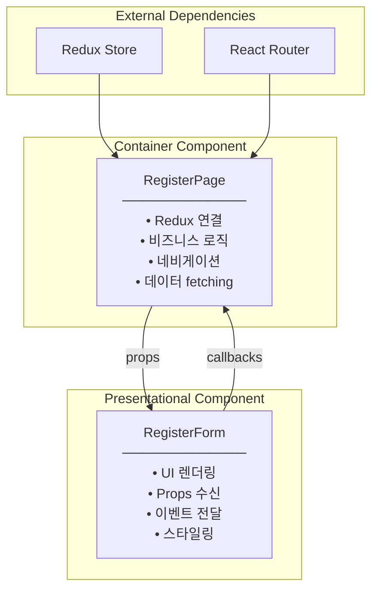
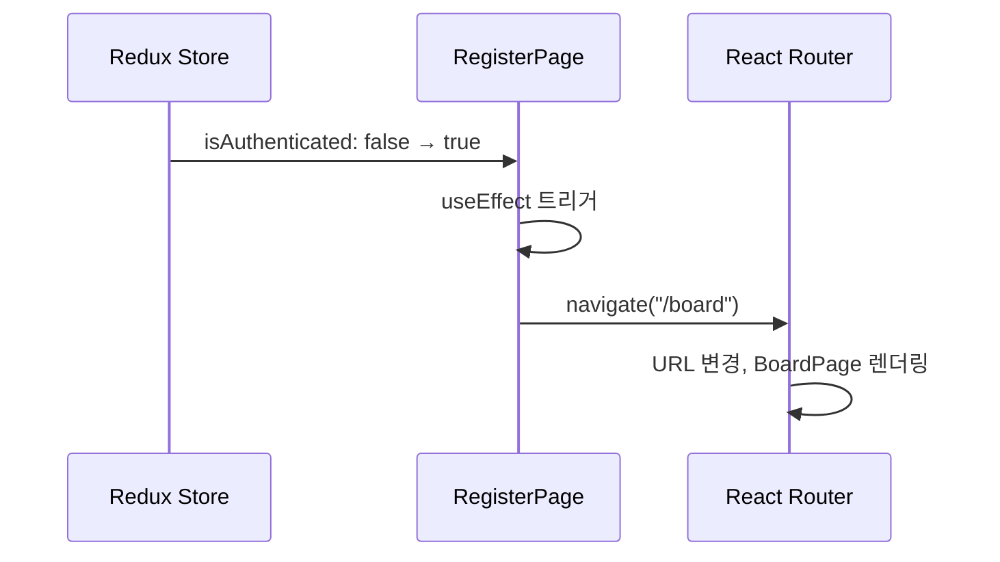
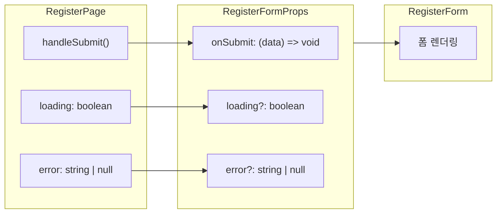
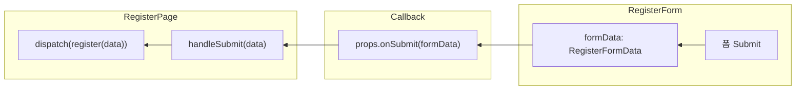

# Container/Presentational Pattern - RegisterPage 분석

## Overview

Task #10에서 구현한 RegisterPage는 Container 컴포넌트로, RegisterForm(Presentational)과 Redux Store를 연결합니다.

---

## Container vs Presentational

### 패턴 정의



---

### 비교표

| 측면 | Container (RegisterPage) | Presentational (RegisterForm) |
|------|--------------------------|------------------------------|
| **목적** | 데이터와 로직 관리 | UI 렌더링 |
| **Redux 인식** | ✓ useAppSelector, useAppDispatch | ✗ Redux 모름 |
| **Router 인식** | ✓ useNavigate | ✗ Router 모름 |
| **데이터 소스** | Redux Store | Props |
| **데이터 변경** | dispatch(action) | props.onSubmit(data) |
| **재사용성** | 특정 경로 전용 | 어디서든 재사용 |
| **테스트** | Redux/Router mock 필요 | Props만 주입 |

---

## RegisterPage.tsx 분석

### 전체 구조

```typescript
export const RegisterPage = () => {
  // 1. Hooks 초기화
  const navigate = useNavigate();           // Router hook
  const dispatch = useAppDispatch();        // Redux dispatch

  // 2. Redux 상태 구독
  const { loading, error, isAuthenticated } = useAppSelector(
    (state) => state.auth
  );

  // 3. Side Effect 처리
  useEffect(() => {
    if (isAuthenticated) {
      navigate("/board");
    }
  }, [isAuthenticated, navigate]);

  // 4. 이벤트 핸들러
  const handleSubmit = (data: RegisterFormData) => {
    dispatch(register(data));
  };

  // 5. Presentational 컴포넌트 렌더링
  return (
    <RegisterForm onSubmit={handleSubmit} loading={loading} error={error} />
  );
};
```

---

### 섹션별 분석

#### 1. Hooks 초기화

```typescript
const navigate = useNavigate();
const dispatch = useAppDispatch();
```

| Hook | 출처 | 역할 |
|------|------|------|
| `useNavigate` | react-router-dom | 프로그래밍 방식 페이지 이동 |
| `useAppDispatch` | app/hooks.ts | 타입 안전한 Redux dispatch |

**Why Container에서만?**
- Presentational은 "어떻게 이동할지" 몰라야 함
- Container가 "언제, 어디로" 결정

---

#### 2. Redux 상태 구독

```typescript
const { loading, error, isAuthenticated } = useAppSelector(
  (state) => state.auth
);
```

| 상태 | 타입 | 용도 |
|------|------|------|
| `loading` | boolean | RegisterForm에 전달 → 버튼 비활성화 |
| `error` | string \| null | RegisterForm에 전달 → 에러 메시지 표시 |
| `isAuthenticated` | boolean | useEffect에서 감지 → redirect 트리거 |

**Why Container에서만?**
- RegisterForm은 Redux 구조를 몰라야 함
- `state.auth`라는 경로를 알 필요 없음

---

#### 3. Side Effect 처리

```typescript
useEffect(() => {
  if (isAuthenticated) {
    navigate("/board");
  }
}, [isAuthenticated, navigate]);
```



**Why useEffect?**
- `isAuthenticated` 변경을 "감지"해서 "반응"
- 동기적으로 navigate 호출하면 렌더링 중 상태 변경 문제

---

#### 4. 이벤트 핸들러

```typescript
const handleSubmit = (data: RegisterFormData) => {
  dispatch(register(data));
};
```

| 단계 | 주체 | 동작 |
|------|------|------|
| 1 | RegisterForm | 유효성 검사 통과 후 `onSubmit(formData)` 호출 |
| 2 | RegisterPage | `handleSubmit` 실행 → `dispatch(register(data))` |
| 3 | authSlice | register thunk 실행 → API 호출 |
| 4 | Redux Store | 상태 업데이트 (loading → fulfilled/rejected) |

**Why Container에서 dispatch?**
- RegisterForm은 "무슨 액션을 dispatch할지" 몰라야 함
- 다른 Context에서 RegisterForm 재사용 시 다른 액션 dispatch 가능

---

#### 5. Presentational 렌더링

```typescript
return (
  <div className="min-h-screen flex items-center justify-center bg-gray-100">
    <div className="w-full max-w-md">
      <h1 className="text-2xl font-bold text-center mb-6">Create Account</h1>
      <RegisterForm onSubmit={handleSubmit} loading={loading} error={error} />
      <p className="mt-4 text-center text-gray-600">
        Already have an account?{" "}
        <a href="/login" className="text-blue-600 hover:underline">
          Sign in
        </a>
      </p>
    </div>
  </div>
);
```

**Container가 담당하는 UI:**
- 페이지 레이아웃 (centering, padding)
- 페이지 타이틀
- 페이지 간 네비게이션 링크

**RegisterForm이 담당하는 UI:**
- 폼 필드들
- 에러 메시지 표시
- Submit 버튼

---

## Props 흐름

### Container → Presentational



### Presentational → Container



---

## 재사용성 예시

### RegisterForm을 다른 Context에서 사용

```typescript
// Admin이 사용자를 생성하는 페이지
const AdminUserCreatePage = () => {
  const dispatch = useAppDispatch();

  const handleSubmit = (data: RegisterFormData) => {
    // 다른 액션 dispatch!
    dispatch(adminCreateUser(data));
  };

  return (
    <div>
      <h1>Create New User (Admin)</h1>
      <RegisterForm
        onSubmit={handleSubmit}  // 같은 Form, 다른 액션
        loading={loading}
        error={error}
      />
    </div>
  );
};
```

**RegisterForm은 변경 없이 재사용됨:**
- "어떤 액션이 dispatch되는지" 모름
- "어디로 redirect되는지" 모름
- Props만 받아서 UI 렌더링

---

## 테스트 용이성

### Presentational 테스트 (쉬움)

```typescript
// RegisterForm.test.tsx
describe('RegisterForm', () => {
  it('calls onSubmit with form data', () => {
    const mockOnSubmit = jest.fn();

    render(
      <RegisterForm
        onSubmit={mockOnSubmit}
        loading={false}
        error={null}
      />
    );

    // 폼 입력 시뮬레이션
    fireEvent.change(screen.getByLabelText('Name'), { target: { value: 'John' } });
    // ... 다른 필드들
    fireEvent.click(screen.getByText('Register'));

    expect(mockOnSubmit).toHaveBeenCalledWith({
      name: 'John',
      // ...
    });
  });
});
```

**Redux mock 불필요!** Props만 주입하면 됨.

---

### Container 테스트 (통합 테스트)

```typescript
// RegisterPage.test.tsx
describe('RegisterPage', () => {
  it('redirects to /board on successful registration', () => {
    const store = createMockStore({
      auth: { isAuthenticated: true }
    });

    render(
      <Provider store={store}>
        <MemoryRouter>
          <RegisterPage />
        </MemoryRouter>
      </Provider>
    );

    // navigate 호출 확인
    expect(mockNavigate).toHaveBeenCalledWith('/board');
  });
});
```

**Redux + Router mock 필요** - 통합 테스트 성격.

---

## Summary

| 원칙 | RegisterPage (Container) | RegisterForm (Presentational) |
|------|--------------------------|------------------------------|
| **SRP** | 연결 + 로직만 담당 | UI 렌더링만 담당 |
| **DIP** | Redux/Router에 의존 | Props 인터페이스에만 의존 |
| **OCP** | 새 로직 추가 용이 | 새 스타일 추가 용이 |
| **테스트** | 통합 테스트 | 단위 테스트 |

---

## Related Documentation

- [01-architecture-diagram.md](./01-architecture-diagram.md) - 전체 아키텍처
- [03-routing-layer.md](./03-routing-layer.md) - Router + Hooks 분석
- [Task #8 RegisterForm](../08-register-form/00-development-plan.md) - Presentational 구현
