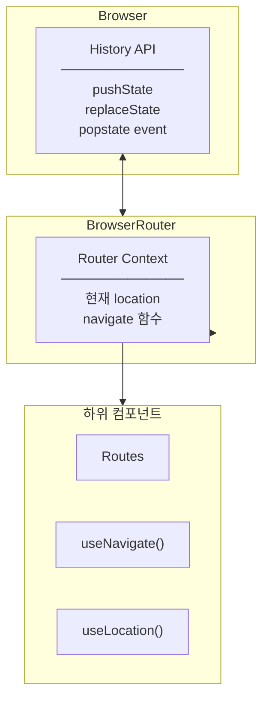
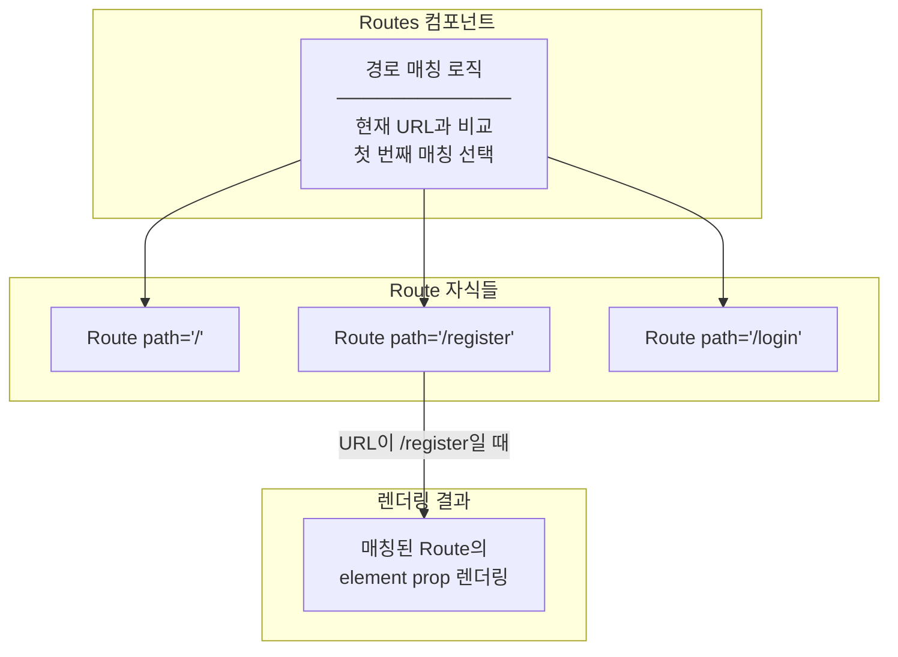
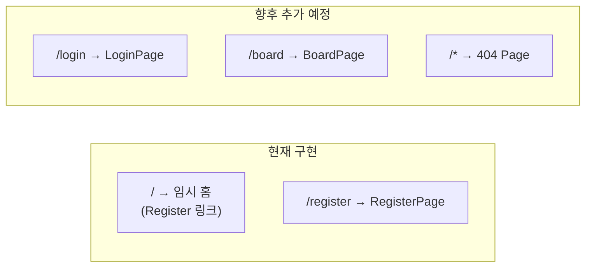
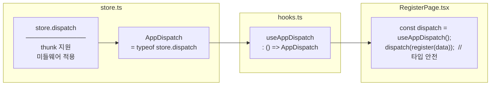
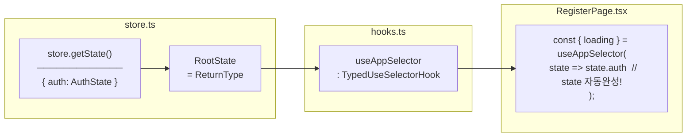
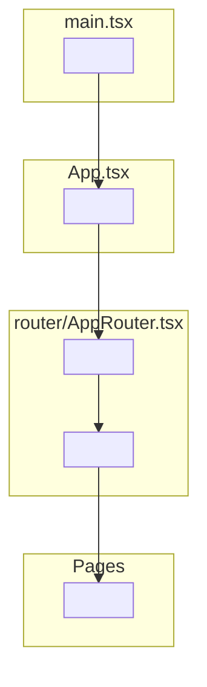

# Routing Layer - AppRouter & Typed Hooks 분석

## Overview

Task #10에서 생성한 라우팅 레이어(AppRouter.tsx)와 타입 안전한 Redux Hooks(hooks.ts)를 분석합니다.

---

## AppRouter.tsx 분석

### 파일 위치와 역할

| 항목 | 값 |
|------|-----|
| **위치** | `src/router/AppRouter.tsx` |
| **책임** | 앱 전체 라우팅 정의 |
| **의존성** | react-router-dom, Page 컴포넌트들 |

---

### 전체 코드

```typescript
import { BrowserRouter, Routes, Route } from "react-router-dom";
import { RegisterPage } from "../features/auth/pages/RegisterPage";

export const AppRouter = () => {
  return (
    <BrowserRouter>
      <Routes>
        <Route path="/register" element={<RegisterPage />} />
        <Route
          path="/"
          element={
            <div className="min-h-screen flex items-center justify-center">
              <a href="/register" className="text-blue-600 hover:underline">
                Go to Register
              </a>
            </div>
          }
        />
      </Routes>
    </BrowserRouter>
  );
};
```

---

### react-router-dom 컴포넌트 분석

#### BrowserRouter



| 역할 | 설명 |
|------|------|
| **History 래핑** | 브라우저 History API를 React에서 사용 가능하게 |
| **Context 제공** | 하위 컴포넌트에서 useNavigate, useLocation 사용 가능 |
| **URL 동기화** | URL 변경 감지 → React 리렌더링 트리거 |

---

#### Routes



| 역할 | 설명 |
|------|------|
| **경로 매칭** | 현재 URL과 자식 Route들의 path 비교 |
| **단일 렌더링** | 여러 Route 중 첫 번째 매칭만 렌더링 |
| **중첩 지원** | 중첩 라우팅 구조 지원 |

---

#### Route

```typescript
<Route path="/register" element={<RegisterPage />} />
```

| Prop | 타입 | 설명 |
|------|------|------|
| `path` | string | 매칭할 URL 경로 |
| `element` | ReactNode | 매칭 시 렌더링할 컴포넌트 |

**path 매칭 규칙:**

| path | 매칭되는 URL |
|------|-------------|
| `/` | 정확히 `/`만 |
| `/register` | `/register` |
| `/users/:id` | `/users/1`, `/users/abc` (동적 세그먼트) |
| `/*` | 모든 경로 (catch-all) |

---

### 라우트 구성



---

## hooks.ts 분석

### 파일 위치와 역할

| 항목 | 값 |
|------|-----|
| **위치** | `src/app/hooks.ts` |
| **책임** | 타입이 적용된 Redux Hooks 제공 |
| **의존성** | react-redux, store.ts |

---

### 전체 코드

```typescript
import {
  useDispatch,
  useSelector,
  type TypedUseSelectorHook,
} from "react-redux";
import type { RootState, AppDispatch } from "./store";

export const useAppDispatch: () => AppDispatch = useDispatch;
export const useAppSelector: TypedUseSelectorHook<RootState> = useSelector;
```

---

### useAppDispatch 분석

#### 타입 정의

```typescript
// store.ts에서
export type AppDispatch = typeof store.dispatch;

// hooks.ts에서
export const useAppDispatch: () => AppDispatch = useDispatch;
```

#### 타입 흐름



#### 비교: 타입 적용 전 vs 후

```typescript
// ❌ Without typed hook
const dispatch = useDispatch();
dispatch(register(data));  // dispatch 타입이 Dispatch<AnyAction>
                           // thunk 타입 추론 불가

// ❌ 매번 타입 지정
const dispatch = useDispatch<AppDispatch>();
dispatch(register(data));  // 매번 <AppDispatch> 작성 필요

// ✅ With typed hook
const dispatch = useAppDispatch();
dispatch(register(data));  // AppDispatch 타입 자동 적용
                           // thunk 반환 타입 추론 가능
```

---

### useAppSelector 분석

#### 타입 정의

```typescript
// store.ts에서
export type RootState = ReturnType<typeof store.getState>;

// hooks.ts에서
export const useAppSelector: TypedUseSelectorHook<RootState> = useSelector;
```

#### TypedUseSelectorHook 이해

```typescript
// react-redux 내부 정의
interface TypedUseSelectorHook<TState> {
  <TSelected>(
    selector: (state: TState) => TSelected,
    equalityFn?: (left: TSelected, right: TSelected) => boolean
  ): TSelected;
}
```

| 제네릭 | 역할 |
|--------|------|
| `TState` | 전체 상태 타입 (RootState) |
| `TSelected` | selector가 반환하는 타입 (자동 추론) |

#### 타입 흐름



#### 비교: 타입 적용 전 vs 후

```typescript
// ❌ Without typed hook
const { loading } = useSelector(state => state.auth);
// state 타입이 unknown → 자동완성 불가, 타입 에러

// ❌ 매번 타입 지정
const { loading } = useSelector((state: RootState) => state.auth);
// 매번 RootState 작성 필요

// ✅ With typed hook
const { loading } = useAppSelector(state => state.auth);
// state가 RootState 타입 → 자동완성 지원
// state.auth가 AuthState 타입 → loading이 boolean 추론
```

---

## App.tsx와의 연결

### 계층 구조



### App.tsx 코드

```typescript
import { AppRouter } from "./router/AppRouter";

function App() {
  return <AppRouter />;
}

export default App;
```

| 책임 | App.tsx | AppRouter.tsx |
|------|---------|---------------|
| **역할** | 앱 루트 컴포넌트 | 라우팅 정의 |
| **변경 시점** | 전역 레이아웃 추가 시 | 새 페이지 추가 시 |
| **SRP** | 앱 진입점 | 라우팅만 담당 |

---

## 향후 확장

### 새 페이지 추가 시

```typescript
// AppRouter.tsx
import { LoginPage } from "../features/auth/pages/LoginPage";
import { BoardPage } from "../features/board/pages/BoardPage";

export const AppRouter = () => {
  return (
    <BrowserRouter>
      <Routes>
        <Route path="/" element={<Navigate to="/login" />} />
        <Route path="/login" element={<LoginPage />} />
        <Route path="/register" element={<RegisterPage />} />
        <Route path="/board" element={<BoardPage />} />
        <Route path="*" element={<NotFoundPage />} />
      </Routes>
    </BrowserRouter>
  );
};
```

### 라우트 가드 추가 시

```typescript
// 인증 필요한 라우트
<Route
  path="/board"
  element={
    <ProtectedRoute>
      <BoardPage />
    </ProtectedRoute>
  }
/>

// ProtectedRoute 컴포넌트
const ProtectedRoute = ({ children }) => {
  const { isAuthenticated } = useAppSelector(state => state.auth);

  if (!isAuthenticated) {
    return <Navigate to="/login" />;
  }

  return children;
};
```

---

## Summary

### AppRouter.tsx

| 항목 | 설명 |
|------|------|
| **책임** | URL → 컴포넌트 매핑 |
| **SRP** | 라우팅 설정만 담당, 비즈니스 로직 없음 |
| **확장** | 새 Route 추가로 페이지 추가 |

### hooks.ts

| 항목 | 설명 |
|------|------|
| **책임** | 타입 안전한 Redux hooks 제공 |
| **SRP** | 타입 래핑만 담당 |
| **장점** | 자동완성, 타입 에러 방지, 코드 간결화 |

---

## Related Documentation

- [01-architecture-diagram.md](./01-architecture-diagram.md) - 전체 아키텍처
- [02-container-pattern.md](./02-container-pattern.md) - Container 패턴 분석
- [04-design-patterns-and-solid.md](./04-design-patterns-and-solid.md) - 디자인 패턴
