# Design Patterns and SOLID Principles - Task #10

## Overview

This document analyzes the design patterns and SOLID principles applied in Task #10 (RegisterPage implementation).

---

## Design Patterns Applied

### 1. Container/Presentational Pattern

**Definition:** Separates components into two categories:
- **Container**: Handles data fetching, state management, business logic
- **Presentational**: Handles UI rendering, receives data via props

**Application in Task #10:**

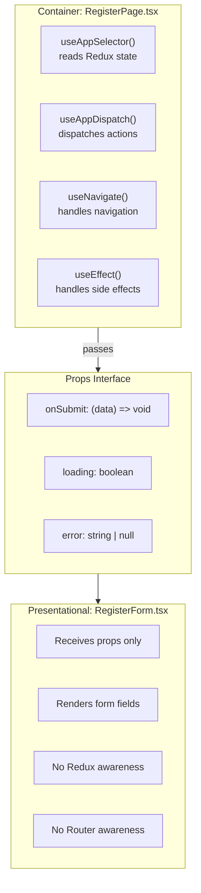

**Benefits:**
| Benefit | Description |
|---------|-------------|
| Testability | Presentational components can be tested with props only |
| Reusability | RegisterForm can be reused in different contexts |
| Separation of Concerns | UI logic separated from business logic |
| Maintainability | Changes to UI don't affect business logic and vice versa |

---

### 2. Provider Pattern

**Definition:** Makes data/functionality available to all descendant components without prop drilling.

**Application in Task #10:**

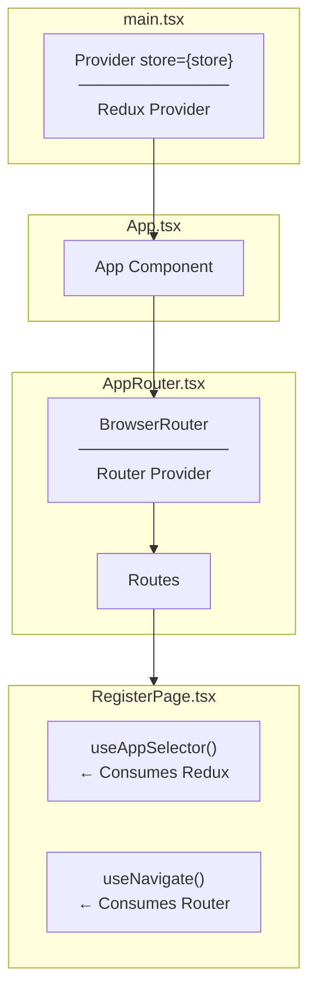

**Why Multiple Providers?**
| Provider | Provides | Consumed By |
|----------|----------|-------------|
| Redux Provider | store (state, dispatch) | useAppSelector, useAppDispatch |
| BrowserRouter | location, navigate | useNavigate, useLocation |

---

### 3. Custom Hook Pattern

**Definition:** Extracts reusable stateful logic into custom hooks.

**Application in Task #10:**

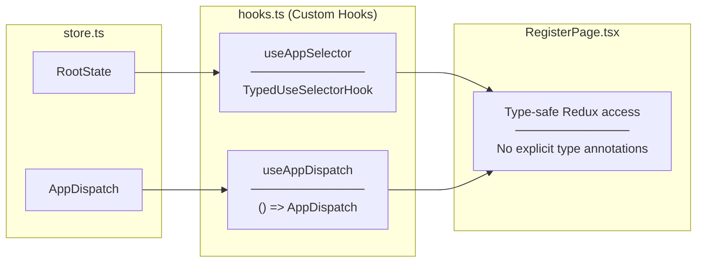

**Before Custom Hooks:**
```typescript
// Every component needs explicit types
const dispatch = useDispatch<AppDispatch>();
const state = useSelector((state: RootState) => state.auth);
```

**After Custom Hooks:**
```typescript
// Types are pre-applied
const dispatch = useAppDispatch();
const state = useAppSelector(state => state.auth);
```

---

### 4. Declarative Routing Pattern

**Definition:** Define routes as data/configuration rather than imperative navigation code.

**Application in Task #10:**

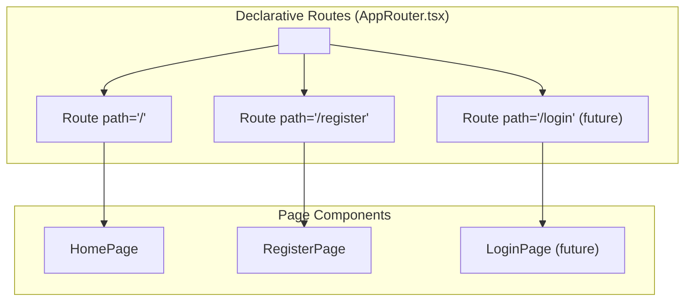

**Declarative vs Imperative:**
| Aspect | Declarative (react-router) | Imperative |
|--------|---------------------------|------------|
| Definition | "What routes exist" | "How to navigate" |
| Readability | Routes visible at a glance | Logic scattered |
| Maintenance | Add/remove Route components | Modify navigation logic |

---

### 5. Facade Pattern (Simplified Interface)

**Definition:** Provides a simplified interface to a complex subsystem.

**Application in Task #10:**

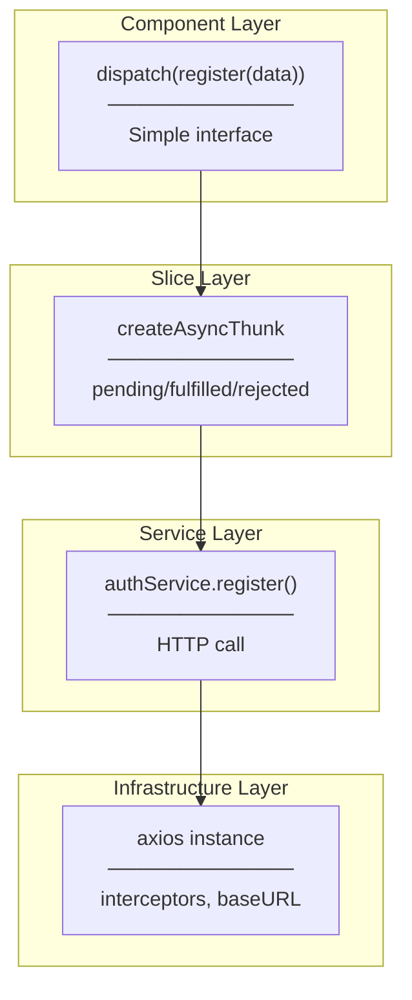

---

## SOLID Principles Applied

### S - Single Responsibility Principle

**Definition:** A class/module should have only one reason to change.

**Application:**

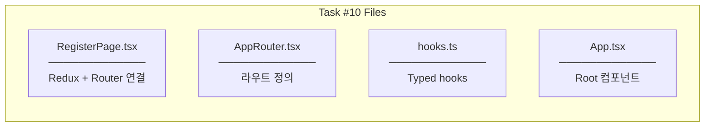

| File | Single Responsibility | Changes When |
|------|----------------------|--------------|
| `RegisterPage.tsx` | Connect Form to Redux, handle navigation | Navigation logic changes |
| `RegisterForm.tsx` | Render registration form UI | Form UI/UX changes |
| `AppRouter.tsx` | Define app routes | New pages added |
| `hooks.ts` | Provide typed Redux hooks | Store types change |
| `App.tsx` | Render root component | App structure changes |

---

### O - Open/Closed Principle

**Definition:** Open for extension, closed for modification.

**Application:**

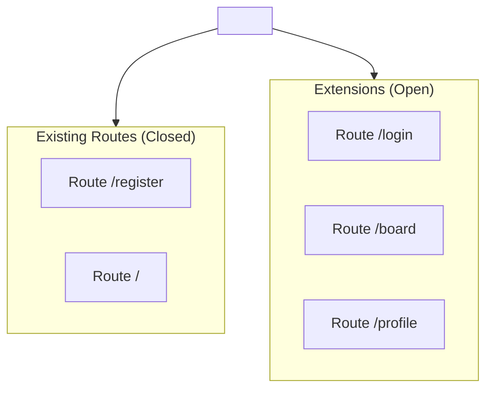

```typescript
// Adding LoginPage - no modification to existing code
<Routes>
  <Route path="/register" element={<RegisterPage />} />  // existing
  <Route path="/login" element={<LoginPage />} />        // extension
  <Route path="/board" element={<BoardPage />} />        // extension
</Routes>
```

---

### L - Liskov Substitution Principle

**Definition:** Subtypes must be substitutable for their base types.

**Application:**

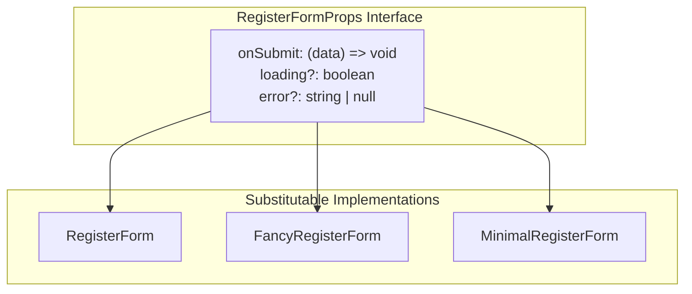

Any component implementing `RegisterFormProps` can replace `RegisterForm`.

---

### I - Interface Segregation Principle

**Definition:** Clients should not depend on interfaces they don't use.

**Application:**

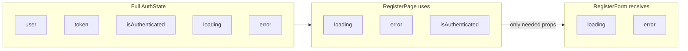

```typescript
// RegisterForm only receives what it needs
interface RegisterFormProps {
  onSubmit: (data: RegisterFormData) => void;
  loading?: boolean;
  error?: string | null;
  // Does NOT include: user, token, isAuthenticated
}
```

---

### D - Dependency Inversion Principle

**Definition:** High-level modules should not depend on low-level modules. Both should depend on abstractions.

**Application:**

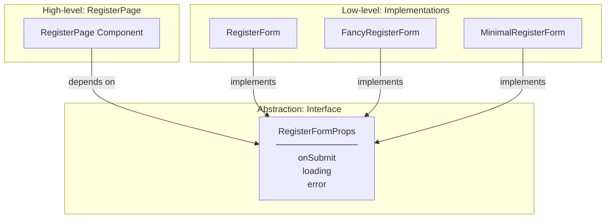

---

## Anti-Patterns Avoided

### 1. Prop Drilling (Avoided)

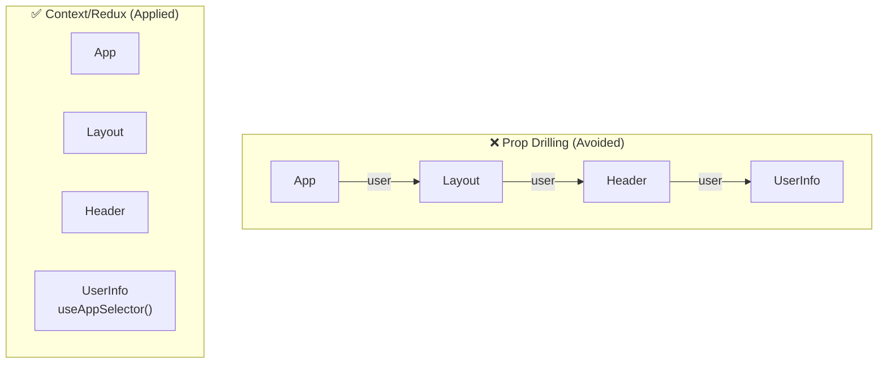

### 2. God Component (Avoided)

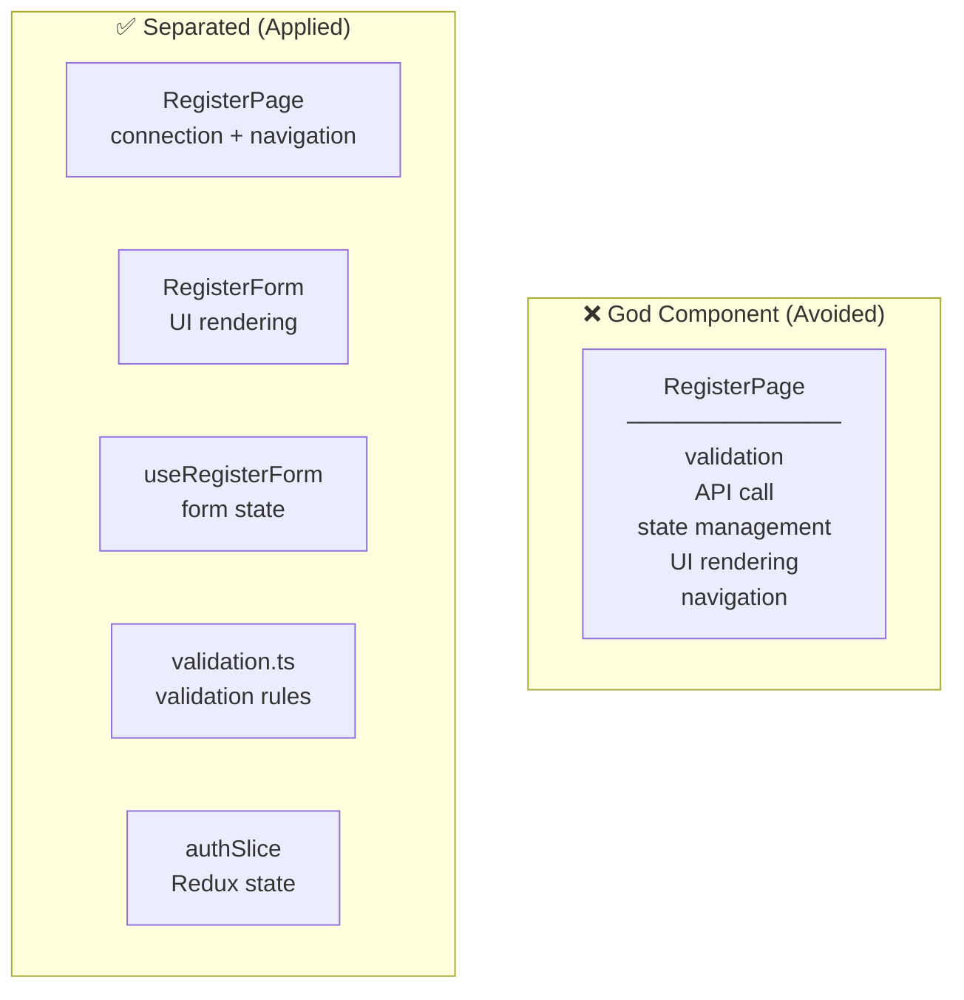

### 3. Hardcoded Dependencies (Avoided)

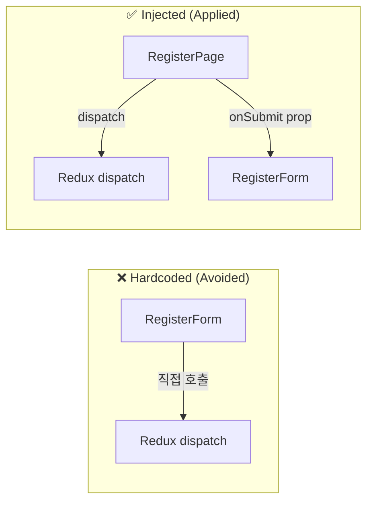

---

## Summary

| Pattern/Principle | Application | Benefit |
|------------------|-------------|---------|
| Container/Presentational | RegisterPage / RegisterForm | Separation of concerns |
| Provider | Redux + Router | No prop drilling |
| Custom Hook | useAppDispatch, useAppSelector | Type safety, DRY |
| Declarative Routing | AppRouter Routes | Readability |
| SRP | Each file has one responsibility | Maintainability |
| OCP | Route definitions extensible | Easy to add features |
| ISP | RegisterFormProps minimal | Loose coupling |
| DIP | Props interface abstraction | Testability |

---

## Related Documentation

- [01-architecture-diagram.md](./01-architecture-diagram.md) - Architecture overview
- [02-container-pattern.md](./02-container-pattern.md) - Container pattern details
- [03-routing-layer.md](./03-routing-layer.md) - Routing implementation
- [05-programming-concepts.md](./05-programming-concepts.md) - Programming concepts
