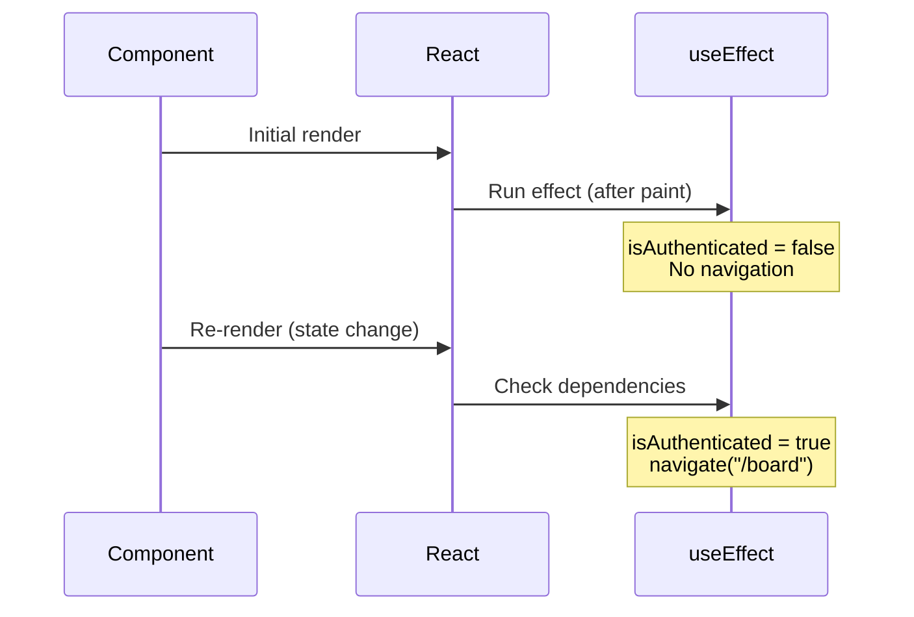
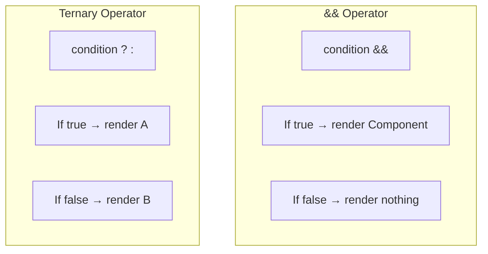
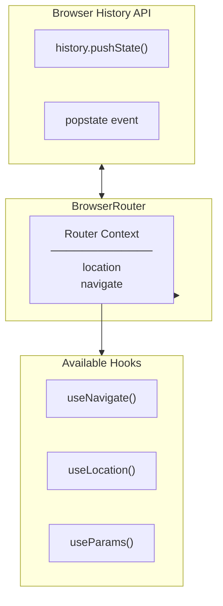
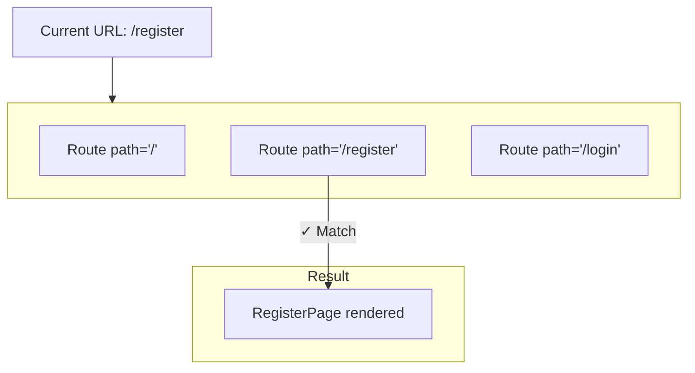
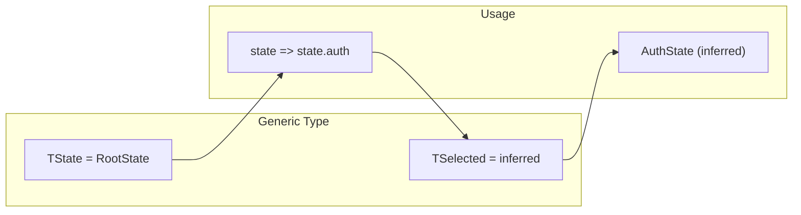
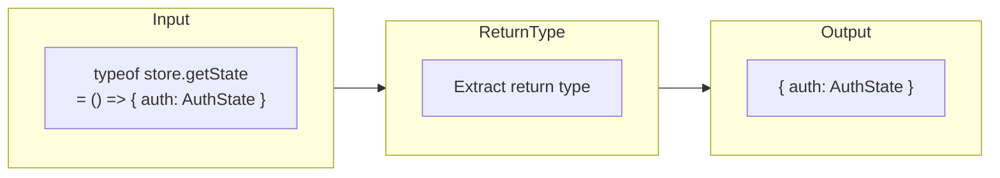
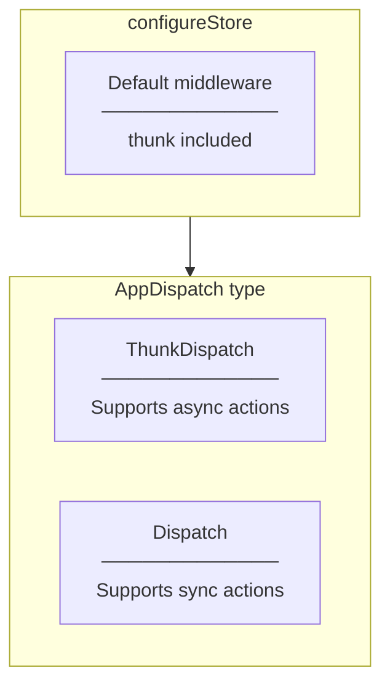

# Programming Concepts - Task #10

## Overview

This document explains the programming concepts used in Task #10 (RegisterPage, AppRouter, hooks.ts).

---

## React Concepts

### 1. useEffect Hook

**Definition:** Performs side effects in function components after render.

**Syntax:**
```typescript
useEffect(() => {
  // Effect logic
  return () => {
    // Cleanup (optional)
  };
}, [dependencies]);
```

**Application in RegisterPage:**
```typescript
useEffect(() => {
  if (isAuthenticated) {
    navigate("/board");
  }
}, [isAuthenticated, navigate]);
```

**Execution Flow:**



**Dependency Array:**
| Value | Behavior |
|-------|----------|
| `[]` | Run once on mount |
| `[dep1, dep2]` | Run when dep1 or dep2 changes |
| No array | Run on every render (avoid!) |

---

### 2. Conditional Rendering

**Definition:** Render different UI based on conditions.

**Application in RegisterPage:**
```typescript
return (
  <div>
    {error && <ErrorMessage message={error} />}  {/* Conditional */}
    <RegisterForm ... />
  </div>
);
```

**Patterns:**



---

### 3. Props Destructuring

**Definition:** Extract properties from props object in function parameter.

**Application:**
```typescript
// Without destructuring
const RegisterForm = (props) => {
  console.log(props.onSubmit);
  console.log(props.loading);
};

// With destructuring
const RegisterForm = ({ onSubmit, loading, error }) => {
  console.log(onSubmit);
  console.log(loading);
};
```

**Benefits:**
- Cleaner code
- Immediate visibility of used props
- Default values support: `{ loading = false }`

---

## React Router Concepts

### 1. BrowserRouter

**Definition:** Router implementation using HTML5 History API.

**How it works:**



**vs HashRouter:**
| Aspect | BrowserRouter | HashRouter |
|--------|--------------|------------|
| URL | `/register` | `/#/register` |
| Server | Needs configuration | Works anywhere |
| SEO | Better | Limited |

---

### 2. Routes and Route

**Definition:**
- `Routes`: Container that matches current URL to child Routes
- `Route`: Defines path-to-component mapping

**Application:**
```typescript
<Routes>
  <Route path="/" element={<Home />} />
  <Route path="/register" element={<RegisterPage />} />
</Routes>
```

**Matching Process:**



---

### 3. useNavigate Hook

**Definition:** Returns a function to navigate programmatically.

**Syntax:**
```typescript
const navigate = useNavigate();

// Navigate to path
navigate("/board");

// Navigate with options
navigate("/board", { replace: true });

// Navigate back
navigate(-1);
```

**Application in RegisterPage:**
```typescript
const navigate = useNavigate();

useEffect(() => {
  if (isAuthenticated) {
    navigate("/board");  // Programmatic navigation
  }
}, [isAuthenticated, navigate]);
```

**vs Link component:**
| Aspect | useNavigate | Link |
|--------|-------------|------|
| Use case | After action/event | Direct user click |
| Syntax | `navigate("/path")` | `<Link to="/path">` |
| Example | After form submit | Navigation menu |

---

## TypeScript Concepts

### 1. TypedUseSelectorHook

**Definition:** Generic type for creating typed useSelector hook.

**Definition from react-redux:**
```typescript
interface TypedUseSelectorHook<TState> {
  <TSelected>(
    selector: (state: TState) => TSelected
  ): TSelected;
}
```

**Application in hooks.ts:**
```typescript
import type { TypedUseSelectorHook } from "react-redux";
import type { RootState } from "./store";

export const useAppSelector: TypedUseSelectorHook<RootState> = useSelector;
```

**Type Flow:**



---

### 2. ReturnType Utility Type

**Definition:** Extracts the return type of a function type.

**Application in store.ts:**
```typescript
// store.getState returns the entire state object
export type RootState = ReturnType<typeof store.getState>;

// Equivalent to manually typing:
// type RootState = { auth: AuthState; task: TaskState; ... }
```

**How it works:**



---

### 3. typeof Operator (TypeScript)

**Definition:** Gets the type of a value at compile time.

**Application:**
```typescript
const store = configureStore({ ... });

// typeof store.dispatch = ThunkDispatch<...>
export type AppDispatch = typeof store.dispatch;

// typeof store.getState = () => RootState
export type RootState = ReturnType<typeof store.getState>;
```

**Runtime vs Compile-time:**
| Context | typeof | Result |
|---------|--------|--------|
| JavaScript (runtime) | `typeof value` | `"string"`, `"object"`, etc. |
| TypeScript (compile) | `typeof value` | Actual type of value |

---

### 4. Type Assertion with `as`

**Definition:** Tell TypeScript to treat a value as a specific type.

**Application in authSlice:**
```typescript
.addCase(register.rejected, (state, action) => {
  state.error = action.payload as string;
  // action.payload is unknown, assert it's string
});
```

**When to use:**
- When you know more than TypeScript
- After runtime checks
- With external data

---

## Redux Toolkit Concepts

### 1. Typed Dispatch

**Definition:** Dispatch function type that includes thunk support.

**Application:**
```typescript
// Without typing - loses thunk return type
const dispatch = useDispatch();
dispatch(register(data));  // Returns unknown

// With typing - preserves thunk return type
const dispatch = useAppDispatch();
const result = dispatch(register(data));  // Returns Promise<...>
```

**Type Definition:**



---

### 2. Selector Pattern

**Definition:** Function that extracts specific data from state.

**Application:**
```typescript
// Inline selector
const { loading, error } = useAppSelector(state => state.auth);

// Named selector (reusable)
const selectAuth = (state: RootState) => state.auth;
const selectIsAuthenticated = (state: RootState) => state.auth.isAuthenticated;
```

**Benefits:**
- Encapsulates state shape knowledge
- Memoization with createSelector
- Reusable across components

---

## JavaScript/ES6+ Concepts

### 1. Object Destructuring with Rename

**Definition:** Extract and rename properties in one statement.

**Application:**
```typescript
// Extract and use
const { loading, error, isAuthenticated } = useAppSelector(state => state.auth);

// Extract with rename
const { loading: isLoading } = useAppSelector(state => state.auth);
```

---

### 2. Arrow Function Implicit Return

**Definition:** Single-expression arrow functions return without `return` keyword.

**Application:**
```typescript
// Explicit return (with braces)
const handleSubmit = (data: RegisterFormData) => {
  dispatch(register(data));
};

// Implicit return (without braces)
const selectAuth = (state: RootState) => state.auth;
```

---

### 3. Optional Chaining (?.)

**Definition:** Safely access nested properties that might be undefined.

**Application:**
```typescript
// Without optional chaining
const userName = user && user.name;

// With optional chaining
const userName = user?.name;
```

---

### 4. Nullish Coalescing (??)

**Definition:** Provide default value only for null/undefined (not for falsy values).

**Application:**
```typescript
// || treats 0, "", false as falsy
const count = value || 10;  // If value is 0, returns 10

// ?? only treats null/undefined
const count = value ?? 10;  // If value is 0, returns 0
```

---

## Summary Table

| Concept | Category | Used In |
|---------|----------|---------|
| useEffect | React Hook | RegisterPage.tsx |
| Conditional Rendering | React Pattern | RegisterPage.tsx |
| BrowserRouter | React Router | AppRouter.tsx |
| Routes/Route | React Router | AppRouter.tsx |
| useNavigate | React Router Hook | RegisterPage.tsx |
| TypedUseSelectorHook | TypeScript Generic | hooks.ts |
| ReturnType | TypeScript Utility | store.ts |
| typeof (TS) | TypeScript Operator | store.ts |
| Object Destructuring | ES6+ | RegisterPage.tsx |
| Arrow Functions | ES6+ | All files |

---

## Related Documentation

- [01-architecture-diagram.md](./01-architecture-diagram.md) - Architecture overview
- [02-container-pattern.md](./02-container-pattern.md) - Container pattern details
- [03-routing-layer.md](./03-routing-layer.md) - Routing implementation
- [04-design-patterns-and-solid.md](./04-design-patterns-and-solid.md) - Design patterns
