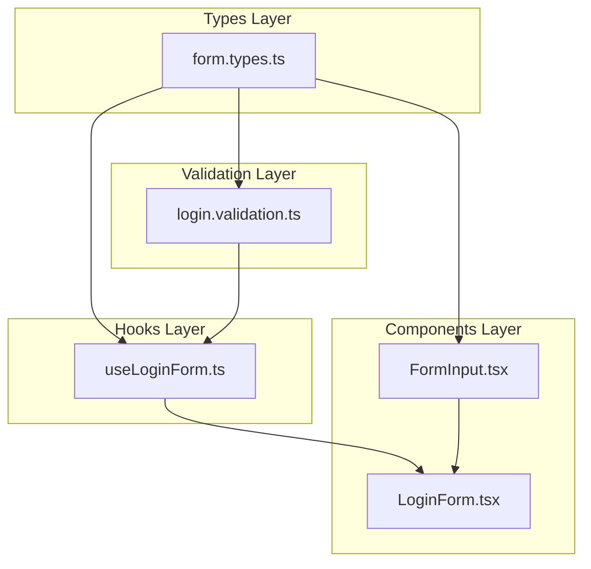

# LoginForm Implementation Plan

## Overview

Task #15: Create LoginForm component with usernameOrEmail and password fields, client-side validation, and styling consistent with RegisterForm.

---

## Changes from Original Plan

### File Structure Refactoring

**Issue:** `types.ts`와 `validation.ts` 파일이 너무 커지고 있었음

**Original Structure:**
```
src/features/auth/
├── types.ts           ← 모든 타입이 한 파일에
├── utils/
│   └── validation.ts  ← Register + Login 검증이 한 파일에
```

**Revised Structure:**
```
src/features/auth/
├── types/
│   ├── form.types.ts    ← 폼 관련 타입
│   ├── state.types.ts   ← Redux 상태 타입
│   └── api.types.ts     ← API 요청/응답 타입
├── utils/
│   └── validation/
│       ├── register.validation.ts  ← 회원가입 검증
│       └── login.validation.ts     ← 로그인 검증
```

**Why Changed:**
- **Single Responsibility Principle** - 각 파일이 한 가지 책임만 가짐
- **Scalability** - 새 기능 추가 시 해당 파일만 수정
- **Navigation** - 파일명만 보고 내용 파악 가능

---

## Node.js Module Resolution

### 폴더 vs 파일 import

```typescript
// 이 import가 어떻게 해석되는가?
import { LoginFormData } from "../types/form.types";
```

**Resolution Order:**
1. `../types/form.types.ts` 파일 찾기 ✅
2. `../types/form.types/index.ts` 폴더 내 index.ts 찾기

**우리 구조에서:**
- `types/` 폴더에 `index.ts` 없음
- 각 파일을 직접 import: `../types/form.types`
- `auth/index.ts`에서 re-export하여 외부 노출

**Why no types/index.ts:**
- 중복 export 방지 (types/index.ts + auth/index.ts 둘 다 export하면 혼란)
- auth/index.ts가 유일한 public API 역할

---

## File Structure (SRP-based)

```
src/features/auth/
├── components/
│   ├── FormInput.tsx         ← 재사용 입력 필드 (Task #8)
│   ├── RegisterForm.tsx      ← 회원가입 폼 (Task #8)
│   └── LoginForm.tsx         ← 로그인 폼 (Task #15) ★ NEW
├── hooks/
│   ├── useRegisterForm.ts    ← 회원가입 상태 관리 (Task #8)
│   └── useLoginForm.ts       ← 로그인 상태 관리 (Task #15) ★ NEW
├── types/
│   ├── form.types.ts         ← 폼 타입 (Task #15) ★ REFACTORED
│   ├── state.types.ts        ← Redux 상태 타입 (Task #15) ★ REFACTORED
│   └── api.types.ts          ← API 타입 (Task #15) ★ REFACTORED
├── utils/
│   └── validation/
│       ├── register.validation.ts  ← 회원가입 검증 (Task #15) ★ REFACTORED
│       └── login.validation.ts     ← 로그인 검증 (Task #15) ★ NEW
├── pages/
│   └── RegisterPage.tsx      ← 회원가입 페이지 (Task #10)
├── store/
│   └── authSlice.ts          ← Redux slice (Task #9)
├── services/
│   └── authService.ts        ← API 서비스 (Task #9)
└── index.ts                  ← Barrel export
```

---

## File Responsibilities

### types/form.types.ts

| Aspect | Description |
|--------|-------------|
| **Responsibility** | 폼 관련 타입 정의 |
| **Contains** | RegisterFormData, LoginFormData, ValidationErrors, FormInputProps, Props 타입들 |
| **Changes when** | 폼 필드 추가/제거, Props 변경 |

### types/state.types.ts

| Aspect | Description |
|--------|-------------|
| **Responsibility** | Redux 상태 관련 타입 |
| **Contains** | User, AuthState |
| **Changes when** | Redux 상태 구조 변경 |

### types/api.types.ts

| Aspect | Description |
|--------|-------------|
| **Responsibility** | API 요청/응답 타입 |
| **Contains** | AuthResponse, LoginCredentials |
| **Changes when** | API 계약 변경 |

### validation/login.validation.ts

| Aspect | Description |
|--------|-------------|
| **Responsibility** | 로그인 폼 유효성 검사 |
| **Contains** | validateLoginField, validateLoginForm |
| **Changes when** | 로그인 검증 규칙 변경 |

### hooks/useLoginForm.ts

| Aspect | Description |
|--------|-------------|
| **Responsibility** | 로그인 폼 상태 관리 |
| **Contains** | formData, errors, touched, handleChange, handleBlur, handleSubmit |
| **Changes when** | 폼 상태 로직 변경 |
| **Pattern** | useRegisterForm과 동일한 패턴 |

### components/LoginForm.tsx

| Aspect | Description |
|--------|-------------|
| **Responsibility** | 로그인 폼 UI 렌더링 |
| **Contains** | usernameOrEmail 필드, password 필드, 제출 버튼, 에러 표시 |
| **Changes when** | 폼 레이아웃/스타일 변경 |
| **Pattern** | RegisterForm과 동일한 패턴 |

---

## Code Reuse from RegisterForm

| Component | Reused | New |
|-----------|--------|-----|
| FormInput.tsx | ✅ 그대로 재사용 | - |
| useLoginForm.ts | 패턴만 재사용 | 새 파일 생성 |
| LoginForm.tsx | 구조/스타일 재사용 | 새 파일 생성 |
| login.validation.ts | 패턴만 재사용 | 새 파일 생성 |

**DRY Principle (Don't Repeat Yourself):**
- FormInput은 완전히 동일하므로 재사용
- Hook과 Form은 구조는 같지만 필드가 다르므로 새 파일
- Validation은 규칙이 다르므로 새 파일

---

## Validation Rules Comparison

| Field | Register | Login |
|-------|----------|-------|
| name | Required, max 100 | N/A |
| email | Required, email format | N/A |
| username | Required, 3-50 chars | N/A |
| usernameOrEmail | N/A | Required |
| password | Required, min 8 | Required (길이 체크 없음) |
| confirmPassword | Must match password | N/A |

**Why different validation:**
- Register: 새 계정 생성이므로 엄격한 규칙 적용
- Login: 기존 계정 확인이므로 "입력했는지"만 체크, 실제 검증은 서버에서

---

## Dependency Flow



---

## Checklist

- [x] Refactor types.ts → types/ folder
  - [x] form.types.ts
  - [x] state.types.ts
  - [x] api.types.ts
- [x] Update all import paths
- [x] Add LoginFormData, LoginFormProps, LoginValidationErrors types
- [x] Refactor validation.ts → validation/ folder
  - [x] register.validation.ts
  - [x] login.validation.ts
- [x] Create useLoginForm hook
- [x] Create LoginForm component
- [x] Export LoginForm from index.ts
- [x] Build verification

---

## Related Documentation

- [Architecture Diagram](./01-architecture-diagram.md)
- [Code Reuse Analysis](./02-code-reuse-analysis.md)
- [RegisterForm (Task #8)](../08-register-form/00-development-plan.md)
