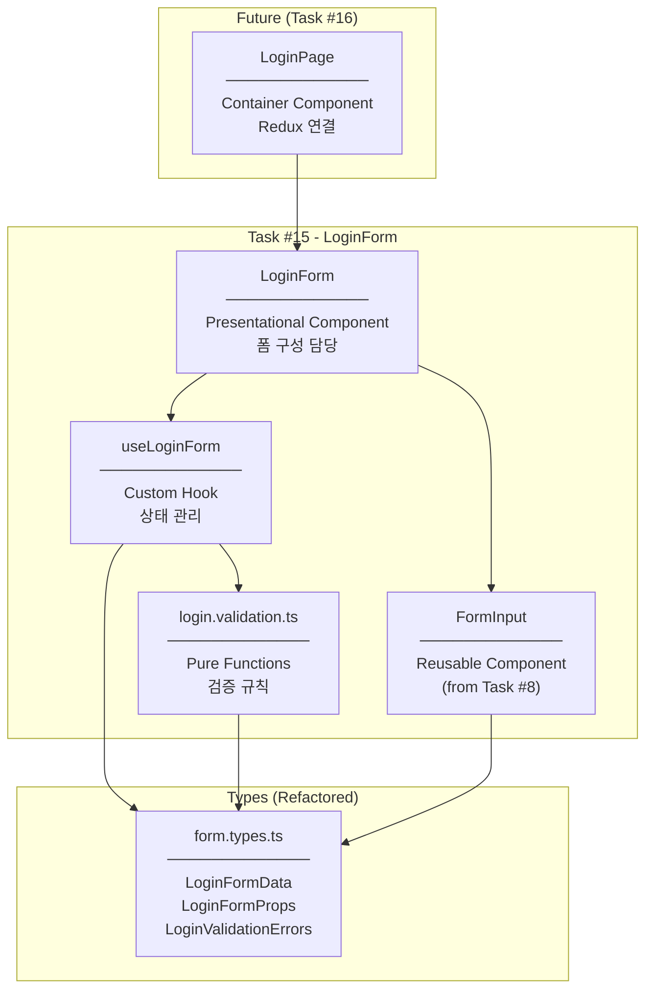
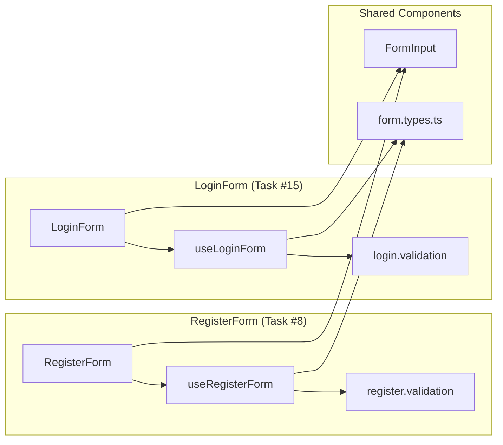
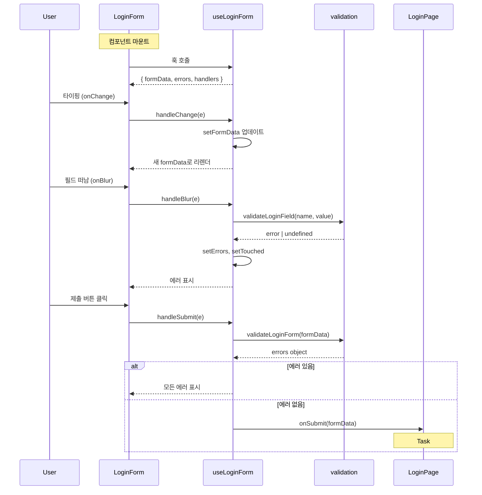

# LoginForm Architecture Diagram

## Component Hierarchy



---

## Register vs Login Comparison



---

## Data Flow



---

## File Structure After Refactoring

```
src/features/auth/
│
├── types/                          ★ REFACTORED from types.ts
│   ├── form.types.ts               # Form-related types
│   │   ├── RegisterFormData
│   │   ├── RegisterFormProps
│   │   ├── ValidationErrors
│   │   ├── FormInputProps
│   │   ├── LoginFormData           ★ NEW
│   │   ├── LoginFormProps          ★ NEW
│   │   └── LoginValidationErrors   ★ NEW
│   │
│   ├── state.types.ts              # Redux state types
│   │   ├── User
│   │   └── AuthState
│   │
│   └── api.types.ts                # API types
│       ├── AuthResponse
│       └── LoginCredentials
│
├── utils/
│   └── validation/                 ★ REFACTORED from validation.ts
│       ├── register.validation.ts  # validateField, validateForm
│       └── login.validation.ts     # validateLoginField, validateLoginForm ★ NEW
│
├── hooks/
│   ├── useRegisterForm.ts
│   └── useLoginForm.ts             ★ NEW
│
├── components/
│   ├── FormInput.tsx               # Reused (no changes)
│   ├── RegisterForm.tsx
│   └── LoginForm.tsx               ★ NEW
│
├── pages/
│   └── RegisterPage.tsx
│
├── store/
│   └── authSlice.ts
│
├── services/
│   └── authService.ts
│
└── index.ts                        # Updated exports
```

---

## Import Path Changes

### Before (types.ts)
```typescript
import type { RegisterFormData } from "../types";
```

### After (types/ folder)
```typescript
import type { RegisterFormData } from "../types/form.types";
import type { AuthState } from "../types/state.types";
import type { AuthResponse } from "../types/api.types";
```

### Why Direct File Imports
```
auth/
├── types/
│   ├── form.types.ts    ← 직접 import
│   └── index.ts         ← 없음! (중복 export 방지)
└── index.ts             ← 여기서만 외부에 export
```

**External Import (다른 feature에서):**
```typescript
import type { LoginFormData } from "@/features/auth";
// auth/index.ts가 re-export
```

**Internal Import (auth feature 내부에서):**
```typescript
import type { LoginFormData } from "../types/form.types";
// 직접 파일 참조
```
