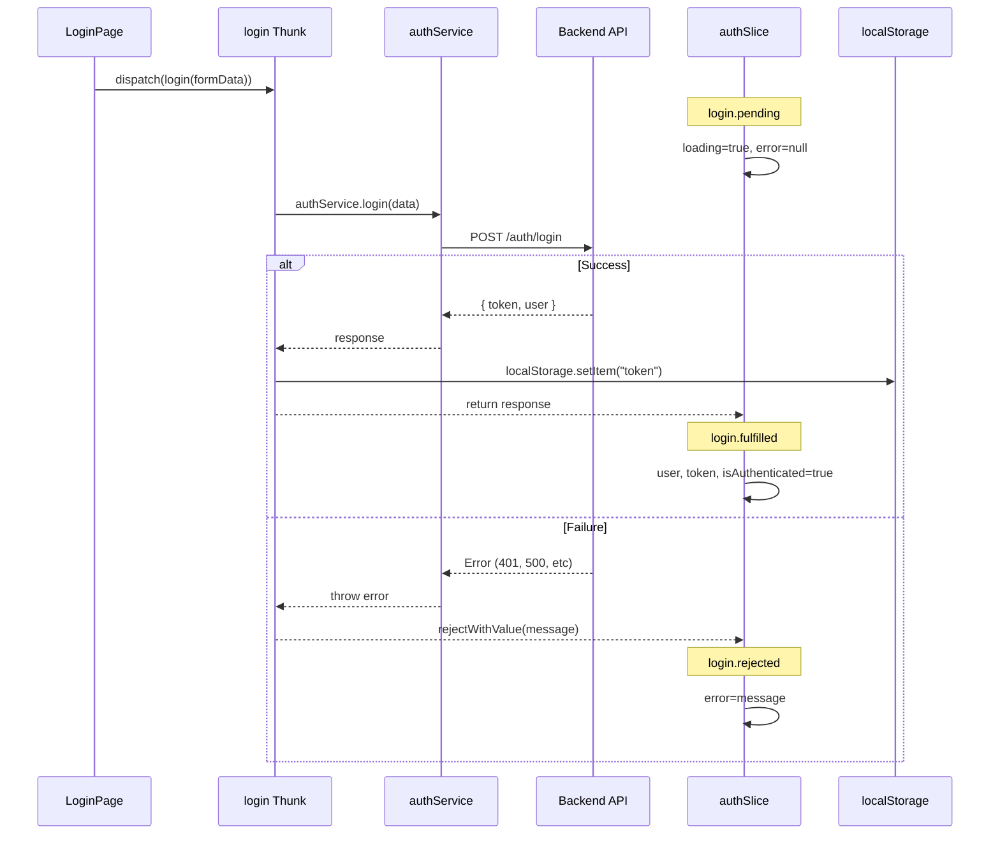

# Login Thunk Implementation Plan

## Overview

Task #16: Add login async thunk to authSlice to call the login API and handle authentication state.

---

## Changes from Original Plan

### File Structure Refactoring

**Issue:** authSlice.ts가 커지면서 Slice와 Thunk 개념이 혼재됨

**Original Structure:**
```
store/
└── authSlice.ts    ← Slice + Thunks 모두 포함 (133줄)
```

**Revised Structure:**
```
store/
├── authSlice.ts    ← Slice만 (상태 정의, reducers, extraReducers)
└── authThunks.ts   ← Thunks만 (register, login)
```

**Why Changed:**
- **개념 분리** - Slice와 Thunk는 다른 역할
- **학습 용이** - 각 파일이 하나의 개념만 담당
- **확장성** - 새 thunk 추가 시 authThunks.ts만 수정

---

## Slice vs Thunk 개념

### Slice (authSlice.ts)

| 항목 | 설명 |
|------|------|
| **역할** | 상태 정의 + 상태 변경 방법 |
| **특징** | 순수 함수 (side effect 없음) |
| **포함 내용** | initialState, reducers, extraReducers |
| **예시** | `logout`, `clearError` |

### Thunk (authThunks.ts)

| 항목 | 설명 |
|------|------|
| **역할** | 비동기 작업 수행 |
| **특징** | 비순수 (API 호출, localStorage 접근) |
| **포함 내용** | createAsyncThunk 함수들 |
| **예시** | `register`, `login` |

### 비유

```
Thunk = 배달원 (외부에서 음식 가져옴)
Slice = 주방 (음식을 받아서 테이블에 세팅)

1. dispatch(login(data)) → Thunk 호출
2. Thunk가 API 호출 → 응답 받음
3. Slice의 extraReducers가 응답 처리 → 상태 업데이트
```

---

## File Structure

```
src/features/auth/
├── services/
│   └── authService.ts      ← API 호출 (login 메서드 추가)
├── store/
│   ├── authSlice.ts        ← 상태 + reducers (login extraReducers 추가)
│   └── authThunks.ts       ← Thunks (register, login) ★ NEW
├── types/
│   └── form.types.ts       ← LoginFormData (Task #15에서 이미 추가)
└── index.ts                ← login export 추가
```

---

## Implementation Details

### 1. authService.login

```typescript
// services/authService.ts
login: async (data: LoginFormData): Promise<AuthResponse> => {
  const response = await api.post<AuthResponse>("/auth/login", {
    usernameOrEmail: data.usernameOrEmail,
    password: data.password,
  });
  return response.data;
},
```

**역할:** HTTP POST 요청을 `/auth/login`으로 보냄

---

### 2. login Thunk

```typescript
// store/authThunks.ts
export const login = createAsyncThunk(
  "auth/login",
  async (data: LoginFormData, { rejectWithValue }) => {
    try {
      const response = await authService.login(data);
      localStorage.setItem("token", response.token);
      return response;
    } catch (error) {
      return rejectWithValue(error.response?.data?.message || "Login failed");
    }
  }
);
```

**역할:**
1. authService.login 호출
2. 성공 시 localStorage에 token 저장
3. 실패 시 에러 메시지 반환

---

### 3. extraReducers (Slice)

```typescript
// store/authSlice.ts
.addCase(login.pending, (state) => {
  state.loading = true;
  state.error = null;
})
.addCase(login.fulfilled, (state, action) => {
  state.loading = false;
  state.user = action.payload.user;
  state.token = action.payload.token;
  state.isAuthenticated = true;
})
.addCase(login.rejected, (state, action) => {
  state.loading = false;
  state.error = action.payload as string;
})
```

**역할:** Thunk 결과에 따라 상태 업데이트

---

## Data Flow



---

## Checklist

- [x] authService.login method added
- [x] login async thunk created
- [x] Handles pending state (loading = true)
- [x] Handles fulfilled state (store token, user, isAuthenticated)
- [x] Handles rejected state (error message)
- [x] Token stored in localStorage on success
- [x] Exports login thunk
- [x] Refactor: Split authSlice into slice + thunks
- [x] Build verification

---

## Related Documentation

- [Slice vs Thunk Concepts](./01-slice-vs-thunk.md)
- [Design Patterns & SOLID](./02-design-patterns-and-solid.md)
- [Programming Concepts](./03-programming-concepts.md)
