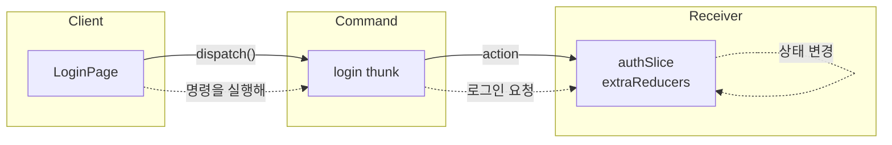
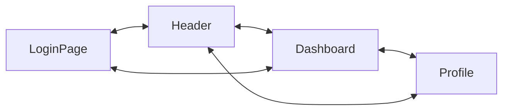
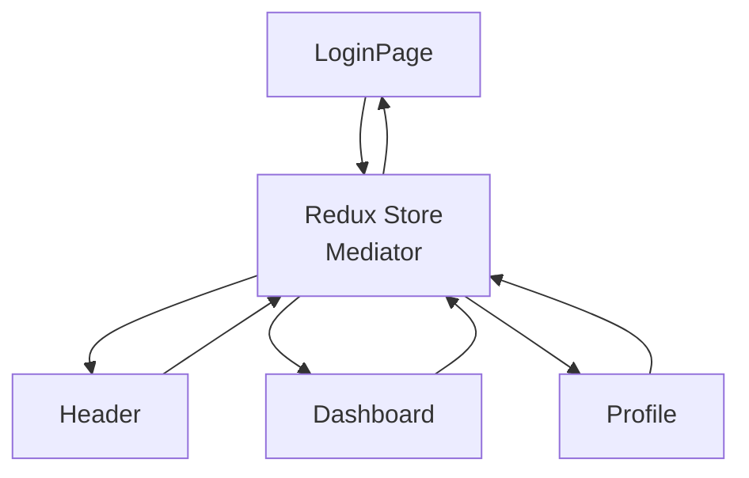
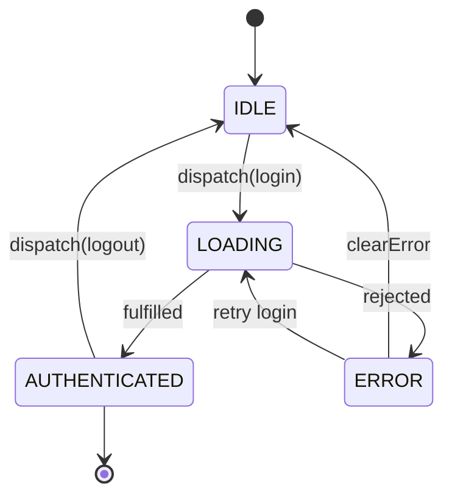
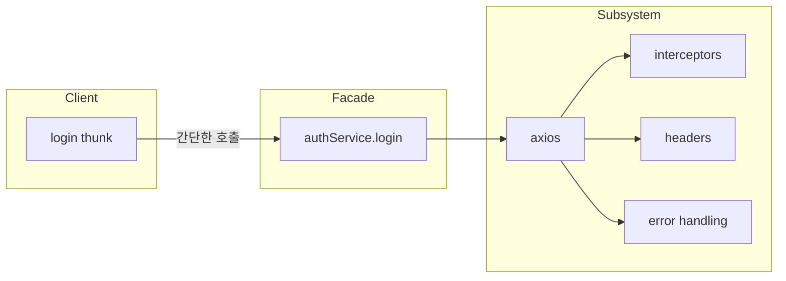
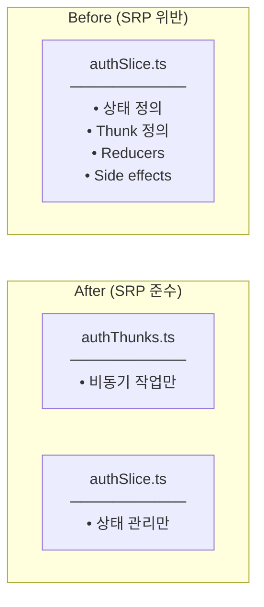
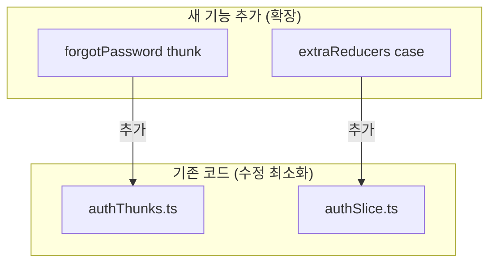
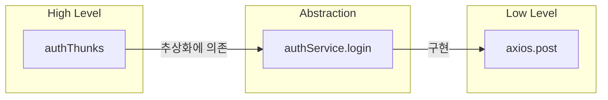

# Design Patterns & SOLID (GoF-based)

## GoF Design Patterns Used

### 1. Command Pattern

**GoF Definition:** Encapsulate a request as an object, thereby letting you parameterize clients with different requests.

**우리 코드에서:**
```
Redux Action = Command
- login thunk → "로그인 요청" 명령 객체
- dispatch(login(data)) → 명령 실행
```

**Structure:**



**Benefits:**
- 요청을 객체로 캡슐화 → 로깅, 되돌리기 가능
- 요청의 발신자와 수신자 분리
- Redux DevTools에서 모든 action 추적 가능

---

### 2. Mediator Pattern

**GoF Definition:** Define an object that encapsulates how a set of objects interact.

**우리 코드에서:**
```
Redux Store = Mediator
- 컴포넌트들이 직접 통신하지 않음
- 모든 상태 변경이 Store를 통해 이루어짐
```

**Without Mediator:**



**With Mediator (Redux):**



---

### 3. State Pattern (via Redux)

**GoF Definition:** Allow an object to alter its behavior when its internal state changes.

**우리 코드에서:**
```
AuthState의 상태에 따라 UI 동작이 변경됨
- loading = true → 버튼 비활성화, 스피너 표시
- isAuthenticated = true → /board로 리다이렉트
- error != null → 에러 메시지 표시
```

**State Transitions:**



---

### 4. Facade Pattern

**GoF Definition:** Provide a unified interface to a set of interfaces in a subsystem.

**우리 코드에서:**
```
authService = Facade
- axios 복잡성 숨김
- 단순한 인터페이스 제공: login(data), register(data)
```

**Structure:**



---

## SOLID Principles Applied

### S - Single Responsibility Principle

**적용:**

| 파일 | 단일 책임 |
|------|----------|
| authThunks.ts | 비동기 작업 (API 호출, localStorage) |
| authSlice.ts | 상태 관리 (정의, 변경) |
| authService.ts | HTTP 요청 |

**Before vs After:**



---

### O - Open/Closed Principle

**적용:**



---

### D - Dependency Inversion Principle

**적용:**



**Benefits:**
- axios를 fetch로 교체해도 thunk 코드 변경 없음
- 테스트 시 authService를 mock으로 대체 가능

---

## Pattern Comparison: Redux vs GoF

| Redux 개념 | GoF 패턴 | 설명 |
|------------|----------|------|
| Action | Command | 요청을 객체로 캡슐화 |
| Store | Mediator | 컴포넌트 간 통신 중재 |
| State | State | 상태에 따른 동작 변경 |
| Service | Facade | 복잡한 시스템의 단순 인터페이스 |
| Thunk | Strategy | 비동기 처리 전략 캡슐화 |

---

## Summary

**GoF Patterns:**
1. **Command** - Redux Action으로 요청 캡슐화
2. **Mediator** - Store가 컴포넌트 간 통신 중재
3. **State** - 인증 상태에 따른 UI 동작 변경
4. **Facade** - authService가 axios 복잡성 숨김

**SOLID:**
1. **SRP** - Thunk와 Slice 분리
2. **OCP** - 새 thunk 추가 시 기존 코드 최소 수정
3. **DIP** - Thunk가 Service 추상화에 의존
