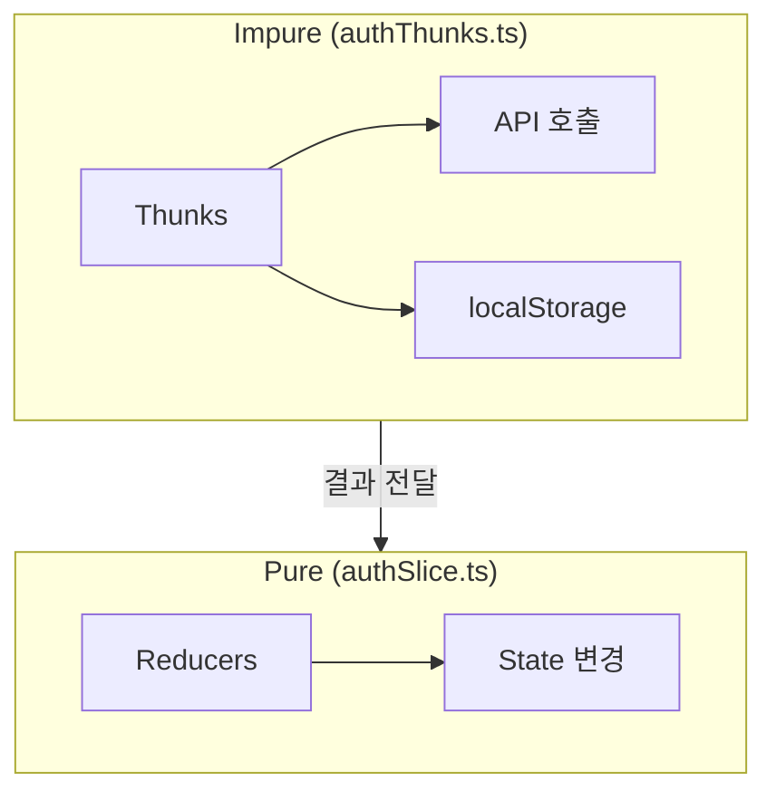
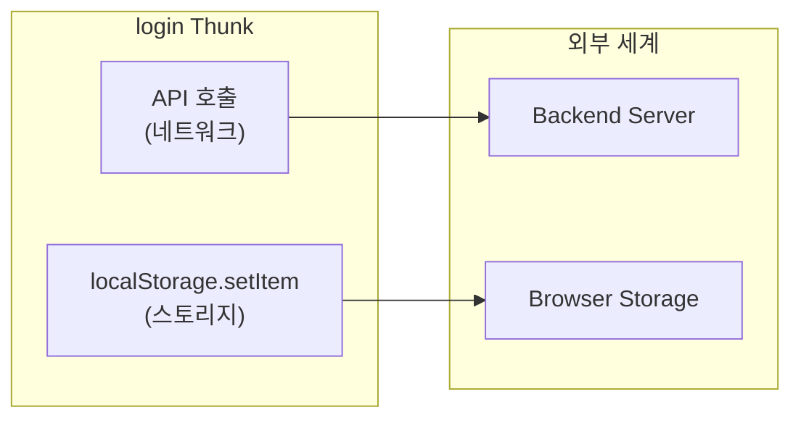
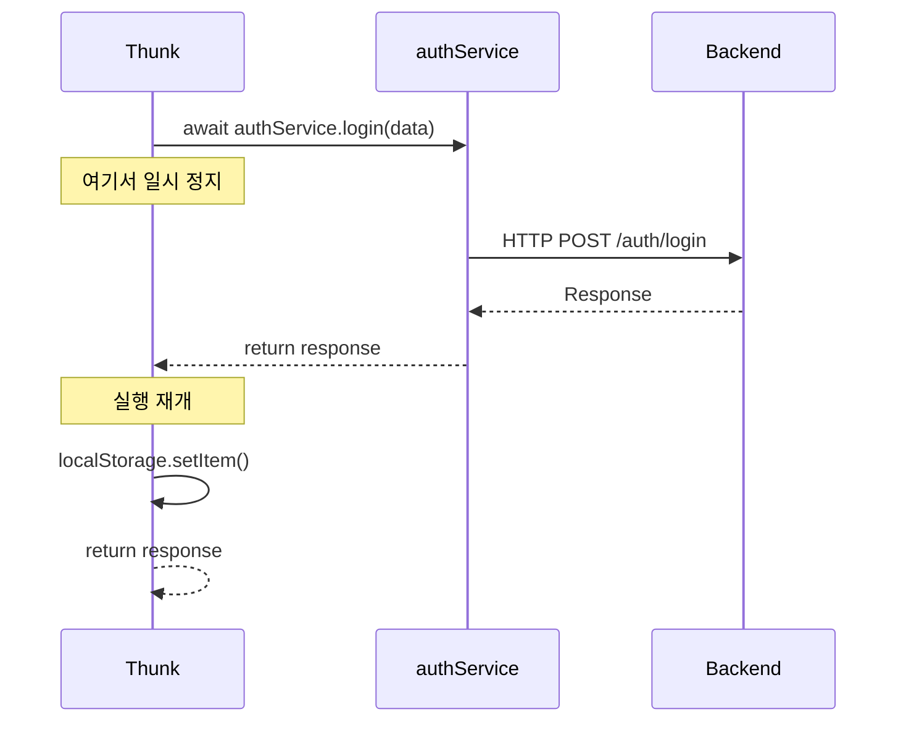
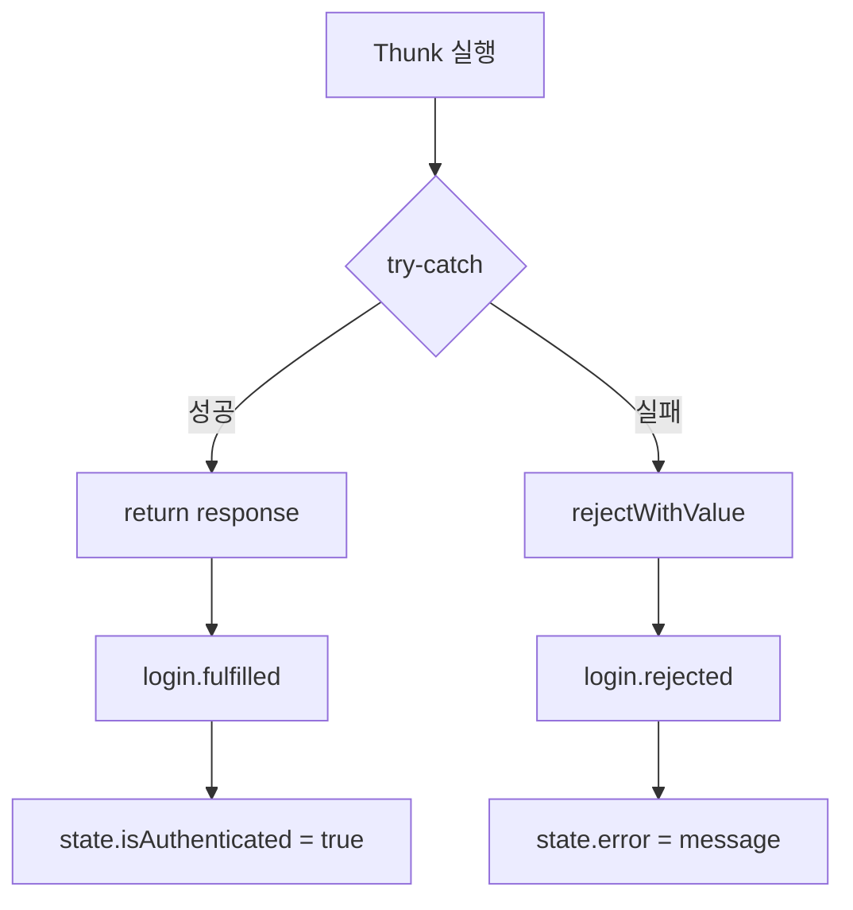
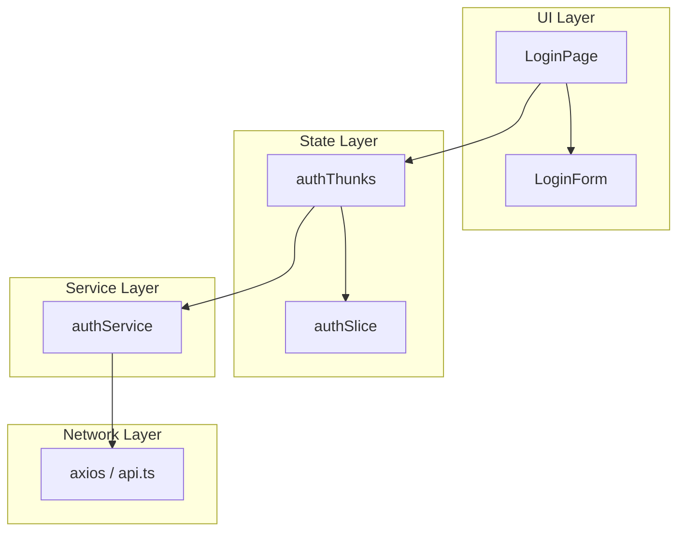
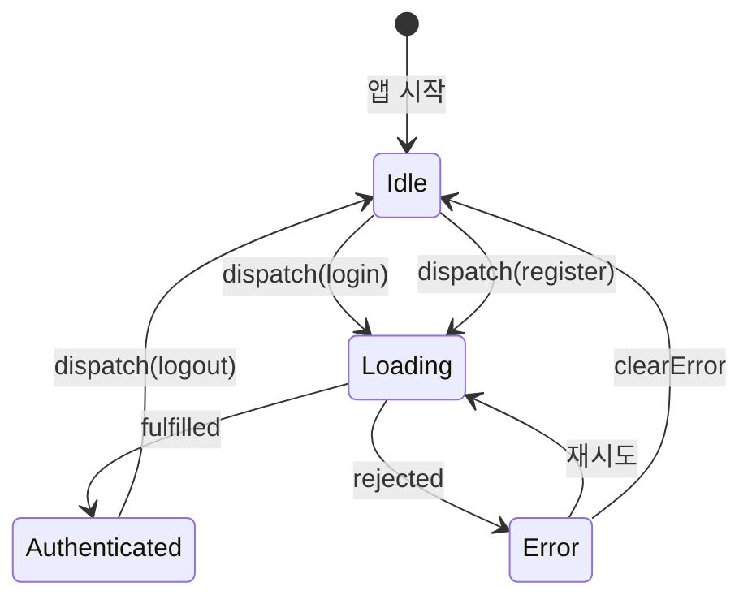
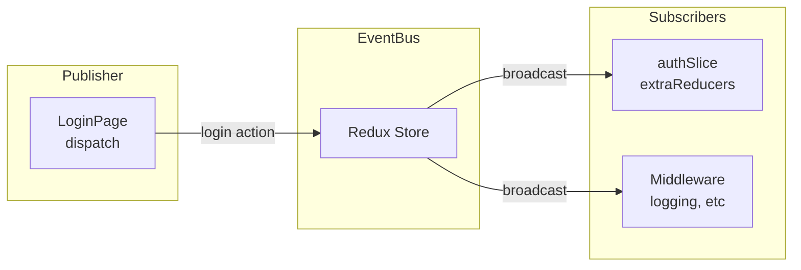
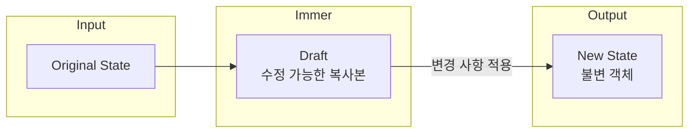

# Programming Concepts (Language Agnostic)

## 1. Pure vs Impure Functions

### Concept
함수가 외부 상태에 영향을 주거나 받는지에 따른 분류.

### Pure Function (순수 함수)

| 특징 | 설명 |
|------|------|
| 동일 입력 → 동일 출력 | 항상 예측 가능한 결과 |
| Side Effect 없음 | 외부 상태 변경 안 함 |
| 외부 상태 의존 없음 | 매개변수만으로 결과 결정 |

**우리 코드:**
```typescript
// authSlice의 reducers = Pure Functions
logout: (state) => {
  state.user = null;
  state.isAuthenticated = false;
}
// 같은 state 입력 → 항상 같은 결과
```

### Impure Function (비순수 함수)

| 특징 | 설명 |
|------|------|
| 외부 상태에 의존 | API 응답, 시간 등 |
| Side Effect 있음 | 외부 상태 변경함 |
| 예측 불가능 | 네트워크, DB 상태에 따라 다름 |

**우리 코드:**
```typescript
// authThunks = Impure Functions
export const login = createAsyncThunk(
  async (data) => {
    const response = await authService.login(data);  // 외부 API 호출
    localStorage.setItem("token", response.token);   // 외부 상태 변경
    return response;
  }
);
```

### 분리 이유



**Benefits:**
- Pure 함수는 테스트 용이 (mock 불필요)
- Impure 함수 격리 → 버그 추적 용이
- 코드 예측 가능성 향상

---

## 2. Side Effects

### Concept
함수가 반환값 외에 외부 세계에 영향을 주는 것.

### Side Effect 종류

| 종류 | 예시 |
|------|------|
| 네트워크 요청 | API 호출 |
| 스토리지 접근 | localStorage, sessionStorage |
| DOM 조작 | document.getElementById |
| 로깅 | console.log |
| 타이머 | setTimeout, setInterval |

### 우리 코드의 Side Effects



### 관리 방법
Side Effect를 한 곳에 격리:
- **Thunks** - 비동기 작업, 외부 통신
- **Slice** - 순수 상태 변경만

---

## 3. Async/Await Pattern

### Concept
비동기 작업을 동기 코드처럼 작성하는 문법.

### Language Implementations

| Language | Syntax |
|----------|--------|
| JavaScript/TypeScript | `async/await` |
| Python | `async/await` |
| C# | `async/await` |
| Rust | `async/.await` |
| Kotlin | `suspend fun` |

### 우리 코드

```typescript
export const login = createAsyncThunk(
  "auth/login",
  async (data: LoginFormData) => {  // async 함수
    const response = await authService.login(data);  // await로 대기
    return response;
  }
);
```

### 동작 방식



---

## 4. Error Handling Strategies

### Concept
예외 상황을 처리하는 다양한 전략.

### Strategy 1: Try-Catch

```typescript
try {
  const response = await authService.login(data);
  return response;
} catch (error) {
  return rejectWithValue("Login failed");
}
```

### Strategy 2: Result Type (Rust 스타일)

```typescript
type Result<T, E> = { ok: true; value: T } | { ok: false; error: E };

// 사용
const result = await login(data);
if (result.ok) {
  // 성공 처리
} else {
  // 에러 처리
}
```

### 우리 코드의 에러 흐름



---

## 5. Separation of Concerns (SoC)

### Concept
시스템을 구분된 섹션으로 나누어 각 섹션이 별도의 관심사를 다루도록 함.

### 우리 코드의 관심사 분리



### 각 레이어의 관심사

| Layer | 관심사 | 파일 |
|-------|--------|------|
| UI | 사용자 상호작용, 렌더링 | LoginPage, LoginForm |
| State | 상태 관리, 액션 처리 | authSlice, authThunks |
| Service | API 추상화 | authService |
| Network | HTTP 통신 | axios, api.ts |

---

## 6. Finite State Machine (FSM)

### Concept
유한한 상태와 상태 전이로 시스템을 모델링.

### Auth FSM



### 상태와 전이

| 현재 상태 | 이벤트 | 다음 상태 |
|----------|--------|----------|
| Idle | login | Loading |
| Loading | fulfilled | Authenticated |
| Loading | rejected | Error |
| Authenticated | logout | Idle |
| Error | clearError | Idle |

---

## 7. Event-Driven Architecture

### Concept
이벤트(Action)가 발생하면 구독자(Reducer)가 반응하는 구조.

### Redux에서의 Event-Driven



### 이벤트 흐름

1. **이벤트 발생:** `dispatch(login(data))`
2. **이벤트 전파:** Store가 모든 reducer에 action 전달
3. **이벤트 처리:** 해당 reducer가 상태 변경
4. **구독자 알림:** 상태 변경 → 구독 컴포넌트 리렌더

---

## 8. Immutability

### Concept
데이터를 변경하지 않고 새로운 복사본을 생성.

### Mutable vs Immutable

```typescript
// Mutable (나쁜 예)
state.user = newUser;
state.token = newToken;

// Immutable (원칙)
return {
  ...state,
  user: newUser,
  token: newToken,
};
```

### Redux Toolkit의 Immer

```typescript
// 겉보기에는 mutable하지만...
.addCase(login.fulfilled, (state, action) => {
  state.user = action.payload.user;  // 직접 수정하는 것 같지만
  state.token = action.payload.token;
})

// Immer가 내부적으로 immutable하게 처리
// 실제로는 새 객체 생성
```

**Immer 동작:**



---

## Summary

| Concept | What We Did | Benefit |
|---------|-------------|---------|
| Pure/Impure | Thunk와 Slice 분리 | 테스트 용이, 예측 가능 |
| Side Effects | Thunk에 격리 | 버그 추적 용이 |
| Async/Await | Thunk 내부 | 가독성 향상 |
| Error Handling | try-catch + rejectWithValue | 일관된 에러 처리 |
| SoC | Layer별 파일 분리 | 유지보수성 |
| FSM | Auth 상태 관리 | 상태 전이 명확 |
| Event-Driven | Redux Action/Reducer | 느슨한 결합 |
| Immutability | Immer 사용 | 상태 예측 가능 |
