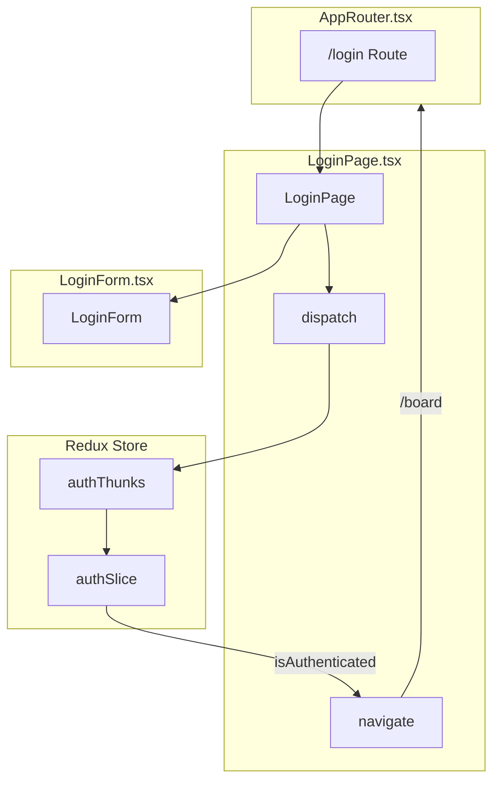
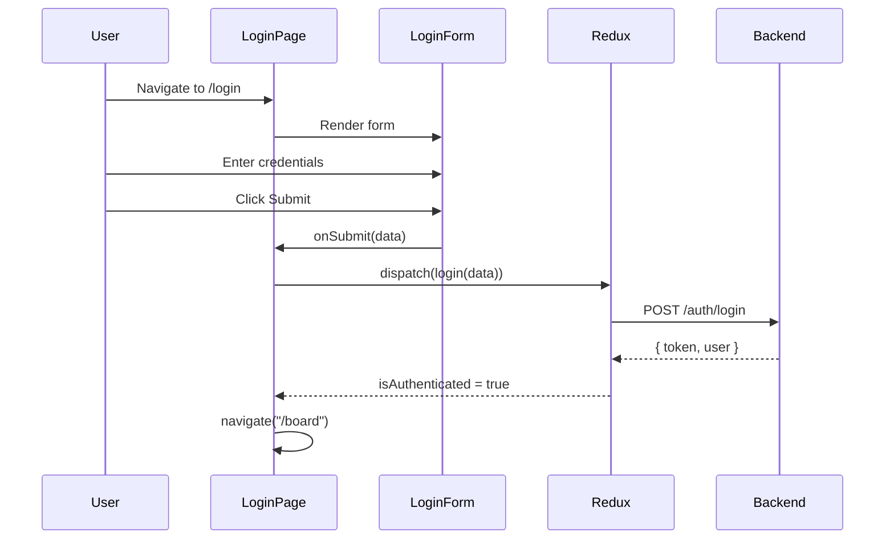

# Task #17: LoginPage Development Plan

## Overview
LoginPage 컴포넌트 생성 및 라우팅 설정.

## Task Requirements
- [x] Create LoginPage as a Container Component
- [x] Connect to Redux (dispatch login thunk)
- [x] Handle navigation on successful login
- [x] Add /login route to AppRouter
- [x] Export from auth/index.ts

## Architecture

## File Changes

| File | Action | Description |
|------|--------|-------------|
| pages/LoginPage.tsx | CREATE | Container component |
| router/AppRouter.tsx | MODIFY | Add /login route |
| auth/index.ts | MODIFY | Export LoginPage |

## Data Flow

## E2E Test Results
- ✅ Invalid credentials → 401 error displayed
- ✅ Client validation → Required field errors
- ✅ Successful login → Token stored in localStorage
