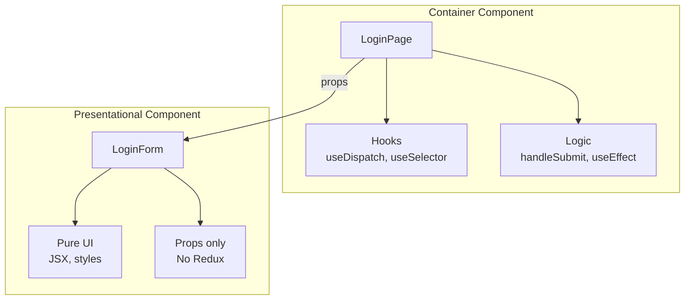
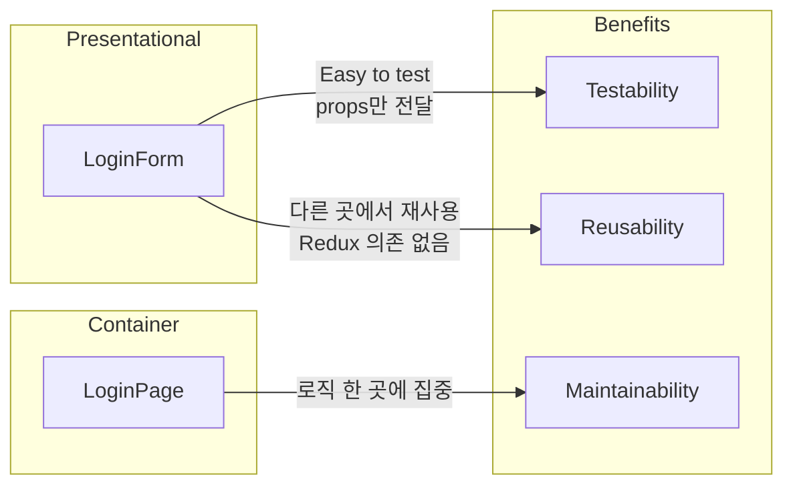

# Container vs Presentational Pattern

## Concept
UI 컴포넌트와 비즈니스 로직을 분리하는 React 패턴.

## Pattern Overview



## Comparison

| Aspect | Container (LoginPage) | Presentational (LoginForm) |
|--------|----------------------|---------------------------|
| Redux 접근 | ✅ useDispatch, useSelector | ❌ Props만 사용 |
| Navigation | ✅ useNavigate | ❌ 알 수 없음 |
| Business Logic | ✅ handleSubmit | ❌ onSubmit prop 호출만 |
| Reusability | 낮음 (특정 용도) | 높음 (재사용 가능) |
| Testability | 복잡 (mock 필요) | 간단 (props만 전달) |

## Our Implementation

### Container: LoginPage.tsx

```typescript
export const LoginPage = () => {
  // Redux Hooks - Container만 사용
  const dispatch = useAppDispatch();
  const { loading, error, isAuthenticated } = useAppSelector(
    (state) => state.auth
  );

  // Navigation Logic - Container가 담당
  const navigate = useNavigate();
  useEffect(() => {
    if (isAuthenticated) navigate("/board");
  }, [isAuthenticated, navigate]);

  // Business Logic - Container가 처리
  const handleSubmit = (data: LoginFormData) => {
    dispatch(login(data));
  };

  // Presentational Component에 props 전달
  return <LoginForm onSubmit={handleSubmit} loading={loading} error={error} />;
};
```

### Presentational: LoginForm.tsx

```typescript
export const LoginForm = ({ onSubmit, loading, error }: LoginFormProps) => {
  // Only local UI state
  const { formData, errors, handleChange, handleSubmit } = useLoginForm();

  // No Redux, No Navigation
  // Just receives props and renders UI
  return (
    <form onSubmit={handleSubmit(onSubmit)}>
      {/* Pure UI rendering */}
    </form>
  );
};
```

## Benefits



## When to Use

| Situation | Use Container? | Use Presentational? |
|-----------|---------------|---------------------|
| Redux 상태 필요 | ✅ | ❌ |
| 라우팅 필요 | ✅ | ❌ |
| 순수 UI 렌더링 | ❌ | ✅ |
| 재사용 컴포넌트 | ❌ | ✅ |
| API 호출 | ✅ (via dispatch) | ❌ |
