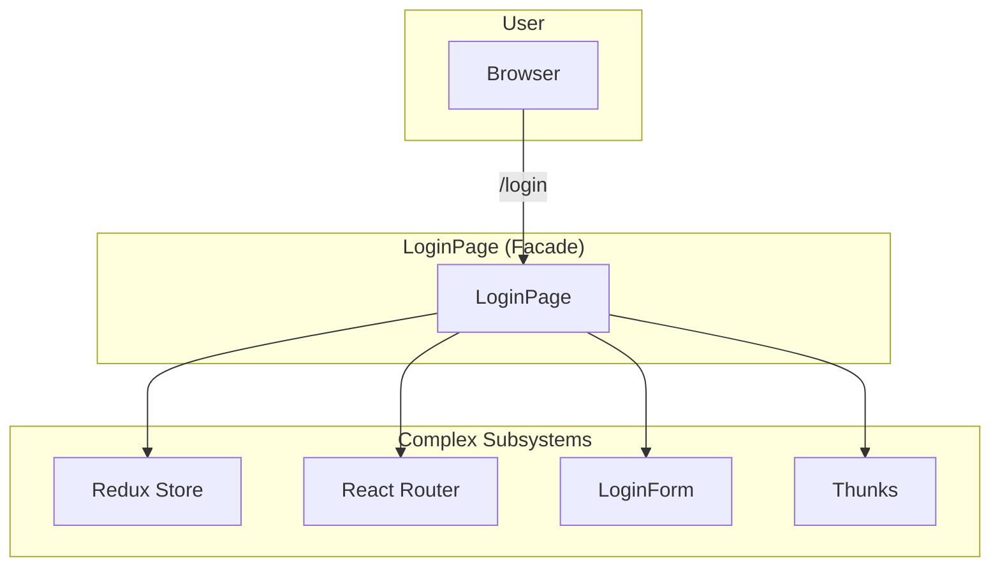
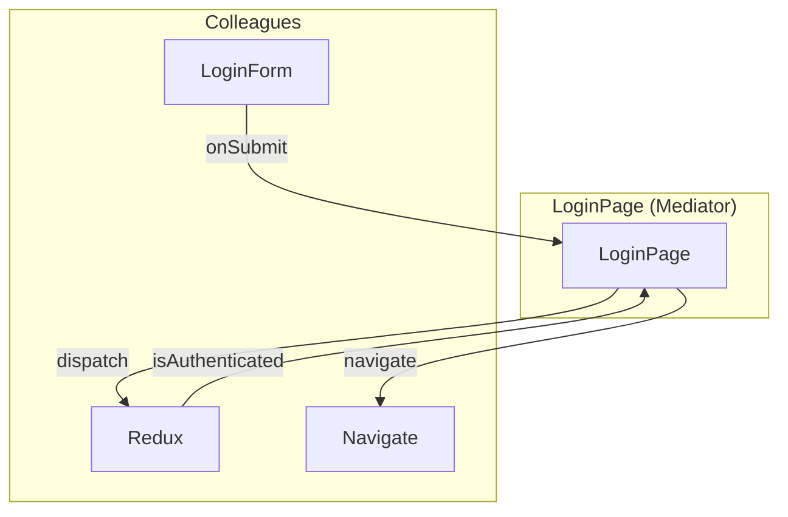
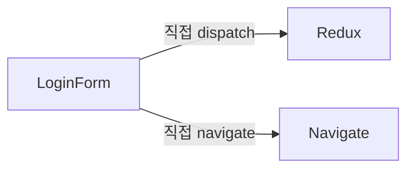
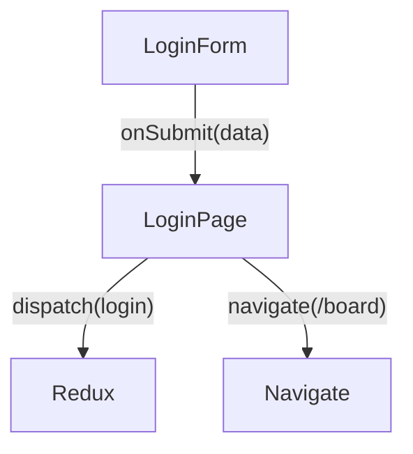
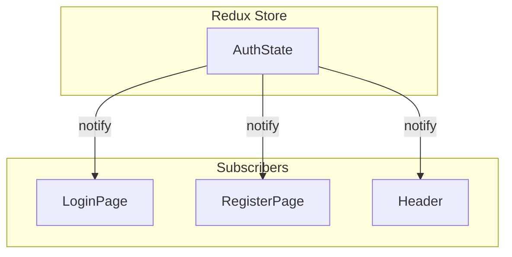
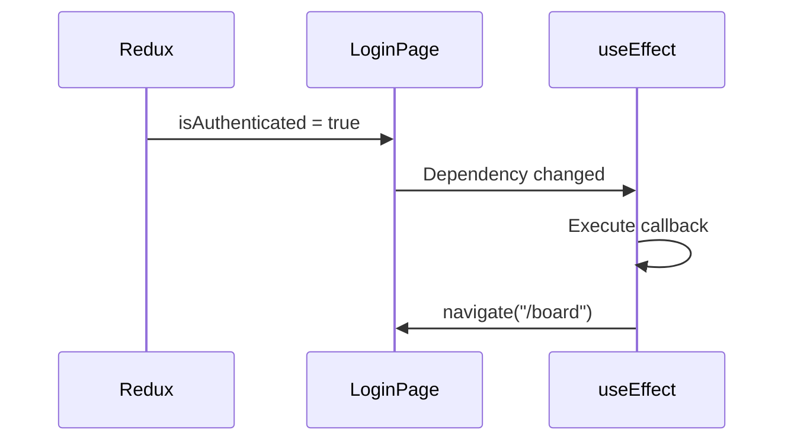
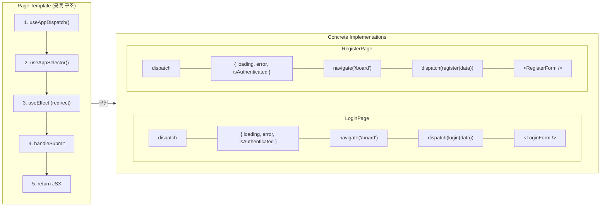
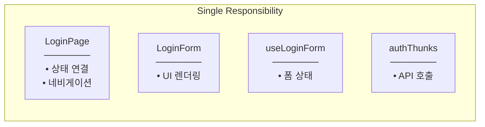
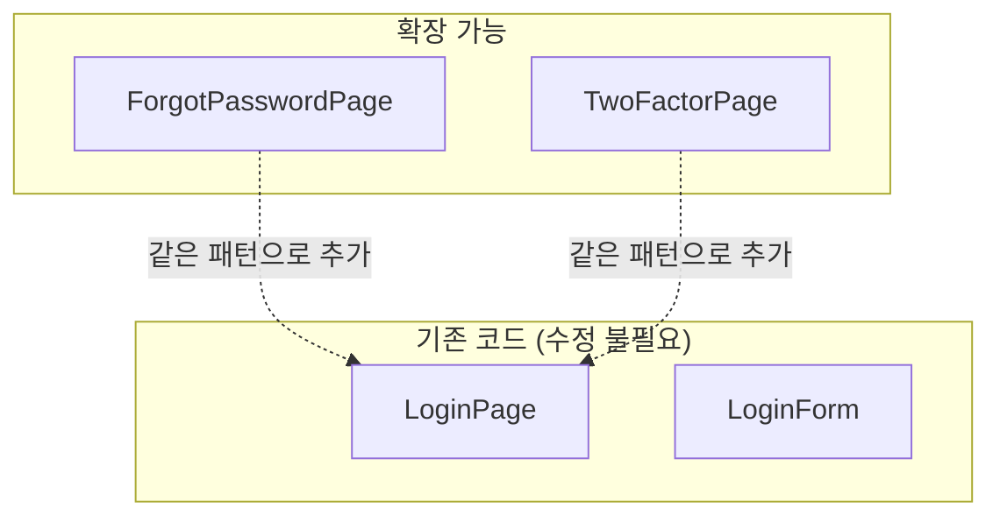
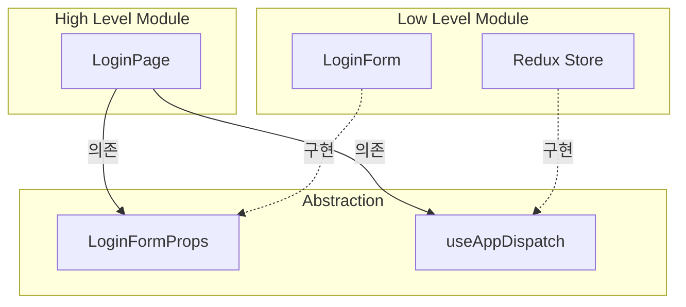

# Design Patterns & SOLID (GoF-based)

## GoF Design Patterns Used

### 1. Facade Pattern

**GoF Definition:** Provide a unified interface to a set of interfaces in a subsystem.

**우리 코드에서:**
```
LoginPage = Facade
- Redux, Router, Form 복잡성을 숨김
- 단순한 페이지 인터페이스 제공
```

**Structure:**



---

### 2. Mediator Pattern

**GoF Definition:** Define an object that encapsulates how a set of objects interact.

**우리 코드에서:**
```
LoginPage = Mediator (Local)
- LoginForm과 Redux 사이를 중재
- 직접 통신하지 않고 LoginPage를 통해
```

**Structure:**



**Without Mediator:**


**With Mediator:**


---

### 3. Observer Pattern

**GoF Definition:** Define a one-to-many dependency between objects so that when one object changes state, all its dependents are notified.

**우리 코드에서:**
```
useAppSelector = Observer subscription
- LoginPage가 Redux 상태를 구독
- 상태 변경 시 자동으로 알림받음
```

**Structure:**



**useEffect as Observer:**


---

### 4. Template Method Pattern

**GoF Definition:** Define the skeleton of an algorithm in an operation, deferring some steps to subclasses.

**우리 코드에서:**
```
LoginPage와 RegisterPage = 같은 템플릿
- 동일한 구조, 다른 세부 구현
```

**Structure:**



**Step-by-Step Comparison:**

| Step | Template | LoginPage | RegisterPage |
|------|----------|-----------|--------------|
| 1 | useAppDispatch() | dispatch | dispatch |
| 2 | useAppSelector() | { loading, error, isAuthenticated } | { loading, error, isAuthenticated } |
| 3 | useEffect (redirect) | navigate('/board') | navigate('/board') |
| 4 | handleSubmit | dispatch(login(data)) | dispatch(register(data)) |
| 5 | return JSX | \<LoginForm /\> | \<RegisterForm /\> |

---

## SOLID Principles Applied

### S - Single Responsibility Principle

**적용:**

| Component | 단일 책임 |
|-----------|----------|
| LoginPage | Redux-Form 연결, Navigation |
| LoginForm | 로그인 UI 렌더링 |
| useLoginForm | 폼 상태 관리 |
| authThunks | API 호출 |

**Diagram:**



---

### O - Open/Closed Principle

**적용:**



---

### D - Dependency Inversion Principle

**적용:**



---

## Summary

| GoF Pattern | Where Applied | Purpose |
|-------------|---------------|---------|
| Facade | LoginPage | 복잡한 서브시스템 단순화 |
| Mediator | LoginPage | Form-Redux 통신 중재 |
| Observer | useAppSelector | 상태 변경 구독 |
| Template Method | Page structure | 동일 패턴, 다른 구현 |

| SOLID | Application |
|-------|-------------|
| SRP | 각 컴포넌트가 하나의 책임 |
| OCP | 새 Page 추가 시 기존 코드 변경 없음 |
| DIP | Props와 Hooks 추상화에 의존 |
