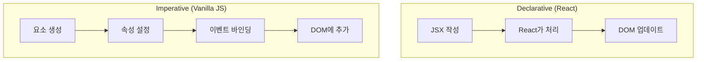
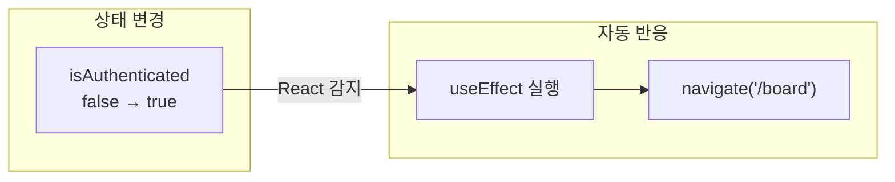
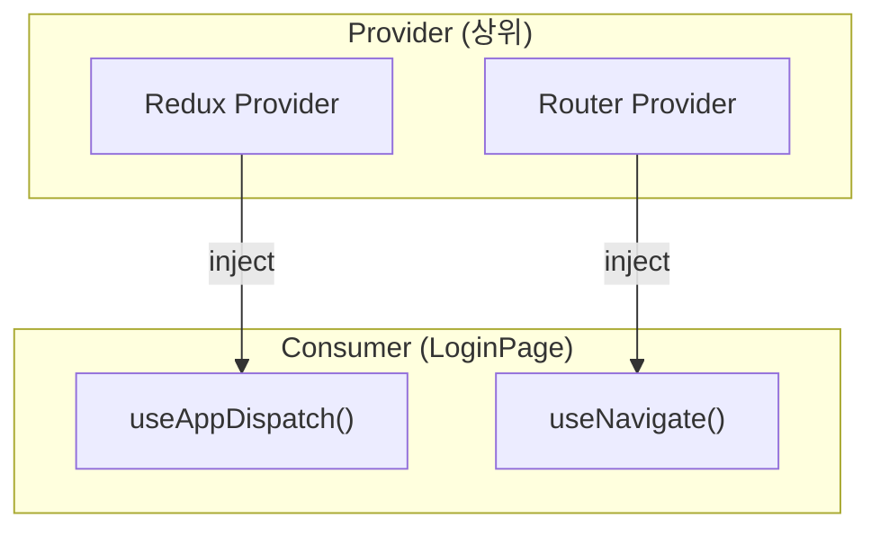
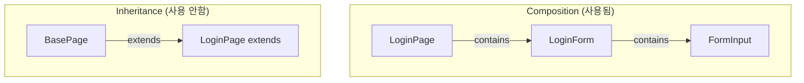
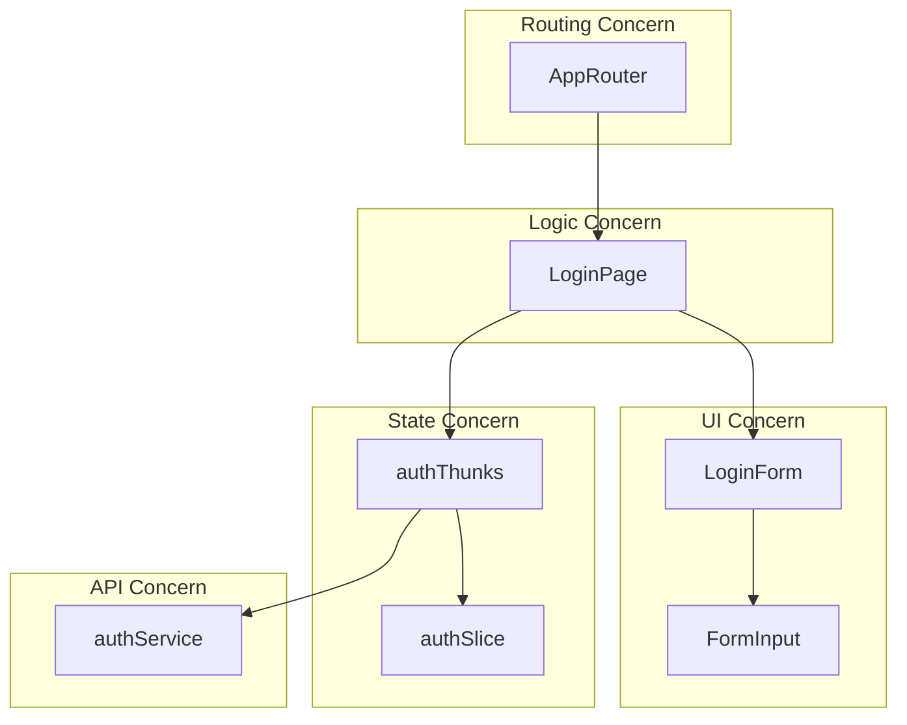
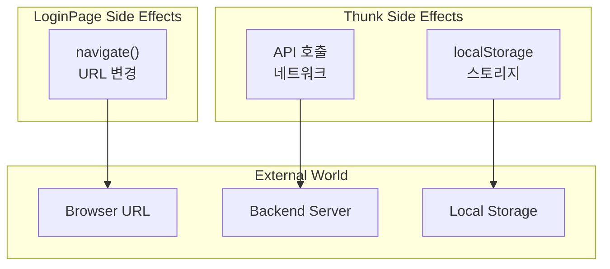
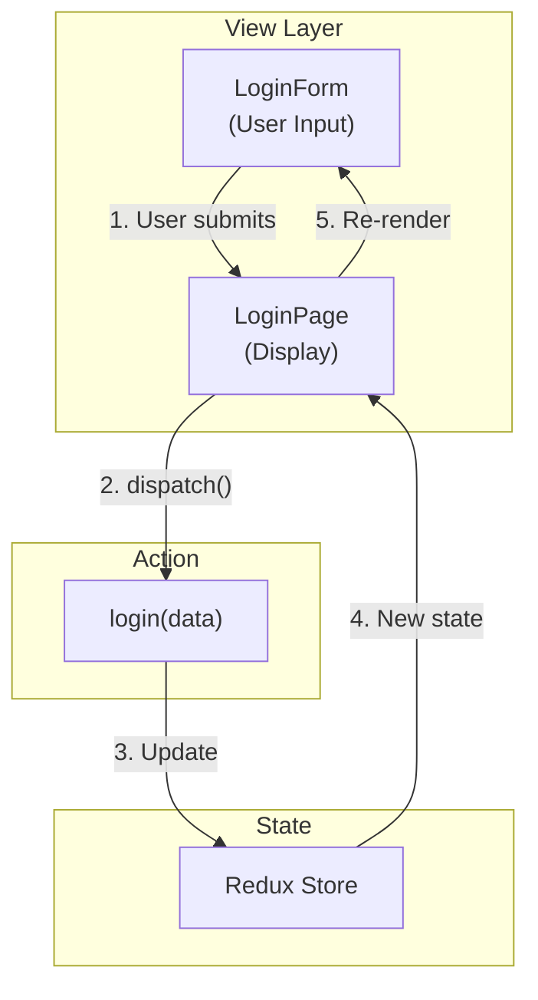

# Programming Concepts (Language Agnostic)

## 1. Declarative vs Imperative Programming

### Concept
"무엇을(What)" vs "어떻게(How)" 프로그래밍하는가.

### Comparison

| Paradigm | Focus | Example |
|----------|-------|---------|
| Imperative | How (절차) | for loop로 DOM 수정 |
| Declarative | What (결과) | JSX로 UI 선언 |

### 우리 코드 - Declarative

```typescript
// Declarative: "무엇을" 렌더링할지 선언
return (
  <div className="min-h-screen flex items-center justify-center">
    <LoginForm onSubmit={handleSubmit} loading={loading} error={error} />
  </div>
);
```

### Imperative 방식이었다면

```typescript
// Imperative: "어떻게" 렌더링할지 절차 작성
const div = document.createElement('div');
div.className = 'min-h-screen';
const form = createLoginForm();
form.onsubmit = handleSubmit;
div.appendChild(form);
container.appendChild(div);
```

### Diagram



---

## 2. Reactive Programming

### Concept
데이터 변경에 자동으로 반응하는 프로그래밍 패러다임.

### 우리 코드의 Reactive Flow



### Code Example

```typescript
// Reactive: 상태 변경 → 자동 반응
useEffect(() => {
  if (isAuthenticated) {
    navigate("/board");  // 상태가 바뀌면 자동 실행
  }
}, [isAuthenticated, navigate]);
```

### Non-Reactive 방식이었다면

```typescript
// Non-Reactive: 수동으로 체크
function checkAuth() {
  if (store.getState().auth.isAuthenticated) {
    navigate("/board");
  }
}
// 어딘가에서 수동으로 checkAuth() 호출 필요
```

---

## 3. Dependency Injection

### Concept
의존성을 외부에서 주입받아 결합도를 낮추는 기법.

### 우리 코드에서



### Code Example

```typescript
// LoginPage는 dispatch를 직접 생성하지 않음
// Provider가 주입한 것을 Hook으로 받음
const dispatch = useAppDispatch();  // Injected
const navigate = useNavigate();     // Injected
```

### Without DI

```typescript
// DI 없이: 직접 생성 → 강한 결합
import { store } from '../app/store';
const dispatch = store.dispatch;  // 직접 접근 → 테스트 어려움
```

---

## 4. Composition over Inheritance

### Concept
상속보다 조합을 통해 기능을 확장.

### 우리 코드에서



### Benefits

| Composition | Inheritance |
|-------------|-------------|
| 유연한 조합 | 고정된 계층 |
| 런타임 변경 가능 | 컴파일 타임 결정 |
| 테스트 용이 | 부모 의존 |

---

## 5. Separation of Concerns

### Concept
관심사를 분리하여 각 부분이 독립적으로 변경 가능하게 함.

### 우리 코드의 관심사



### 각 관심사

| Layer | Concern | Files |
|-------|---------|-------|
| Routing | URL → Component 매핑 | AppRouter.tsx |
| Container | Logic + State 연결 | LoginPage.tsx |
| UI | 사용자 인터페이스 | LoginForm, FormInput |
| State | 상태 관리 | authSlice, authThunks |
| Service | API 통신 | authService |

---

## 6. Side Effect Management

### Concept
함수의 반환값 외 외부 영향을 관리.

### 우리 코드의 Side Effects



### Side Effect 격리

| Location | Side Effect | Why Here |
|----------|-------------|----------|
| LoginPage | navigate() | UI 관련 side effect |
| authThunks | API call | 비동기 작업 격리 |
| authThunks | localStorage | 스토리지 접근 격리 |
| authSlice | ❌ None | 순수 상태 변경만 |

---

## 7. Unidirectional Data Flow

### Concept
데이터가 한 방향으로만 흐르는 아키텍처.

### 우리 코드의 데이터 흐름



### 장점

| Aspect | Benefit |
|--------|---------|
| Predictable | 상태 변경 예측 가능 |
| Debuggable | 데이터 흐름 추적 용이 |
| Testable | 각 단계 독립 테스트 |

---

## Summary

| Concept | What We Did | Benefit |
|---------|-------------|---------|
| Declarative | JSX로 UI 선언 | 코드 가독성, 유지보수성 |
| Reactive | useEffect로 상태 반응 | 자동화된 UI 업데이트 |
| DI | Hooks로 의존성 주입 | 느슨한 결합, 테스트 용이 |
| Composition | 컴포넌트 조합 | 유연한 구조 |
| SoC | Layer별 파일 분리 | 독립적 변경 가능 |
| Side Effect | 위치별 격리 | 버그 추적 용이 |
| Unidirectional | 단방향 데이터 흐름 | 예측 가능한 상태 |
