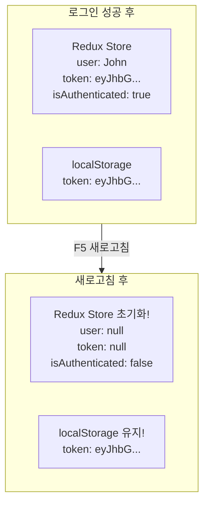
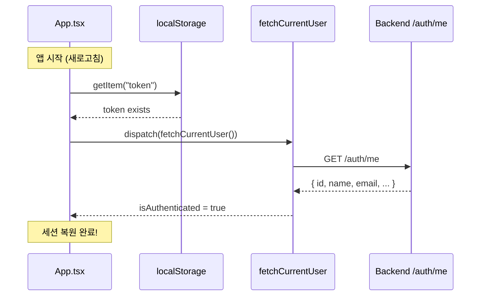
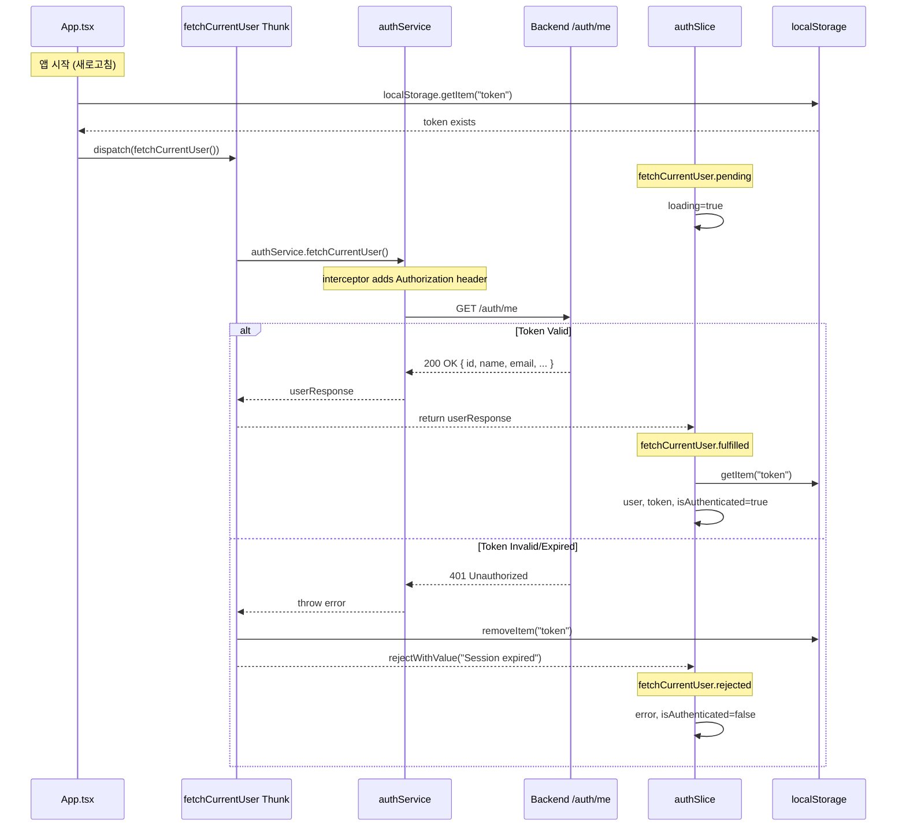
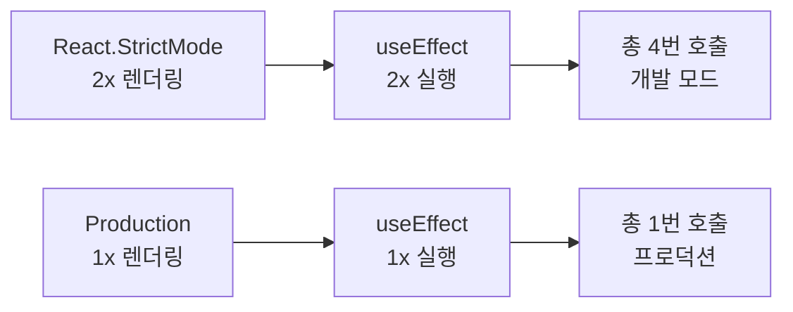

# Fetch Current User Implementation Plan

## Overview

Task #22: Frontend에서 앱 시작 시 현재 사용자 정보를 복원하는 fetchCurrentUser thunk 구현

---

## 현재 구현 상태

| 항목 | 상태 | 설명 |
|------|------|------|
| UserResponse 타입 | ✅ 완료 | api.types.ts |
| authService.fetchCurrentUser | ✅ 완료 | authService.ts |
| fetchCurrentUser thunk | ✅ 완료 | authThunks.ts |
| authSlice extraReducers | ✅ 완료 | authSlice.ts |
| index.ts exports | ✅ 완료 | index.ts |
| App.tsx 호출 | ⏳ 대기 | 필요 시 추가 |

**참고:** 모든 기반 코드는 준비됨. App.tsx에서 호출만 추가하면 동작

---

## 문제 상황

### 브라우저 새로고침 시 문제



**결과:** 토큰은 있지만 로그인 안 된 것처럼 보임

---

## 해결 방법

앱 시작 시 localStorage에 token이 있으면 서버에 사용자 정보 요청



---

## File Structure

```
src/features/auth/
├── services/
│   └── authService.ts      ← fetchCurrentUser 메서드 추가 ✅
├── store/
│   ├── authSlice.ts        ← extraReducers 추가 ✅
│   └── authThunks.ts       ← fetchCurrentUser thunk 추가 ✅
├── types/
│   └── api.types.ts        ← UserResponse 타입 추가 ✅
└── index.ts                ← export 추가 ✅

src/
└── App.tsx                 ← useEffect로 호출 (⏳ 대기)
```

---

## Implementation Details

### 1. UserResponse 타입 (api.types.ts)

```typescript
export interface UserResponse {
  id: number;
  name: string;
  username: string;
  email: string;
  role: "Admin" | "User";
  createdAt: string;
}
```

**AuthResponse vs UserResponse:**

| 항목 | AuthResponse | UserResponse |
|------|-------------|--------------|
| 용도 | 로그인/회원가입 | /auth/me |
| token | ✅ 포함 | ❌ 없음 |
| createdAt | ❌ 없음 | ✅ 포함 |

---

### 2. authService.fetchCurrentUser

```typescript
fetchCurrentUser: async (): Promise<UserResponse> => {
  const response = await api.get<UserResponse>("/auth/me");
  return response.data;
},
```

**중요:** api 인스턴스의 interceptor가 자동으로 token을 Header에 추가

---

### 3. fetchCurrentUser Thunk

```typescript
export const fetchCurrentUser = createAsyncThunk(
  "auth/fetchCurrentUser",
  async (_, { rejectWithValue }) => {
    try {
      const response = await authService.fetchCurrentUser();
      return response;
    } catch (error: unknown) {
      localStorage.removeItem("token");  // 토큰 무효 시 삭제
      // ... error handling
    }
  }
);
```

**특별한 점:**
- 첫 번째 파라미터가 `_` (인자 없음)
- 실패 시 localStorage 토큰 삭제 (만료/무효 처리)

---

### 4. extraReducers

```typescript
.addCase(fetchCurrentUser.fulfilled, (state, action) => {
  state.loading = false;
  state.user = {
    id: action.payload.id,
    name: action.payload.name,
    email: action.payload.email,
    username: action.payload.username,
    role: action.payload.role,
  };
  state.token = localStorage.getItem("token");  // localStorage에서 복원
  state.isAuthenticated = true;
})
```

**주의:** token은 API 응답이 아닌 localStorage에서 가져옴

---

### 5. App.tsx (미구현 - 필요 시 추가)

```typescript
// 현재 상태
function App() {
  return <AppRouter />;
}

// 세션 복원 필요 시 추가할 코드
function App() {
  const dispatch = useAppDispatch();
  const { isAuthenticated } = useAppSelector((state) => state.auth);

  useEffect(() => {
    const token = localStorage.getItem("token");
    if (token && !isAuthenticated) {
      dispatch(fetchCurrentUser());
    }
  }, []);

  return <AppRouter />;
}
```

---

## Data Flow



---

## StrictMode와 중복 호출

### 개발 모드에서 여러 번 호출되는 이유



| 환경 | 호출 횟수 |
|-----|---------|
| Development (StrictMode ON) | 4번 |
| Production (StrictMode OFF) | 1번 |

**왜 괜찮은가:**
- 동일한 token으로 동일한 요청
- 서버에 부담 없음 (GET 요청, idempotent)
- Production에서는 1번만 호출

---

## Checklist

- [x] UserResponse 타입 추가 (api.types.ts)
- [x] authService.fetchCurrentUser 메서드 추가
- [x] fetchCurrentUser async thunk 생성
- [x] Handles pending state (loading = true)
- [x] Handles fulfilled state (user, token, isAuthenticated)
- [x] Handles rejected state (error, token 삭제)
- [x] index.ts export 추가
- [x] Build verification
- [x] E2E test (Network tab)
- [ ] App.tsx에서 앱 시작 시 호출 (필요 시 추가)

---

## Related Documentation

- [Session Persistence Flow](./01-session-persistence.md)
- [Design Patterns & SOLID](./02-design-patterns-and-solid.md)
- [Programming Concepts](./03-programming-concepts.md)
