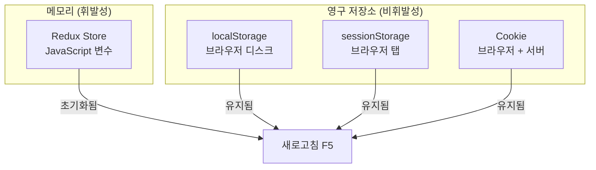
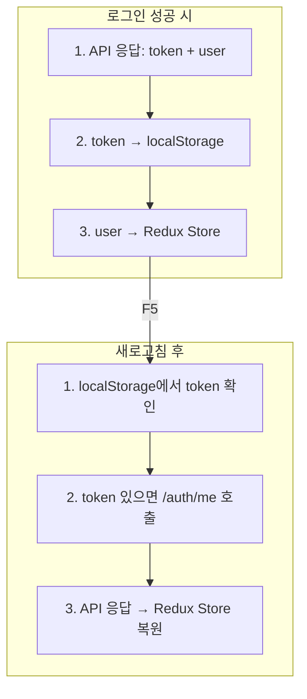
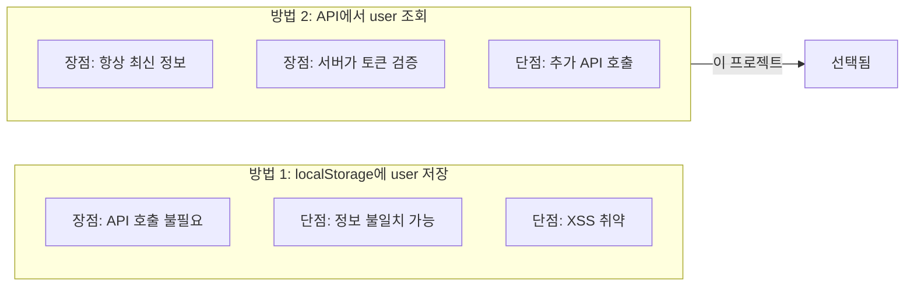
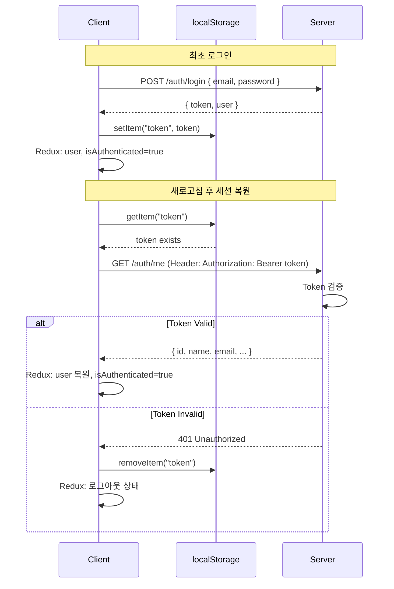
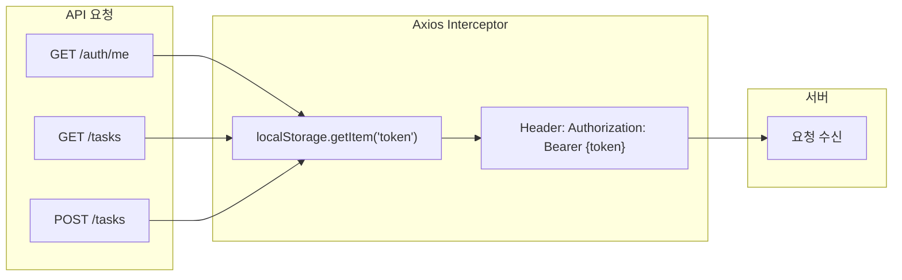
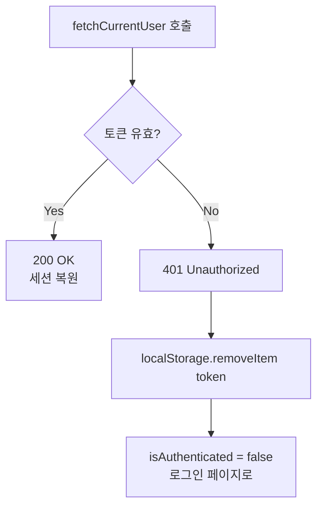
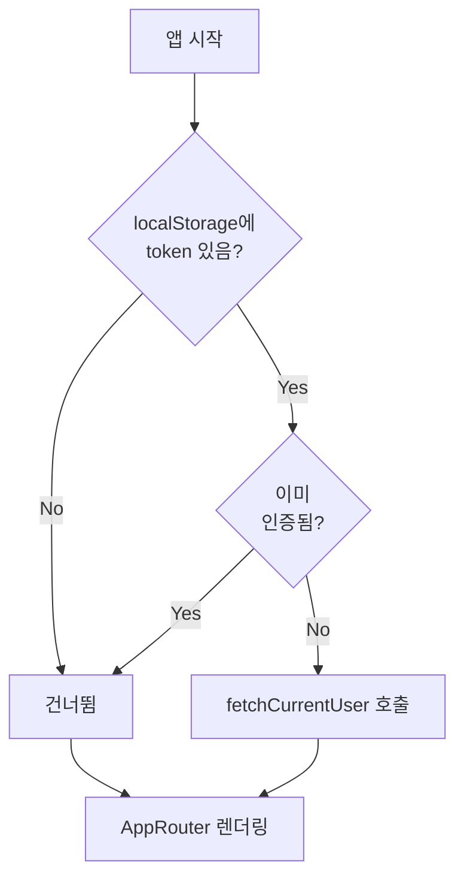

# Session Persistence: 세션 유지 전략

## Overview

웹 애플리케이션에서 브라우저 새로고침 후에도 로그인 상태를 유지하는 방법

---

## 1. 메모리 vs 영구 저장소



### 비교 표

| 저장소 | 지속성 | 탭 공유 | 서버 전송 | 용량 |
|--------|--------|---------|----------|------|
| Redux Store | 새로고침 시 초기화 | ❌ | ❌ | 무제한 |
| localStorage | 브라우저 닫아도 유지 | ✅ | ❌ | ~5MB |
| sessionStorage | 탭 닫으면 삭제 | ❌ | ❌ | ~5MB |
| Cookie | 만료일까지 유지 | ✅ | ✅ | ~4KB |

---

## 2. 이 프로젝트의 전략

### Token은 localStorage, User는 API에서



### 왜 user 정보는 localStorage에 저장 안 하나?



**이유:**
1. **보안**: 서버가 토큰 유효성 검증
2. **정확성**: 사용자 정보가 변경되었을 수 있음 (이름, 역할 등)
3. **단순성**: localStorage는 token만 관리

---

## 3. Token 기반 인증 흐름



---

## 4. Axios Interceptor의 역할

### 모든 요청에 Token 자동 추가



### 코드 위치

```typescript
// src/services/api.ts
api.interceptors.request.use((config) => {
  const token = localStorage.getItem("token");
  if (token) {
    config.headers.Authorization = `Bearer ${token}`;
  }
  return config;
});
```

**장점:**
- 매 요청마다 token 추가 코드 불필요
- 중앙 집중식 관리
- 인증 로직 일관성

---

## 5. 토큰 만료 처리



### 토큰이 무효화되는 경우

| 상황 | 서버 응답 | 클라이언트 처리 |
|------|----------|----------------|
| 토큰 만료 | 401 | token 삭제, 재로그인 유도 |
| 토큰 변조 | 401 | token 삭제, 재로그인 유도 |
| 사용자 삭제됨 | 404 또는 401 | token 삭제, 재로그인 유도 |

---

## 6. 언제 fetchCurrentUser가 호출되나?



### 조건: `token && !isAuthenticated`

| token | isAuthenticated | 결과 |
|-------|-----------------|------|
| ❌ | ❌ | 건너뜀 (비로그인 상태) |
| ✅ | ❌ | **호출** (복원 필요) |
| ✅ | ✅ | 건너뜀 (이미 인증됨) |

---

## 7. 요약

```mermaid
graph TB
    subgraph 저장_전략["저장 전략"]
        T[Token → localStorage<br/>영구 저장, 새로고침 유지]
        U[User → Redux Store<br/>API에서 조회]
    end

    subgraph 복원_전략["복원 전략"]
        R1[앱 시작]
        R2[token 확인]
        R3[/auth/me 호출]
        R4[Redux 복원]
    end

    T --> R1
    R1 --> R2
    R2 --> R3
    R3 --> R4

    style T fill:#87CEEB
    style U fill:#87CEEB
```

### 핵심 포인트

1. **localStorage**: token만 저장 (영구)
2. **Redux Store**: user 정보 저장 (휘발)
3. **세션 복원**: token으로 서버에 user 정보 요청
4. **Interceptor**: 모든 요청에 token 자동 추가
5. **토큰 만료**: 401 시 자동 로그아웃 처리
