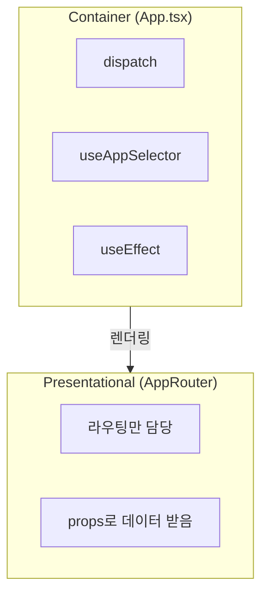
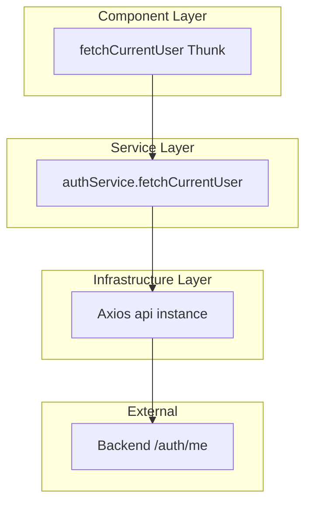
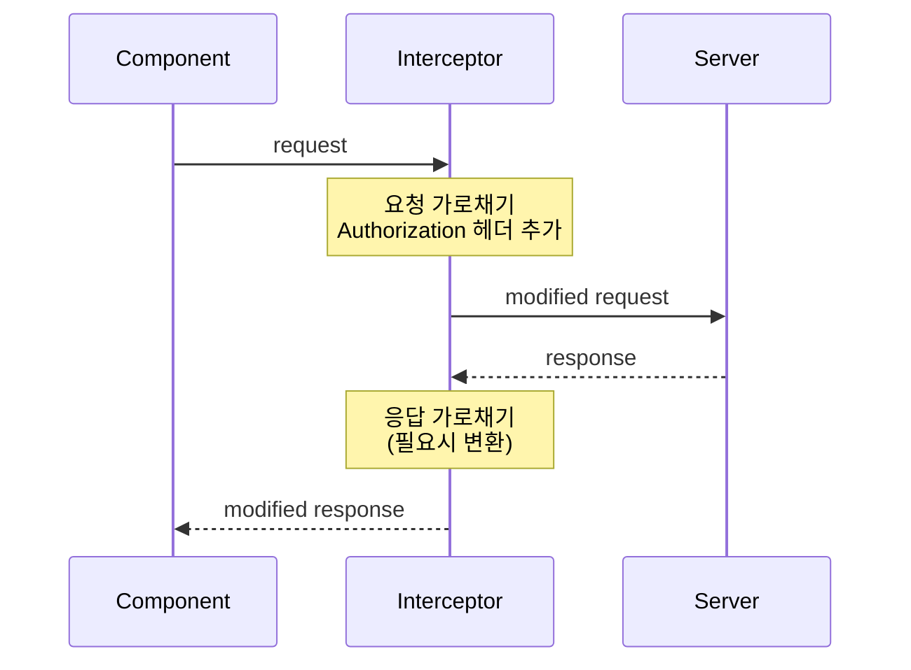
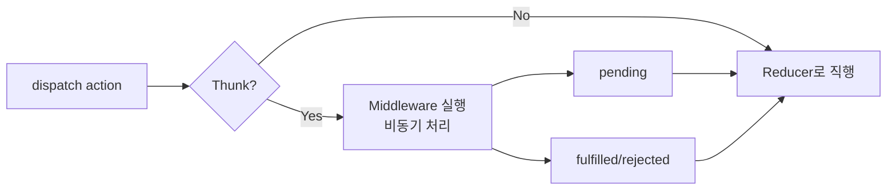
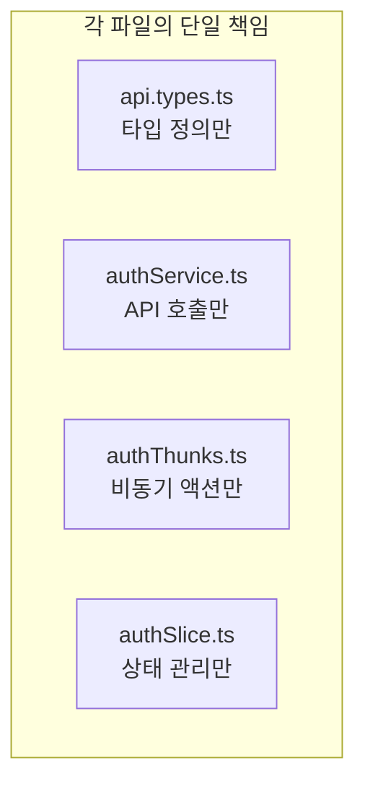
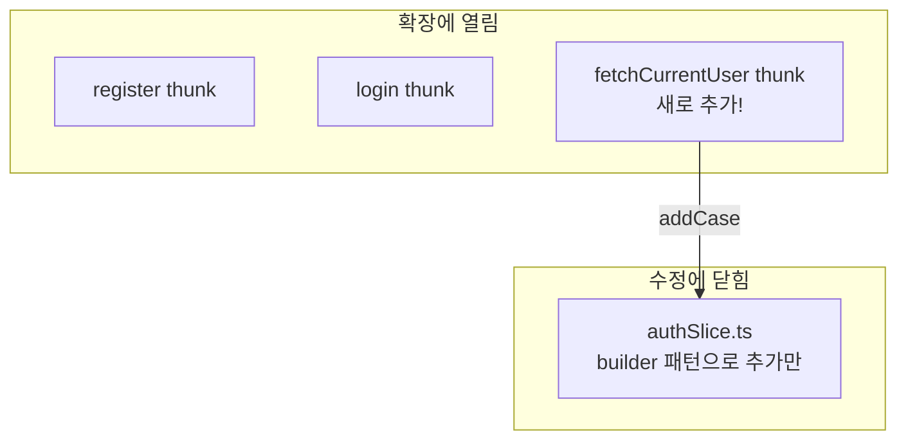
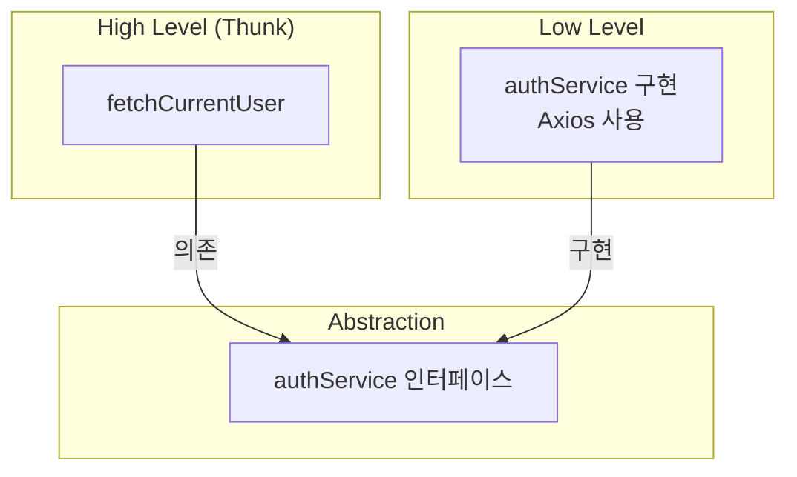
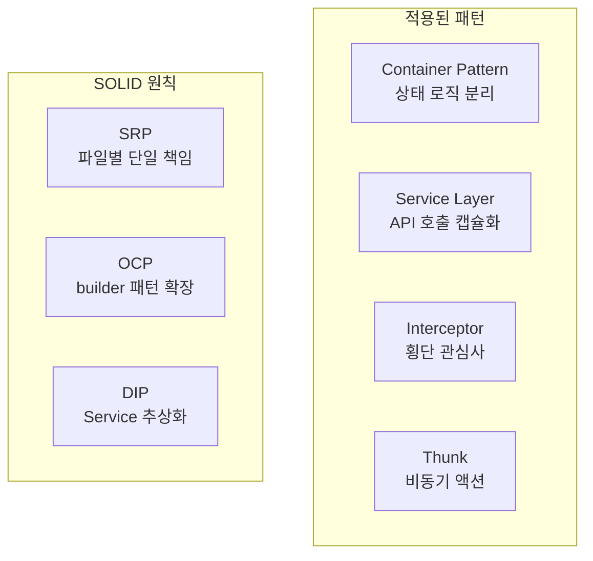

# Design Patterns & SOLID Principles

## Overview

Task #22 fetchCurrentUser 구현에서 사용된 디자인 패턴과 SOLID 원칙

---

## 1. Design Patterns

### 1.1 Container Pattern (계획됨)



**적용:**
- App.tsx = Container (상태 로직)
- AppRouter = Presentational (UI 라우팅)

---

### 1.2 Service Layer Pattern



**장점:**
- Thunk가 HTTP 세부사항 모름
- Service 교체 가능 (테스트 시 Mock)
- 관심사 분리

---

### 1.3 Interceptor Pattern



**적용:**
- Axios request interceptor가 모든 요청에 token 자동 추가
- 횡단 관심사 (Cross-cutting Concern) 처리

---

### 1.4 Thunk Pattern (Redux Middleware)



**역할:**
- 비동기 로직을 액션으로 캡슐화
- 컴포넌트는 `dispatch(fetchCurrentUser())`만 호출
- 복잡한 비동기 로직 숨김

---

## 2. SOLID Principles

### 2.1 Single Responsibility Principle (SRP)



| 파일 | 책임 |
|------|------|
| api.types.ts | UserResponse 타입 정의 |
| authService.ts | /auth/me HTTP 호출 |
| authThunks.ts | 비동기 흐름 관리 |
| authSlice.ts | 상태 변경 로직 |

---

### 2.2 Open/Closed Principle (OCP)



**적용:**
- 새 thunk 추가 시 기존 코드 수정 불필요
- `builder.addCase()`로 새 케이스만 추가

```typescript
// 기존 코드 수정 없이 확장
builder
  .addCase(register.pending, ...)
  .addCase(login.pending, ...)
  .addCase(fetchCurrentUser.pending, ...)  // 추가만!
```

---

### 2.3 Dependency Inversion Principle (DIP)



**효과:**
- Thunk는 authService 인터페이스에만 의존
- 실제 HTTP 라이브러리(Axios) 교체 가능
- 테스트 시 Mock 주입 용이

---

## 3. 적용된 패턴 요약



---

## 4. 코드 품질 체크리스트

| 항목 | 상태 | 설명 |
|------|------|------|
| 파일 분리 | ✅ | types, service, thunk, slice 분리 |
| 단일 책임 | ✅ | 각 파일 하나의 역할 |
| 확장 용이 | ✅ | 새 thunk 추가 쉬움 |
| 테스트 용이 | ✅ | Service Mock 가능 |
| 재사용성 | ✅ | fetchCurrentUser 어디서든 호출 가능 |
