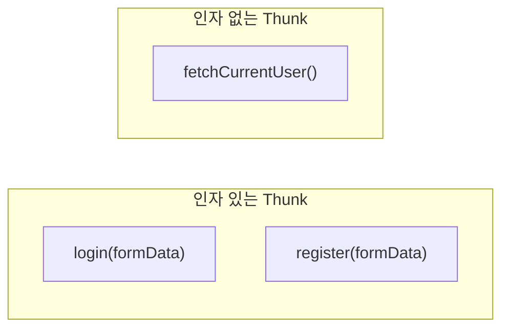
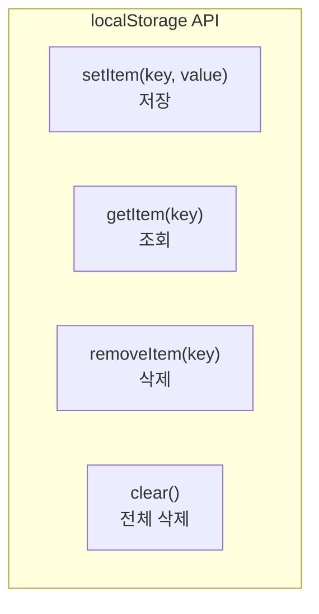
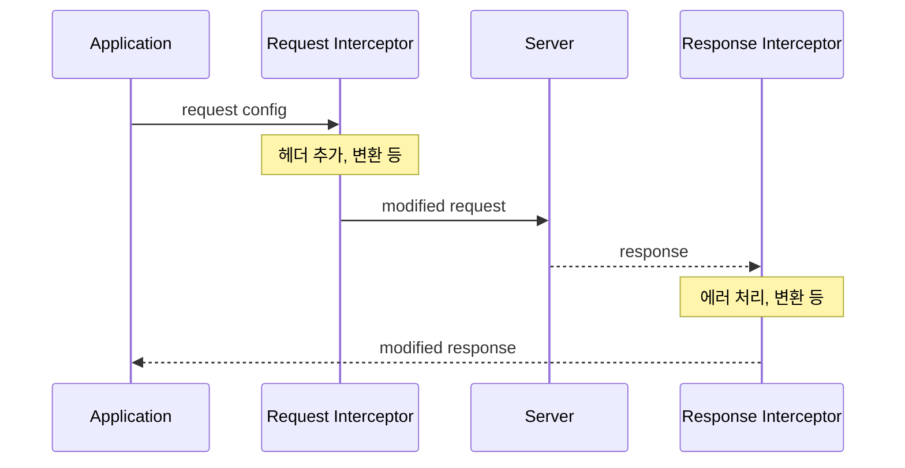
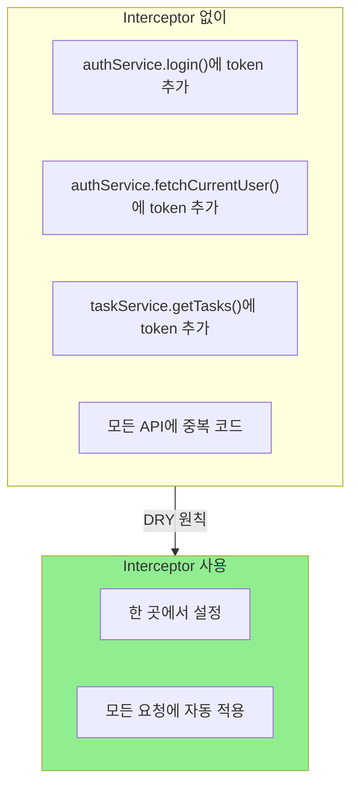
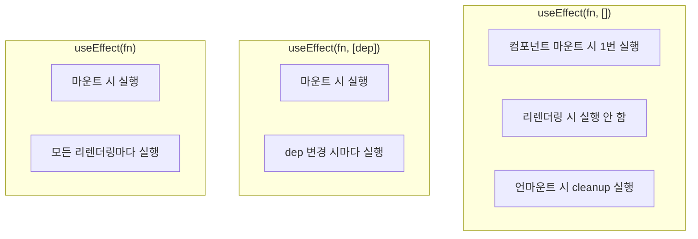
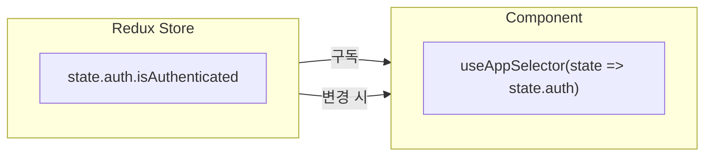
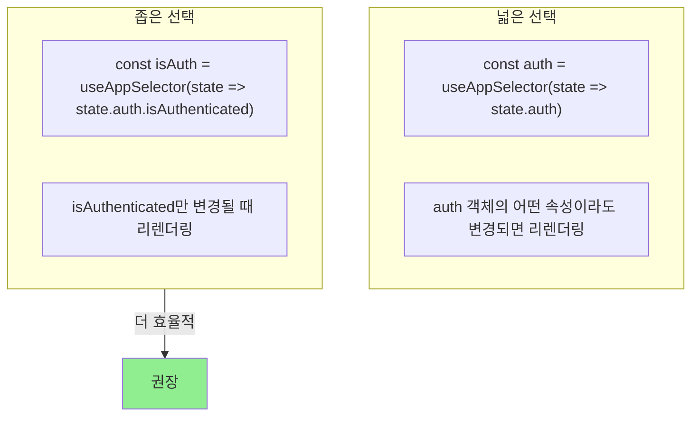
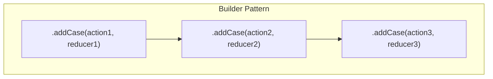
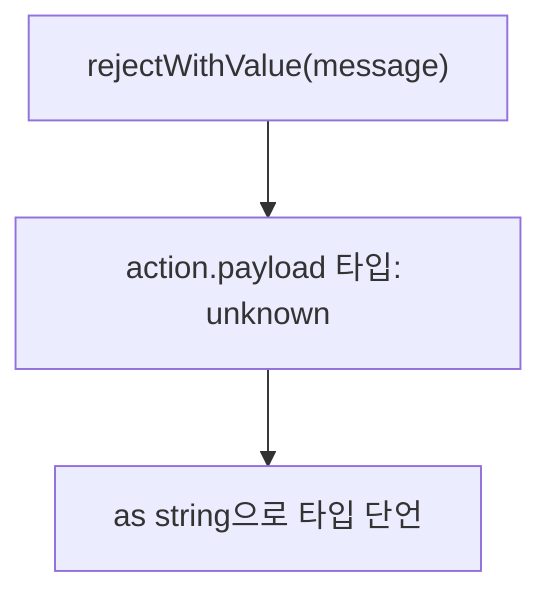
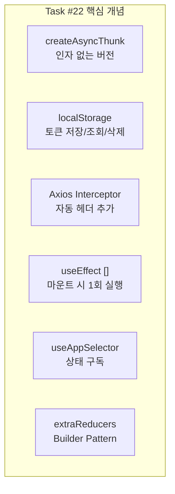

# Programming Concepts

## Overview

Task #22 fetchCurrentUser 구현에서 사용된 프로그래밍 개념들

---

## 1. createAsyncThunk with No Arguments

### 일반 Thunk vs 인자 없는 Thunk



### 코드 비교

```typescript
// 인자가 있는 경우
export const login = createAsyncThunk(
  "auth/login",
  async (data: LoginFormData, { rejectWithValue }) => {
    // data 사용
  }
);

// 인자가 없는 경우 (fetchCurrentUser)
export const fetchCurrentUser = createAsyncThunk(
  "auth/fetchCurrentUser",
  async (_, { rejectWithValue }) => {  // _ = 사용하지 않는 파라미터
    // 인자 없이 호출됨
  }
);
```

**`_` 의미:**
- 컨벤션: "이 파라미터는 사용하지 않음"
- TypeScript가 필수 파라미터 자리 채움
- `void`로 타입 지정 가능

---

## 2. localStorage API

### 기본 메서드



### 이 프로젝트에서 사용

```typescript
// 저장 (로그인 성공 시)
localStorage.setItem("token", response.token);

// 조회 (세션 복원 시)
const token = localStorage.getItem("token");

// 삭제 (로그아웃 또는 토큰 만료 시)
localStorage.removeItem("token");
```

### 주의사항

| 항목 | 설명 |
|------|------|
| **문자열만** | 객체 저장 시 JSON.stringify 필요 |
| **동기식** | 메인 스레드 블로킹 (큰 데이터 주의) |
| **보안** | XSS 취약, 민감 정보 저장 주의 |
| **용량** | ~5MB 제한 |

---

## 3. Axios Interceptors

### 개념



### Request Interceptor 코드

```typescript
// src/services/api.ts
api.interceptors.request.use(
  (config) => {
    const token = localStorage.getItem("token");
    if (token) {
      config.headers.Authorization = `Bearer ${token}`;
    }
    return config;  // 반드시 config 반환
  },
  (error) => {
    return Promise.reject(error);
  }
);
```

### 왜 Interceptor를 사용하나?



---

## 4. useEffect with Empty Dependency Array

### 동작 방식



### 이 프로젝트에서

```typescript
// 앱 시작 시 1번만 실행 (계획)
useEffect(() => {
  const token = localStorage.getItem("token");
  if (token && !isAuthenticated) {
    dispatch(fetchCurrentUser());
  }
}, []);  // 빈 배열 = 마운트 시 1번만
```

**왜 빈 배열?**
- 세션 복원은 앱 시작 시 1번만 필요
- 리렌더링마다 API 호출하면 비효율적

---

## 5. Redux Selector Pattern

### useAppSelector 사용



### 코드 예시

```typescript
// 전체 auth 상태 가져오기
const { isAuthenticated } = useAppSelector((state) => state.auth);

// 특정 값만 가져오기 (성능 최적화)
const isAuthenticated = useAppSelector((state) => state.auth.isAuthenticated);
```

### 리렌더링 최적화



---

## 6. extraReducers Builder Pattern

### 패턴 설명



### 코드 구조

```typescript
extraReducers: (builder) => {
  builder
    // 첫 번째 케이스
    .addCase(fetchCurrentUser.pending, (state) => {
      state.loading = true;
    })
    // 두 번째 케이스 (체이닝)
    .addCase(fetchCurrentUser.fulfilled, (state, action) => {
      state.loading = false;
      state.user = action.payload;
    })
    // 세 번째 케이스 (체이닝)
    .addCase(fetchCurrentUser.rejected, (state, action) => {
      state.loading = false;
      state.error = action.payload;
    });
}
```

### Builder Pattern 장점

| 장점 | 설명 |
|------|------|
| **타입 안전성** | TypeScript가 action.payload 타입 추론 |
| **가독성** | 체이닝으로 순차적 정의 |
| **확장성** | 새 케이스 추가 쉬움 |
| **IDE 지원** | 자동완성, 오류 감지 |

---

## 7. Type Assertion vs Type Guard

### rejectWithValue 사용 시

```typescript
.addCase(fetchCurrentUser.rejected, (state, action) => {
  state.error = action.payload as string;  // Type Assertion
})
```

### 왜 `as string`?



**이유:**
- `rejectWithValue`의 반환 타입이 `unknown`
- 우리는 항상 string을 전달하므로 `as string`으로 단언
- 더 안전한 방법: `createAsyncThunk`의 제네릭 사용

---

## 8. 요약: 주요 개념



| 개념 | 용도 |
|------|------|
| `_` 파라미터 | 사용하지 않는 인자 표시 |
| localStorage | 브라우저에 토큰 영구 저장 |
| Interceptor | 모든 요청에 토큰 자동 추가 |
| useEffect([]) | 앱 시작 시 1번 실행 |
| useAppSelector | Redux 상태 구독 |
| builder.addCase | 타입 안전한 리듀서 추가 |
