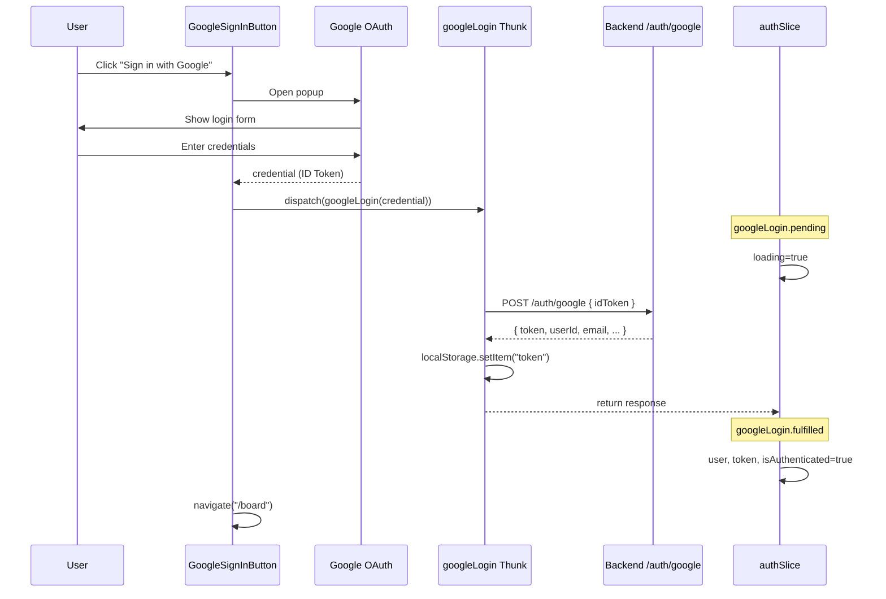
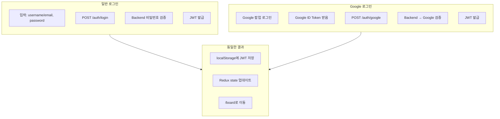

# Google Sign-In Button Implementation Plan

## Overview

Task #24: LoginPage에 Google Sign-In 버튼 추가

---

## 구현 완료 상태

| 항목 | 상태 | 설명 |
|------|------|------|
| @react-oauth/google 설치 | ✅ 완료 | npm package |
| .env 설정 | ✅ 완료 | VITE_GOOGLE_CLIENT_ID |
| GoogleOAuthProvider | ✅ 완료 | App.tsx |
| authService.googleLogin | ✅ 완료 | authService.ts |
| googleLogin thunk | ✅ 완료 | authThunks.ts |
| authSlice extraReducers | ✅ 완료 | authSlice.ts |
| GoogleSignInButton | ✅ 완료 | components/ |
| LoginPage 통합 | ✅ 완료 | LoginPage.tsx |

---

## Google OAuth 프론트엔드 흐름



---

## File Structure

```
src/
├── App.tsx                          ← GoogleOAuthProvider 추가 ✅
└── features/auth/
    ├── components/
    │   └── GoogleSignInButton.tsx   ← NEW ✅
    ├── services/
    │   └── authService.ts           ← googleLogin 메서드 추가 ✅
    ├── store/
    │   ├── authSlice.ts             ← extraReducers 추가 ✅
    │   └── authThunks.ts            ← googleLogin thunk 추가 ✅
    ├── pages/
    │   └── LoginPage.tsx            ← GoogleSignInButton 추가 ✅
    └── index.ts                     ← exports 추가 ✅
```

---

## Implementation Details

### 1. .env 설정

```
VITE_GOOGLE_CLIENT_ID=your_google_client_id_here
```

**Vite 환경변수 규칙:**
- `VITE_` prefix 필수
- `import.meta.env.VITE_*` 로 접근

---

### 2. GoogleOAuthProvider (App.tsx)

```tsx
import { GoogleOAuthProvider } from "@react-oauth/google";

function App() {
  return (
    <GoogleOAuthProvider clientId={import.meta.env.VITE_GOOGLE_CLIENT_ID}>
      <AppRouter />
    </GoogleOAuthProvider>
  );
}
```

**Provider 역할:**
- Google OAuth SDK 초기화
- 하위 컴포넌트에서 GoogleLogin 사용 가능하게 함

---

### 3. authService.googleLogin

```typescript
googleLogin: async (idToken: string): Promise<AuthResponse> => {
  const response = await api.post<AuthResponse>("/auth/google", {
    idToken,
  });
  return response.data;
},
```

**login vs googleLogin:**

| 항목 | login | googleLogin |
|------|-------|-------------|
| 입력 | usernameOrEmail, password | idToken (Google) |
| 인증 주체 | 우리 서버 | Google |
| 응답 | 동일 (AuthResponse) | 동일 (AuthResponse) |

---

### 4. googleLogin Thunk

```typescript
export const googleLogin = createAsyncThunk(
  "auth/googleLogin",
  async (idToken: string, { rejectWithValue }) => {
    try {
      const response = await authService.googleLogin(idToken);
      localStorage.setItem("token", response.token);
      return response;
    } catch (error: unknown) {
      // ... error handling
    }
  }
);
```

**기존 login thunk와 동일한 패턴:**
- 성공 시 localStorage에 token 저장
- 실패 시 에러 메시지 추출

---

### 5. extraReducers

```typescript
.addCase(googleLogin.pending, (state) => {
  state.loading = true;
  state.error = null;
})
.addCase(googleLogin.fulfilled, (state, action) => {
  state.loading = false;
  state.user = action.payload.user;
  state.token = action.payload.token;
  state.isAuthenticated = true;
})
.addCase(googleLogin.rejected, (state, action) => {
  state.loading = false;
  state.error = action.payload as string;
})
```

**login extraReducers와 완전히 동일한 구조**

---

### 6. GoogleSignInButton Component

```tsx
import { GoogleLogin } from "@react-oauth/google";

export const GoogleSignInButton = () => {
  const dispatch = useAppDispatch();
  const navigate = useNavigate();

  const handleSuccess = async (credential: string | undefined) => {
    if (!credential) return;

    try {
      await dispatch(googleLogin(credential)).unwrap();
      navigate("/board");
    } catch (error) {
      console.error("Google login failed:", error);
    }
  };

  return (
    <div className="flex justify-center">
      <GoogleLogin
        onSuccess={(response) => handleSuccess(response.credential)}
        onError={() => console.error("Google Sign-In failed")}
      />
    </div>
  );
};
```

**GoogleLogin 컴포넌트:**
- @react-oauth/google 제공
- 자동으로 Google 브랜드 버튼 렌더링
- 팝업 로그인 처리

---

### 7. LoginPage 통합

```tsx
<LoginForm onSubmit={handleSubmit} loading={loading} error={error} />

{/* 구분선 */}
<div className="flex items-center my-4">
  <div className="flex-1 border-t border-gray-300"></div>
  <span className="px-4 text-gray-500 text-sm">or</span>
  <div className="flex-1 border-t border-gray-300"></div>
</div>

{/* Google 로그인 버튼 */}
<GoogleSignInButton />
```

---

## Token Flow 비교



---

## Checklist

- [x] @react-oauth/google 패키지 설치
- [x] .env 파일에 VITE_GOOGLE_CLIENT_ID 추가
- [x] App.tsx에 GoogleOAuthProvider 추가
- [x] authService.googleLogin 메서드 추가
- [x] googleLogin async thunk 생성
- [x] authSlice extraReducers 추가
- [x] GoogleSignInButton 컴포넌트 생성
- [x] index.ts exports 추가
- [x] LoginPage에 버튼 추가
- [x] Build verification

---

## Related Documentation

- [01-architecture-diagram.md](./01-architecture-diagram.md) - 시스템 아키텍처
- [02-design-patterns-and-solid.md](./02-design-patterns-and-solid.md) - 디자인 패턴
- [03-programming-concepts.md](./03-programming-concepts.md) - 프로그래밍 개념
