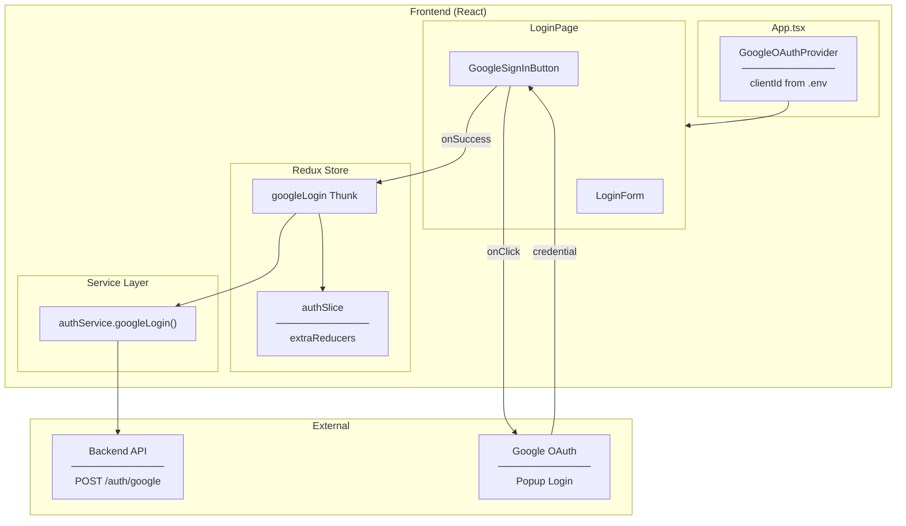
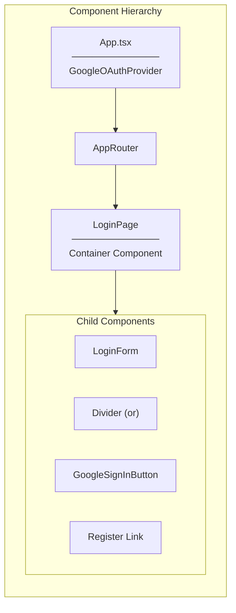
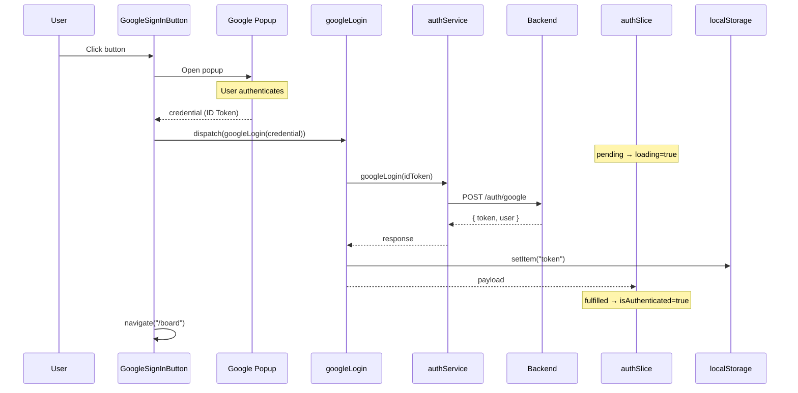
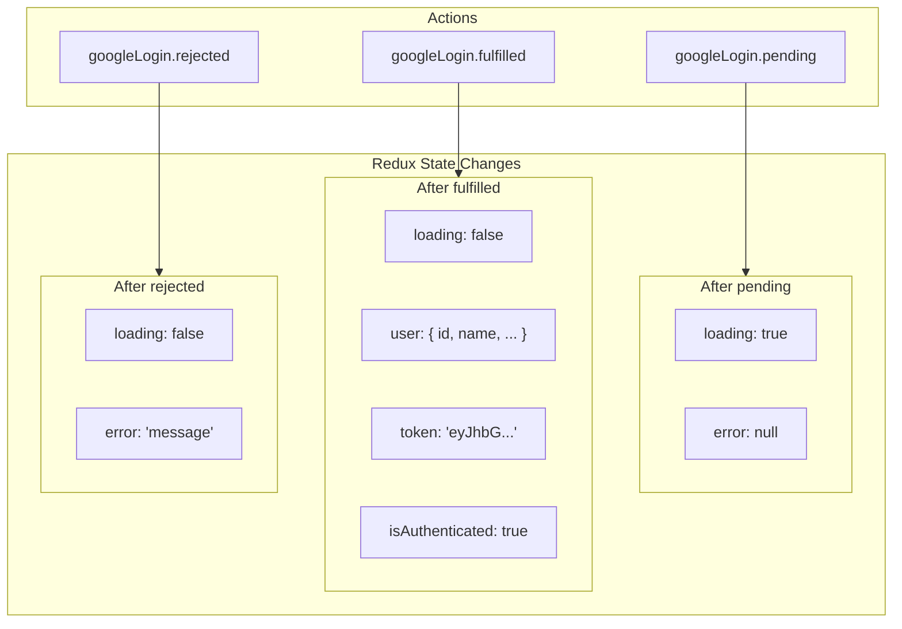
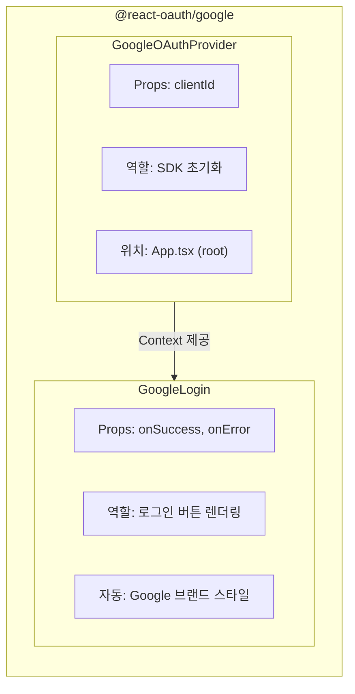
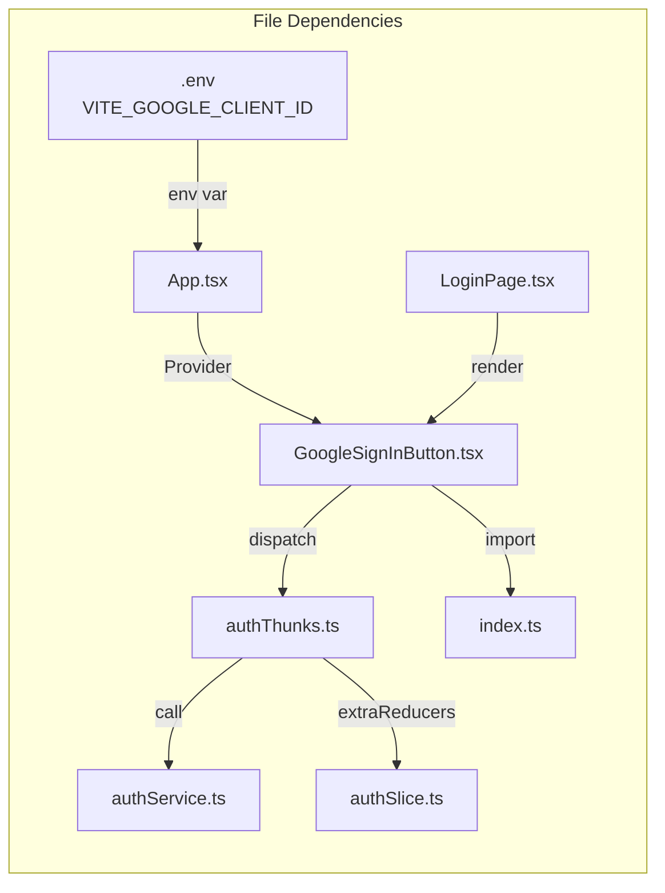
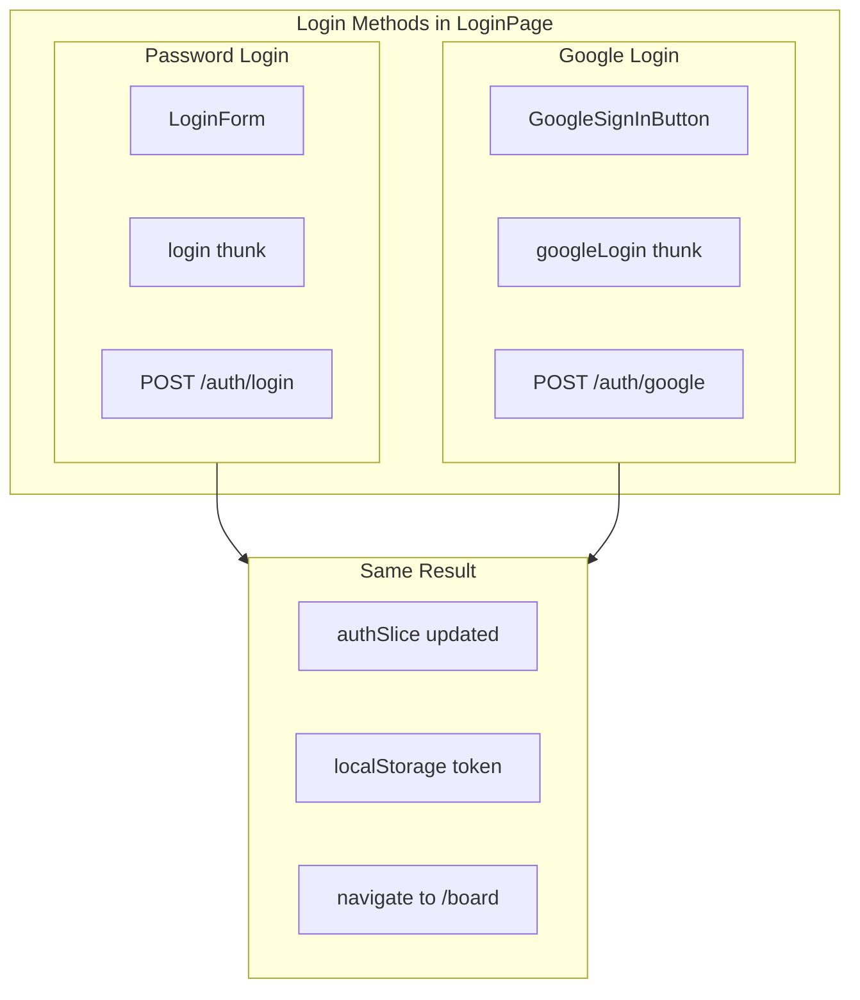

# Google Sign-In Button Architecture Diagram

## System Architecture

---

## Component Hierarchy

---

## Data Flow Sequence

---

## State Management Flow

---

## Google OAuth Library Components

---

## File Dependencies

---

## Comparison: Login Methods

| 항목 | Password Login | Google Login |
|------|----------------|--------------|
| UI Component | LoginForm | GoogleSignInButton |
| Thunk | login | googleLogin |
| API Endpoint | POST /auth/login | POST /auth/google |
| 인증 주체 | 우리 서버 (BCrypt) | Google |
| 결과 | 동일 | 동일 |

---

## Related Documentation

- [00-development-plan.md](./00-development-plan.md) - 구현 계획
- [02-design-patterns-and-solid.md](./02-design-patterns-and-solid.md) - 디자인 패턴
- [03-programming-concepts.md](./03-programming-concepts.md) - 프로그래밍 개념
