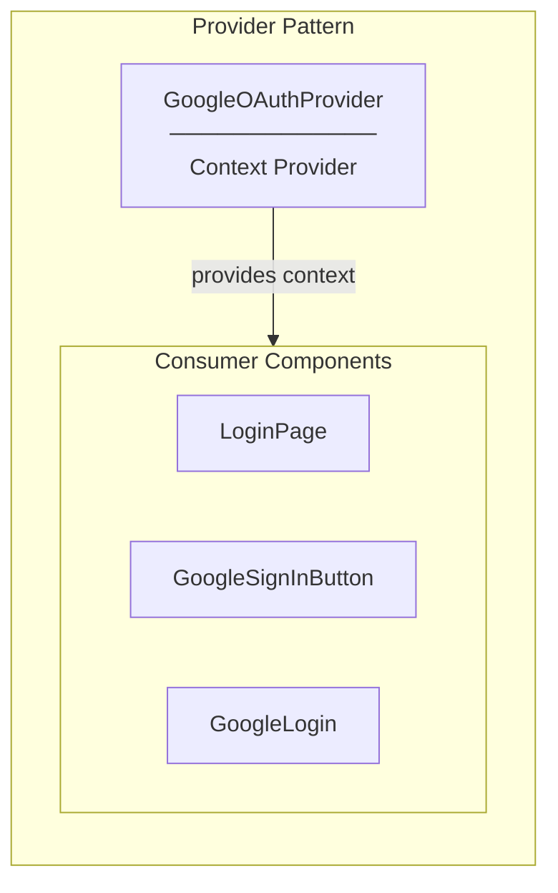
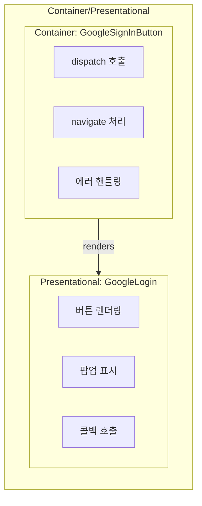
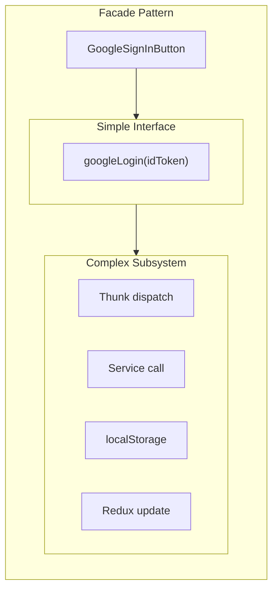
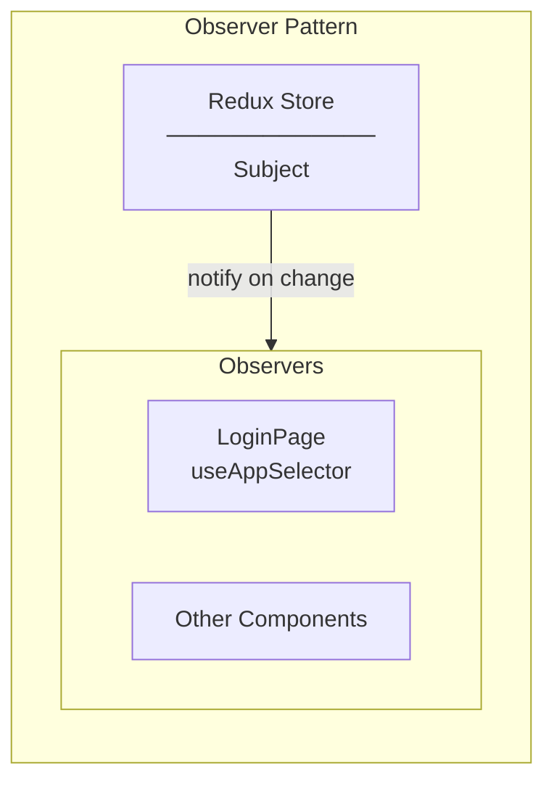
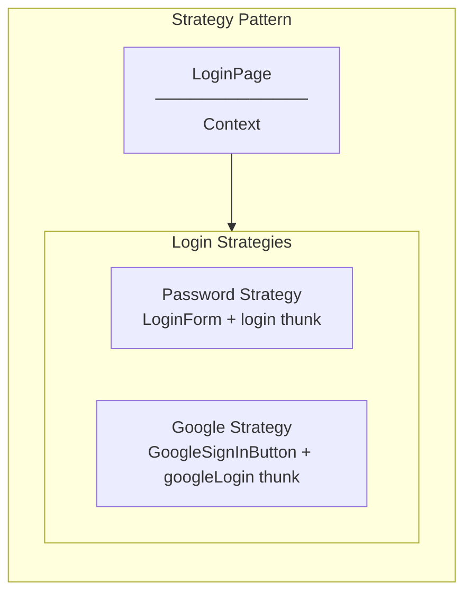
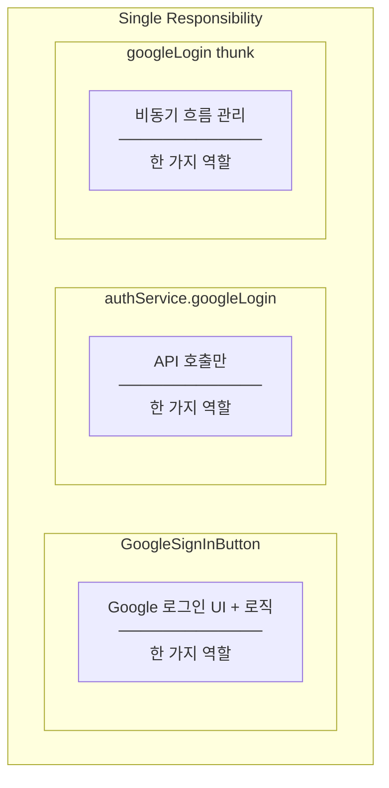
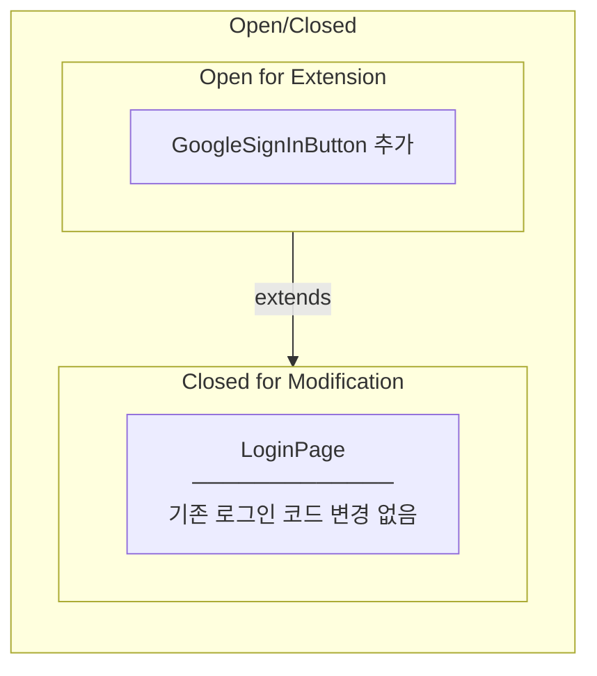
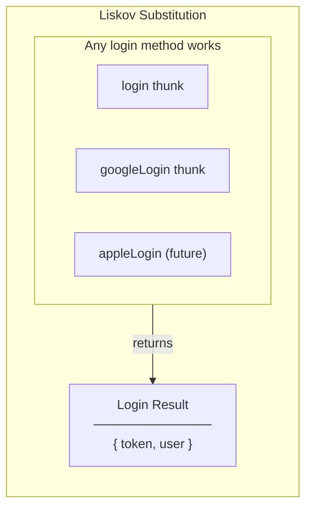
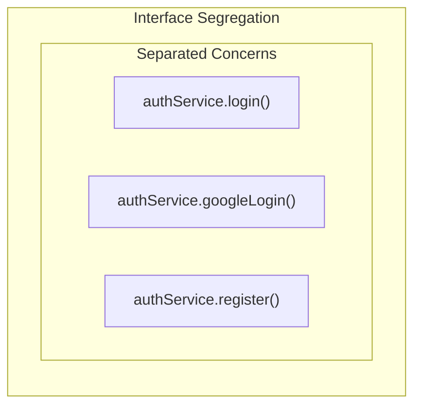
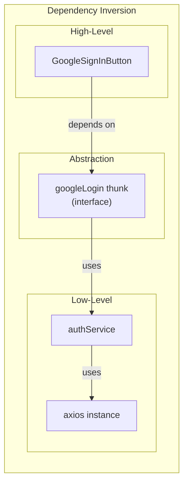

# Design Patterns & SOLID Principles in Google Sign-In Button

## GoF Design Patterns Applied

### 1. Provider Pattern (React Context)



**Where:** `GoogleOAuthProvider` in App.tsx

**Why Provider Pattern:**
- SDK 초기화를 한 곳에서 관리
- 하위 컴포넌트에서 설정 없이 사용 가능
- Client ID를 props drilling 없이 전달

```tsx
// App.tsx - Provider
<GoogleOAuthProvider clientId={import.meta.env.VITE_GOOGLE_CLIENT_ID}>
  <AppRouter />
</GoogleOAuthProvider>

// GoogleSignInButton - Consumer (자동으로 context 사용)
<GoogleLogin onSuccess={...} />
```

---

### 2. Container/Presentational Pattern



**Where:** GoogleSignInButton wraps GoogleLogin

**Why:**
- GoogleLogin: UI만 담당 (라이브러리 제공)
- GoogleSignInButton: 비즈니스 로직 담당 (우리 코드)

---

### 3. Facade Pattern



**Where:** googleLogin thunk

**Why Facade:**
- 컴포넌트는 `dispatch(googleLogin(credential))` 만 호출
- API 호출, localStorage, Redux 업데이트는 내부에서 처리

---

### 4. Observer Pattern (Redux)



**Where:** LoginPage subscribes to auth state

**Why Observer:**
- `isAuthenticated` 변경 시 자동 리렌더링
- useEffect에서 감지하여 navigate

```tsx
const { isAuthenticated } = useAppSelector((state) => state.auth);

useEffect(() => {
  if (isAuthenticated) {
    navigate("/board");
  }
}, [isAuthenticated]);
```

---

### 5. Strategy Pattern



**Where:** LoginPage with two login methods

**Why Strategy:**
- 동일한 목적 (로그인) 달성
- 다른 구현 방법 (password vs Google)
- 런타임에 사용자가 선택

---

## SOLID Principles Applied

### S - Single Responsibility Principle (SRP)



| Component | Single Responsibility |
|-----------|----------------------|
| GoogleSignInButton | Google 로그인 UI 렌더링 |
| googleLogin thunk | 비동기 흐름 (API → localStorage → Redux) |
| authService.googleLogin | HTTP POST 요청만 |
| authSlice | 상태 변경만 |

---

### O - Open/Closed Principle (OCP)



**Where Applied:**
- LoginPage에 GoogleSignInButton 추가만으로 확장
- 기존 LoginForm 코드 수정 없음
- 추후 Facebook, Apple 로그인도 같은 방식으로 추가 가능

---

### L - Liskov Substitution Principle (LSP)



**Where Applied:**
- 모든 로그인 방식이 동일한 AuthResponse 반환
- authSlice는 어떤 로그인인지 모르고 동일하게 처리
- 교체 가능 (Substitutable)

---

### I - Interface Segregation Principle (ISP)



**Where Applied:**
- 각 메서드가 독립적
- googleLogin은 login 코드에 의존하지 않음
- 필요한 것만 import

---

### D - Dependency Inversion Principle (DIP)



**Where Applied:**
- GoogleSignInButton은 authService 직접 호출 안 함
- thunk 추상화 계층을 통해 호출
- 테스트 시 thunk만 mock 가능

---

## Summary Table

| Pattern/Principle | Where Applied | Benefit |
|-------------------|---------------|---------|
| **Provider** | GoogleOAuthProvider | SDK 설정 중앙화 |
| **Container/Presentational** | GoogleSignInButton/GoogleLogin | 관심사 분리 |
| **Facade** | googleLogin thunk | 복잡성 숨김 |
| **Observer** | Redux subscription | 자동 UI 업데이트 |
| **Strategy** | Password/Google login | 교체 가능한 로그인 |
| **SRP** | Each file | 한 가지 역할만 |
| **OCP** | Adding GoogleSignInButton | 확장에 열림 |
| **LSP** | AuthResponse | 교체 가능 |
| **ISP** | Separate service methods | 독립적 인터페이스 |
| **DIP** | Component → Thunk → Service | 추상화 의존 |

---

## Related Documentation

- [00-development-plan.md](./00-development-plan.md) - 구현 계획
- [01-architecture-diagram.md](./01-architecture-diagram.md) - 시스템 아키텍처
- [03-programming-concepts.md](./03-programming-concepts.md) - 프로그래밍 개념
