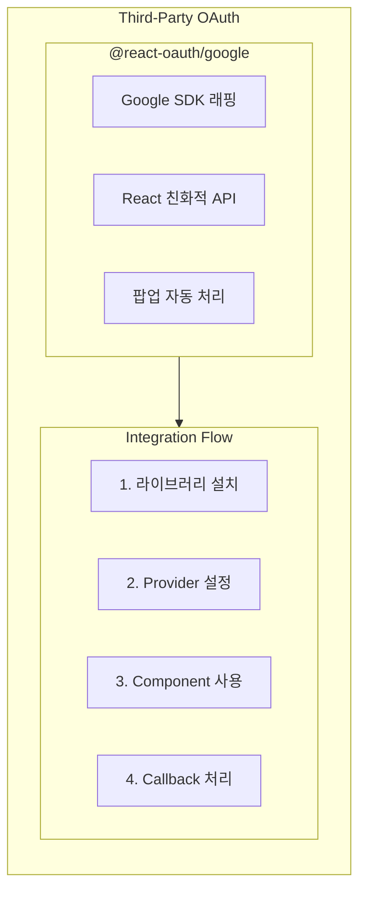
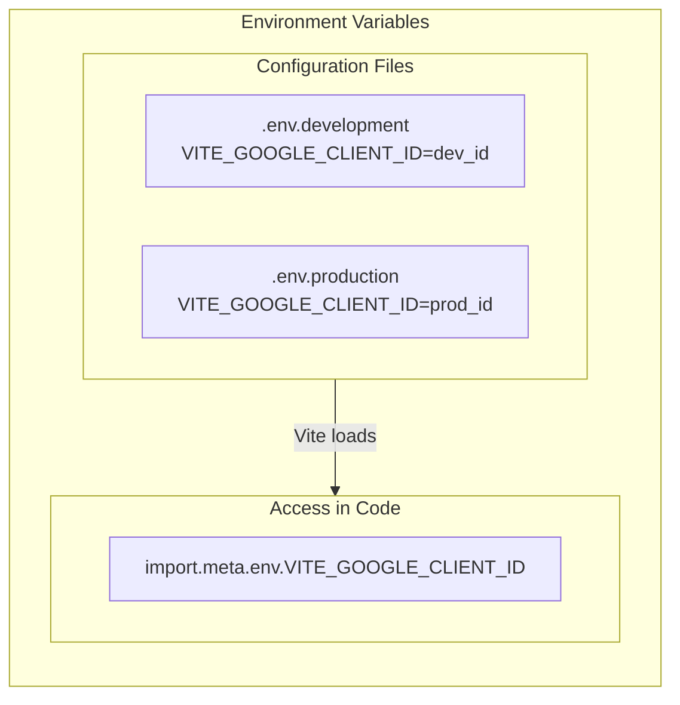
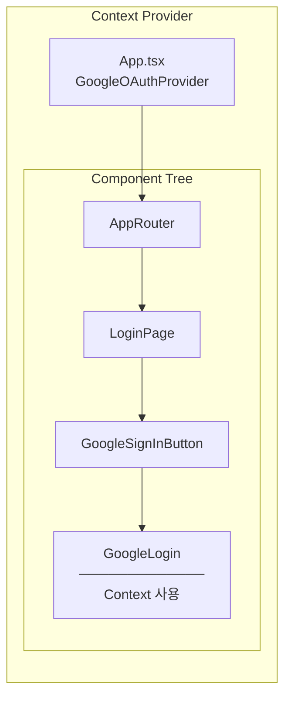
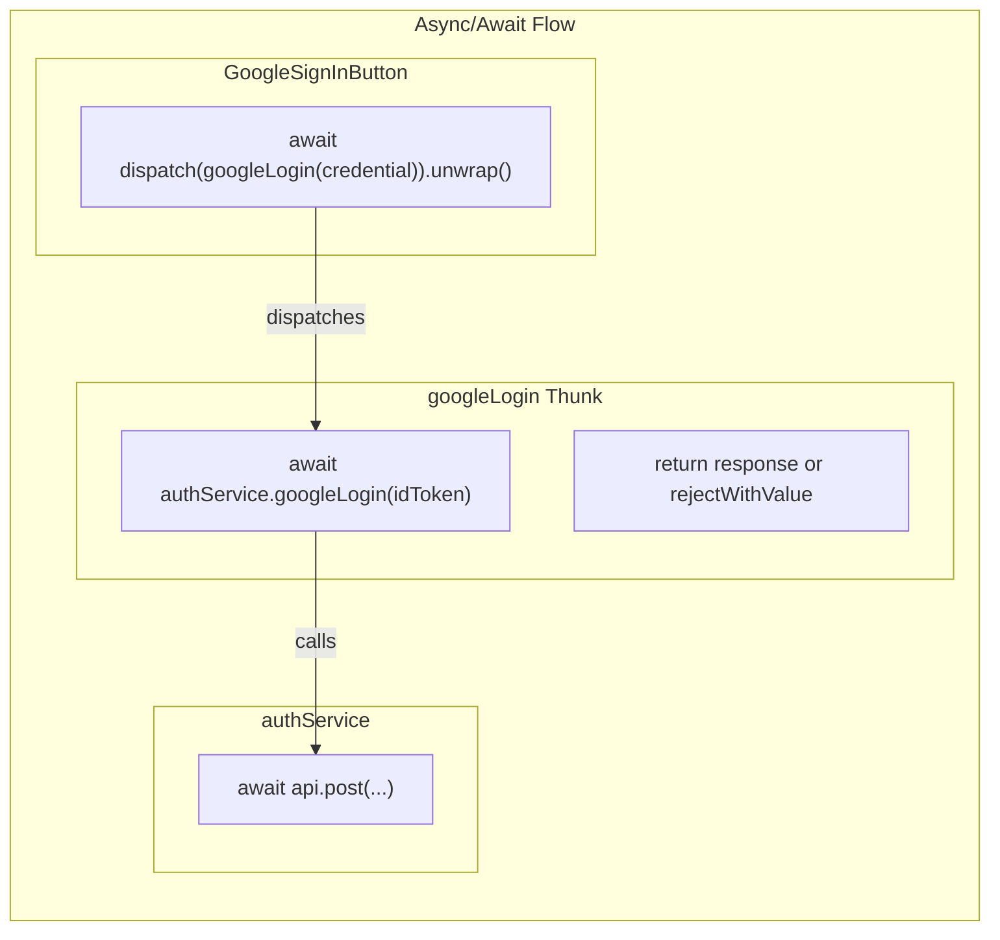
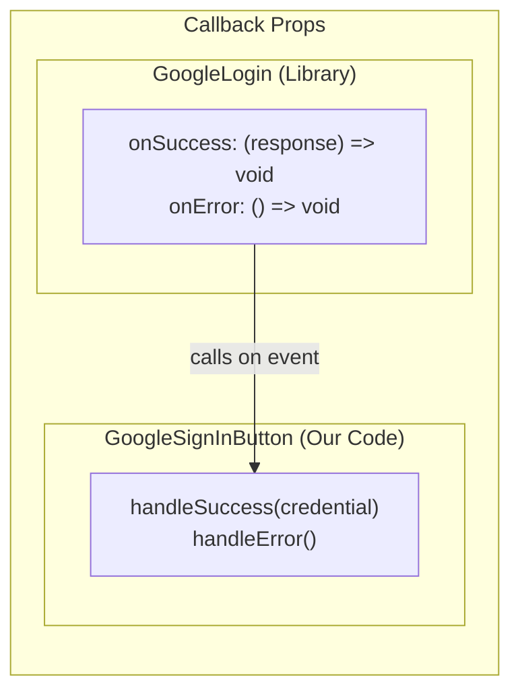
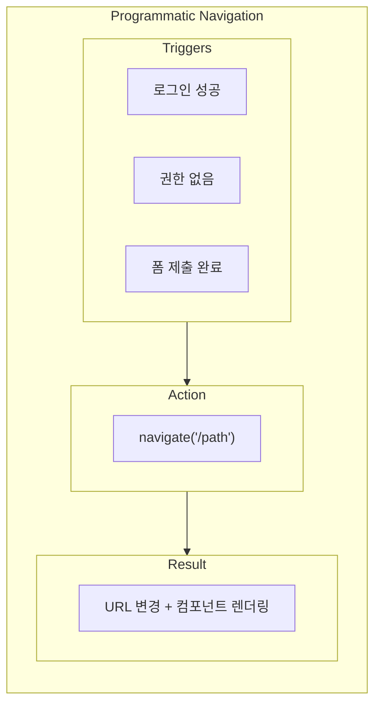
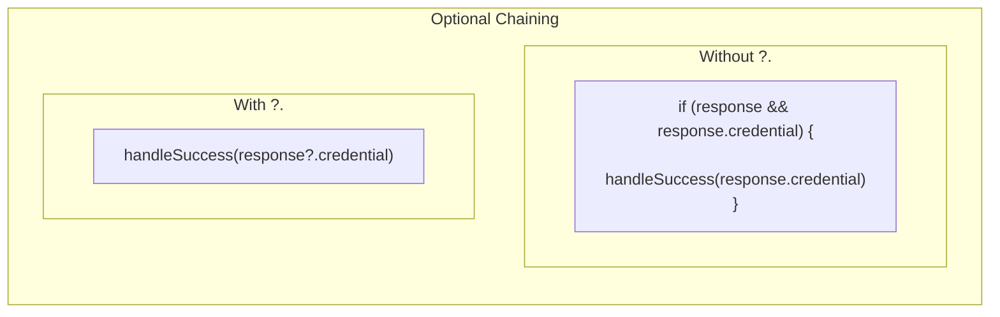

# Programming Concepts Recap (Language Agnostic)

## Table of Contents

1. [Third-Party OAuth Integration](#1-third-party-oauth-integration)
2. [Environment Variables](#2-environment-variables)
3. [Context Provider Pattern](#3-context-provider-pattern)
4. [Async/Await with Redux Thunk](#4-asyncawait-with-redux-thunk)
5. [Callback Props](#5-callback-props)
6. [Programmatic Navigation](#6-programmatic-navigation)
7. [Optional Chaining](#7-optional-chaining)

---

## 1. Third-Party OAuth Integration

**Concept:** 외부 서비스(Google, Facebook 등)의 인증 시스템을 우리 앱에 통합하여 사용자가 별도 계정 없이 로그인할 수 있게 함



**Key Insight:**

| 직접 구현 | 라이브러리 사용 |
|----------|---------------|
| OAuth 프로토콜 이해 필요 | 추상화된 API |
| 보안 취약점 위험 | 검증된 구현 |
| 유지보수 부담 | 커뮤니티 지원 |

---

## 2. Environment Variables

**Concept:** 환경별로 다른 설정값을 코드 외부에서 관리. 민감한 정보(API keys)를 코드에 하드코딩하지 않음



**Vite 환경변수 규칙:**

| 규칙 | 예시 |
|-----|-----|
| `VITE_` prefix 필수 | `VITE_API_URL` |
| 접근 방법 | `import.meta.env.VITE_*` |
| 빌드 시 주입 | 런타임에 변경 불가 |

**보안:**
- `.env` 파일은 `.gitignore`에 추가
- Client ID는 공개해도 됨 (Secret과 다름)
- API Secret은 백엔드에서만 사용

---

## 3. Context Provider Pattern

**Concept:** React Context를 사용해 컴포넌트 트리 전체에 데이터를 전달. Props drilling 없이 깊은 컴포넌트에서 접근 가능



**Without Context (Props Drilling):**
```tsx
// 매 레벨마다 props 전달 필요
<App clientId={id}>
  <Router clientId={id}>
    <LoginPage clientId={id}>
      <GoogleLogin clientId={id} />
```

**With Context (Provider Pattern):**
```tsx
// Provider만 설정하면 어디서든 접근
<GoogleOAuthProvider clientId={id}>
  <Router>
    <LoginPage>
      <GoogleLogin /> // 자동으로 context에서 clientId 가져옴
```

---

## 4. Async/Await with Redux Thunk

**Concept:** 비동기 작업을 동기 코드처럼 작성. Thunk에서 await로 결과를 기다리고, unwrap()으로 에러 처리



**unwrap() 메서드:**

| 호출 방식 | 성공 시 | 실패 시 |
|----------|--------|--------|
| `dispatch(thunk)` | fulfilled action | rejected action |
| `dispatch(thunk).unwrap()` | payload 반환 | throw error |

```tsx
// unwrap() 사용 예시
try {
  await dispatch(googleLogin(credential)).unwrap();
  navigate("/board");  // 성공 시만 실행
} catch (error) {
  console.error("Failed:", error);  // 실패 시 에러 catch
}
```

---

## 5. Callback Props

**Concept:** 컴포넌트에 함수를 props로 전달하여 이벤트 발생 시 부모가 정의한 로직 실행



**Key Insight:**

| 개념 | 설명 |
|-----|-----|
| Inversion of Control | 라이브러리가 "언제" 호출할지 결정 |
| 우리가 결정하는 것 | "무엇을" 실행할지 |

```tsx
<GoogleLogin
  onSuccess={(response) => handleSuccess(response.credential)}
  onError={() => handleError()}
/>
```

---

## 6. Programmatic Navigation

**Concept:** 사용자 클릭이 아닌 코드로 페이지 이동. 로그인 성공 등 특정 조건에서 자동 이동



**react-router-dom의 useNavigate:**

```tsx
const navigate = useNavigate();

// 성공 시 이동
await dispatch(googleLogin(credential)).unwrap();
navigate("/board");  // 프로그래밍 방식으로 이동
```

**vs Link 컴포넌트:**

| navigate() | Link |
|------------|------|
| 조건부 이동 | 클릭으로 이동 |
| 코드에서 호출 | JSX로 렌더링 |
| 비동기 후 이동 가능 | 즉시 이동 |

---

## 7. Optional Chaining

**Concept:** 중첩된 객체 속성 접근 시 null/undefined 체크를 간결하게 처리



**Google Login에서의 활용:**

```tsx
// response.credential이 undefined일 수 있음
const handleSuccess = async (credential: string | undefined) => {
  if (!credential) {
    console.error("No credential received");
    return;
  }

  // credential이 확실히 string인 상태
  await dispatch(googleLogin(credential)).unwrap();
};
```

**Type Guard:**

| 패턴 | 용도 |
|-----|-----|
| `if (!credential) return` | Early return (Guard clause) |
| `credential!` | Non-null assertion (위험) |
| `credential ?? 'default'` | Nullish coalescing |

---

## Summary Table

| Concept | Where Applied | Key Benefit |
|---------|---------------|-------------|
| **Third-Party OAuth** | @react-oauth/google | 검증된 보안 구현 |
| **Environment Variables** | .env + import.meta.env | 설정 외부화 |
| **Context Provider** | GoogleOAuthProvider | Props drilling 방지 |
| **Async/Await + Thunk** | googleLogin dispatch | 깔끔한 비동기 코드 |
| **Callback Props** | onSuccess/onError | IoC (제어 역전) |
| **Programmatic Navigation** | navigate("/board") | 조건부 페이지 이동 |
| **Optional Chaining** | credential handling | 안전한 null 처리 |

---

## Related Documentation

- [00-development-plan.md](./00-development-plan.md) - 구현 계획
- [01-architecture-diagram.md](./01-architecture-diagram.md) - 시스템 아키텍처
- [02-design-patterns-and-solid.md](./02-design-patterns-and-solid.md) - 디자인 패턴
