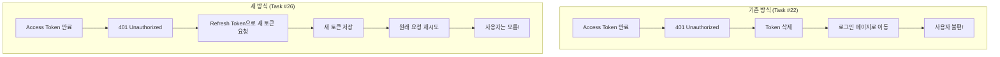
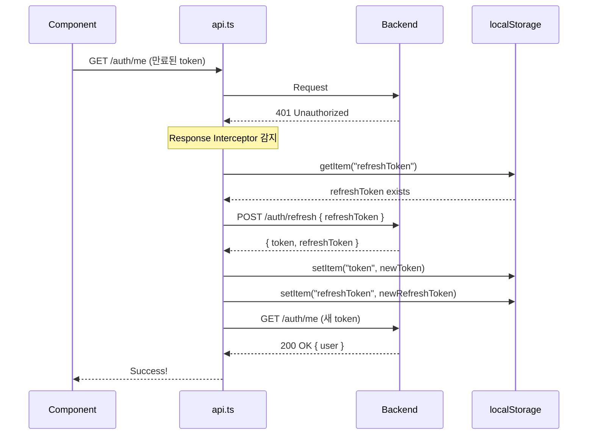
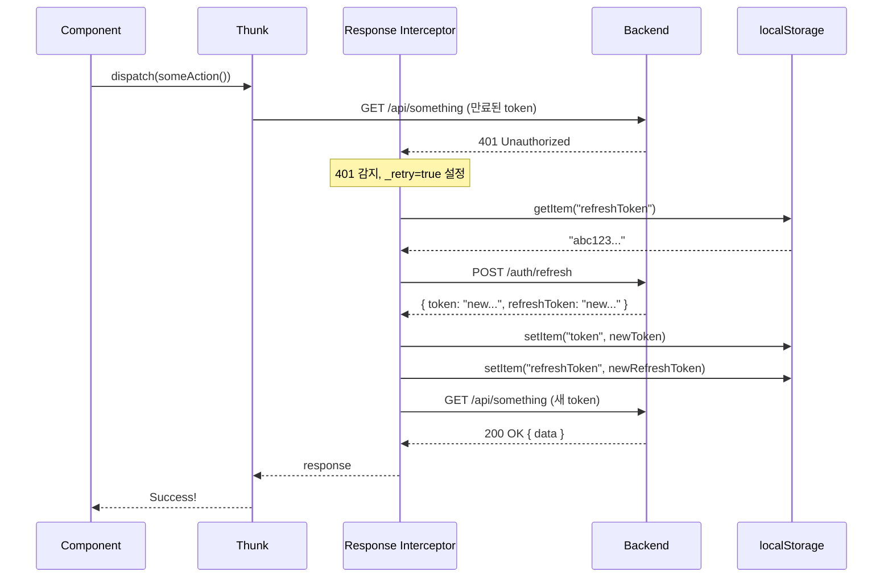
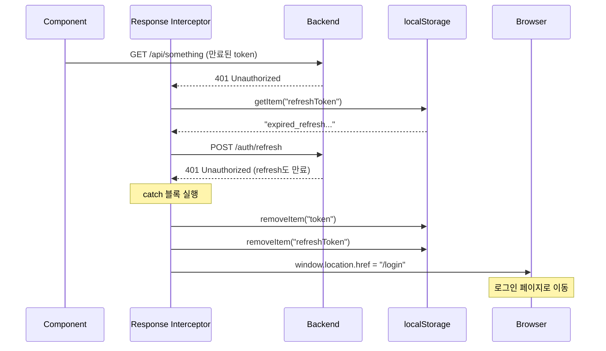
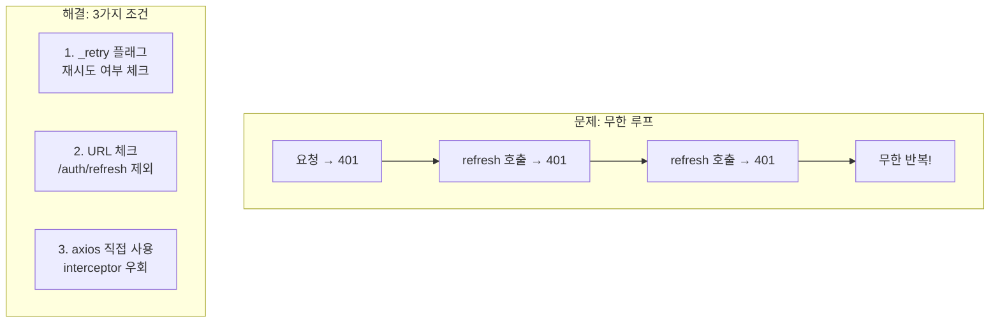
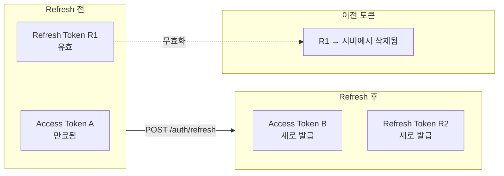

# Auto Refresh Token Implementation Plan

## Overview

Task #26: Frontend에서 Access Token 만료 시 자동으로 Refresh Token을 사용하여 새 토큰을 발급받고 원래 요청을 재시도하는 기능 구현

---

## 현재 구현 상태

| 항목 | 상태 | 설명 |
|------|------|------|
| refreshToken localStorage 저장 | ✅ 완료 | authThunks.ts (login, register, googleLogin) |
| logout 시 refreshToken 삭제 | ✅ 완료 | authSlice.ts |
| Response Interceptor 구현 | ✅ 완료 | api.ts |
| fetchCurrentUser refreshToken 삭제 | ✅ 완료 | authThunks.ts |
| 빌드 테스트 | ✅ 완료 | npm run build |
| E2E 테스트 | ✅ 완료 | 401 → refresh → 재시도 확인 |

---

## 문제 상황

### Access Token 만료 시 문제



**결과:** 사용자는 토큰 만료를 인지하지 못하고 계속 사용 가능

---

## 해결 방법

### Axios Response Interceptor



---

## File Structure

```
src/
├── services/
│   └── api.ts                    ← Response Interceptor 추가 ✅
├── features/auth/
│   ├── store/
│   │   ├── authSlice.ts          ← logout에서 refreshToken 삭제 ✅
│   │   └── authThunks.ts         ← refreshToken 저장/삭제 ✅
│   └── types/
│       └── api.types.ts          ← AuthResponse (이미 refreshToken 포함)
```

---

## Implementation Details

### 1. refreshToken 저장 (authThunks.ts)

모든 인증 성공 시 refreshToken도 localStorage에 저장

```typescript
// login, register, googleLogin thunks
const response = await authService.login(data);
localStorage.setItem("token", response.token);
localStorage.setItem("refreshToken", response.refreshToken);  // 추가
```

**적용 위치:**
- `register` thunk
- `login` thunk
- `googleLogin` thunk

---

### 2. refreshToken 삭제 (authSlice.ts)

로그아웃 시 refreshToken도 삭제

```typescript
logout: (state) => {
  state.user = null;
  state.token = null;
  state.isAuthenticated = false;
  state.error = null;
  localStorage.removeItem("token");
  localStorage.removeItem("refreshToken");  // 추가
},
```

---

### 3. Response Interceptor (api.ts)

401 에러 감지 → 자동 refresh → 원래 요청 재시도

```typescript
api.interceptors.response.use(
  (response) => response,
  async (error) => {
    const originalRequest = error.config;

    // 조건: 401 + 재시도 안함 + refresh 요청 아님
    if (
      error.response?.status === 401 &&
      !originalRequest._retry &&
      !originalRequest.url?.includes("/auth/refresh")
    ) {
      originalRequest._retry = true;

      const refreshToken = localStorage.getItem("refreshToken");
      if (!refreshToken) {
        // refreshToken 없으면 로그아웃
        localStorage.removeItem("token");
        localStorage.removeItem("refreshToken");
        window.location.href = "/login";
        return Promise.reject(error);
      }

      try {
        // 새 토큰 요청 (axios 직접 사용 - 무한루프 방지)
        const response = await axios.post<AuthResponse>(
          `${api.defaults.baseURL}/auth/refresh`,
          { refreshToken }
        );

        // 새 토큰 저장
        localStorage.setItem("token", response.data.token);
        localStorage.setItem("refreshToken", response.data.refreshToken);

        // 원래 요청 재시도
        originalRequest.headers.Authorization = `Bearer ${response.data.token}`;
        return api(originalRequest);
      } catch (refreshError) {
        // refresh 실패 시 로그아웃
        localStorage.removeItem("token");
        localStorage.removeItem("refreshToken");
        window.location.href = "/login";
        return Promise.reject(refreshError);
      }
    }

    return Promise.reject(error);
  }
);
```

---

### 4. fetchCurrentUser에서 refreshToken 삭제 (authThunks.ts)

401 에러 시 refreshToken도 함께 삭제

```typescript
catch (error: unknown) {
  localStorage.removeItem("token");
  localStorage.removeItem("refreshToken");  // 추가
  // ...
}
```

---

## Data Flow

### 정상 흐름 (토큰 갱신 성공)



### 실패 흐름 (Refresh Token도 만료)



---

## 무한 루프 방지 전략

### 문제: Refresh 요청도 401이면?



### 조건 코드

```typescript
if (
  error.response?.status === 401 &&      // 1. 401 에러
  !originalRequest._retry &&              // 2. 아직 재시도 안 함
  !originalRequest.url?.includes("/auth/refresh")  // 3. refresh 요청 아님
)
```

### axios vs api 사용

```typescript
// ❌ 잘못된 방법 (무한 루프 위험)
const response = await api.post("/auth/refresh", { refreshToken });

// ✅ 올바른 방법 (interceptor 우회)
const response = await axios.post(
  `${api.defaults.baseURL}/auth/refresh`,
  { refreshToken }
);
```

---

## Token Rotation (토큰 회전)

### 매 Refresh마다 새 Refresh Token 발급



**보안 이점:**
- Refresh Token 탈취 시 한 번만 사용 가능
- 정상 사용자가 다음 refresh 시 탈취 감지 가능

---

## Checklist

- [x] login thunk에서 refreshToken 저장
- [x] register thunk에서 refreshToken 저장
- [x] googleLogin thunk에서 refreshToken 저장
- [x] logout에서 refreshToken 삭제
- [x] Response Interceptor 구현
- [x] 무한 루프 방지 로직
- [x] fetchCurrentUser에서 refreshToken 삭제
- [x] Build verification (npm run build)
- [x] E2E test (Network tab: 401 → refresh → 200)

---

## Related Documentation

- [01-interceptor-flow.md](./01-interceptor-flow.md) - Interceptor 상세 동작
- [02-design-patterns-and-solid.md](./02-design-patterns-and-solid.md) - 디자인 패턴
- [03-programming-concepts.md](./03-programming-concepts.md) - 프로그래밍 개념
