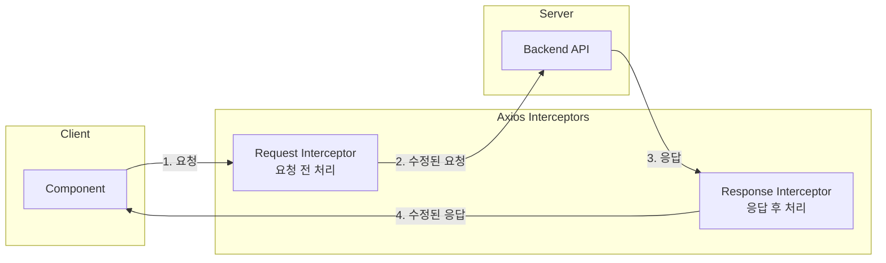
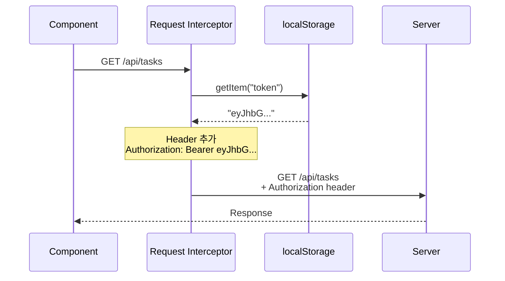
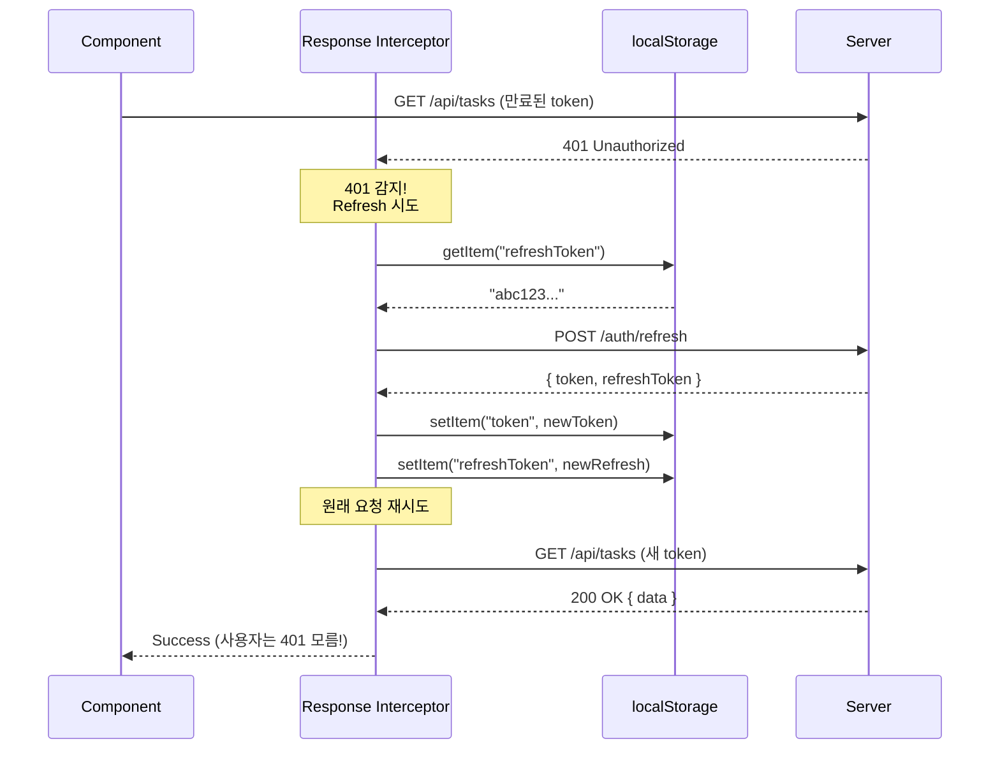
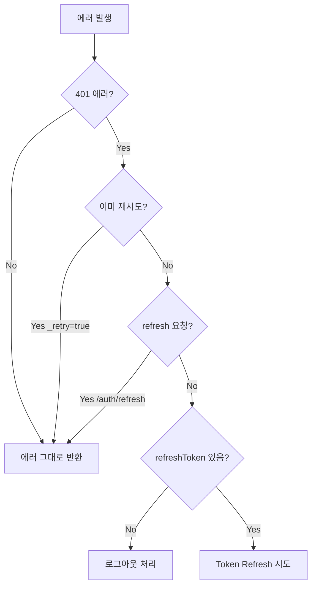
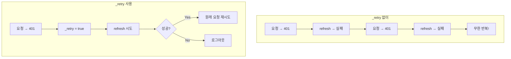
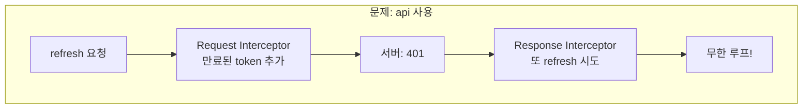
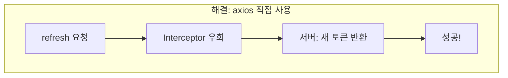
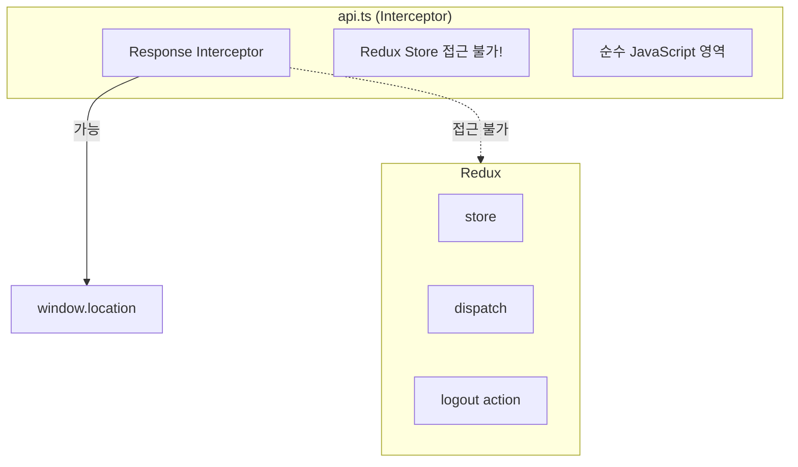
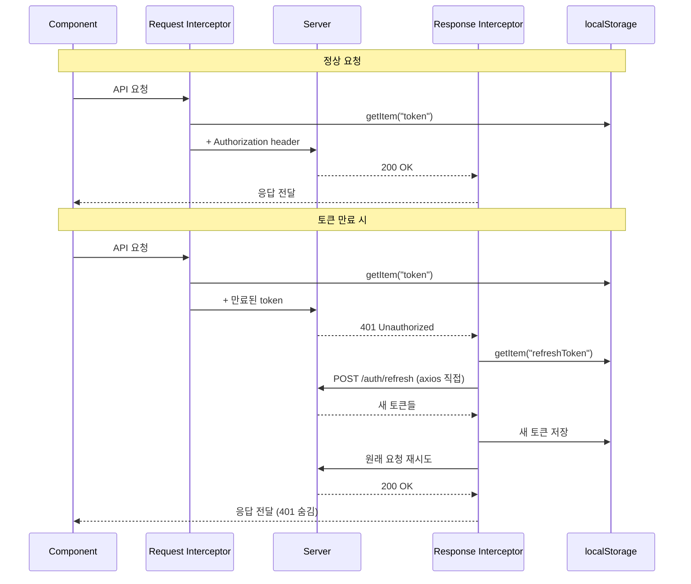

# Axios Interceptor: Request vs Response

## Overview

Axios Interceptor는 HTTP 요청/응답을 가로채서 공통 로직을 처리하는 미들웨어 패턴

---

## 1. 두 종류의 Interceptor



---

## 2. Request Interceptor (기존)

### 역할: 모든 요청에 Token 자동 추가



### 코드

```typescript
api.interceptors.request.use((config) => {
  const token = localStorage.getItem("token");
  if (token) {
    config.headers.Authorization = `Bearer ${token}`;
  }
  return config;
});
```

### 장점

| 기존 방식 | Interceptor 방식 |
|-----------|------------------|
| 매 요청마다 token 추가 | 한 번 설정으로 모든 요청에 적용 |
| 중복 코드 | 중앙 집중 관리 |
| 실수 가능성 높음 | 일관성 보장 |

---

## 3. Response Interceptor (Task #26 추가)

### 역할: 401 에러 감지 → 자동 Token Refresh



### 코드 구조

```typescript
api.interceptors.response.use(
  // 성공 응답: 그대로 통과
  (response) => response,

  // 에러 응답: 401이면 refresh 시도
  async (error) => {
    const originalRequest = error.config;

    if (shouldAttemptRefresh(error, originalRequest)) {
      return attemptTokenRefresh(originalRequest);
    }

    return Promise.reject(error);
  }
);
```

---

## 4. Response Interceptor 상세 흐름

### 조건 체크



### 각 조건의 의미

| 조건 | 목적 |
|------|------|
| `error.response?.status === 401` | 인증 실패만 처리 |
| `!originalRequest._retry` | 무한 루프 방지 (한 번만 재시도) |
| `!originalRequest.url?.includes("/auth/refresh")` | refresh 요청 자체는 재시도 안 함 |
| `refreshToken` 존재 여부 | 갱신 가능 여부 확인 |

---

## 5. originalRequest._retry 플래그

### 왜 필요한가?



### 코드

```typescript
// 첫 번째 401에서
originalRequest._retry = true;  // 플래그 설정

// 두 번째 401에서
if (!originalRequest._retry) {  // false이므로 재시도 안 함
  // 이 블록 실행 안 됨
}
```

---

## 6. axios vs api 사용 이유

### 문제: api 인스턴스로 refresh 요청 시



### 해결: axios 직접 사용



### 코드 비교

```typescript
// ❌ 잘못된 방법
const response = await api.post("/auth/refresh", { refreshToken });
// → Request Interceptor가 만료된 token을 추가함

// ✅ 올바른 방법
const response = await axios.post(
  `${api.defaults.baseURL}/auth/refresh`,
  { refreshToken }
);
// → Interceptor 완전 우회, refreshToken만 전송
```

---

## 7. window.location.href vs Redux

### 왜 Redux dispatch를 안 쓰나?



### 이유

| 방법 | 문제점 |
|------|--------|
| Redux dispatch | api.ts에서 store import 시 순환 의존성 |
| window.location.href | 간단하고 확실한 리다이렉트 |

### 대안: Event 기반 (고급)

```typescript
// api.ts
window.dispatchEvent(new CustomEvent('auth:logout'));

// App.tsx
useEffect(() => {
  const handleLogout = () => dispatch(logout());
  window.addEventListener('auth:logout', handleLogout);
  return () => window.removeEventListener('auth:logout', handleLogout);
}, []);
```

---

## 8. 두 Interceptor 비교

| 항목 | Request Interceptor | Response Interceptor |
|------|---------------------|----------------------|
| 실행 시점 | 요청 전 | 응답 후 |
| 주요 역할 | Token 추가 | 에러 처리 |
| Task | 기존 | Task #26 추가 |
| 처리 대상 | 모든 요청 | 401 에러만 |

---

## 9. 전체 흐름 요약



---

## 10. 핵심 포인트

1. **Request Interceptor**: 모든 요청에 token 자동 추가
2. **Response Interceptor**: 401 감지 → 자동 refresh → 재시도
3. **_retry 플래그**: 무한 루프 방지
4. **axios 직접 사용**: Interceptor 우회하여 refresh 요청
5. **window.location**: Redux 외부에서 리다이렉트
