# Design Patterns & SOLID Principles

## Overview

Task #26 Auto Refresh Token 구현에서 사용된 디자인 패턴과 SOLID 원칙

---

## 1. Design Patterns

### 1.1 Interceptor Pattern (Chain of Responsibility 변형)

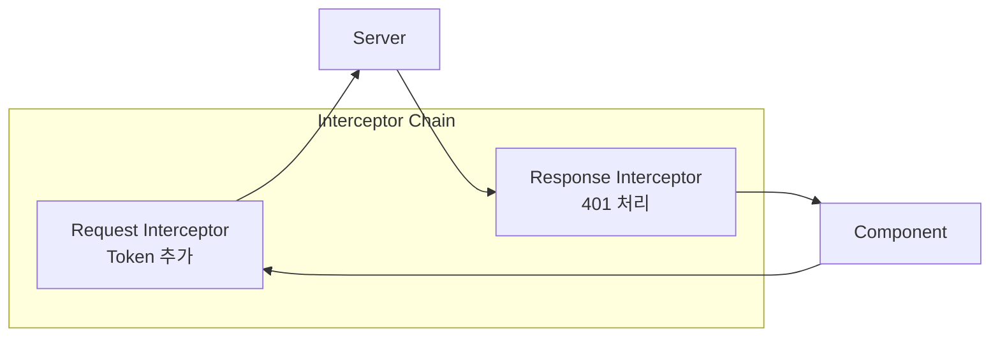

**정의:** 요청/응답을 가로채어 공통 로직을 처리하는 패턴

**적용:**
```typescript
// Request Interceptor
api.interceptors.request.use((config) => {
  // 모든 요청에 token 추가
});

// Response Interceptor
api.interceptors.response.use(
  (response) => response,
  (error) => {
    // 모든 401 에러에 refresh 로직 적용
  }
);
```

**장점:**
- 횡단 관심사 (Cross-cutting Concern) 분리
- 코드 중복 제거
- 단일 지점에서 인증 로직 관리

---

### 1.2 Retry Pattern

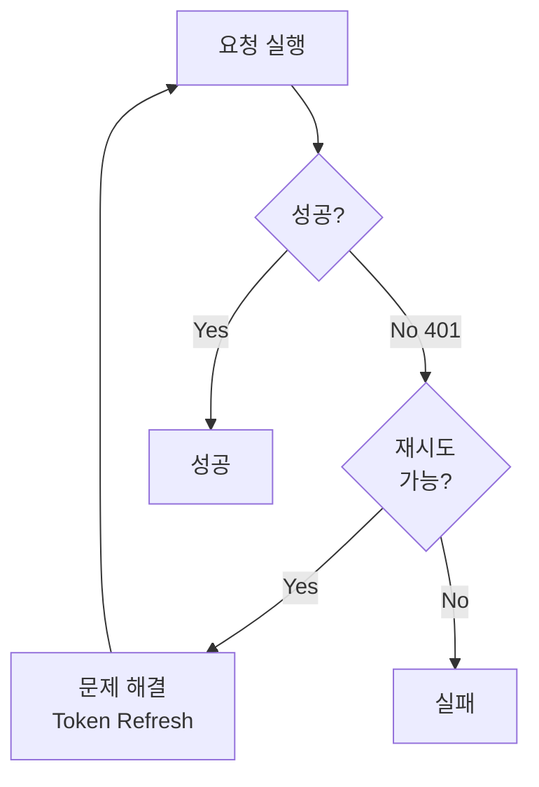

**정의:** 실패한 작업을 조건에 따라 재시도하는 패턴

**적용:**
```typescript
// 원래 요청 저장
const originalRequest = error.config;

// 문제 해결 (새 토큰 발급)
const response = await axios.post("/auth/refresh", { refreshToken });

// 재시도
originalRequest.headers.Authorization = `Bearer ${response.data.token}`;
return api(originalRequest);
```

**특징:**
- 일시적 실패에 대한 복원력 제공
- 사용자 경험 향상 (자동 복구)

---

### 1.3 Token Bucket / Rotation Pattern

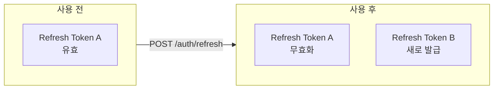

**정의:** 토큰 사용 시 새 토큰으로 교체하는 보안 패턴

**적용:**
```typescript
// 새 토큰들 저장 (이전 refresh token은 서버에서 무효화됨)
localStorage.setItem("token", response.data.token);
localStorage.setItem("refreshToken", response.data.refreshToken);
```

**보안 이점:**
- 토큰 탈취 시 한 번만 사용 가능
- 정상 사용자의 다음 요청에서 탈취 감지

---

### 1.4 Fail-Fast with Fallback Pattern

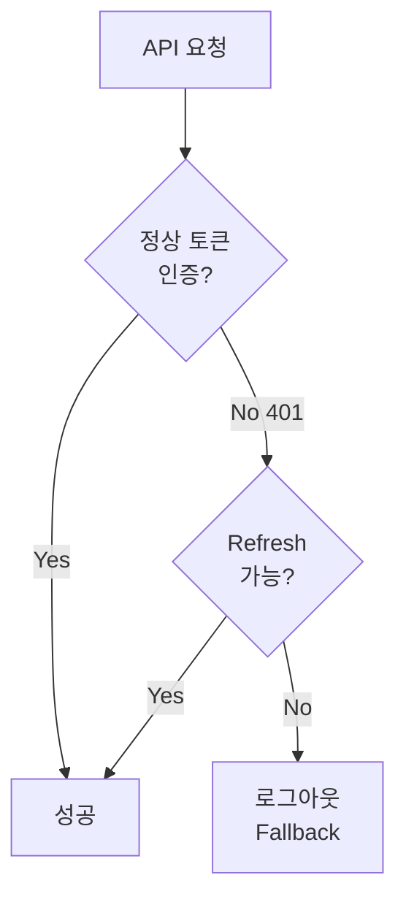

**정의:** 주요 경로 실패 시 대체 경로로 빠르게 전환

**적용:**
```typescript
try {
  // Primary: Refresh 시도
  const response = await axios.post("/auth/refresh", { refreshToken });
  // ... 성공 처리
} catch (refreshError) {
  // Fallback: 로그아웃
  localStorage.removeItem("token");
  localStorage.removeItem("refreshToken");
  window.location.href = "/login";
}
```

---

### 1.5 Guard Clause Pattern

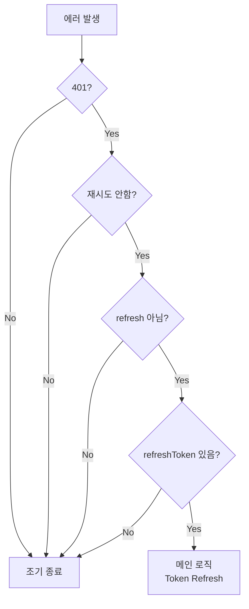

**정의:** 조건을 먼저 체크하여 조기 종료, 메인 로직을 깔끔하게 유지

**적용:**
```typescript
// Guard Clauses
if (error.response?.status !== 401) return Promise.reject(error);
if (originalRequest._retry) return Promise.reject(error);
if (originalRequest.url?.includes("/auth/refresh")) return Promise.reject(error);

const refreshToken = localStorage.getItem("refreshToken");
if (!refreshToken) {
  // 로그아웃 처리
  return Promise.reject(error);
}

// Main Logic (모든 조건 통과 후)
// Token refresh 로직...
```

---

## 2. SOLID Principles

### 2.1 Single Responsibility Principle (SRP)

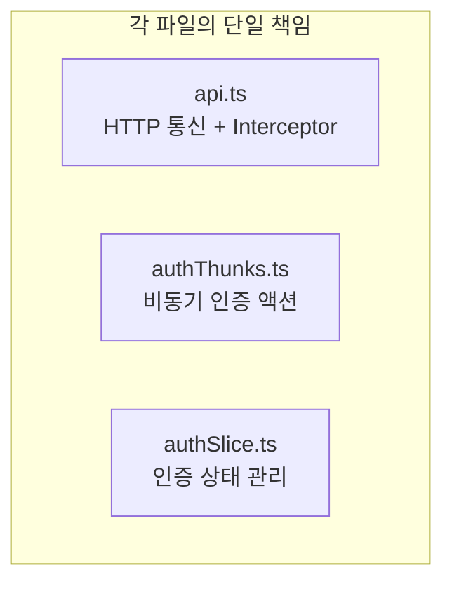

| 컴포넌트 | 책임 |
|----------|------|
| Request Interceptor | Token 자동 추가 |
| Response Interceptor | 401 자동 처리 |
| authThunks | Token 저장 |
| authSlice logout | Token 삭제 |

**적용:**
- Interceptor는 HTTP 레벨 처리만
- Thunk는 비즈니스 로직만
- Slice는 상태 변경만

---

### 2.2 Open/Closed Principle (OCP)

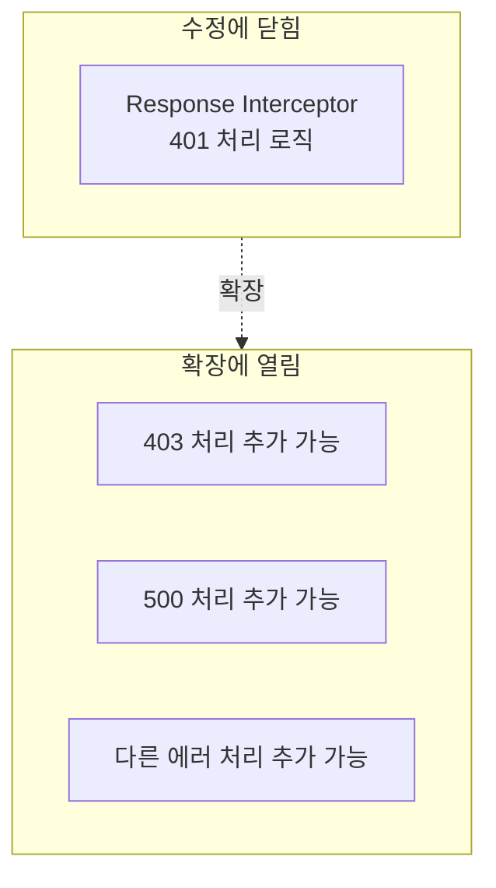

**적용:**
```typescript
api.interceptors.response.use(
  (response) => response,
  async (error) => {
    // 기존 401 처리 (수정 불필요)
    if (error.response?.status === 401) {
      // ...
    }

    // 새로운 에러 처리 추가 가능 (확장)
    if (error.response?.status === 403) {
      // 권한 없음 처리
    }

    return Promise.reject(error);
  }
);
```

---

### 2.3 Liskov Substitution Principle (LSP)

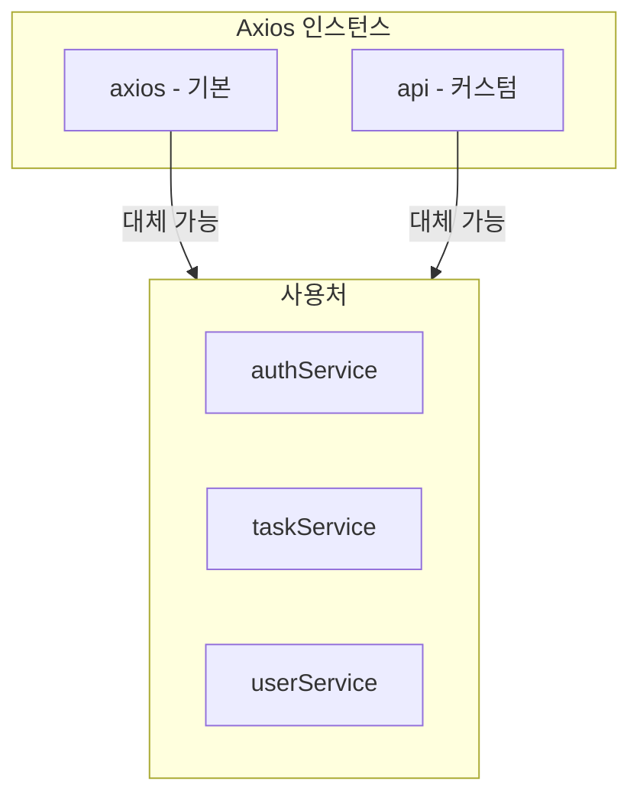

**적용:**
- `api` 인스턴스는 `axios`의 서브타입
- 같은 인터페이스 (get, post, put, delete)
- 어디서든 대체 가능

```typescript
// 둘 다 같은 방식으로 사용 가능
axios.get("/api/users");
api.get("/api/users");  // + interceptor 기능
```

---

### 2.4 Interface Segregation Principle (ISP)

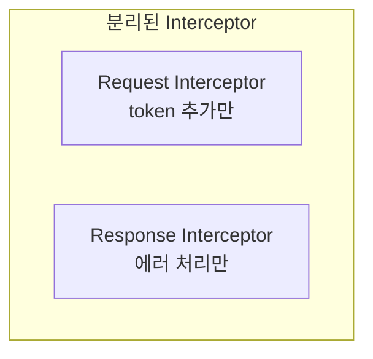

**적용:**
- Request Interceptor: 요청 전처리만
- Response Interceptor: 응답 후처리만
- 각 Interceptor는 자신의 역할만 수행

```typescript
// Request: 요청 전처리만
api.interceptors.request.use((config) => {
  // 오직 Authorization 헤더 추가
});

// Response: 응답 후처리만
api.interceptors.response.use(
  (response) => response,
  (error) => {
    // 오직 에러 처리
  }
);
```

---

### 2.5 Dependency Inversion Principle (DIP)

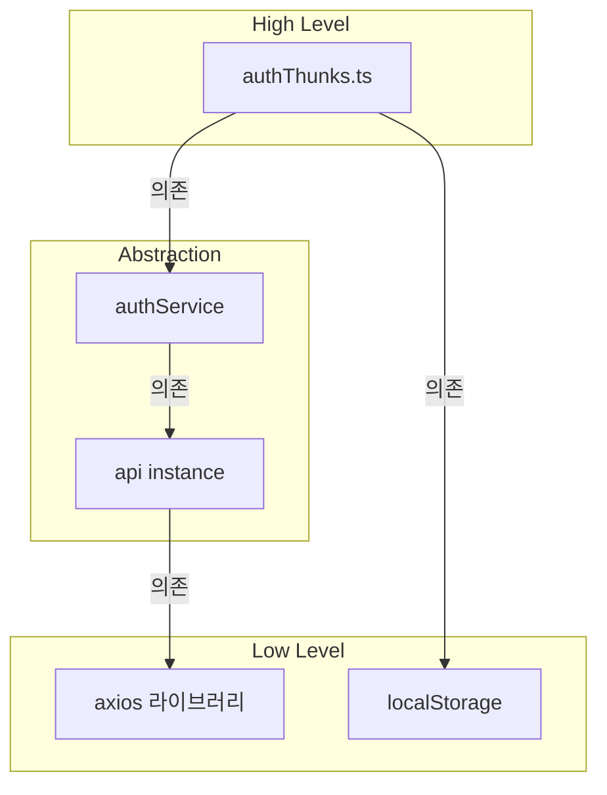

**적용:**
- Thunk는 authService 추상화에 의존
- Interceptor는 localStorage 인터페이스에 의존
- 실제 구현체 교체 가능 (테스트 시 Mock)

---

## 3. 패턴 적용 요약

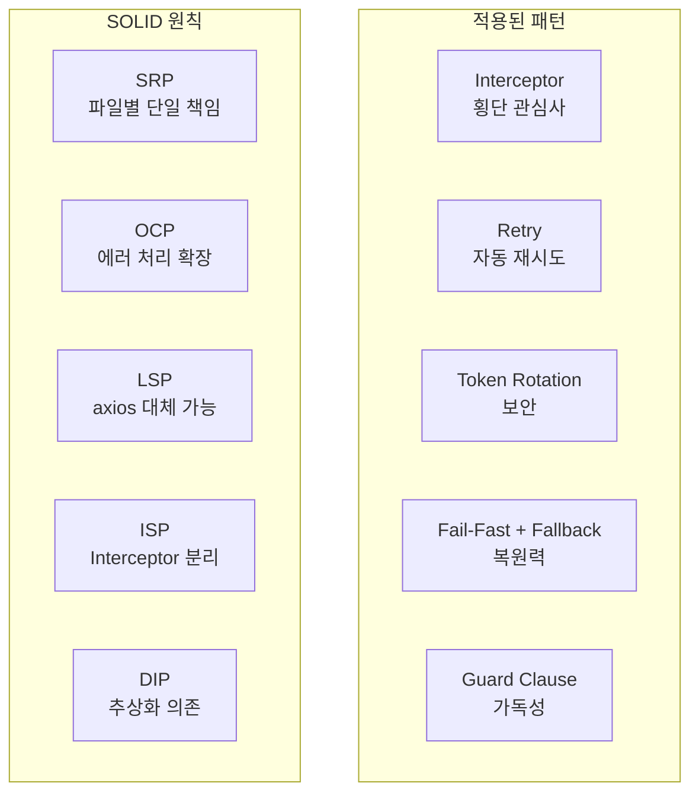

---

## 4. 코드 품질 체크리스트

| 항목 | 상태 | 설명 |
|------|------|------|
| 횡단 관심사 분리 | ✅ | Interceptor로 인증 로직 중앙화 |
| 자동 복구 | ✅ | 401 시 자동 refresh |
| 보안 | ✅ | Token Rotation 적용 |
| 무한 루프 방지 | ✅ | Guard Clause 패턴 |
| 확장성 | ✅ | 다른 에러 처리 추가 용이 |
| 테스트 용이 | ✅ | localStorage Mock 가능 |
