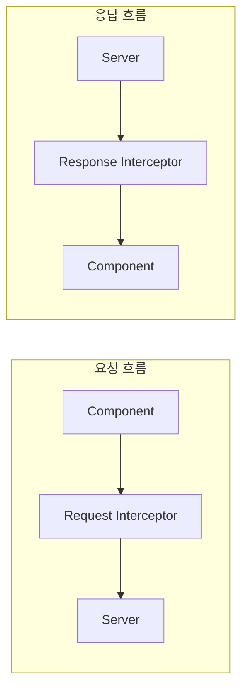
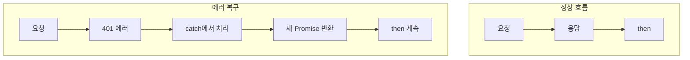
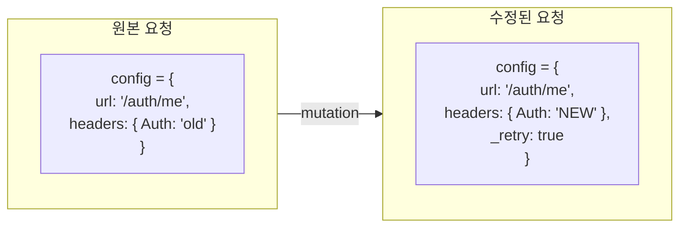
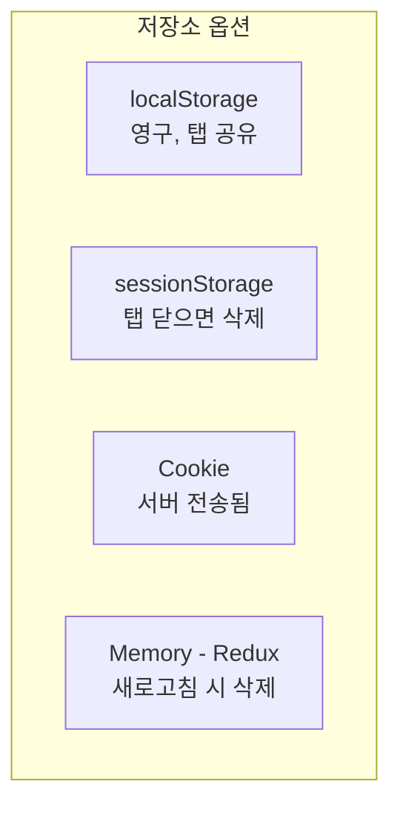
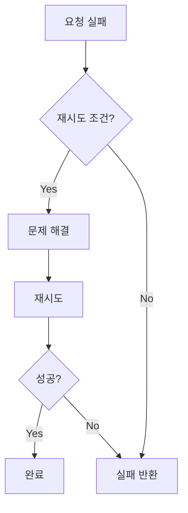
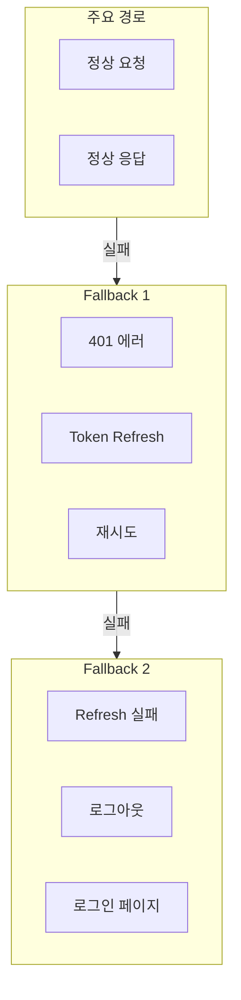
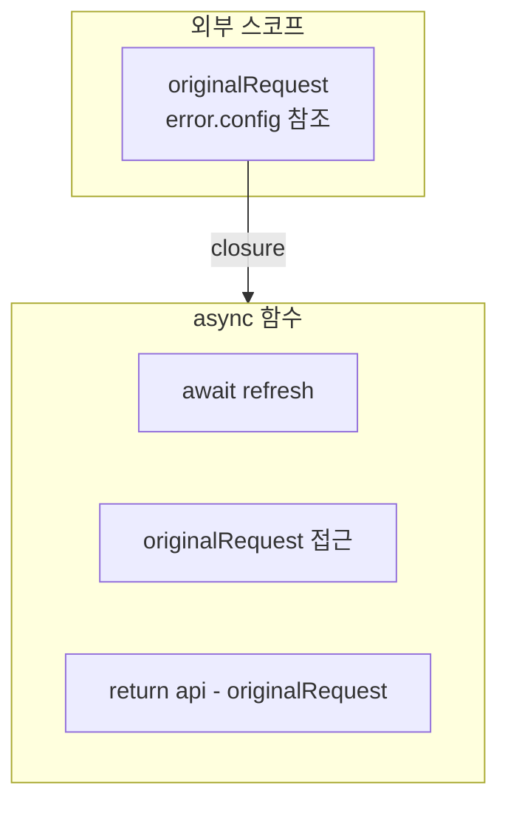

# Programming Concepts Recap (Language Agnostic)

## Table of Contents

1. [Axios Interceptors](#1-axios-interceptors)
2. [Promise Chaining in Error Handling](#2-promise-chaining-in-error-handling)
3. [Request Object Mutation](#3-request-object-mutation)
4. [Token Storage Strategies](#4-token-storage-strategies)
5. [Automatic Retry Logic](#5-automatic-retry-logic)
6. [Graceful Degradation](#6-graceful-degradation)
7. [Closure in Async Functions](#7-closure-in-async-functions)

---

## 1. Axios Interceptors

**Concept:** HTTP 요청/응답을 가로채어 공통 로직을 적용하는 미들웨어



**Key Insight:**

| Interceptor | 실행 시점 | 용도 |
|-------------|-----------|------|
| Request | 요청 전송 직전 | 헤더 추가, 요청 수정 |
| Response | 응답 수신 직후 | 에러 처리, 응답 변환 |

**구현:**
```typescript
// Request Interceptor
api.interceptors.request.use(
  (config) => {
    // 요청 수정
    return config;
  },
  (error) => Promise.reject(error)
);

// Response Interceptor
api.interceptors.response.use(
  (response) => response,        // 성공 시 그대로 통과
  async (error) => {             // 실패 시 처리
    // 에러 처리 로직
    return Promise.reject(error);
  }
);
```

---

## 2. Promise Chaining in Error Handling

**Concept:** Promise의 에러를 잡아서 처리하거나, 새로운 Promise로 대체하여 체인 계속



**Key Insight:**

| 반환값 | 결과 |
|--------|------|
| `Promise.reject(error)` | 에러 전파 (catch로) |
| `api(originalRequest)` | 새 요청으로 대체 (then으로) |

**구현:**
```typescript
api.interceptors.response.use(
  (response) => response,
  async (error) => {
    if (canRecover(error)) {
      // 복구 시도 → 새 Promise 반환 → then으로 이어짐
      return api(originalRequest);
    }
    // 복구 불가 → 에러 전파 → catch로 이어짐
    return Promise.reject(error);
  }
);
```

---

## 3. Request Object Mutation

**Concept:** 원본 요청 객체를 수정하여 재사용



**Key Insight:**

| 속성 | 목적 |
|------|------|
| `originalRequest._retry` | 재시도 여부 플래그 (커스텀) |
| `originalRequest.headers.Authorization` | 새 토큰으로 교체 |

**구현:**
```typescript
const originalRequest = error.config;

// 커스텀 플래그 추가 (JavaScript 객체는 동적 속성 추가 가능)
originalRequest._retry = true;

// 헤더 수정
originalRequest.headers.Authorization = `Bearer ${newToken}`;

// 수정된 요청으로 재시도
return api(originalRequest);
```

**왜 가능한가:**
- JavaScript 객체는 동적으로 속성 추가/수정 가능
- `error.config`는 원본 요청 설정 객체의 참조

---

## 4. Token Storage Strategies

**Concept:** 클라이언트에서 인증 토큰을 저장하는 다양한 방법



**Key Insight:**

| 저장소 | Access Token | Refresh Token | 보안 |
|--------|--------------|---------------|------|
| localStorage | ✅ 이 프로젝트 | ✅ 이 프로젝트 | XSS 취약 |
| httpOnly Cookie | ❌ | 권장 (production) | XSS 안전 |
| Memory | SPA 최적 | ❌ | 가장 안전 |

**이 프로젝트의 선택:**
```typescript
// 저장
localStorage.setItem("token", response.token);
localStorage.setItem("refreshToken", response.refreshToken);

// 조회
const token = localStorage.getItem("token");
const refreshToken = localStorage.getItem("refreshToken");

// 삭제
localStorage.removeItem("token");
localStorage.removeItem("refreshToken");
```

**Production 권장 사항:**
- Access Token: Memory (Redux) 또는 localStorage
- Refresh Token: httpOnly Cookie (서버에서 설정)

---

## 5. Automatic Retry Logic

**Concept:** 특정 조건에서 실패한 요청을 자동으로 재시도



**Key Insight:**

| 구성 요소 | 역할 |
|-----------|------|
| 조건 체크 | 재시도 가능 여부 판단 |
| 문제 해결 | Token Refresh |
| 재시도 제한 | `_retry` 플래그로 1회만 |

**구현:**
```typescript
// 재시도 조건
const shouldRetry =
  error.response?.status === 401 &&  // 인증 실패
  !originalRequest._retry &&          // 아직 재시도 안 함
  !originalRequest.url?.includes("/auth/refresh");  // refresh 요청 아님

if (shouldRetry) {
  originalRequest._retry = true;  // 재시도 표시

  // 문제 해결 (새 토큰 발급)
  const { token } = await refreshTokens();

  // 재시도
  originalRequest.headers.Authorization = `Bearer ${token}`;
  return api(originalRequest);
}
```

---

## 6. Graceful Degradation

**Concept:** 오류 발생 시 완전 실패 대신 대체 동작 제공



**Key Insight:**

| 단계 | 상황 | 대응 |
|------|------|------|
| 1 | 정상 | 응답 반환 |
| 2 | 401 + refreshToken 있음 | 자동 갱신 후 재시도 |
| 3 | 401 + refreshToken 없음 | 로그인 페이지로 |
| 4 | Refresh 실패 | 로그인 페이지로 |

**구현:**
```typescript
// Fallback 1: Token Refresh
try {
  const response = await axios.post("/auth/refresh", { refreshToken });
  // 성공 → 재시도
  return api(originalRequest);
} catch (refreshError) {
  // Fallback 2: 로그아웃
  localStorage.removeItem("token");
  localStorage.removeItem("refreshToken");
  window.location.href = "/login";
  return Promise.reject(refreshError);
}
```

---

## 7. Closure in Async Functions

**Concept:** async 함수 내에서 외부 변수를 캡처하여 비동기 작업 후에도 접근



**Key Insight:**

| 개념 | 설명 |
|------|------|
| Closure | 함수가 자신이 생성된 스코프의 변수에 접근 |
| 비동기에서 | await 후에도 이전 변수 접근 가능 |

**구현:**
```typescript
async (error) => {
  // originalRequest는 이 함수 스코프에서 캡처됨
  const originalRequest = error.config;

  // 비동기 작업 (시간이 걸림)
  const response = await axios.post("/auth/refresh", { refreshToken });

  // await 후에도 originalRequest 접근 가능 (closure)
  originalRequest.headers.Authorization = `Bearer ${response.data.token}`;

  return api(originalRequest);
}
```

**왜 중요한가:**
- 비동기 작업 완료 후 원본 요청 정보 필요
- Closure가 없으면 원본 정보 유실

---

## Summary Table

| Concept | Where Applied | Key Benefit |
|---------|---------------|-------------|
| **Axios Interceptors** | api.ts | 횡단 관심사 중앙 처리 |
| **Promise Chaining** | Response Interceptor | 에러 복구 후 체인 계속 |
| **Request Mutation** | originalRequest 수정 | 재시도에 필요한 정보 유지 |
| **Token Storage** | localStorage | 새로고침 후에도 유지 |
| **Automatic Retry** | 401 처리 | 사용자 경험 향상 |
| **Graceful Degradation** | Fallback 로직 | 완전 실패 방지 |
| **Closure** | async 함수 | 비동기 후 컨텍스트 유지 |

---

## Related Documentation

- [00-development-plan.md](./00-development-plan.md) - 구현 계획
- [01-interceptor-flow.md](./01-interceptor-flow.md) - Interceptor 상세
- [02-design-patterns-and-solid.md](./02-design-patterns-and-solid.md) - 디자인 패턴
