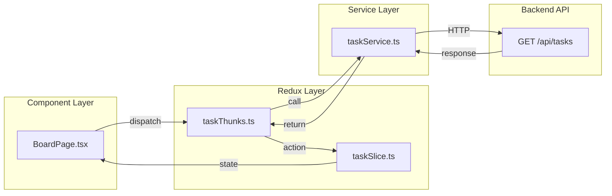
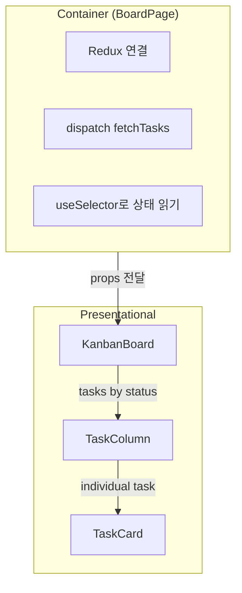
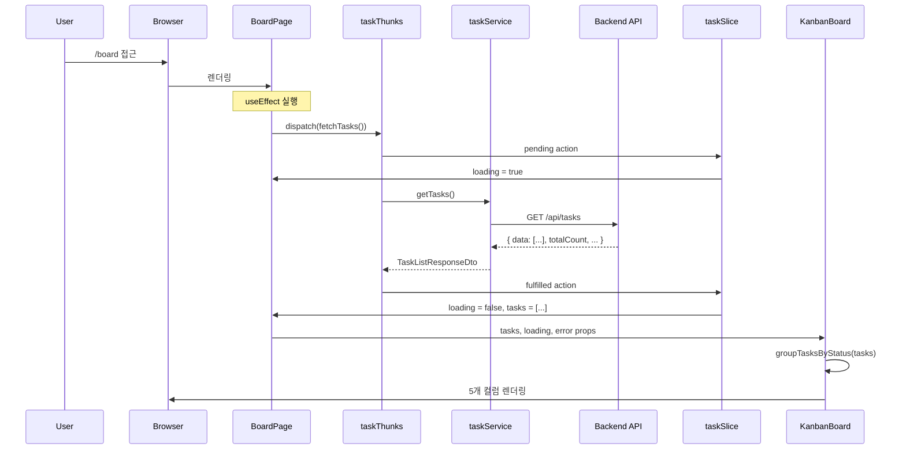

# Task Board Display Implementation Plan

## Overview

Story #32: Frontend에서 Kanban Board 형태로 Task 목록을 표시하는 기능 구현
- Task #33: taskSlice and taskService (Redux 상태 관리 + API 호출)
- Task #34: KanbanBoard component (5개 컬럼의 Kanban 보드 UI)

---

## 현재 구현 상태

| 항목 | 상태 | 설명 |
|------|------|------|
| api.types.ts | ✅ 완료 | Task API 타입 정의 |
| state.types.ts | ✅ 완료 | Redux 상태 타입 정의 |
| taskService.ts | ✅ 완료 | API 호출 서비스 |
| taskThunks.ts | ✅ 완료 | Async thunks (fetchTasks, fetchTaskById) |
| taskSlice.ts | ✅ 완료 | Redux slice |
| index.ts | ✅ 완료 | Barrel exports |
| store.ts 등록 | ✅ 완료 | taskReducer 등록 |
| TaskCard.tsx | ✅ 완료 | 개별 Task 카드 |
| TaskColumn.tsx | ✅ 완료 | Status별 컬럼 |
| KanbanBoard.tsx | ✅ 완료 | Kanban 보드 컨테이너 |
| BoardPage.tsx | ✅ 완료 | Container 페이지 |
| ProtectedRoute | ✅ 완료 | 인증 필요 라우트 |
| E2E 테스트 | ✅ 완료 | Seed 데이터 7개 Task 표시 확인 |

---

## 문제 상황

### Task Board가 필요한 이유

```mermaid
graph TB
    subgraph Before["기존: Task 목록 없음"]
        B1[로그인 성공]
        B2[빈 화면?]
        B3[Task 확인 불가]

        B1 --> B2 --> B3
    end

    subgraph After["신규: Kanban Board"]
        A1[로그인 성공]
        A2[/board 리다이렉트]
        A3[5개 컬럼 표시]
        A4[Task 상태별 분류]

        A1 --> A2 --> A3 --> A4
    end
```

---

## 해결 방법

### 1. Redux Toolkit 패턴



### 2. Container vs Presentational 패턴



---

## File Structure

```
src/features/task/
├── types/
│   ├── api.types.ts          ← API 타입 (TaskResponseDto, TaskStatus)
│   └── state.types.ts        ← Redux 상태 타입 (TaskState)
├── services/
│   └── taskService.ts        ← API 호출 (getTasks, getTaskById)
├── store/
│   ├── taskThunks.ts         ← Async thunks
│   └── taskSlice.ts          ← Redux slice
├── components/
│   ├── TaskCard.tsx          ← 개별 카드 UI
│   ├── TaskColumn.tsx        ← 컬럼 (헤더 + 카드 목록)
│   └── KanbanBoard.tsx       ← 5컬럼 그리드
├── pages/
│   └── BoardPage.tsx         ← Container 컴포넌트
└── index.ts                  ← Barrel exports
```

---

## Implementation Details

### 1. TaskStatus 타입 (Backend와 일치)

```typescript
export type TaskStatus = "ToDo" | "Development" | "Review" | "Merge" | "Done";
```

**5가지 상태:**
- `ToDo` - 시작 전
- `Development` - 개발 중
- `Review` - 코드 리뷰
- `Merge` - 병합 대기
- `Done` - 완료

---

### 2. Backend DTO와 Frontend 타입 매핑

**Backend (C#):**
```csharp
public class TaskListResponseDto
{
    public IEnumerable<TaskResponseDto> Data { get; set; }
    public int Page { get; set; }
    public int PageSize { get; set; }
    public int TotalCount { get; set; }
    public int TotalPages { get; set; }
}
```

**Frontend (TypeScript):**
```typescript
export interface TaskListResponseDto {
  data: TaskResponseDto[];    // C# Data → JSON data (camelCase)
  page: number;
  pageSize: number;
  totalCount: number;
  totalPages: number;
}
```

**주의:** C#의 PascalCase → JSON의 camelCase 자동 변환

---

### 3. Column Colors (요구사항 기반)

```typescript
export const COLUMN_COLORS: Record<TaskStatus, ColumnStyle> = {
  ToDo: { bg: "bg-gray-200", text: "text-gray-700", header: "To Do" },
  Development: { bg: "bg-blue-100", text: "text-blue-700", header: "Development" },
  Review: { bg: "bg-yellow-100", text: "text-yellow-700", header: "Review" },
  Merge: { bg: "bg-purple-100", text: "text-purple-700", header: "Merge" },
  Done: { bg: "bg-green-100", text: "text-green-700", header: "Done" },
};
```

---

### 4. Tasks를 Status별로 그룹화

```typescript
const groupTasksByStatus = (tasks: TaskResponseDto[]): GroupedTasks => {
  const grouped: GroupedTasks = {
    ToDo: [],
    Development: [],
    Review: [],
    Merge: [],
    Done: [],
  };

  tasks.forEach((task) => {
    if (grouped[task.status]) {
      grouped[task.status].push(task);
    }
  });

  return grouped;
};
```

---

### 5. ProtectedRoute (인증 필요 라우트)

```typescript
const ProtectedRoute = ({ children }: { children: React.ReactNode }) => {
  const token = localStorage.getItem("token");

  if (!token) {
    return <Navigate to="/login" replace />;
  }

  return <>{children}</>;
};
```

**동작:**
- Token 없음 → `/login`으로 리다이렉트
- Token 있음 → children 렌더링

---

## Data Flow

### 전체 흐름



---

## 디버깅 과정에서 발견한 문제

### 문제 1: tasks가 undefined

**증상:**
```
TypeError: Cannot read properties of undefined (reading 'forEach')
```

**원인:** Redux 초기 상태에서 tasks가 아직 로드되지 않음

**해결:**
```typescript
// Before
const groupedTasks = groupTasksByStatus(tasks);

// After
const groupedTasks = groupTasksByStatus(tasks || []);
```

---

### 문제 2: Backend DTO 필드명 불일치

**증상:** API 응답은 오는데 Task가 화면에 안 나옴

**원인:**
- Backend: `Data` 필드 (C# PascalCase)
- Frontend: `items` 필드로 기대

**해결:**
```typescript
// api.types.ts - items → data로 변경
export interface TaskListResponseDto {
  data: TaskResponseDto[];  // Backend와 일치
  // ...
}

// taskSlice.ts
.addCase(fetchTasks.fulfilled, (state, action) => {
  state.tasks = action.payload.data;  // items → data
});
```

---

## Checklist

### Task #33: taskSlice and taskService
- [x] Create `src/features/task/types/api.types.ts`
- [x] Create `src/features/task/types/state.types.ts`
- [x] Create `src/features/task/services/taskService.ts`
- [x] Create `src/features/task/store/taskThunks.ts`
- [x] Create `src/features/task/store/taskSlice.ts`
- [x] Create `src/features/task/index.ts`
- [x] Register taskReducer in store.ts

### Task #34: KanbanBoard Component
- [x] Create `src/features/task/components/TaskCard.tsx`
- [x] Create `src/features/task/components/TaskColumn.tsx`
- [x] Create `src/features/task/components/KanbanBoard.tsx`
- [x] Create `src/features/task/pages/BoardPage.tsx`
- [x] Add ProtectedRoute in AppRouter.tsx
- [x] Add /board route
- [x] Test with seeded data (7 tasks displayed)

---

## 향후 개선 (Out of Scope)

현재 구현은 모든 Task를 표시합니다. 향후 추가할 기능:

| 기능 | API | 설명 |
|------|-----|------|
| My Tasks | `GET /api/tasks/my` | 내가 생성한 Task만 |
| Assigned to Me | `GET /api/tasks/assigned` | 나에게 할당된 Task만 |
| Filter UI | - | 탭 또는 드롭다운 필터 |

---

## Related Documentation

- [01-redux-data-flow.md](./01-redux-data-flow.md) - Redux 데이터 흐름
- [02-design-patterns.md](./02-design-patterns.md) - 디자인 패턴
- [03-programming-concepts.md](./03-programming-concepts.md) - 프로그래밍 개념
