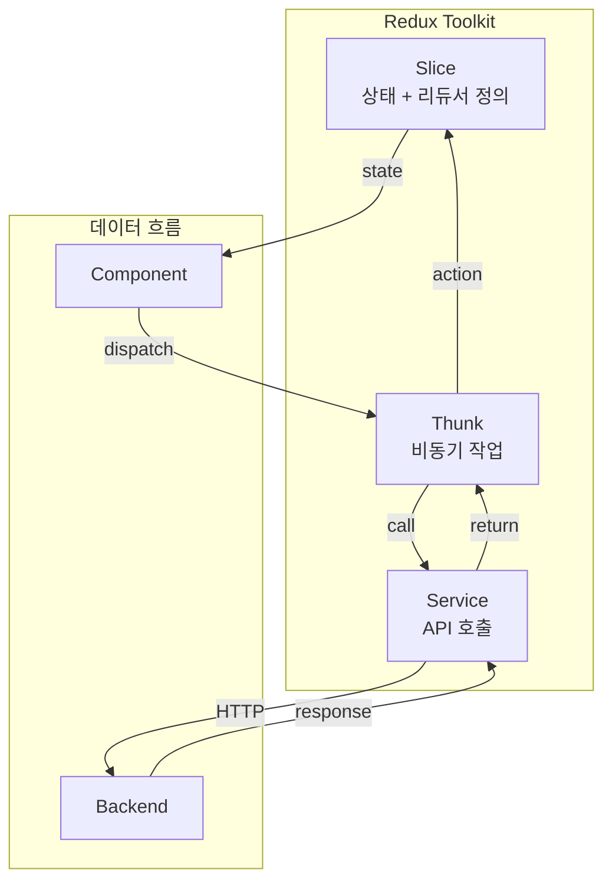
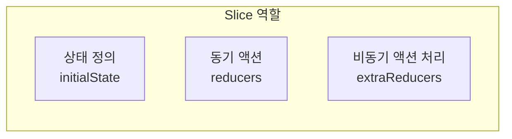
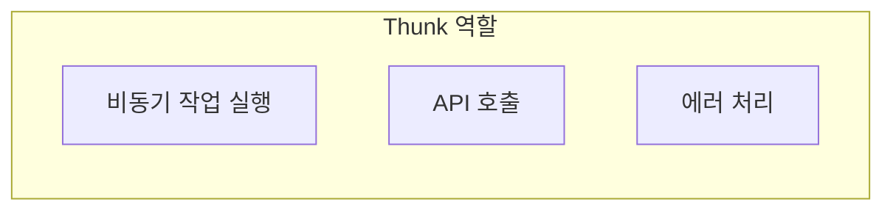
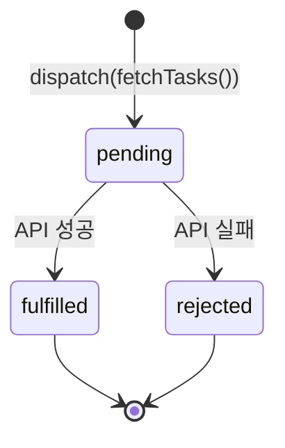
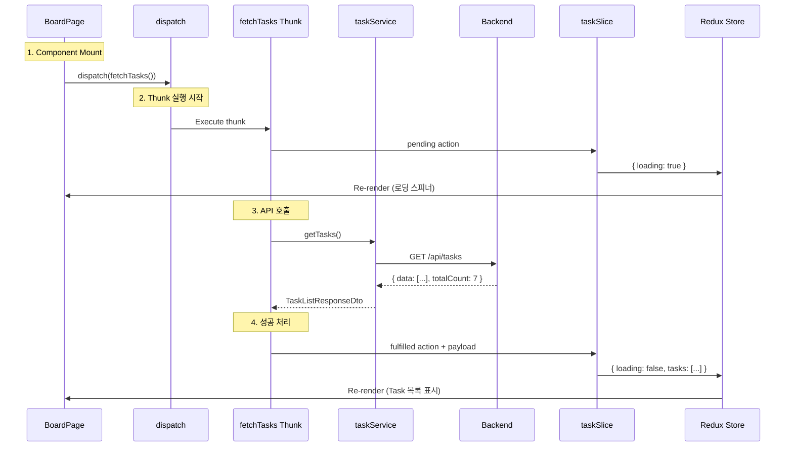
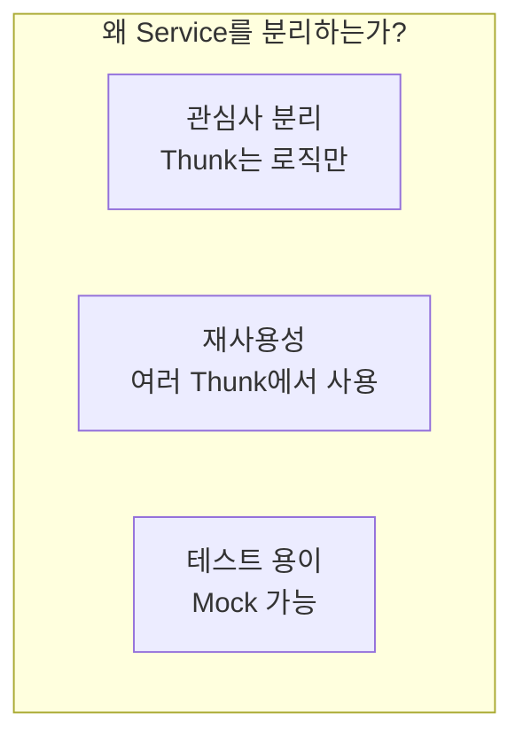
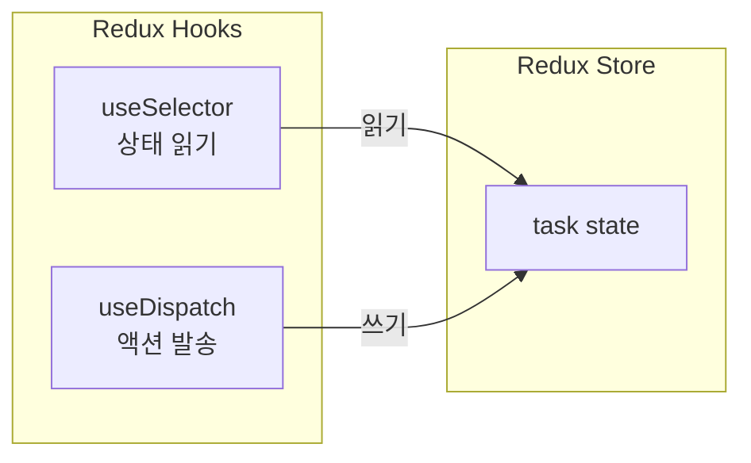
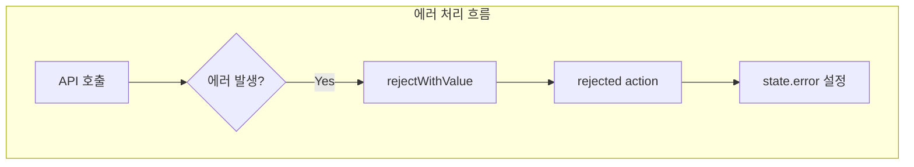
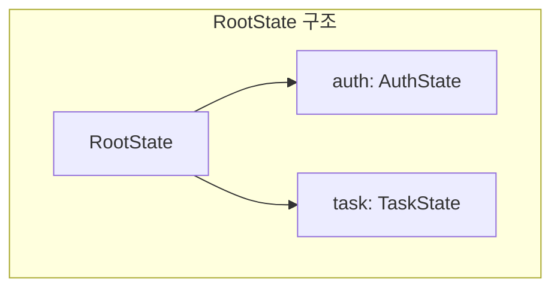

# Redux Data Flow: Task Feature

## Overview

Redux Toolkit을 사용한 Task feature의 데이터 흐름을 상세히 설명

---

## 1. Redux Toolkit 핵심 개념

### 3가지 주요 구성요소



---

## 2. Slice vs Thunk 역할 분리

### Slice (taskSlice.ts)



**코드 예시:**
```typescript
const taskSlice = createSlice({
  name: "task",
  initialState: {
    tasks: [],
    loading: false,
    error: null,
  },
  reducers: {
    // 동기 액션 (선택사항)
    clearTasks: (state) => {
      state.tasks = [];
    },
  },
  extraReducers: (builder) => {
    // 비동기 Thunk 결과 처리
    builder.addCase(fetchTasks.fulfilled, (state, action) => {
      state.tasks = action.payload.data;
    });
  },
});
```

### Thunk (taskThunks.ts)



**코드 예시:**
```typescript
export const fetchTasks = createAsyncThunk(
  "task/fetchTasks",
  async (params, { rejectWithValue }) => {
    try {
      return await taskService.getTasks(params);
    } catch (error) {
      return rejectWithValue(errorMessage);
    }
  }
);
```

---

## 3. createAsyncThunk 생명주기

### 3가지 자동 생성 액션



| 액션 | 시점 | 용도 |
|------|------|------|
| `pending` | 요청 시작 | loading = true |
| `fulfilled` | 요청 성공 | 데이터 저장 |
| `rejected` | 요청 실패 | 에러 메시지 저장 |

### extraReducers에서 처리

```typescript
extraReducers: (builder) => {
  builder
    // 1. 요청 시작
    .addCase(fetchTasks.pending, (state) => {
      state.loading = true;
      state.error = null;
    })
    // 2. 요청 성공
    .addCase(fetchTasks.fulfilled, (state, action) => {
      state.loading = false;
      state.tasks = action.payload.data;
      state.totalCount = action.payload.totalCount;
    })
    // 3. 요청 실패
    .addCase(fetchTasks.rejected, (state, action) => {
      state.loading = false;
      state.error = action.payload as string;
    });
},
```

---

## 4. 전체 데이터 흐름

### Step-by-Step 흐름



---

## 5. Service Layer의 역할

### API 호출 분리



**taskService.ts:**
```typescript
export const taskService = {
  /**
   * Task 목록 조회
   * GET /api/tasks
   */
  getTasks: async (params?: TaskQueryParams): Promise<TaskListResponseDto> => {
    const response = await api.get<TaskListResponseDto>("/tasks", { params });
    return response.data;
  },

  /**
   * 단일 Task 조회
   * GET /api/tasks/:id
   */
  getTaskById: async (id: number): Promise<TaskResponseDto> => {
    const response = await api.get<TaskResponseDto>(`/tasks/${id}`);
    return response.data;
  },
};
```

---

## 6. Component에서 Redux 사용

### useSelector와 useDispatch



**BoardPage.tsx:**
```typescript
const BoardPage = () => {
  const dispatch = useAppDispatch();

  // 상태 읽기
  const { tasks, loading, error } = useAppSelector((state) => state.task);

  // 컴포넌트 마운트 시 데이터 로드
  useEffect(() => {
    dispatch(fetchTasks());
  }, [dispatch]);

  return <KanbanBoard tasks={tasks} loading={loading} error={error} />;
};
```

---

## 7. useAppSelector vs useSelector

### 타입 안전한 커스텀 훅

```typescript
// app/hooks.ts
import { TypedUseSelectorHook, useSelector, useDispatch } from "react-redux";
import type { RootState, AppDispatch } from "./store";

// 타입이 적용된 커스텀 훅
export const useAppDispatch = () => useDispatch<AppDispatch>();
export const useAppSelector: TypedUseSelectorHook<RootState> = useSelector;
```

### 비교

| 훅 | 타입 | 사용 시 |
|----|------|---------|
| `useSelector` | 제네릭 필요 | `useSelector((state: RootState) => ...)` |
| `useAppSelector` | 자동 타입 추론 | `useAppSelector((state) => ...)` |

---

## 8. State 구조 설계

### TaskState 인터페이스

```typescript
export interface TaskState {
  tasks: TaskResponseDto[];      // Task 목록
  selectedTask: TaskResponseDto | null;  // 선택된 Task (상세보기용)
  totalCount: number;            // 전체 개수
  page: number;                  // 현재 페이지
  pageSize: number;              // 페이지 크기
  loading: boolean;              // 로딩 상태
  error: string | null;          // 에러 메시지
}
```

### 초기 상태

```typescript
const initialState: TaskState = {
  tasks: [],
  selectedTask: null,
  totalCount: 0,
  page: 1,
  pageSize: 100,  // Kanban은 전체 로드
  loading: false,
  error: null,
};
```

---

## 9. Error Handling 패턴

### rejectWithValue 사용



**Thunk에서:**
```typescript
export const fetchTasks = createAsyncThunk(
  "task/fetchTasks",
  async (params, { rejectWithValue }) => {
    try {
      return await taskService.getTasks(params);
    } catch (error: unknown) {
      if (axios.isAxiosError(error)) {
        return rejectWithValue(
          error.response?.data?.message || "Failed to fetch tasks"
        );
      }
      return rejectWithValue("An unexpected error occurred");
    }
  }
);
```

**Slice에서:**
```typescript
.addCase(fetchTasks.rejected, (state, action) => {
  state.loading = false;
  state.error = action.payload as string;  // rejectWithValue의 값
});
```

---

## 10. Store 등록

### configureStore

```typescript
// app/store.ts
import { configureStore } from "@reduxjs/toolkit";
import authReducer from "../features/auth/store/authSlice";
import taskReducer from "../features/task/store/taskSlice";

export const store = configureStore({
  reducer: {
    auth: authReducer,
    task: taskReducer,  // Task feature 추가
  },
});

export type RootState = ReturnType<typeof store.getState>;
export type AppDispatch = typeof store.dispatch;
```

### RootState 타입



---

## 11. Barrel Export (index.ts)

### 깔끔한 import를 위한 패턴

```typescript
// features/task/index.ts

// Store
export { default as taskReducer } from "./store/taskSlice";
export { fetchTasks, fetchTaskById } from "./store/taskThunks";

// Components
export { TaskCard } from "./components/TaskCard";
export { TaskColumn } from "./components/TaskColumn";
export { KanbanBoard } from "./components/KanbanBoard";

// Pages
export { BoardPage } from "./pages/BoardPage";

// Types
export type { TaskResponseDto, TaskStatus } from "./types/api.types";
export type { TaskState } from "./types/state.types";
```

### 사용 시

```typescript
// Before (개별 import)
import taskReducer from "../features/task/store/taskSlice";
import { fetchTasks } from "../features/task/store/taskThunks";

// After (barrel export)
import { taskReducer, fetchTasks } from "../features/task";
```

---

## 12. 핵심 포인트 요약

| 개념 | 설명 |
|------|------|
| **Slice** | 상태 정의 + 리듀서 (순수 함수) |
| **Thunk** | 비동기 작업 + API 호출 |
| **Service** | HTTP 요청 캡슐화 |
| **createAsyncThunk** | pending/fulfilled/rejected 자동 생성 |
| **extraReducers** | Thunk 결과를 상태에 반영 |
| **useAppSelector** | 타입 안전한 상태 읽기 |
| **rejectWithValue** | 에러 메시지 전달 |
