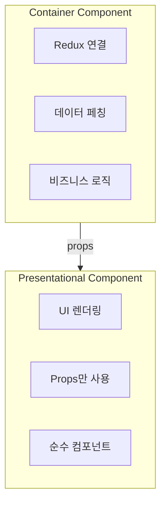
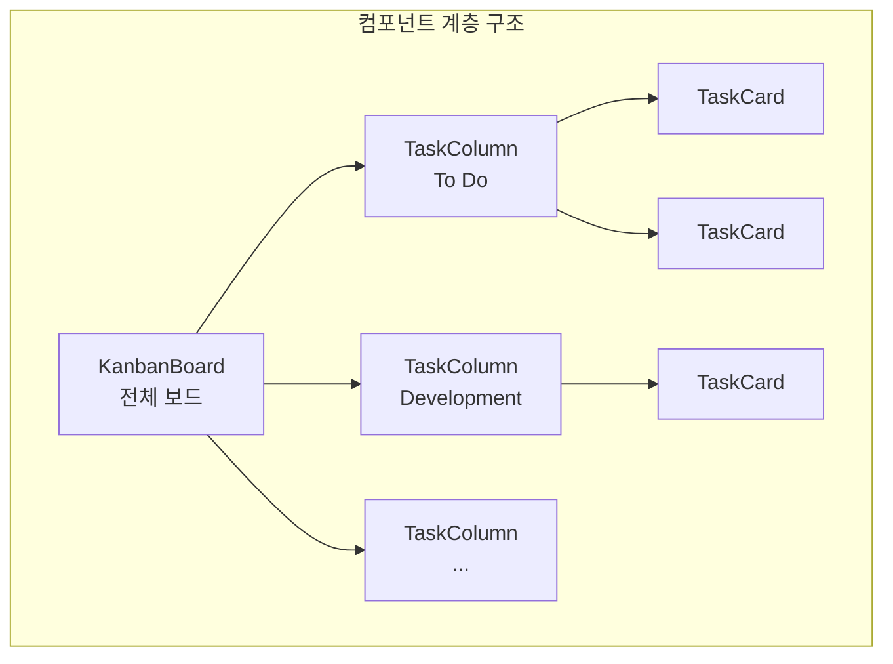
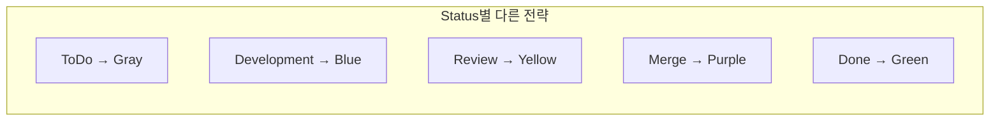
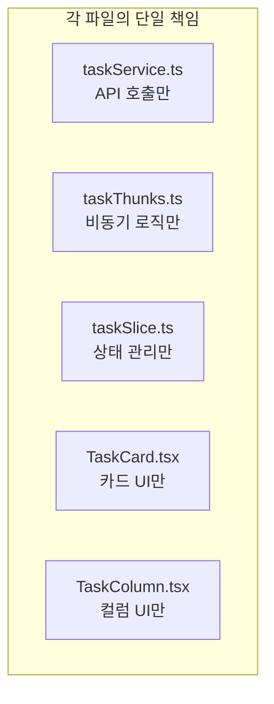
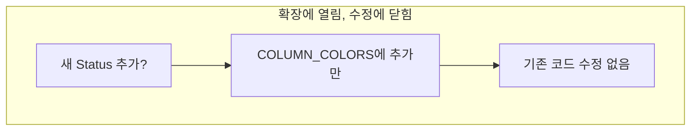
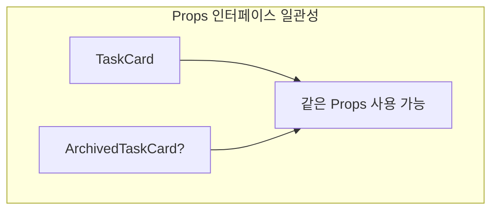
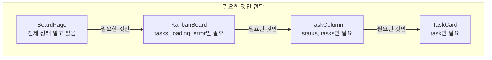
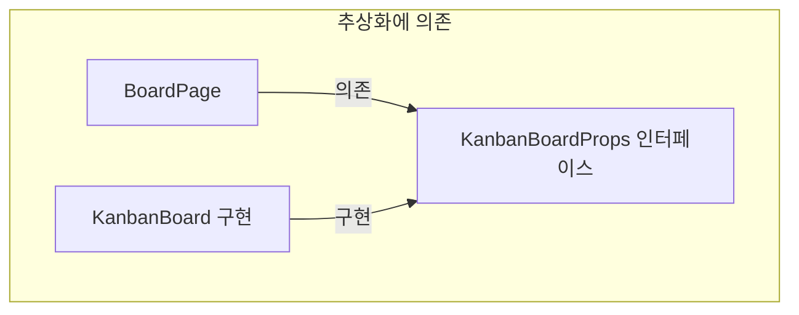
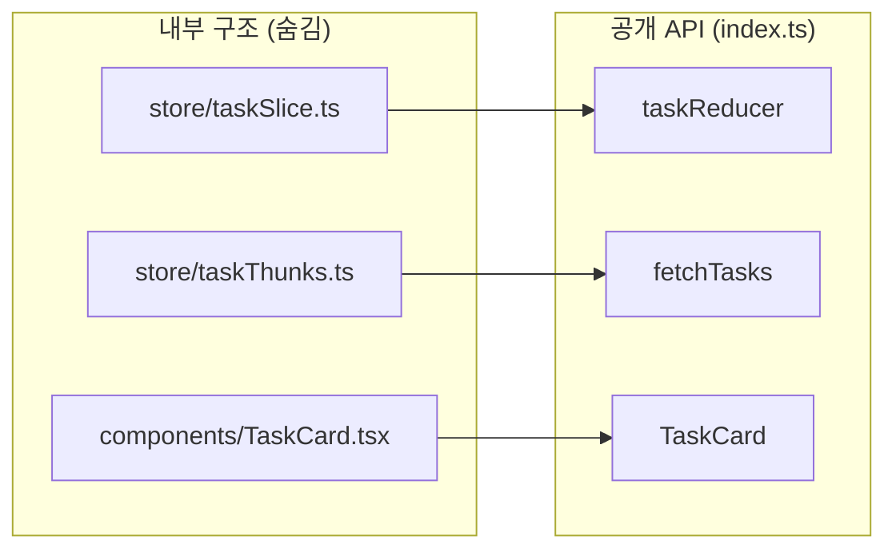

# Design Patterns: Task Board Display

## Overview

Task Board Display 구현에 사용된 디자인 패턴과 SOLID 원칙

---

## 1. Container/Presentational 패턴

### 개념



### 구현 예시

**Container (BoardPage.tsx):**
```typescript
const BoardPage = () => {
  const dispatch = useAppDispatch();
  const { tasks, loading, error } = useAppSelector((state) => state.task);

  useEffect(() => {
    dispatch(fetchTasks());  // 데이터 페칭
  }, [dispatch]);

  const handleTaskClick = (taskId: number) => {
    // 비즈니스 로직
    console.log("Navigate to task:", taskId);
  };

  // Presentational에 props 전달
  return (
    <KanbanBoard
      tasks={tasks}
      loading={loading}
      error={error}
      onTaskClick={handleTaskClick}
    />
  );
};
```

**Presentational (KanbanBoard.tsx):**
```typescript
interface KanbanBoardProps {
  tasks: TaskResponseDto[];
  loading: boolean;
  error: string | null;
  onTaskClick: (taskId: number) => void;
}

const KanbanBoard = ({ tasks, loading, error, onTaskClick }: KanbanBoardProps) => {
  // Redux 직접 사용 없음, props만 사용
  if (loading) return <LoadingSpinner />;
  if (error) return <ErrorMessage message={error} />;

  return (
    <div className="grid grid-cols-5 gap-4">
      {/* UI 렌더링만 담당 */}
    </div>
  );
};
```

### 장점

| 장점 | 설명 |
|------|------|
| 관심사 분리 | 데이터 로직과 UI 분리 |
| 테스트 용이 | Presentational은 props만으로 테스트 |
| 재사용성 | UI 컴포넌트 다른 Container에서 재사용 |
| 유지보수 | Redux 변경해도 UI 영향 없음 |

---

## 2. Composite 패턴

### 개념



### 구현

```typescript
// KanbanBoard - 전체를 포함
<KanbanBoard>
  {STATUSES.map((status) => (
    <TaskColumn
      key={status}
      status={status}
      tasks={groupedTasks[status]}
    >
      {groupedTasks[status].map((task) => (
        <TaskCard key={task.id} task={task} />
      ))}
    </TaskColumn>
  ))}
</KanbanBoard>
```

### 장점

- 계층적 구조 표현
- 각 레벨에서 독립적 스타일링
- 부분 렌더링 최적화

---

## 3. Strategy 패턴 (컬럼 스타일)

### 개념



### 구현

```typescript
// 전략 객체 정의
const COLUMN_COLORS: Record<TaskStatus, ColumnStyle> = {
  ToDo: { bg: "bg-gray-200", text: "text-gray-700", header: "To Do" },
  Development: { bg: "bg-blue-100", text: "text-blue-700", header: "Development" },
  Review: { bg: "bg-yellow-100", text: "text-yellow-700", header: "Review" },
  Merge: { bg: "bg-purple-100", text: "text-purple-700", header: "Merge" },
  Done: { bg: "bg-green-100", text: "text-green-700", header: "Done" },
};

// 사용
const TaskColumn = ({ status }: { status: TaskStatus }) => {
  const style = COLUMN_COLORS[status];  // 전략 선택

  return (
    <div className={style.bg}>
      <h2 className={style.text}>{style.header}</h2>
    </div>
  );
};
```

### 장점

- Status 추가 시 객체만 수정
- 조건문 (if/switch) 제거
- 일관된 스타일 관리

---

## 4. Factory 패턴 (그룹화 함수)

### 개념


### 구현

```typescript
type GroupedTasks = Record<TaskStatus, TaskResponseDto[]>;

// Factory 함수
const groupTasksByStatus = (tasks: TaskResponseDto[]): GroupedTasks => {
  // 빈 구조 생성
  const grouped: GroupedTasks = {
    ToDo: [],
    Development: [],
    Review: [],
    Merge: [],
    Done: [],
  };

  // Task를 상태별로 분류
  tasks.forEach((task) => {
    if (grouped[task.status]) {
      grouped[task.status].push(task);
    }
  });

  return grouped;
};

// 사용
const groupedTasks = groupTasksByStatus(tasks);
// Result: { ToDo: [...], Development: [...], ... }
```

### 장점

- 복잡한 데이터 변환 캡슐화
- 재사용 가능
- 단일 책임 (변환만 담당)

---

## 5. SOLID 원칙 적용

### S - Single Responsibility (단일 책임)



| 파일 | 책임 |
|------|------|
| taskService.ts | HTTP 요청 |
| taskThunks.ts | 비동기 작업 조율 |
| taskSlice.ts | 상태 정의 + 변경 |
| TaskCard.tsx | 개별 카드 렌더링 |
| TaskColumn.tsx | 컬럼 렌더링 |

---

### O - Open/Closed (개방-폐쇄)



**예시: 새 Status "Testing" 추가**

```typescript
// COLUMN_COLORS만 수정
const COLUMN_COLORS: Record<TaskStatus, ColumnStyle> = {
  // ... 기존 것들
  Testing: { bg: "bg-orange-100", text: "text-orange-700", header: "Testing" },  // 추가
};

// 나머지 코드는 수정 불필요!
```

---

### L - Liskov Substitution (리스코프 치환)



**예시:**
```typescript
// 기본 Props
interface TaskCardProps {
  task: TaskResponseDto;
  onClick?: () => void;
}

// 파생 컴포넌트도 같은 Props 사용
const TaskCard = ({ task, onClick }: TaskCardProps) => { ... };
const ArchivedTaskCard = ({ task, onClick }: TaskCardProps) => { ... };

// 둘 다 같은 방식으로 사용 가능
<TaskCard task={task} />
<ArchivedTaskCard task={task} />
```

---

### I - Interface Segregation (인터페이스 분리)



**좋은 예시:**
```typescript
// TaskCard는 task만 필요
interface TaskCardProps {
  task: TaskResponseDto;  // 필요한 것만
}

// 나쁜 예시 (불필요한 props)
interface BadTaskCardProps {
  task: TaskResponseDto;
  allTasks: TaskResponseDto[];  // 불필요
  loading: boolean;             // 불필요
  dispatch: AppDispatch;        // 불필요
}
```

---

### D - Dependency Inversion (의존성 역전)



**구현:**
```typescript
// 인터페이스 (추상화)
interface KanbanBoardProps {
  tasks: TaskResponseDto[];
  loading: boolean;
  error: string | null;
  onTaskClick: (taskId: number) => void;
}

// BoardPage는 인터페이스에 의존
const BoardPage = () => {
  return <KanbanBoard {...props} />;  // 구현이 바뀌어도 OK
};

// KanbanBoard 구현이 변경되어도 BoardPage 수정 불필요
```

---

## 6. Feature 폴더 구조 패턴

### 개념

```
features/
└── task/                    ← 도메인별 폴더
    ├── components/          ← UI 컴포넌트
    ├── pages/               ← 페이지 (Container)
    ├── services/            ← API 호출
    ├── store/               ← Redux (slice + thunks)
    ├── types/               ← 타입 정의
    └── index.ts             ← Barrel export
```

### 장점

| 장점 | 설명 |
|------|------|
| 응집도 | 관련 파일이 한 폴더에 |
| 캡슐화 | index.ts로 공개 API 제어 |
| 확장성 | 새 feature 추가 쉬움 |
| 삭제 용이 | feature 폴더만 삭제 |

---

## 7. Barrel Export 패턴

### 개념



### 구현

```typescript
// features/task/index.ts

// Store - 공개
export { default as taskReducer } from "./store/taskSlice";
export { fetchTasks, fetchTaskById } from "./store/taskThunks";

// Components - 공개
export { KanbanBoard } from "./components/KanbanBoard";

// 내부 헬퍼는 export 안 함
// groupTasksByStatus는 KanbanBoard 내부에서만 사용
```

### 사용

```typescript
// 깔끔한 import
import { taskReducer, fetchTasks, KanbanBoard } from "@/features/task";

// 내부 경로 접근 불가 (의도적)
// import { groupTasksByStatus } from "@/features/task/components/KanbanBoard";  // X
```

---

## 8. 핵심 패턴 요약

| 패턴 | 적용 위치 | 목적 |
|------|----------|------|
| Container/Presentational | BoardPage + KanbanBoard | 로직/UI 분리 |
| Composite | Board → Column → Card | 계층 구조 |
| Strategy | COLUMN_COLORS | Status별 스타일 |
| Factory | groupTasksByStatus | 데이터 변환 |
| Feature Folder | src/features/task/ | 도메인 중심 구조 |
| Barrel Export | index.ts | 공개 API 제어 |
