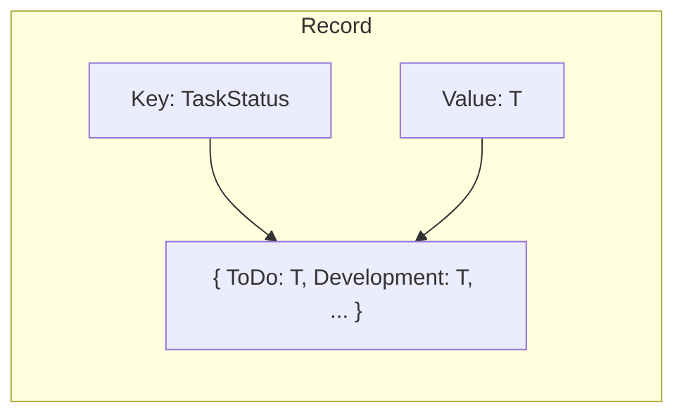
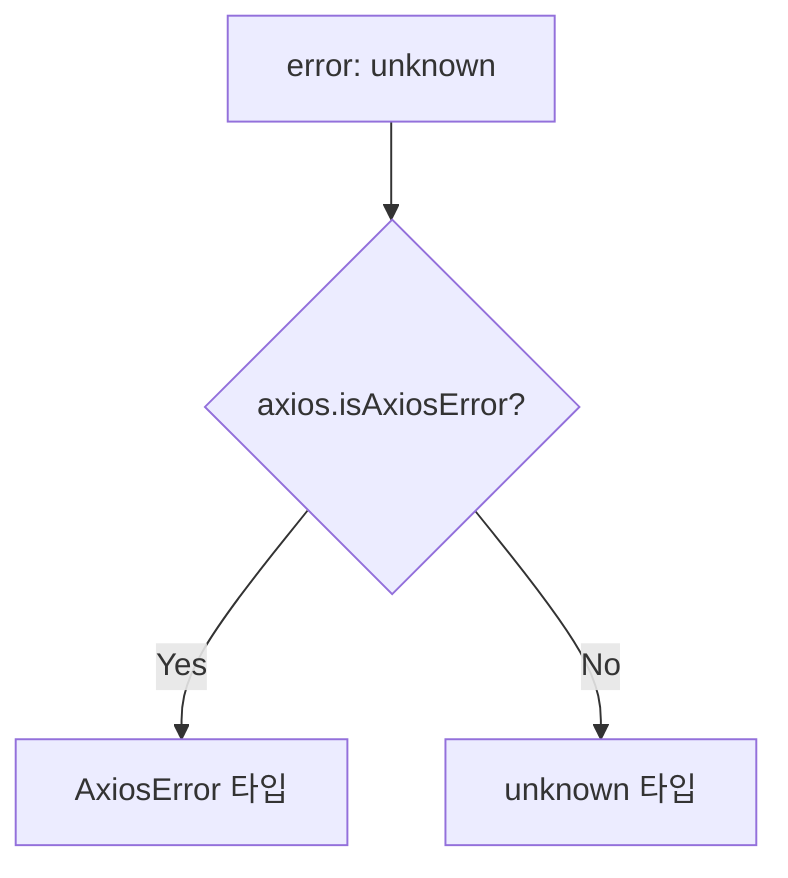

# Programming Concepts: Task Board Display

## Overview

Task Board Display 구현에서 배울 수 있는 TypeScript/React 프로그래밍 개념

---

## 1. TypeScript 유틸리티 타입

### Record<K, V>



**사용 예시:**
```typescript
// TaskStatus를 키로, ColumnStyle을 값으로
type TaskStatus = "ToDo" | "Development" | "Review" | "Merge" | "Done";

interface ColumnStyle {
  bg: string;
  text: string;
  header: string;
}

const COLUMN_COLORS: Record<TaskStatus, ColumnStyle> = {
  ToDo: { bg: "bg-gray-200", text: "text-gray-700", header: "To Do" },
  Development: { bg: "bg-blue-100", text: "text-blue-700", header: "Development" },
  // ... 모든 TaskStatus 키 필수!
};
```

**장점:**
- 모든 키를 강제로 정의해야 함 (누락 방지)
- 타입 안전한 객체 생성

---

### ReturnType<T>

```typescript
// 함수의 반환 타입 추출
export const store = configureStore({
  reducer: { auth: authReducer, task: taskReducer },
});

// store.getState()의 반환 타입을 자동 추출
export type RootState = ReturnType<typeof store.getState>;

// 결과: { auth: AuthState, task: TaskState }
```

**사용 이유:**
- 수동으로 타입 정의 불필요
- reducer 변경 시 자동 업데이트

---

### Partial<T>와 Required<T>

```typescript
// 모든 속성을 선택적으로
interface TaskQueryParams {
  page?: number;
  pageSize?: number;
  status?: TaskStatus;
}

// Partial - 모든 속성 선택적
type PartialTask = Partial<TaskResponseDto>;
// { id?: number, title?: string, ... }

// Required - 모든 속성 필수
type RequiredQuery = Required<TaskQueryParams>;
// { page: number, pageSize: number, status: TaskStatus }
```

---

## 2. Generic 타입

### 함수에서 Generic 사용

```typescript
// 일반 함수
function identity(arg: any): any {
  return arg;
}

// Generic 함수 - 타입 안전
function identity<T>(arg: T): T {
  return arg;
}

// 사용
const str = identity<string>("hello");  // string
const num = identity<number>(42);       // number
```

### createAsyncThunk Generic

```typescript
// createAsyncThunk<반환타입, 인자타입>
export const fetchTasks = createAsyncThunk<
  TaskListResponseDto,           // 성공 시 반환 타입
  TaskQueryParams | undefined    // thunk 인자 타입
>(
  "task/fetchTasks",
  async (params) => {
    return await taskService.getTasks(params);
  }
);
```

---

## 3. Type Guard와 Type Narrowing

### axios.isAxiosError

```typescript
export const fetchTasks = createAsyncThunk(
  "task/fetchTasks",
  async (params, { rejectWithValue }) => {
    try {
      return await taskService.getTasks(params);
    } catch (error: unknown) {
      // Type Guard: error가 AxiosError인지 확인
      if (axios.isAxiosError(error)) {
        // 여기서 error는 AxiosError 타입으로 narrowing
        return rejectWithValue(
          error.response?.data?.message || "Failed to fetch"
        );
      }
      return rejectWithValue("Unknown error");
    }
  }
);
```

### 타입 체크 패턴



---

## 4. React Hooks

### useEffect 의존성 배열

```typescript
const BoardPage = () => {
  const dispatch = useAppDispatch();

  // 빈 배열: 마운트 시 1번만 실행
  useEffect(() => {
    dispatch(fetchTasks());
  }, []);  // 경고: dispatch 누락

  // 올바른 방법: dispatch 포함
  useEffect(() => {
    dispatch(fetchTasks());
  }, [dispatch]);  // dispatch는 stable하므로 1번만 실행됨
};
```

### 의존성 배열 규칙

| 배열 | 실행 시점 |
|------|----------|
| `[]` | 마운트 시 1번 |
| `[dep]` | 마운트 + dep 변경 시 |
| 없음 | 매 렌더링마다 |

---

### Custom Hooks (useAppSelector, useAppDispatch)

```typescript
// hooks.ts - 타입이 적용된 커스텀 훅
import { TypedUseSelectorHook, useSelector, useDispatch } from "react-redux";
import type { RootState, AppDispatch } from "./store";

// useDispatch에 AppDispatch 타입 적용
export const useAppDispatch = () => useDispatch<AppDispatch>();

// useSelector에 RootState 타입 적용
export const useAppSelector: TypedUseSelectorHook<RootState> = useSelector;
```

**사용:**
```typescript
// Before: 매번 타입 지정
const tasks = useSelector((state: RootState) => state.task.tasks);

// After: 타입 자동 추론
const tasks = useAppSelector((state) => state.task.tasks);
// state 타입이 자동으로 RootState
```

---

## 5. 배열 메서드

### forEach vs map

```typescript
// forEach: 반환값 없음, 부수 효과용
tasks.forEach((task) => {
  grouped[task.status].push(task);  // 기존 객체 수정
});

// map: 새 배열 반환
const titles = tasks.map((task) => task.title);
// ["Task 1", "Task 2", ...]
```

### filter + map 체이닝

```typescript
// 완료된 Task의 제목만 추출
const doneTitles = tasks
  .filter((task) => task.status === "Done")
  .map((task) => task.title);
```

### reduce로 그룹화

```typescript
// forEach 대신 reduce 사용 (함수형 스타일)
const grouped = tasks.reduce((acc, task) => {
  if (!acc[task.status]) {
    acc[task.status] = [];
  }
  acc[task.status].push(task);
  return acc;
}, {} as Record<TaskStatus, TaskResponseDto[]>);
```

---

## 6. Optional Chaining과 Nullish Coalescing

### Optional Chaining (?.)

```typescript
// 중첩 객체 안전 접근
const assigneeName = task.assignedTo?.name;
// assignedTo가 null/undefined면 undefined 반환

// 배열 접근
const firstTask = tasks?.[0];
// tasks가 null/undefined면 undefined 반환

// 메서드 호출
error.response?.data?.message;
// 중간에 null이면 undefined 반환
```

### Nullish Coalescing (??)

```typescript
// null/undefined일 때만 기본값
const errorMessage = error.response?.data?.message ?? "Unknown error";

// OR 연산자와 차이
const value1 = 0 || "default";   // "default" (0은 falsy)
const value2 = 0 ?? "default";   // 0 (null/undefined만 체크)

const value3 = "" || "default";  // "default" (빈 문자열은 falsy)
const value4 = "" ?? "default";  // "" (null/undefined만 체크)
```

---

## 7. Props와 Children

### React.ReactNode

```typescript
// children 타입
interface ProtectedRouteProps {
  children: React.ReactNode;  // 어떤 React 요소든 가능
}

const ProtectedRoute = ({ children }: ProtectedRouteProps) => {
  if (!token) {
    return <Navigate to="/login" />;
  }
  return <>{children}</>;  // Fragment로 감싸서 반환
};

// 사용
<ProtectedRoute>
  <BoardPage />  {/* children으로 전달 */}
</ProtectedRoute>
```

### Fragment (<>...</>)

```typescript
// Fragment: 추가 DOM 노드 없이 여러 요소 그룹화
return (
  <>
    <Header />
    <Main />
    <Footer />
  </>
);

// 동일한 결과
return (
  <React.Fragment>
    <Header />
    <Main />
    <Footer />
  </React.Fragment>
);
```

---

## 8. 조건부 렌더링 패턴

### Early Return 패턴

```typescript
const KanbanBoard = ({ tasks, loading, error }: Props) => {
  // 로딩 상태 먼저 처리
  if (loading) {
    return <div className="text-center">Loading...</div>;
  }

  // 에러 상태 처리
  if (error) {
    return <div className="text-red-500">{error}</div>;
  }

  // 정상 렌더링
  return (
    <div className="grid grid-cols-5">
      {/* ... */}
    </div>
  );
};
```

### 삼항 연산자 vs && 연산자

```typescript
// 삼항: 둘 중 하나 선택
{loading ? <Spinner /> : <Content />}

// &&: 조건 만족 시만 렌더링
{error && <ErrorMessage message={error} />}

// 주의: 숫자 0은 렌더링됨
{count && <span>{count}</span>}  // count=0이면 0 표시됨
{count > 0 && <span>{count}</span>}  // 올바른 방법
```

---

## 9. 비구조화 할당 (Destructuring)

### 객체 비구조화

```typescript
// Props에서 비구조화
const TaskCard = ({ task, onClick }: TaskCardProps) => {
  // task에서 다시 비구조화
  const { id, title, status, assignedTo } = task;

  return (
    <div onClick={onClick}>
      <span>#{id}</span>
      <span>{title}</span>
    </div>
  );
};
```

### 배열 비구조화

```typescript
// useState 반환값
const [isOpen, setIsOpen] = useState(false);

// 첫 번째와 나머지
const [first, ...rest] = tasks;
```

### 기본값과 함께

```typescript
// 기본값 지정
const { page = 1, pageSize = 10 } = params || {};

// Props 기본값
const TaskCard = ({ task, onClick = () => {} }: TaskCardProps) => {
  // onClick 기본값은 빈 함수
};
```

---

## 10. async/await와 Promise

### 기본 사용

```typescript
// async 함수 정의
const getTasks = async (params?: TaskQueryParams): Promise<TaskListResponseDto> => {
  const response = await api.get<TaskListResponseDto>("/tasks", { params });
  return response.data;  // Promise 자동 unwrap
};

// 호출
const data = await getTasks({ page: 1 });
```

### try/catch 에러 처리

```typescript
export const fetchTasks = createAsyncThunk(
  "task/fetchTasks",
  async (params, { rejectWithValue }) => {
    try {
      // 성공 시
      return await taskService.getTasks(params);
    } catch (error) {
      // 실패 시
      return rejectWithValue("Failed to fetch");
    }
  }
);
```

### Promise.all (병렬 실행)

```typescript
// 순차 실행 (느림)
const task1 = await getTask(1);
const task2 = await getTask(2);

// 병렬 실행 (빠름)
const [task1, task2] = await Promise.all([
  getTask(1),
  getTask(2),
]);
```

---

## 11. Type Import

### import type

```typescript
// 일반 import: 값 + 타입
import { TaskResponseDto } from "./api.types";

// type import: 타입만 (런타임에 제거됨)
import type { TaskResponseDto } from "./api.types";

// 혼합 사용
import { taskService } from "./taskService";
import type { TaskQueryParams } from "./api.types";
```

**장점:**
- 번들 크기 최적화 (타입은 컴파일 시 제거)
- 순환 참조 방지
- 의도 명확히 표현

---

## 12. 핵심 개념 요약

| 개념 | 용도 | 예시 |
|------|------|------|
| `Record<K,V>` | 타입 안전한 객체 | `Record<TaskStatus, Style>` |
| `ReturnType<T>` | 반환 타입 추출 | `ReturnType<typeof fn>` |
| Type Guard | 타입 좁히기 | `axios.isAxiosError(e)` |
| Optional Chaining | 안전한 접근 | `obj?.prop?.method?.()` |
| Nullish Coalescing | null/undefined 기본값 | `value ?? "default"` |
| `import type` | 타입만 import | `import type { T }` |
| Early Return | 조건부 렌더링 | `if (loading) return <Spinner/>` |
| Custom Hooks | 재사용 가능한 로직 | `useAppSelector` |
