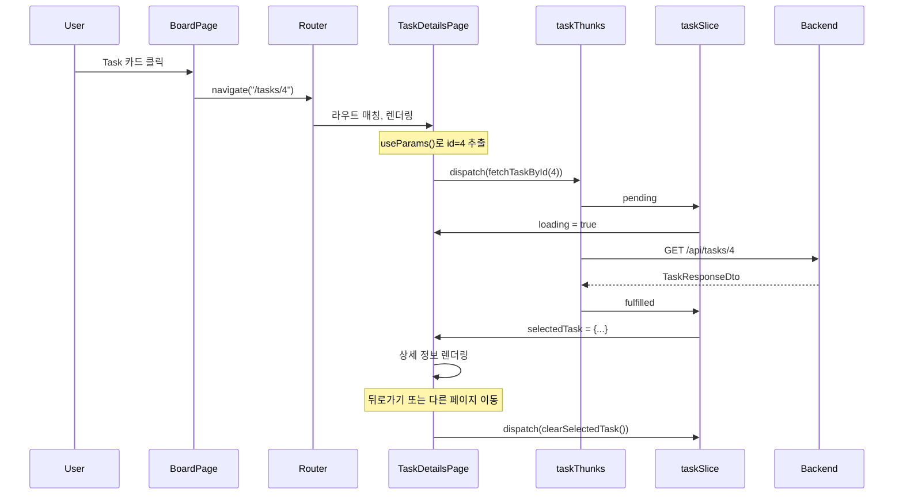

# Task Details Page Implementation Plan

## Overview

Story #35: Frontend에서 Task 상세 정보를 표시하는 페이지 구현
- Task #36: TaskDetailsPage component

---

## 현재 구현 상태

| 항목 | 상태 | 설명 |
|------|------|------|
| TaskDetailsPage.tsx | ✅ 완료 | Two-column layout |
| index.ts export | ✅ 완료 | Barrel export 추가 |
| AppRouter 라우트 | ✅ 완료 | /tasks/:id 라우트 |
| ProtectedRoute 적용 | ✅ 완료 | 인증 필요 |
| BoardPage 연결 | ✅ 완료 | 카드 클릭 → 상세 페이지 |
| E2E 테스트 | ✅ 완료 | 모든 필드 정상 표시 |

---

## 페이지 구조

### Two-Column Layout

```
┌─────────────────────────────────────────────────────────┐
│ Header                                                  │
│ ┌─────────────────────────────────────────────────────┐ │
│ │ Breadcrumb: Board / Task #4                         │ │
│ │ Title: Build task API endpoints                     │ │
│ └─────────────────────────────────────────────────────┘ │
├─────────────────────────────────────────────────────────┤
│ Main Content                                            │
│ ┌───────────────────────────┬─────────────────────────┐ │
│ │ Left (2/3)                │ Right (1/3)             │ │
│ │                           │                         │ │
│ │ ┌───────────────────────┐ │ ┌─────────────────────┐ │ │
│ │ │ Description           │ │ │ Status              │ │ │
│ │ │                       │ │ │ [Development]       │ │ │
│ │ │ Implement CRUD...     │ │ └─────────────────────┘ │ │
│ │ │                       │ │                         │ │
│ │ └───────────────────────┘ │ ┌─────────────────────┐ │ │
│ │                           │ │ Assignee            │ │ │
│ │                           │ │ (S) Sarah Chen      │ │ │
│ │                           │ └─────────────────────┘ │ │
│ │                           │                         │ │
│ │                           │ ┌─────────────────────┐ │ │
│ │                           │ │ Reporter            │ │ │
│ │                           │ │ (J) John Doe        │ │ │
│ │                           │ └─────────────────────┘ │ │
│ │                           │                         │ │
│ │                           │ ┌─────────────────────┐ │ │
│ │                           │ │ Dates               │ │ │
│ │                           │ │ Created: 12/9/2025  │ │ │
│ │                           │ │ Updated: 12/13/2025 │ │ │
│ │                           │ └─────────────────────┘ │ │
│ │                           │                         │ │
│ │                           │ ┌─────────────────────┐ │ │
│ │                           │ │ Actions             │ │ │
│ │                           │ │ [Back to Board]     │ │ │
│ │                           │ └─────────────────────┘ │ │
│ └───────────────────────────┴─────────────────────────┘ │
└─────────────────────────────────────────────────────────┘
```

---

## File Structure

```
src/features/task/
├── pages/
│   ├── BoardPage.tsx          ← 카드 클릭 시 navigate
│   └── TaskDetailsPage.tsx    ← 신규 생성
├── store/
│   ├── taskSlice.ts           ← selectedTask, clearSelectedTask
│   └── taskThunks.ts          ← fetchTaskById
└── index.ts                   ← TaskDetailsPage export 추가
```

---

## Data Flow



---

## Implementation Details

### 1. URL 파라미터 추출

```typescript
const { id } = useParams<{ id: string }>();
```

- `useParams` - React Router의 URL 파라미터 훅
- `/tasks/:id`에서 `:id` 부분을 추출
- 타입은 항상 `string` (숫자 변환 필요)

---

### 2. 데이터 로드 및 Cleanup

```typescript
useEffect(() => {
  if (id) {
    dispatch(fetchTaskById(Number(id)));
  }

  // Cleanup: 페이지 나갈 때 selectedTask 초기화
  return () => {
    dispatch(clearSelectedTask());
  };
}, [dispatch, id]);
```

**Cleanup이 필요한 이유:**
- Task #1 상세 → Task #2 상세 이동 시
- 이전 Task #1 데이터가 잠깐 보이는 문제 방지
- `clearSelectedTask()`로 이전 데이터 제거

---

### 3. Early Return 패턴

```typescript
// 1. 로딩 상태
if (loading) {
  return <LoadingSpinner />;
}

// 2. 에러 상태
if (error) {
  return <ErrorMessage />;
}

// 3. 데이터 없음
if (!selectedTask) {
  return null;
}

// 4. 정상 렌더링
return <TaskDetails />;
```

조건별로 빨리 반환하여 코드 가독성 향상

---

### 4. Breadcrumb 네비게이션

```typescript
<nav className="text-sm text-gray-500 mb-2">
  <Link to="/board" className="hover:text-blue-600">
    Board
  </Link>
  <span className="mx-2">/</span>
  <span className="text-gray-900">Task #{selectedTask.id}</span>
</nav>
```

- 현재 위치 표시: `Board / Task #4`
- Board 링크 클릭 시 보드로 이동

---

### 5. 상태별 색상 (Strategy 패턴)

```typescript
const STATUS_COLORS: Record<TaskStatus, { bg: string; text: string; label: string }> = {
  ToDo: { bg: "#dfe1e6", text: "#5e6c84", label: "To Do" },
  Development: { bg: "#deebff", text: "#0052cc", label: "Development" },
  Review: { bg: "#fff0b3", text: "#ff991f", label: "Review" },
  Merge: { bg: "#eae6ff", text: "#6554c0", label: "Merge" },
  Done: { bg: "#e3fcef", text: "#00875a", label: "Done" },
};
```

TaskColumn의 COLUMN_COLORS와 동일한 색상 체계 사용

---

## Checklist

- [x] Create TaskDetailsPage.tsx
- [x] Two-column responsive layout
- [x] Fetch task by ID on mount
- [x] Display all task fields (title, description, status, assignee, reporter, dates)
- [x] Status badge with color coding
- [x] User avatar with initials
- [x] Breadcrumb navigation
- [x] Loading/error states
- [x] Cleanup on unmount (clearSelectedTask)
- [x] Add export to index.ts
- [x] Add route /tasks/:id in AppRouter
- [x] ProtectedRoute for authentication
- [x] Test navigation from BoardPage

---

## Related Documentation

- [01-react-router-concepts.md](./01-react-router-concepts.md) - React Router 개념
- [02-design-patterns.md](./02-design-patterns.md) - 디자인 패턴
