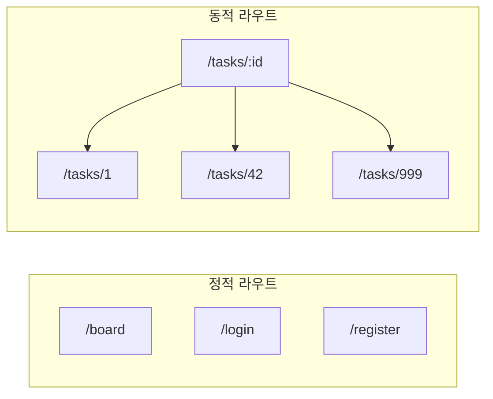
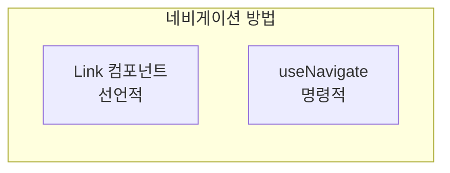
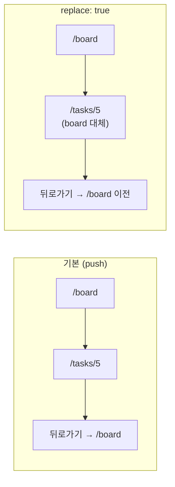
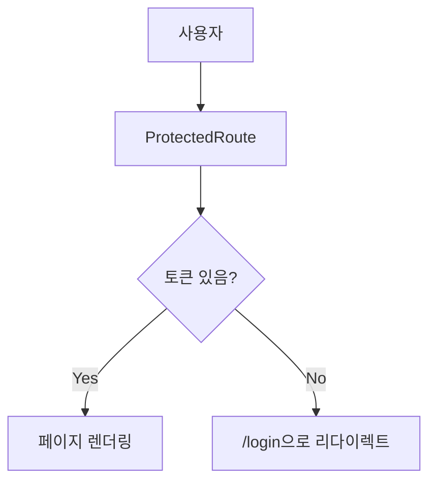

# React Router Concepts

## Overview

React Router를 사용한 동적 라우팅과 URL 파라미터 처리

---

## 1. 동적 라우트 (Dynamic Routes)

### 정적 vs 동적 라우트



### 라우트 정의

```typescript
// AppRouter.tsx
<Routes>
  {/* 정적 라우트 */}
  <Route path="/board" element={<BoardPage />} />

  {/* 동적 라우트 - :id는 파라미터 */}
  <Route path="/tasks/:id" element={<TaskDetailsPage />} />
</Routes>
```

`:id` - 콜론으로 시작하는 부분은 동적 파라미터

---

## 2. useParams Hook

### URL 파라미터 추출

```typescript
import { useParams } from "react-router-dom";

const TaskDetailsPage = () => {
  // URL에서 파라미터 추출
  const { id } = useParams<{ id: string }>();

  // /tasks/42 접속 시 → id = "42" (문자열)
  console.log(id);  // "42"

  // 숫자로 변환
  const taskId = Number(id);  // 42
};
```

### 타입 정의

```typescript
// 방법 1: 인라인 타입
const { id } = useParams<{ id: string }>();

// 방법 2: 별도 타입 정의
interface TaskParams {
  id: string;
}
const { id } = useParams<TaskParams>();
```

**주의:** useParams는 항상 `string | undefined` 반환

---

## 3. useNavigate Hook

### 프로그래밍 방식 네비게이션



### Link vs useNavigate

```typescript
// 1. Link 컴포넌트 (선언적)
<Link to="/board">Back to Board</Link>

// 2. useNavigate (명령적)
const navigate = useNavigate();

const handleClick = () => {
  navigate("/board");        // 이동
  navigate(-1);              // 뒤로가기
  navigate("/tasks/5");      // 동적 경로
};
```

### 언제 무엇을 사용?

| 상황 | 권장 |
|------|------|
| 단순 링크 | `Link` 컴포넌트 |
| 이벤트 후 이동 | `useNavigate` |
| 조건부 이동 | `useNavigate` |
| 데이터 제출 후 | `useNavigate` |

---

## 4. 네비게이션 옵션

### replace 옵션

```typescript
// 기본: 히스토리에 추가
navigate("/tasks/5");

// replace: 현재 히스토리 교체
navigate("/tasks/5", { replace: true });
```



### state 전달

```typescript
// 네비게이션 시 상태 전달
navigate("/tasks/5", {
  state: { from: "board", taskTitle: "Build API" }
});

// 받는 쪽에서
const location = useLocation();
console.log(location.state);  // { from: "board", taskTitle: "Build API" }
```

---

## 5. ProtectedRoute 패턴

### 인증 필요 라우트 보호



### 구현

```typescript
const ProtectedRoute = ({ children }: { children: React.ReactNode }) => {
  const token = localStorage.getItem("token");

  if (!token) {
    return <Navigate to="/login" replace />;
  }

  return <>{children}</>;
};
```

### 사용

```typescript
<Route
  path="/tasks/:id"
  element={
    <ProtectedRoute>
      <TaskDetailsPage />
    </ProtectedRoute>
  }
/>
```

---

## 6. Navigate 컴포넌트

### 선언적 리다이렉트

```typescript
// 컴포넌트로 리다이렉트
<Navigate to="/login" replace />

// vs useNavigate (명령적)
const navigate = useNavigate();
navigate("/login", { replace: true });
```

### 주요 사용처

```typescript
// 1. 홈 리다이렉트
<Route path="/" element={<Navigate to="/board" replace />} />

// 2. 조건부 렌더링에서
if (!token) {
  return <Navigate to="/login" replace />;
}

// 3. 404 처리
<Route path="*" element={<Navigate to="/board" replace />} />
```

---

## 7. 라우트 매칭 순서

### 우선순위

```typescript
<Routes>
  {/* 정확한 매칭 우선 */}
  <Route path="/tasks/new" element={<CreateTaskPage />} />

  {/* 동적 매칭 */}
  <Route path="/tasks/:id" element={<TaskDetailsPage />} />

  {/* 와일드카드 (가장 낮은 우선순위) */}
  <Route path="*" element={<NotFoundPage />} />
</Routes>
```

**순서:**
1. `/tasks/new` → CreateTaskPage (정확히 매칭)
2. `/tasks/42` → TaskDetailsPage (동적 매칭)
3. `/anything` → NotFoundPage (와일드카드)

---

## 8. useEffect와 라우트 파라미터

### 파라미터 변경 감지

```typescript
const { id } = useParams<{ id: string }>();

useEffect(() => {
  // id가 변경될 때마다 실행
  if (id) {
    dispatch(fetchTaskById(Number(id)));
  }
}, [dispatch, id]);  // id를 의존성 배열에 포함
```

### Cleanup 패턴

```typescript
useEffect(() => {
  if (id) {
    dispatch(fetchTaskById(Number(id)));
  }

  // Cleanup: 컴포넌트 unmount 또는 id 변경 시
  return () => {
    dispatch(clearSelectedTask());
  };
}, [dispatch, id]);
```

---

## 9. 현재 앱의 라우트 구조

```
/
├── /login              → LoginPage
├── /register           → RegisterPage
├── /board              → BoardPage (Protected)
└── /tasks/:id          → TaskDetailsPage (Protected)
```

### 전체 AppRouter

```typescript
<BrowserRouter>
  <Routes>
    <Route path="/login" element={<LoginPage />} />
    <Route path="/register" element={<RegisterPage />} />

    <Route path="/board" element={
      <ProtectedRoute><BoardPage /></ProtectedRoute>
    } />

    <Route path="/tasks/:id" element={
      <ProtectedRoute><TaskDetailsPage /></ProtectedRoute>
    } />

    <Route path="/" element={<Navigate to="/board" replace />} />
  </Routes>
</BrowserRouter>
```

---

## 10. 핵심 포인트 요약

| 개념 | 설명 | 예시 |
|------|------|------|
| 동적 라우트 | `:param`으로 정의 | `/tasks/:id` |
| useParams | URL 파라미터 추출 | `{ id } = useParams()` |
| useNavigate | 프로그래밍 네비게이션 | `navigate("/board")` |
| Navigate | 선언적 리다이렉트 | `<Navigate to="/" />` |
| ProtectedRoute | 인증 보호 래퍼 | 토큰 없으면 리다이렉트 |
| replace | 히스토리 교체 | 뒤로가기 방지 |
