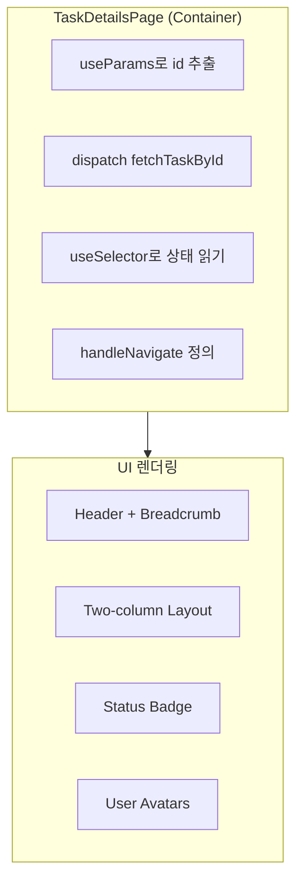
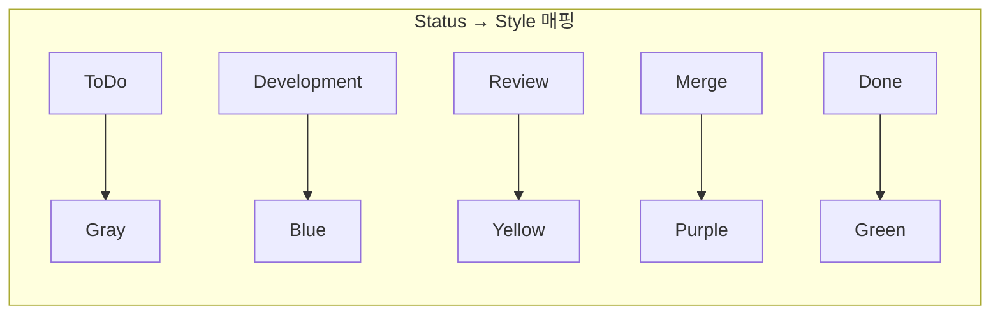
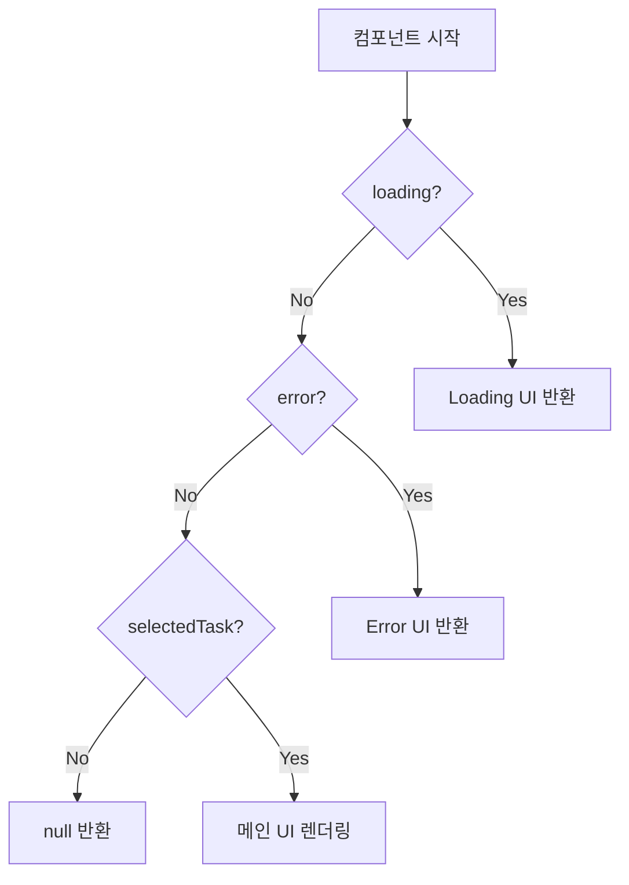
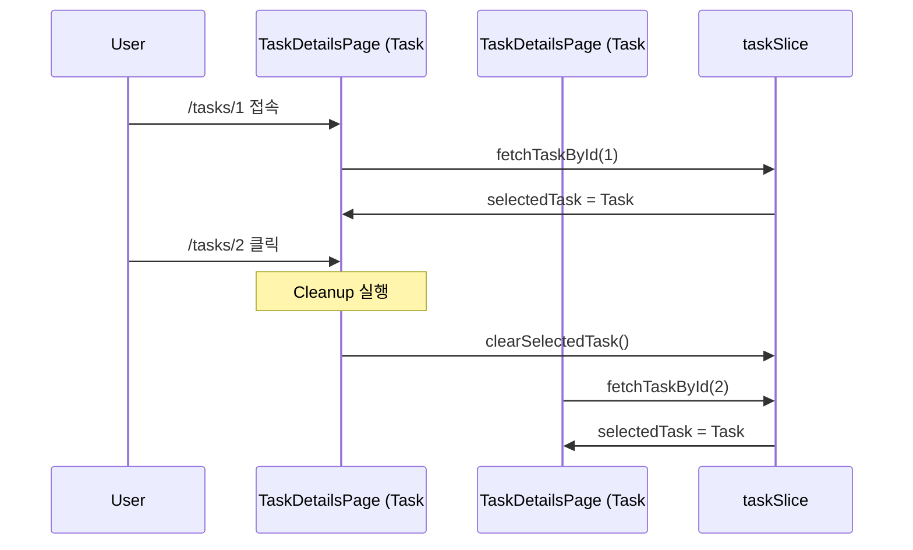

# Design Patterns: Task Details Page

## Overview

TaskDetailsPage 구현에 사용된 디자인 패턴과 아키텍처 원칙

---

## 1. Container/Presentational 패턴 (확장)

### TaskDetailsPage의 역할



### 현재 구조 vs 미래 리팩토링

```typescript
// 현재: 모든 것이 한 컴포넌트
const TaskDetailsPage = () => {
  // Container 로직
  const { id } = useParams();
  const dispatch = useAppDispatch();
  const { selectedTask, loading, error } = useAppSelector(...);

  // UI 렌더링
  return (
    <div>
      <StatusBadge status={selectedTask.status} />
      <UserAvatar user={selectedTask.assignedTo} />
      ...
    </div>
  );
};

// 미래: 분리된 구조 (필요시)
const TaskDetailsPage = () => {
  // Container 로직만
  return <TaskDetailsView task={selectedTask} ... />;
};

const TaskDetailsView = ({ task }: Props) => {
  // UI만
};
```

---

## 2. Strategy 패턴 (상태별 스타일)

### STATUS_COLORS 객체



### 코드

```typescript
const STATUS_COLORS: Record<TaskStatus, StyleConfig> = {
  ToDo: { bg: "#dfe1e6", text: "#5e6c84", label: "To Do" },
  Development: { bg: "#deebff", text: "#0052cc", label: "Development" },
  // ...
};

// 사용: switch/if 없이 직접 접근
const style = STATUS_COLORS[task.status];
```

### Strategy vs Switch 비교

```typescript
// ❌ Switch 문 (확장 어려움)
const getStyle = (status: TaskStatus) => {
  switch (status) {
    case "ToDo": return { bg: "gray", ... };
    case "Development": return { bg: "blue", ... };
    // 새 상태 추가 시 switch도 수정 필요
  }
};

// ✅ Strategy 패턴 (확장 용이)
const STATUS_COLORS: Record<TaskStatus, Style> = { ... };
// 새 상태 추가 시 객체에만 추가
```

---

## 3. Early Return 패턴

### 조건별 빠른 반환



### 코드

```typescript
const TaskDetailsPage = () => {
  // Early returns
  if (loading) {
    return <div>Loading...</div>;
  }

  if (error) {
    return <div className="text-red-500">{error}</div>;
  }

  if (!selectedTask) {
    return null;
  }

  // 메인 렌더링 (들여쓰기 최소화)
  return (
    <div>
      {/* 복잡한 UI */}
    </div>
  );
};
```

### 장점

| 장점 | 설명 |
|------|------|
| 가독성 | 조건 중첩 없음 |
| 타입 안전 | selectedTask가 확실히 존재 |
| 유지보수 | 각 조건 독립적 처리 |

---

## 4. Cleanup 패턴 (useEffect)

### 리소스 정리



### 코드

```typescript
useEffect(() => {
  // Setup: 데이터 로드
  if (id) {
    dispatch(fetchTaskById(Number(id)));
  }

  // Cleanup: 컴포넌트 언마운트 시
  return () => {
    dispatch(clearSelectedTask());
  };
}, [dispatch, id]);
```

### Cleanup이 없으면?

```
Task #1 상세 보기 → selectedTask = Task #1
Task #2 클릭 →
  1. Task #1 데이터가 잠깐 보임 (깜빡임)
  2. Task #2 로드 완료
  3. Task #2 표시

Cleanup 있으면:
Task #1 상세 → Task #2 클릭 →
  1. selectedTask = null (즉시)
  2. Loading 표시
  3. Task #2 로드 완료
  4. Task #2 표시
```

---

## 5. Compound Component 패턴 (Card 구조)

### 정보 카드 구조

```typescript
// 재사용 가능한 카드 구조
<div className="bg-white rounded-lg shadow p-6">
  <h3 className="text-sm font-medium text-gray-500 mb-2">
    {title}
  </h3>
  {children}
</div>
```

### 현재 구현

```typescript
{/* Status Card */}
<div className="bg-white rounded-lg shadow p-6">
  <h3 className="text-sm font-medium text-gray-500 mb-2">Status</h3>
  <StatusBadge status={selectedTask.status} />
</div>

{/* Assignee Card */}
<div className="bg-white rounded-lg shadow p-6">
  <h3 className="text-sm font-medium text-gray-500 mb-2">Assignee</h3>
  <UserDisplay user={selectedTask.assignedTo} />
</div>
```

### 미래 리팩토링 (선택사항)

```typescript
// 공통 InfoCard 컴포넌트
const InfoCard = ({ title, children }: Props) => (
  <div className="bg-white rounded-lg shadow p-6">
    <h3 className="text-sm font-medium text-gray-500 mb-2">{title}</h3>
    {children}
  </div>
);

// 사용
<InfoCard title="Status">
  <StatusBadge status={task.status} />
</InfoCard>
```

---

## 6. Avatar 패턴

### 이니셜 아바타

```typescript
// 사용자 이름의 첫 글자로 아바타 생성
<div className="w-8 h-8 rounded-full bg-blue-500 flex items-center justify-center text-white">
  {user.name.charAt(0).toUpperCase()}
</div>
```

### 색상 차별화

```typescript
// Assignee: 파란색
<div className="bg-blue-500">...</div>

// Reporter: 초록색
<div className="bg-green-500">...</div>
```

---

## 7. Two-Column Layout 패턴

### Grid 기반 레이아웃

```typescript
<div className="grid grid-cols-1 lg:grid-cols-3 gap-6">
  {/* Left: 2/3 */}
  <div className="lg:col-span-2">
    <DescriptionCard />
  </div>

  {/* Right: 1/3 */}
  <div>
    <StatusCard />
    <AssigneeCard />
    <ReporterCard />
    <DatesCard />
  </div>
</div>
```

### 반응형 동작

| 화면 크기 | 레이아웃 |
|----------|----------|
| Mobile (< lg) | 단일 컬럼 (세로 배치) |
| Desktop (≥ lg) | 2:1 비율 (가로 배치) |

---

## 8. Breadcrumb 네비게이션 패턴

### 현재 위치 표시

```
Board / Task #4
  │        │
  │        └─ 현재 페이지 (텍스트)
  └─ 링크 (클릭 가능)
```

### 구현

```typescript
<nav className="text-sm text-gray-500 mb-2">
  <Link to="/board" className="hover:text-blue-600">
    Board
  </Link>
  <span className="mx-2">/</span>
  <span className="text-gray-900">Task #{id}</span>
</nav>
```

---

## 9. 날짜 포맷팅 패턴

### toLocaleDateString 사용

```typescript
// ISO 문자열 → 로컬 날짜
{new Date(selectedTask.createdAt).toLocaleDateString()}
// "12/9/2025" (locale에 따라 다름)

// 더 상세한 포맷팅 (선택사항)
{new Date(selectedTask.createdAt).toLocaleDateString("en-US", {
  year: "numeric",
  month: "short",
  day: "numeric",
})}
// "Dec 9, 2025"
```

---

## 10. 핵심 패턴 요약

| 패턴 | 적용 위치 | 목적 |
|------|----------|------|
| Container/Presentational | TaskDetailsPage | 로직/UI 분리 |
| Strategy | STATUS_COLORS | 상태별 스타일 |
| Early Return | 로딩/에러 처리 | 가독성 향상 |
| Cleanup | useEffect return | 메모리 정리 |
| Two-Column | Grid layout | 반응형 레이아웃 |
| Breadcrumb | Navigation | 현재 위치 표시 |
| Avatar | User display | 시각적 식별 |
