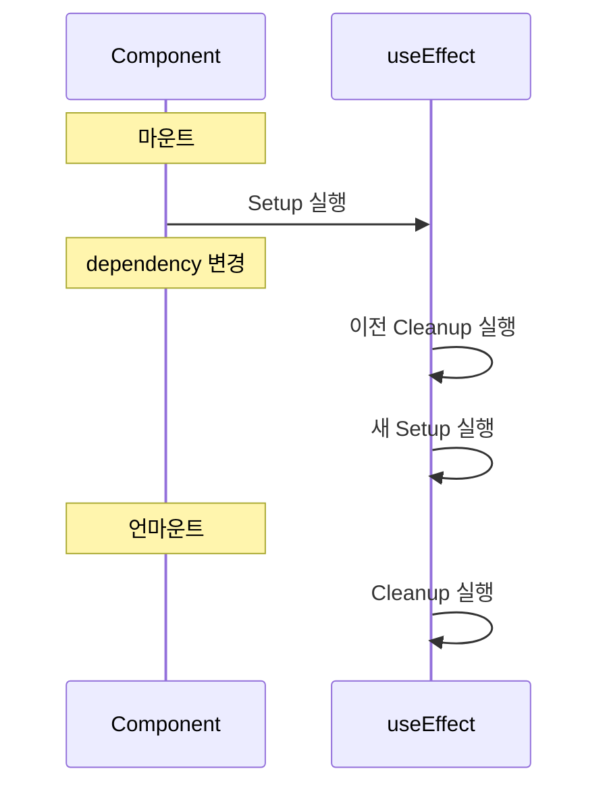

# Programming Concepts: Task Details Page

## Overview

TaskDetailsPage 구현에서 배울 수 있는 JavaScript/TypeScript 프로그래밍 개념

---

## 1. 타입 변환 (Type Conversion)

### String → Number

```typescript
const { id } = useParams<{ id: string }>();  // id는 항상 string

// 방법 1: Number() 함수
const taskId = Number(id);  // "42" → 42

// 방법 2: parseInt()
const taskId = parseInt(id, 10);  // "42" → 42

// 방법 3: 단항 + 연산자
const taskId = +id;  // "42" → 42
```

### 차이점

| 방법 | `"42"` | `"42.5"` | `"42px"` | `""` | `undefined` |
|------|--------|----------|----------|------|-------------|
| `Number()` | 42 | 42.5 | NaN | 0 | NaN |
| `parseInt()` | 42 | 42 | 42 | NaN | NaN |
| `+` | 42 | 42.5 | NaN | 0 | NaN |

**권장:** `Number()`가 가장 명시적이고 읽기 쉬움

---

## 2. 날짜 포맷팅

### Date 객체 생성

```typescript
// ISO 문자열에서 Date 생성
const date = new Date("2025-12-09T10:30:00Z");
```

### toLocaleDateString()

```typescript
// 기본: 브라우저 로케일 사용
date.toLocaleDateString();
// 결과: "12/9/2025" (US) 또는 "2025. 12. 9." (KR)

// 로케일 지정
date.toLocaleDateString("en-US");  // "12/9/2025"
date.toLocaleDateString("ko-KR");  // "2025. 12. 9."

// 옵션으로 포맷 지정
date.toLocaleDateString("en-US", {
  year: "numeric",
  month: "short",
  day: "numeric",
});
// "Dec 9, 2025"

date.toLocaleDateString("en-US", {
  year: "numeric",
  month: "long",
  day: "numeric",
  weekday: "long",
});
// "Tuesday, December 9, 2025"
```

### 다른 메서드들

```typescript
const date = new Date("2025-12-09T10:30:00Z");

date.toLocaleString();      // "12/9/2025, 10:30:00 AM"
date.toLocaleTimeString();  // "10:30:00 AM"
date.toISOString();         // "2025-12-09T10:30:00.000Z"
date.toDateString();        // "Tue Dec 09 2025"
```

---

## 3. 문자열 메서드

### charAt()과 toUpperCase()

```typescript
const name = "john doe";

// 첫 글자 추출
name.charAt(0);  // "j"

// 대문자로 변환
name.charAt(0).toUpperCase();  // "J"

// 아바타 이니셜 생성
const initial = name.charAt(0).toUpperCase();  // "J"
```

### 대안: 배열 인덱스 접근

```typescript
// 배열처럼 접근 (동일 결과)
name[0];  // "j"
name[0].toUpperCase();  // "J"

// 차이점
"".charAt(0);  // "" (빈 문자열)
""[0];         // undefined
```

**권장:** `charAt()`이 안전함 (undefined 대신 빈 문자열 반환)

---

## 4. 조건부 렌더링과 Nullish 처리

### 옵셔널 체이닝 (?.)

```typescript
// assignedTo가 null일 수 있음
interface Task {
  assignedTo: User | null;
}

// 안전한 접근
selectedTask.assignedTo?.name;  // null이면 undefined
selectedTask.assignedTo?.email;
```

### 조건부 렌더링

```typescript
{/* 방법 1: && 연산자 */}
{selectedTask.assignedTo && (
  <div>{selectedTask.assignedTo.name}</div>
)}

{/* 방법 2: 삼항 연산자 */}
{selectedTask.assignedTo ? (
  <div>{selectedTask.assignedTo.name}</div>
) : (
  <span>Unassigned</span>
)}
```

---

## 5. useEffect Cleanup 함수

### 기본 구조

```typescript
useEffect(() => {
  // Setup: 마운트 시 또는 의존성 변경 시 실행
  console.log("Setup");

  // Cleanup: 언마운트 시 또는 다음 실행 전에 호출
  return () => {
    console.log("Cleanup");
  };
}, [dependency]);
```

### 실행 순서



### TaskDetailsPage에서의 활용

```typescript
useEffect(() => {
  // 1. 데이터 로드
  if (id) {
    dispatch(fetchTaskById(Number(id)));
  }

  // 2. Cleanup: 이전 데이터 정리
  return () => {
    dispatch(clearSelectedTask());
  };
}, [dispatch, id]);

// 시나리오: /tasks/1 → /tasks/2 이동
// 1. id=1의 Cleanup 실행 (clearSelectedTask)
// 2. id=2의 Setup 실행 (fetchTaskById(2))
```

---

## 6. Generic 타입과 useParams

### useParams 타입 지정

```typescript
// 방법 1: 인라인 제네릭
const { id } = useParams<{ id: string }>();

// 방법 2: Record 유틸리티 타입
const params = useParams<Record<string, string>>();

// 방법 3: 커스텀 타입
interface TaskParams {
  id: string;
}
const { id } = useParams<TaskParams>();
```

### 반환 타입

```typescript
// useParams의 반환 타입
type Params = {
  [key: string]: string | undefined;
};

// 따라서 id는 string | undefined
const { id } = useParams<{ id: string }>();
// id: string | undefined

// 사용 시 체크 필요
if (id) {
  dispatch(fetchTaskById(Number(id)));
}
```

---

## 7. CSS-in-JS: Inline Styles

### style 속성 사용

```typescript
// 동적 스타일링
<span
  style={{
    backgroundColor: statusColor.bg,
    color: statusColor.text,
  }}
>
  {statusColor.label}
</span>
```

### Tailwind vs Inline Style

```typescript
// Tailwind: 정적 클래스 (빌드 타임)
<span className="bg-blue-500 text-white">...</span>

// Inline: 동적 값 (런타임)
<span style={{ backgroundColor: dynamicColor }}>...</span>

// 혼합 사용 (권장)
<span
  className="px-3 py-1 rounded-full text-sm font-medium"
  style={{ backgroundColor: statusColor.bg, color: statusColor.text }}
>
  {statusColor.label}
</span>
```

---

## 8. React Fragment

### Fragment 사용 이유

```typescript
// ❌ 불필요한 div 래퍼
return (
  <div>
    <Header />
    <Content />
  </div>
);

// ✅ Fragment (DOM에 추가 요소 없음)
return (
  <>
    <Header />
    <Content />
  </>
);
```

### ProtectedRoute에서의 사용

```typescript
const ProtectedRoute = ({ children }: Props) => {
  if (!token) {
    return <Navigate to="/login" replace />;
  }

  // Fragment로 children 래핑
  return <>{children}</>;
};
```

---

## 9. whitespace-pre-wrap

### 텍스트 줄바꿈 보존

```typescript
// Description에 줄바꿈이 포함된 경우
const description = "Line 1\nLine 2\nLine 3";

// 기본: 줄바꿈 무시
<p>{description}</p>
// 결과: "Line 1 Line 2 Line 3"

// whitespace-pre-wrap: 줄바꿈 보존
<p className="whitespace-pre-wrap">{description}</p>
// 결과:
// Line 1
// Line 2
// Line 3
```

### whitespace 옵션들

| 값 | 공백 | 줄바꿈 | 자동 줄바꿈 |
|----|------|--------|------------|
| `normal` | 합침 | 무시 | O |
| `nowrap` | 합침 | 무시 | X |
| `pre` | 보존 | 보존 | X |
| `pre-wrap` | 보존 | 보존 | O |
| `pre-line` | 합침 | 보존 | O |

---

## 10. 핵심 개념 요약

| 개념 | 용도 | 예시 |
|------|------|------|
| `Number()` | 문자열→숫자 변환 | `Number("42")` |
| `toLocaleDateString()` | 날짜 포맷팅 | `date.toLocaleDateString()` |
| `charAt(0)` | 첫 글자 추출 | `name.charAt(0)` |
| `toUpperCase()` | 대문자 변환 | `"a".toUpperCase()` |
| useEffect Cleanup | 리소스 정리 | `return () => {...}` |
| `useParams<T>()` | URL 파라미터 타입 | `useParams<{id: string}>()` |
| Inline style | 동적 스타일 | `style={{color: var}}` |
| `whitespace-pre-wrap` | 줄바꿈 보존 | 여러 줄 텍스트 표시 |
