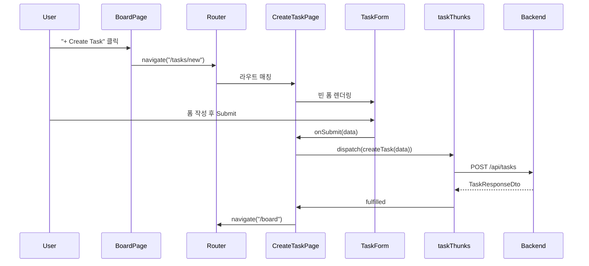
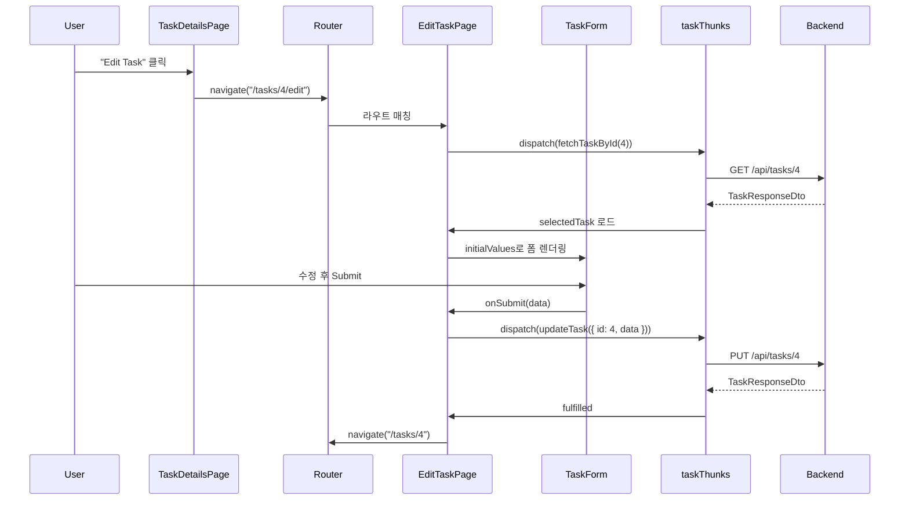
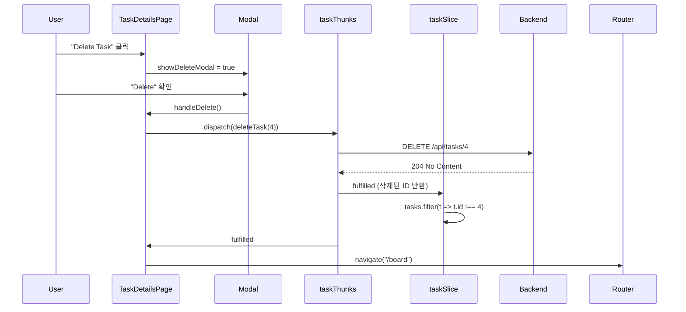

# Task CRUD Frontend Implementation Plan

## Overview

Stories #37-43: Frontend에서 Task CRUD 기능 구현
- Story #37 (Task #38, #39): Create Task
- Story #40 (Task #41): Update Task
- Story #42 (Task #43): Delete Task

---

## 현재 구현 상태

| 항목 | 상태 | 설명 |
|------|------|------|
| api.types.ts (DTO 추가) | ✅ 완료 | CreateTaskRequestDto, UpdateTaskRequestDto |
| taskService.ts | ✅ 완료 | createTask, updateTask, deleteTask |
| taskThunks.ts | ✅ 완료 | 3개 async thunks |
| taskSlice.ts | ✅ 완료 | extraReducers 추가 |
| TaskForm.tsx | ✅ 완료 | 재사용 가능한 폼 컴포넌트 |
| CreateTaskPage.tsx | ✅ 완료 | /tasks/new 라우트 |
| EditTaskPage.tsx | ✅ 완료 | /tasks/:id/edit 라우트 |
| TaskDetailsPage.tsx | ✅ 완료 | Edit/Delete 버튼 + 삭제 확인 모달 |
| BoardPage.tsx | ✅ 완료 | "+ Create Task" 버튼 |
| AppRouter.tsx | ✅ 완료 | 새 라우트 추가 |
| index.ts | ✅ 완료 | Export 업데이트 |

---

## File Structure

```
src/features/task/
├── components/
│   └── TaskForm.tsx           ← 신규 생성 (Presentational)
├── pages/
│   ├── BoardPage.tsx          ← + Create Task 버튼 추가
│   ├── TaskDetailsPage.tsx    ← Edit/Delete 버튼 + 모달 추가
│   ├── CreateTaskPage.tsx     ← 신규 생성 (Container)
│   └── EditTaskPage.tsx       ← 신규 생성 (Container)
├── store/
│   ├── taskSlice.ts           ← extraReducers 추가
│   └── taskThunks.ts          ← createTask, updateTask, deleteTask
├── services/
│   └── taskService.ts         ← API 메서드 추가
├── types/
│   └── api.types.ts           ← Request DTO 추가
└── index.ts                   ← Export 업데이트

src/router/
└── AppRouter.tsx              ← /tasks/new, /tasks/:id/edit 라우트
```

---

## CRUD Operations Flow

### Create Task



### Update Task



### Delete Task



---

## Authorization Flow

```typescript
// TaskDetailsPage.tsx
const canModify = user?.id === selectedTask?.createdBy.id || user?.role === "Admin";

// EditTaskPage.tsx
if (!canModify) {
  return <Navigate to={`/tasks/${id}`} replace />;
}
```

**권한 체크:**
- Creator: Task를 생성한 사용자
- Admin: 모든 Task 수정/삭제 가능

---

## Checklist

- [x] Add CreateTaskRequestDto, UpdateTaskRequestDto to api.types.ts
- [x] Add createTask, updateTask, deleteTask to taskService.ts
- [x] Add createTask, updateTask, deleteTask thunks
- [x] Add extraReducers for CRUD operations in taskSlice.ts
- [x] Create TaskForm.tsx (reusable form component)
- [x] Create CreateTaskPage.tsx (/tasks/new)
- [x] Create EditTaskPage.tsx (/tasks/:id/edit)
- [x] Add Edit/Delete buttons to TaskDetailsPage
- [x] Add delete confirmation modal
- [x] Add "+ Create Task" button to BoardPage header
- [x] Add routes to AppRouter.tsx
- [x] Update index.ts exports
- [x] Test Create, Update, Delete operations

---

## Related Documentation

- [01-reusable-form-pattern.md](./01-reusable-form-pattern.md) - 재사용 가능한 폼 패턴
- [02-design-patterns.md](./02-design-patterns.md) - 디자인 패턴
- [03-programming-concepts.md](./03-programming-concepts.md) - 프로그래밍 개념
