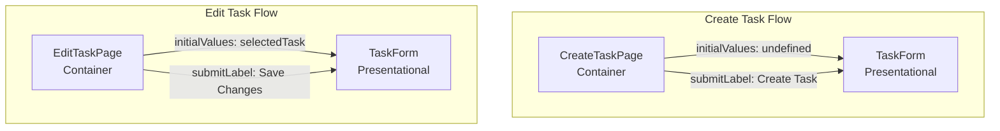

# Reusable Form Pattern

## Overview

TaskForm 컴포넌트를 Create와 Edit에서 재사용하는 패턴

---

## Props Interface

```typescript
interface TaskFormProps {
  initialValues?: {
    title: string;
    description: string;
    status: TaskStatus;
  };
  onSubmit: (data: CreateTaskRequestDto | UpdateTaskRequestDto) => Promise<void>;
  onCancel: () => void;
  isLoading?: boolean;
  submitLabel?: string;  // "Create Task" or "Save Changes"
}
```

**왜 이렇게 설계했나?**

| Props | 목적 |
|-------|------|
| `initialValues` | Edit 시 기존 값 세팅, Create 시 undefined |
| `onSubmit` | 부모가 결정하는 제출 로직 |
| `onCancel` | 부모가 결정하는 취소 로직 |
| `isLoading` | 제출 중 버튼 비활성화 |
| `submitLabel` | 버튼 텍스트 커스터마이징 |

---

## Container vs Presentational



### Container 역할

```typescript
// CreateTaskPage.tsx (Container)
const CreateTaskPage = () => {
  const dispatch = useAppDispatch();
  const navigate = useNavigate();
  const { loading } = useAppSelector((state) => state.task);

  const handleSubmit = async (data: CreateTaskRequestDto) => {
    const result = await dispatch(createTask(data));
    if (createTask.fulfilled.match(result)) {
      navigate("/board");
    }
  };

  return (
    <TaskForm
      onSubmit={handleSubmit}
      onCancel={() => navigate("/board")}
      isLoading={loading}
      submitLabel="Create Task"
    />
  );
};
```

### Presentational 역할

```typescript
// TaskForm.tsx (Presentational)
const TaskForm = ({ initialValues, onSubmit, onCancel, isLoading, submitLabel }: TaskFormProps) => {
  // 로컬 상태만 관리
  const [formData, setFormData] = useState({
    title: initialValues?.title ?? "",
    description: initialValues?.description ?? "",
    status: initialValues?.status ?? "ToDo",
  });

  // Redux 직접 사용 안 함
  // 부모에게 데이터만 전달
  const handleSubmit = (e: React.FormEvent) => {
    e.preventDefault();
    onSubmit(formData);
  };

  return <form onSubmit={handleSubmit}>...</form>;
};
```

---

## Default Values Pattern

```typescript
// Create 시: initialValues가 undefined
// Edit 시: initialValues가 전달됨

const [formData, setFormData] = useState({
  title: initialValues?.title ?? "",
  description: initialValues?.description ?? "",
  status: initialValues?.status ?? "ToDo",
});
```

### Nullish Coalescing (`??`) vs OR (`||`)

```typescript
// ?? : null 또는 undefined일 때만 기본값
// || : falsy 값(0, "", false)일 때도 기본값

// 문제 상황: description이 빈 문자열이면?
description: initialValues?.description || "default"  // ❌ "default" 반환
description: initialValues?.description ?? ""         // ✅ "" 반환 (정상)

// 숫자 0인 경우
count: initialValues?.count || 10  // ❌ 0이면 10 반환
count: initialValues?.count ?? 10  // ✅ 0이면 0 반환
```

---

## Form Validation

```typescript
const handleSubmit = async (e: React.FormEvent) => {
  e.preventDefault();

  // 1. 클라이언트 측 유효성 검사
  if (!formData.title.trim()) {
    setError("Title is required");
    return;
  }

  if (formData.title.length > 200) {
    setError("Title cannot exceed 200 characters");
    return;
  }

  // 2. 유효성 통과 시 제출
  await onSubmit({
    title: formData.title.trim(),
    description: formData.description.trim() || null,
    status: formData.status,
  });
};
```

### Backend DTO와 일치

```csharp
// CreateTaskRequestDto.cs
[Required(ErrorMessage = "Title is required")]
[MaxLength(200, ErrorMessage = "Title cannot exceed 200 characters")]
public string Title { get; set; }
```

**Frontend와 Backend 동일한 검증 규칙:**
- Title 필수
- Title 최대 200자
- Description 선택 (null 가능)

---

## Action Result Pattern

```typescript
// CreateTaskPage.tsx
const handleSubmit = async (data: CreateTaskRequestDto) => {
  const result = await dispatch(createTask(data));

  // Action 결과 확인
  if (createTask.fulfilled.match(result)) {
    navigate("/board");  // 성공 시 이동
  }
  // 실패 시: thunk에서 error 상태 업데이트됨
};
```

### `.match()` vs `.unwrap()`

| 방법 | 특징 |
|------|------|
| `.match()` | 조건문으로 분기, 예외 없음 |
| `.unwrap()` | 실패 시 예외, try-catch 필요 |

```typescript
// .match() 방식
const result = await dispatch(createTask(data));
if (createTask.fulfilled.match(result)) {
  // 성공 처리
}

// .unwrap() 방식
try {
  const task = await dispatch(createTask(data)).unwrap();
  navigate("/board");
} catch (error) {
  // 에러 처리
}
```

---

## 재사용 장점

### 1. 코드 중복 제거

```
Before (중복)              After (재사용)
┌─────────────────┐       ┌─────────────────┐
│ CreateTaskPage  │       │ CreateTaskPage  │
│ ┌─────────────┐ │       │                 │
│ │ Form Logic  │ │       │      ┌──────────┴──────────┐
│ │ Validation  │ │       │      │                     │
│ │ UI          │ │       │      ▼                     │
│ └─────────────┘ │       │ ┌─────────────────────────┐│
└─────────────────┘       │ │      TaskForm           ││
                          │ │ - Form Logic            ││
┌─────────────────┐       │ │ - Validation            ││
│ EditTaskPage    │       │ │ - UI                    ││
│ ┌─────────────┐ │       │ └─────────────────────────┘│
│ │ Form Logic  │ │       │      ▲                     │
│ │ Validation  │ │ ──▶   │      │                     │
│ │ UI          │ │       │ ┌────┴───────────────────┐ │
│ └─────────────┘ │       │ │ EditTaskPage           │ │
└─────────────────┘       │ └────────────────────────┘ │
                          └───────────────────────────┘
```

### 2. 일관성

- 동일한 UI 스타일
- 동일한 유효성 검사
- 동일한 에러 처리

### 3. 유지보수

- 폼 로직 변경 시 한 곳만 수정
- 버그 수정이 양쪽에 적용

---

## 핵심 요약

| 개념 | 설명 |
|------|------|
| Container | Redux 연결, 비즈니스 로직 |
| Presentational | UI, 로컬 상태, Props만 사용 |
| `initialValues` | Create는 undefined, Edit는 기존 값 |
| `??` (Nullish) | null/undefined만 체크 |
| `.match()` | Action 결과 확인 |
