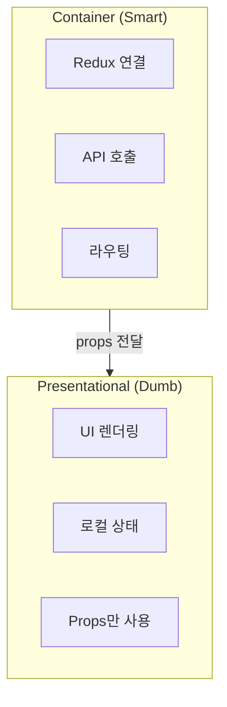
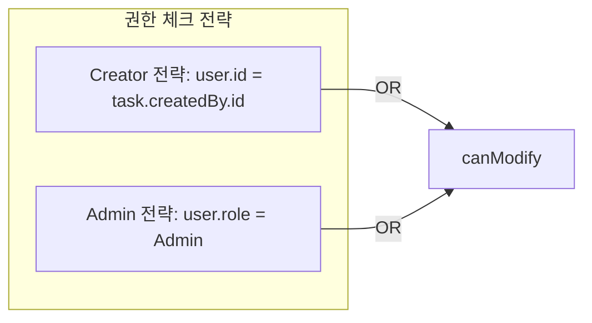
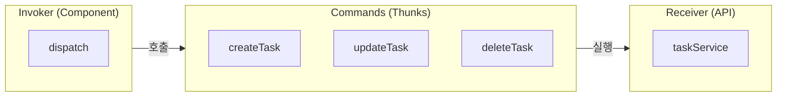
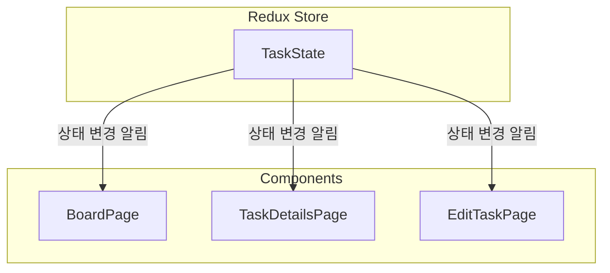
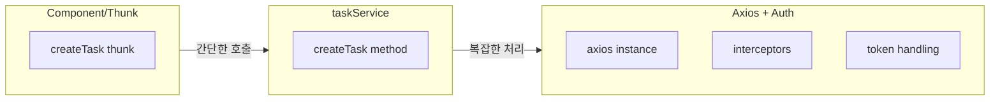
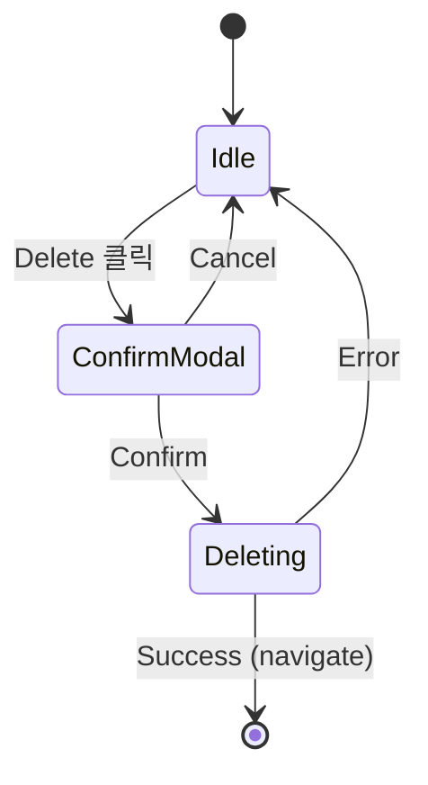
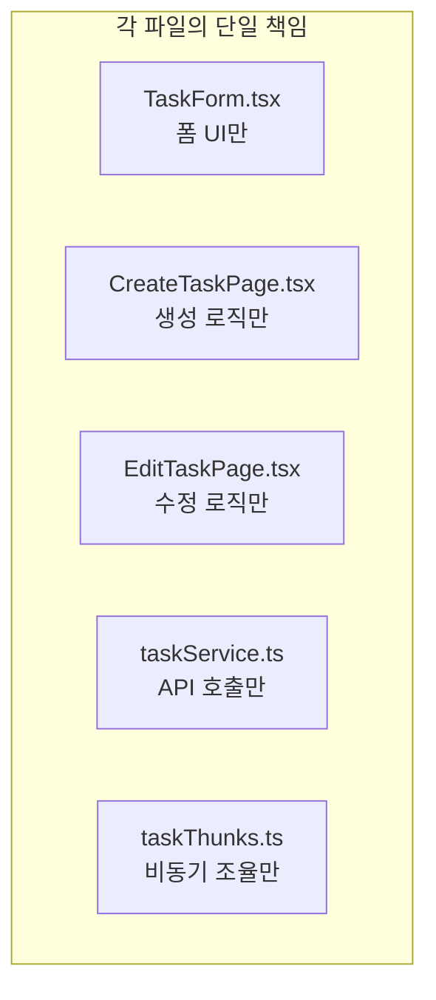

# Design Patterns: Task CRUD

## Overview

Task CRUD 구현에 사용된 디자인 패턴과 SOLID 원칙

---

## 1. Container/Presentational 패턴

### 개념



### 구현 예시

```typescript
// Container: CreateTaskPage.tsx
const CreateTaskPage = () => {
  const dispatch = useAppDispatch();      // Redux 연결
  const navigate = useNavigate();         // 라우팅

  const handleSubmit = async (data) => {
    const result = await dispatch(createTask(data));  // API 호출
    if (createTask.fulfilled.match(result)) {
      navigate("/board");
    }
  };

  return <TaskForm onSubmit={handleSubmit} />;  // Presentational에 위임
};

// Presentational: TaskForm.tsx
const TaskForm = ({ onSubmit, onCancel }: Props) => {
  const [formData, setFormData] = useState({});  // 로컬 상태만

  return (
    <form onSubmit={handleSubmit}>
      {/* UI 렌더링만 담당 */}
    </form>
  );
};
```

### 장점

| 장점 | 설명 |
|------|------|
| 관심사 분리 | 데이터 로직과 UI 분리 |
| 테스트 용이 | TaskForm은 props만으로 테스트 |
| 재사용성 | Create와 Edit에서 TaskForm 공유 |

---

## 2. Strategy 패턴

### 개념

런타임에 알고리즘(전략)을 선택하는 패턴

### Authorization 전략



```typescript
// 권한에 따라 다른 UI 전략
const canModify = user?.id === selectedTask?.createdBy.id || user?.role === "Admin";

{canModify && <EditButton />}    // 전략에 따라 표시/숨김
{canModify && <DeleteButton />}
```

### 폼 초기값 전략

```typescript
// Create 전략: 빈 값
<TaskForm initialValues={undefined} submitLabel="Create Task" />

// Edit 전략: 기존 값
<TaskForm
  initialValues={{
    title: selectedTask.title,
    description: selectedTask.description,
    status: selectedTask.status,
  }}
  submitLabel="Save Changes"
/>
```

---

## 3. Command 패턴 (Redux Thunk)

### 개념



### 구현

```typescript
// Command 정의 (thunk)
export const createTask = createAsyncThunk(
  "task/createTask",
  async (data: CreateTaskRequestDto) => {
    return await taskService.createTask(data);  // Receiver 호출
  }
);

// Invoker (Component)
dispatch(createTask(data));  // Command 실행
```

### 장점

- 각 작업을 독립적인 객체로 캡슐화
- 추가 기능 (로깅, 취소) 쉽게 추가
- 일관된 비동기 처리 패턴

---

## 4. Observer 패턴 (Redux)

### 개념



### 구현

```typescript
// Subject: taskSlice
builder.addCase(createTask.fulfilled, (state, action) => {
  state.tasks.unshift(action.payload);  // 상태 변경
});

// Observer: Component
const { tasks } = useAppSelector(state => state.task);
// tasks 변경 시 자동 re-render (Observer 알림)
```

---

## 5. Facade 패턴 (taskService)

### 개념

복잡한 서브시스템을 간단한 인터페이스로 감싸는 패턴



### 구현

```typescript
// Facade: taskService
export const taskService = {
  createTask: async (data: CreateTaskRequestDto): Promise<TaskResponseDto> => {
    const response = await api.post("/tasks", data);  // 복잡성 숨김
    return response.data;
  },
};

// Client: thunk
const result = await taskService.createTask(data);  // 간단하게 사용
```

### 장점

- Component는 HTTP 세부사항 몰라도 됨
- 인터셉터, 에러 처리 등 일괄 적용
- API 변경 시 Facade만 수정

---

## 6. Modal State Machine 패턴

### 개념



### 구현

```typescript
const [showDeleteModal, setShowDeleteModal] = useState(false);  // Idle <-> ConfirmModal
const [isDeleting, setIsDeleting] = useState(false);           // Deleting 상태

const handleDelete = async () => {
  setIsDeleting(true);  // → Deleting 상태
  const result = await dispatch(deleteTask(id));

  if (deleteTask.fulfilled.match(result)) {
    navigate("/board");  // Success → 종료
  } else {
    setIsDeleting(false);       // Error → Idle로
    setShowDeleteModal(false);
  }
};
```

---

## 7. SOLID 원칙 적용

### S - Single Responsibility



### O - Open/Closed

```typescript
// TaskForm은 확장에 열림 (다양한 initialValues)
// 수정에 닫힘 (TaskForm 코드 변경 불필요)

<TaskForm initialValues={undefined} />  // Create 확장
<TaskForm initialValues={task} />       // Edit 확장
```

### L - Liskov Substitution

```typescript
// CreateTaskRequestDto와 UpdateTaskRequestDto 호환
interface CreateTaskRequestDto {
  title: string;
  description?: string | null;
  status: TaskStatus;
}

interface UpdateTaskRequestDto {
  title: string;
  description?: string | null;
  status: TaskStatus;
}

// 동일 구조 → TaskForm에서 둘 다 처리 가능
```

### I - Interface Segregation

```typescript
// TaskForm은 필요한 것만 받음
interface TaskFormProps {
  initialValues?: FormValues;  // 필요한 것만
  onSubmit: (data) => void;
  onCancel: () => void;
  // dispatch, navigate 등 불필요한 것 X
}
```

### D - Dependency Inversion

```typescript
// TaskForm은 구체적인 dispatch에 의존하지 않음
// 추상화된 onSubmit에 의존

const TaskForm = ({ onSubmit }: Props) => {
  // onSubmit이 뭘 하는지 모름
  // 그냥 호출만 함
};

// Container가 구현 결정
<TaskForm onSubmit={async (data) => {
  await dispatch(createTask(data));
}} />
```

---

## 8. 핵심 패턴 요약

| 패턴 | 적용 위치 | 목적 |
|------|----------|------|
| Container/Presentational | Pages + TaskForm | 로직/UI 분리 |
| Strategy | canModify, initialValues | 런타임 전략 선택 |
| Command | Redux Thunks | 작업 캡슐화 |
| Observer | Redux + useSelector | 상태 변경 구독 |
| Facade | taskService | 복잡성 숨김 |
| State Machine | Delete Modal | 상태 전이 관리 |
