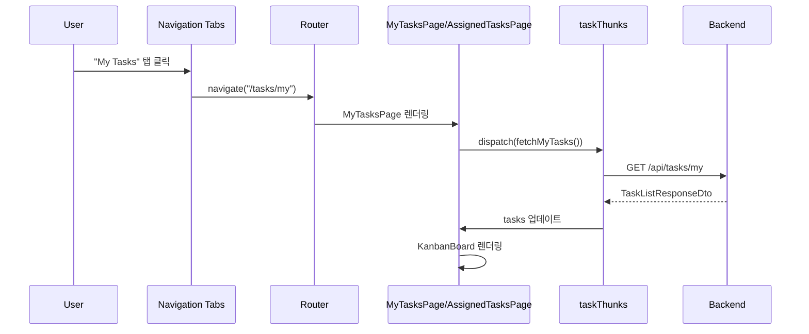

# My Tasks & Assigned Tasks Implementation Plan

## Overview

Stories #44-45: My Tasks와 Assigned Tasks 페이지 구현
- Story #44: My Tasks and Assigned Tasks
- Task #45: Create MyTasksPage and AssignedTasksPage

---

## 현재 구현 상태

| 항목 | 상태 | 설명 |
|------|------|------|
| taskService (getMyTasks, getAssignedTasks) | ✅ 완료 | 이전에 구현됨 |
| fetchMyTasks thunk | ✅ 완료 | taskThunks.ts |
| fetchAssignedTasks thunk | ✅ 완료 | taskThunks.ts |
| taskSlice extraReducers | ✅ 완료 | 새 thunks 처리 |
| MyTasksPage.tsx | ✅ 완료 | /tasks/my |
| AssignedTasksPage.tsx | ✅ 완료 | /tasks/assigned |
| Navigation Tabs | ✅ 완료 | BoardPage, MyTasksPage, AssignedTasksPage |
| AppRouter 라우트 | ✅ 완료 | /tasks/my, /tasks/assigned |
| index.ts exports | ✅ 완료 | 새 페이지 및 thunks |

---

## File Structure

```
src/features/task/
├── pages/
│   ├── BoardPage.tsx           ← Navigation tabs 추가
│   ├── MyTasksPage.tsx         ← 신규 생성
│   └── AssignedTasksPage.tsx   ← 신규 생성
├── store/
│   ├── taskSlice.ts            ← extraReducers 추가
│   └── taskThunks.ts           ← fetchMyTasks, fetchAssignedTasks 추가
└── index.ts                    ← exports 업데이트

src/router/
└── AppRouter.tsx               ← /tasks/my, /tasks/assigned 라우트 추가
```

---

## Data Flow



---

## Navigation Tabs Design

```
┌──────────────────────────────────────────────────────────────────┐
│ Task Board  [All Tasks] [My Tasks] [Assigned to Me]  + Create   │
└──────────────────────────────────────────────────────────────────┘
              ↑ Active tab has blue background
```

### Active State Logic

```typescript
const isActive = (path: string) => location.pathname === path;

<button className={isActive("/board") ? "bg-blue-100 text-blue-700" : "text-gray-600"}>
  All Tasks
</button>
```

---

## Route Order (중요!)

```typescript
// ✅ 올바른 순서: 구체적인 경로가 먼저
<Route path="/tasks/new" />
<Route path="/tasks/my" />        // "my"가 :id로 인식되지 않음
<Route path="/tasks/assigned" />  // "assigned"가 :id로 인식되지 않음
<Route path="/tasks/:id" />       // 마지막에 dynamic route
<Route path="/tasks/:id/edit" />
```

```typescript
// ❌ 잘못된 순서: :id가 모든 것을 catch
<Route path="/tasks/:id" />       // "my", "assigned"도 :id로 인식!
<Route path="/tasks/my" />        // 절대 도달 안 함
```

---

## API Endpoints

| Endpoint | 설명 | 필터 |
|----------|------|------|
| `GET /api/tasks` | 전체 태스크 | 없음 |
| `GET /api/tasks/my` | 내가 생성한 태스크 | CreatedBy = currentUser |
| `GET /api/tasks/assigned` | 나에게 할당된 태스크 | AssignedTo = currentUser |

---

## Checklist

- [x] Add fetchMyTasks thunk to taskThunks.ts
- [x] Add fetchAssignedTasks thunk to taskThunks.ts
- [x] Add extraReducers in taskSlice.ts
- [x] Create MyTasksPage.tsx
- [x] Create AssignedTasksPage.tsx
- [x] Add navigation tabs to BoardPage
- [x] Add navigation tabs to MyTasksPage
- [x] Add navigation tabs to AssignedTasksPage
- [x] Add routes to AppRouter.tsx (correct order!)
- [x] Update index.ts exports
- [x] Test all three pages

---

## Related Documentation

- [01-navigation-tabs-pattern.md](./01-navigation-tabs-pattern.md) - Navigation Tabs 패턴
