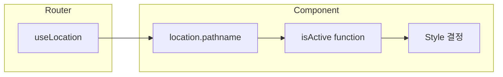

# Navigation Tabs Pattern

## Overview

여러 페이지에서 동일한 Navigation Tabs를 구현하는 패턴

---

## 1. Active State with useLocation

### 개념



### 구현

```typescript
import { useLocation, useNavigate } from "react-router-dom";

const MyTasksPage = () => {
  const navigate = useNavigate();
  const location = useLocation();

  // 현재 경로와 비교하여 active 상태 결정
  const isActive = (path: string) => location.pathname === path;

  return (
    <nav className="flex gap-1">
      <button
        onClick={() => navigate("/board")}
        className={`px-3 py-1 text-sm rounded ${
          isActive("/board")
            ? "bg-blue-100 text-blue-700"    // Active 스타일
            : "text-gray-600 hover:bg-gray-100"  // Inactive 스타일
        }`}
      >
        All Tasks
      </button>
      {/* ... 다른 탭들 */}
    </nav>
  );
};
```

---

## 2. Tab Configuration Object

### 반복 코드 줄이기

```typescript
// 탭 설정을 객체로 정의
const TABS = [
  { path: "/board", label: "All Tasks" },
  { path: "/tasks/my", label: "My Tasks" },
  { path: "/tasks/assigned", label: "Assigned to Me" },
];

// map으로 렌더링
{TABS.map((tab) => (
  <button
    key={tab.path}
    onClick={() => navigate(tab.path)}
    className={`px-3 py-1 text-sm rounded ${
      isActive(tab.path)
        ? "bg-blue-100 text-blue-700"
        : "text-gray-600 hover:bg-gray-100"
    }`}
  >
    {tab.label}
  </button>
))}
```

---

## 3. 코드 중복 문제

### 현재 상태

```
BoardPage.tsx         → Navigation Tabs (복사)
MyTasksPage.tsx       → Navigation Tabs (복사)
AssignedTasksPage.tsx → Navigation Tabs (복사)
```

### 개선 방법 (향후)

**Option 1: Layout Component**
```typescript
// TaskBoardLayout.tsx
const TaskBoardLayout = ({ children, activeTab }) => (
  <div>
    <Header>
      <NavigationTabs activeTab={activeTab} />
    </Header>
    <main>{children}</main>
  </div>
);

// 사용
<TaskBoardLayout activeTab="/board">
  <KanbanBoard {...props} />
</TaskBoardLayout>
```

**Option 2: Custom Hook**
```typescript
// useNavigationTabs.ts
const useNavigationTabs = () => {
  const location = useLocation();
  const navigate = useNavigate();

  const isActive = (path: string) => location.pathname === path;

  return { isActive, navigate };
};
```

---

## 4. Route Order 중요성

### 문제 상황

```typescript
// React Router는 위에서 아래로 매칭
<Route path="/tasks/:id" />       // :id = "my" 로 매칭됨!
<Route path="/tasks/my" />        // 도달 불가
```

### 해결: 구체적인 경로 먼저

```typescript
<Route path="/tasks/new" />       // 1. new
<Route path="/tasks/my" />        // 2. my
<Route path="/tasks/assigned" /> // 3. assigned
<Route path="/tasks/:id" />       // 4. 나머지 숫자 ID
<Route path="/tasks/:id/edit" /> // 5. edit
```

### 매칭 순서

| URL | 매칭 Route |
|-----|-----------|
| `/tasks/new` | `/tasks/new` |
| `/tasks/my` | `/tasks/my` |
| `/tasks/assigned` | `/tasks/assigned` |
| `/tasks/123` | `/tasks/:id` (id=123) |
| `/tasks/123/edit` | `/tasks/:id/edit` |

---

## 5. Thunk 재사용 패턴

### 동일한 패턴의 Thunks

```typescript
// fetchTasks, fetchMyTasks, fetchAssignedTasks 모두 동일한 패턴
export const fetchMyTasks = createAsyncThunk(
  "task/fetchMyTasks",
  async (params: TaskQueryParams | undefined, { rejectWithValue }) => {
    try {
      const response = await taskService.getMyTasks(params);
      return response;
    } catch (error) {
      // 에러 처리
    }
  }
);
```

### extraReducers도 동일 패턴

```typescript
// 세 가지 fetch 모두 같은 state 업데이트 로직
.addCase(fetchMyTasks.fulfilled, (state, action) => {
  state.loading = false;
  state.tasks = action.payload.data;
  state.totalCount = action.payload.totalCount;
  state.page = action.payload.page;
  state.pageSize = action.payload.pageSize;
})
```

---

## 6. 핵심 요약

| 개념 | 설명 |
|------|------|
| `useLocation` | 현재 URL 경로 가져오기 |
| `isActive(path)` | 현재 경로와 비교하여 active 상태 결정 |
| Route Order | 구체적인 경로가 dynamic route보다 먼저 |
| Thunk 패턴 | 동일한 패턴으로 여러 fetch 구현 |
| 코드 중복 | Layout Component나 Custom Hook으로 개선 가능 |
