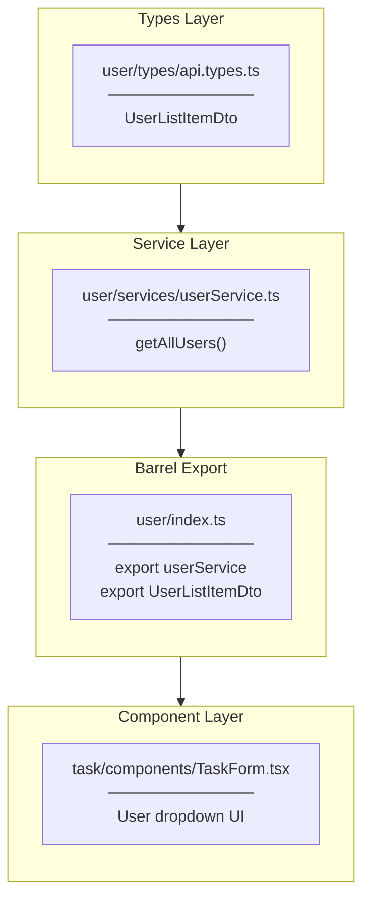
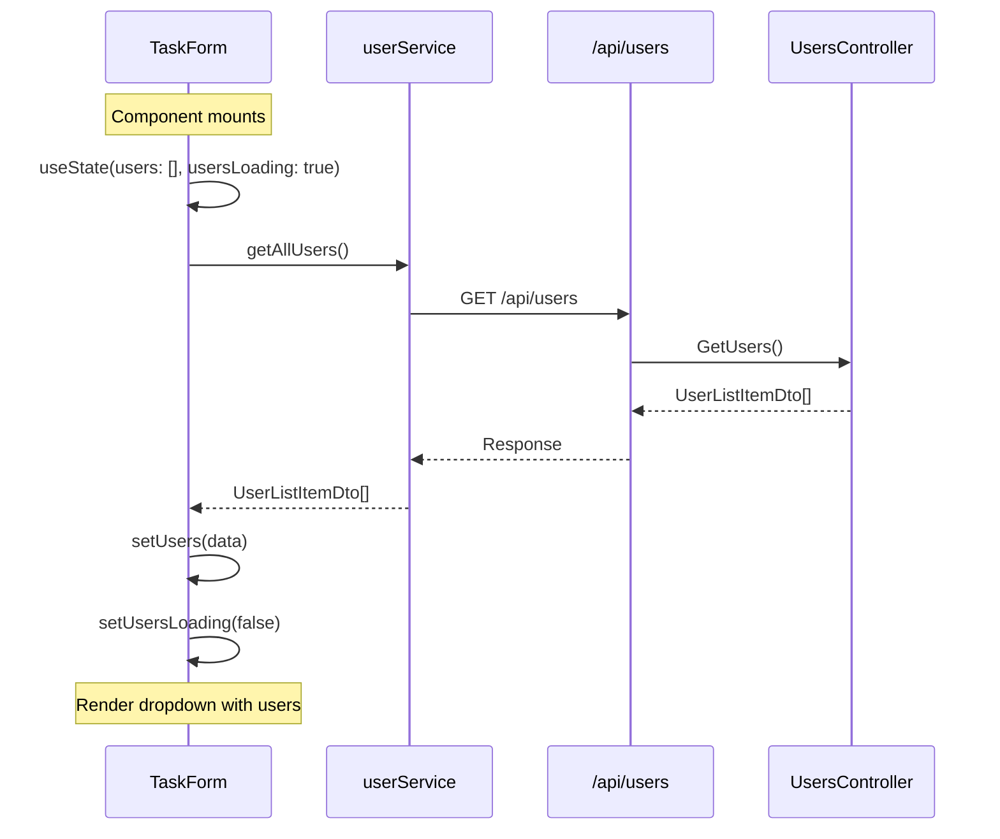

# User Dropdown Implementation Plan

## Overview

Task #49: Add user dropdown to TaskForm for task assignment (Phase 3 completion)

## Implementation Flow



---

## File-by-File Implementation Order

### 1. api.types.ts

**Location:** `features/user/types/api.types.ts`

**Purpose:** TypeScript type definition for user list API response

**Type:**
| Property | Type | Description |
|----------|------|-------------|
| `id` | number | User identifier |
| `name` | string | Display name |
| `initials` | string | Avatar initials |

---

### 2. userService.ts

**Location:** `features/user/services/userService.ts`

**Purpose:** API service for user-related endpoints

**Method:**
| Method | Return | Description |
|--------|--------|-------------|
| `getAllUsers()` | `Promise<UserListItemDto[]>` | Fetch all users for dropdown |

---

### 3. index.ts

**Location:** `features/user/index.ts`

**Purpose:** Barrel export for user feature

**Exports:**
- `userService` - API service
- `UserListItemDto` - Type (re-export)

---

### 4. TaskForm.tsx Modifications

**Location:** `features/task/components/TaskForm.tsx`

**Changes:**
| Change | Description |
|--------|-------------|
| Import | Add `userService`, `UserListItemDto` from user feature |
| State | Add `users`, `usersLoading` states |
| Effect | Add `useEffect` to load users on mount |
| UI | Replace Phase 3 TODO with actual dropdown |

---

## Data Flow



---

## Folder Structure

```
features/
├── task/
│   └── components/
│       └── TaskForm.tsx        (MODIFIED)
└── user/                       (NEW folder)
    ├── types/
    │   └── api.types.ts        (NEW)
    ├── services/
    │   └── userService.ts      (NEW)
    └── index.ts                (NEW)
```

---

## Checklist

- [x] Create user feature folder structure
- [x] Create api.types.ts with UserListItemDto
- [x] Create userService.ts with getAllUsers
- [x] Create index.ts barrel export
- [x] Update TaskForm.tsx imports
- [x] Add users/usersLoading state
- [x] Add useEffect to load users
- [x] Replace TODO with dropdown UI
- [x] Build verification
- [x] E2E test (assign user to task)
