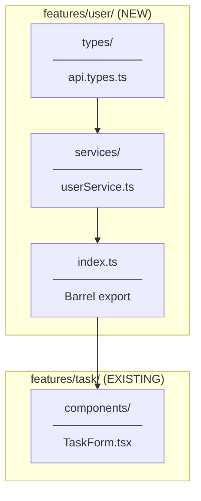
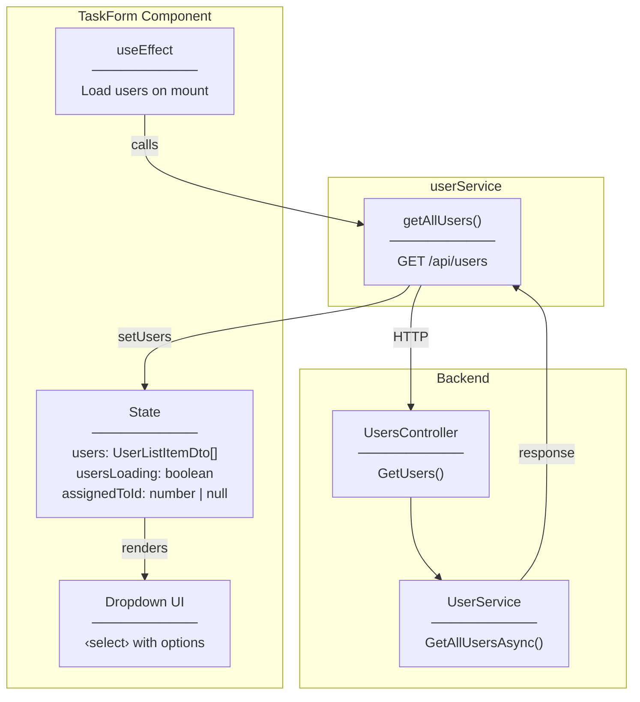
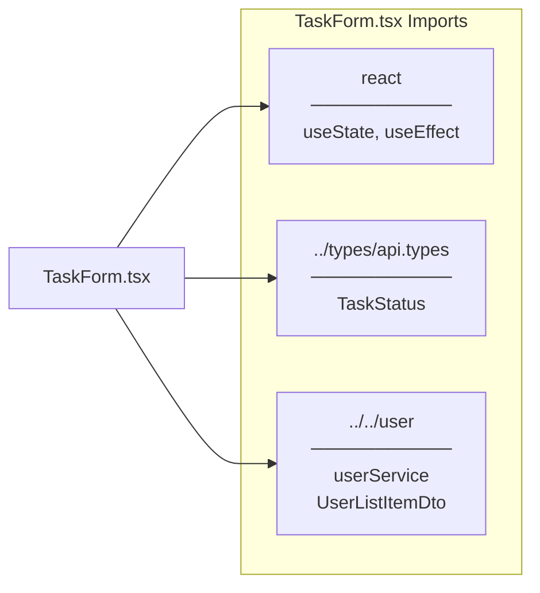
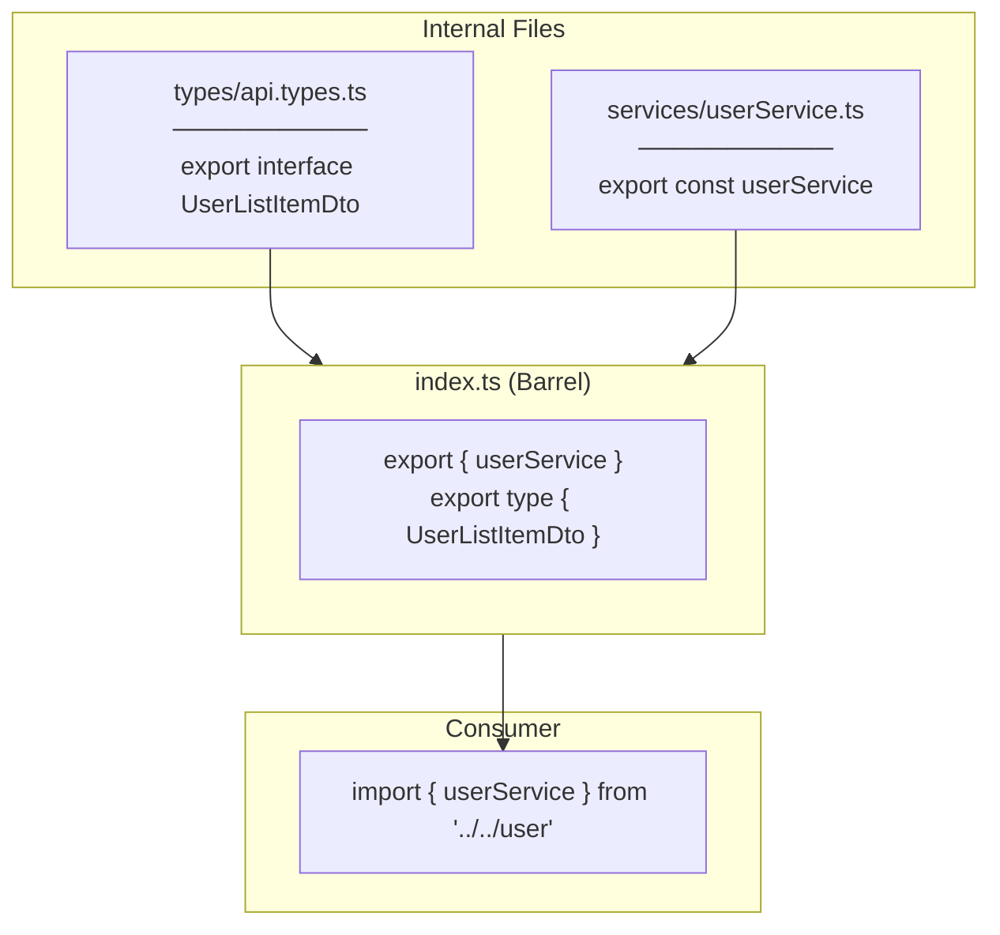
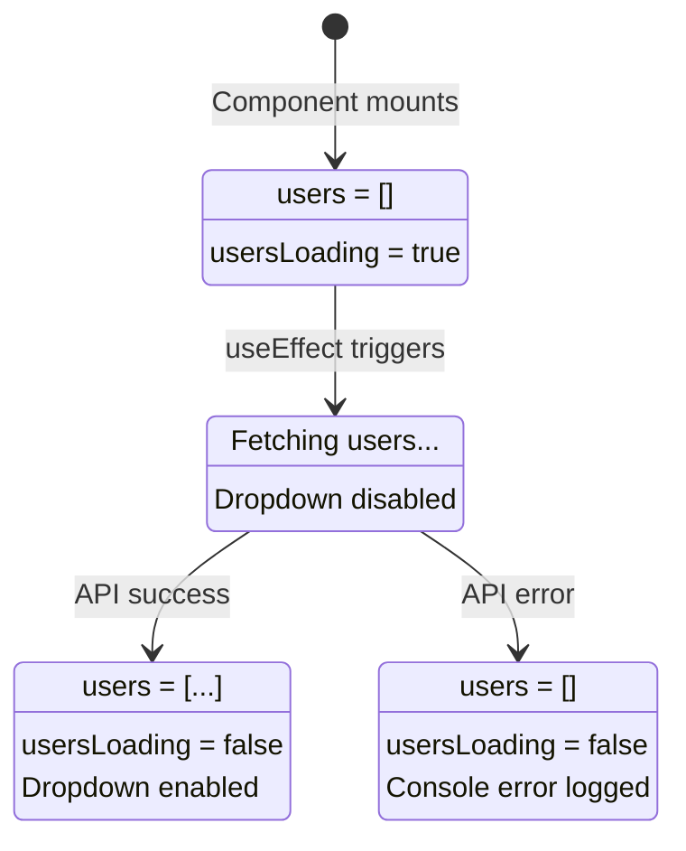
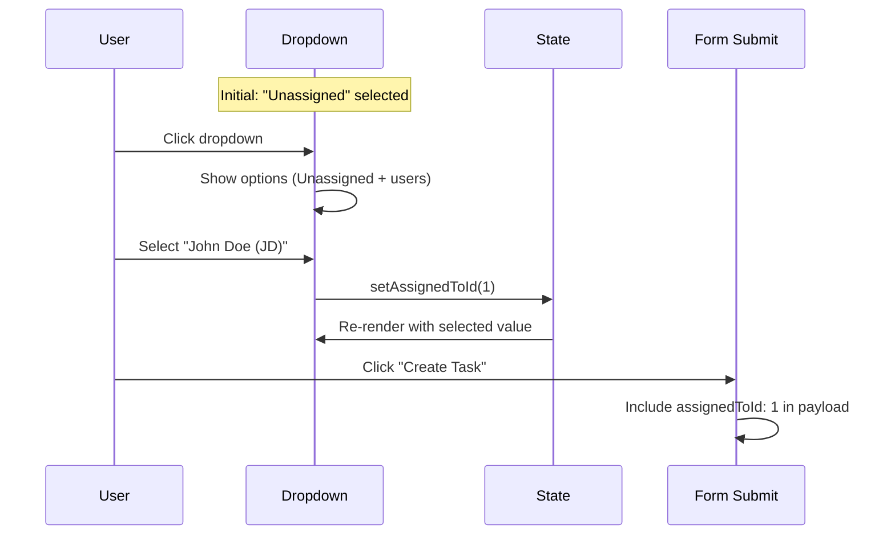

# Architecture Diagram

## Feature Structure

---

## Component Data Flow

---

## Import Graph

---

## Barrel Export Pattern

**Why Barrel Export?**
- Clean import paths
- Hide internal structure
- Single entry point for feature
- Easy refactoring

---

## State Management

---

## Dropdown Interaction

