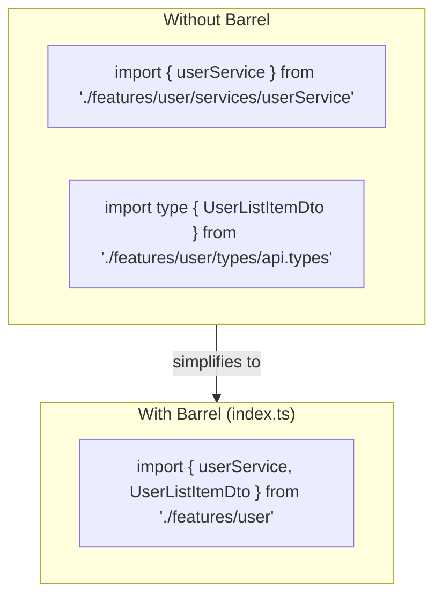
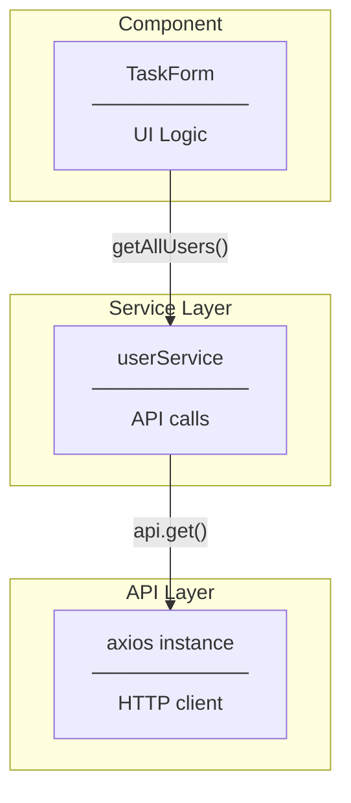
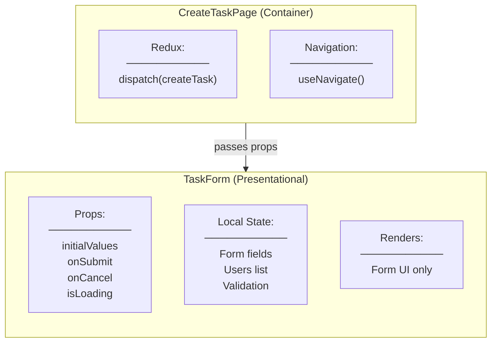
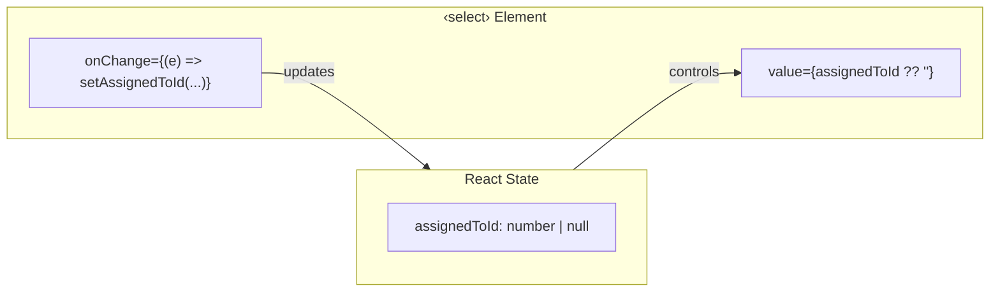
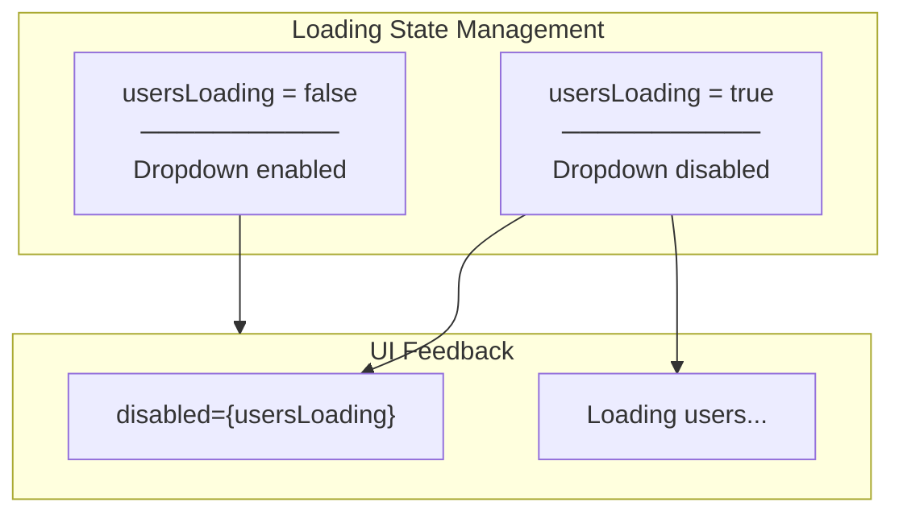
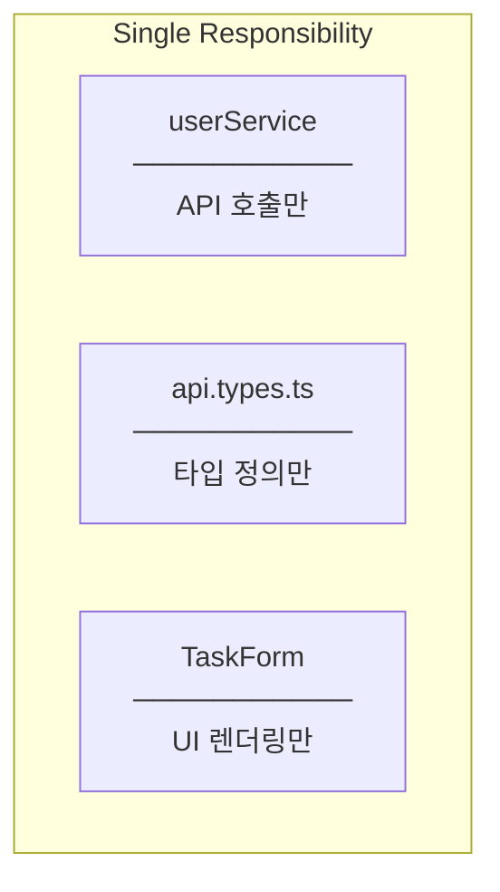
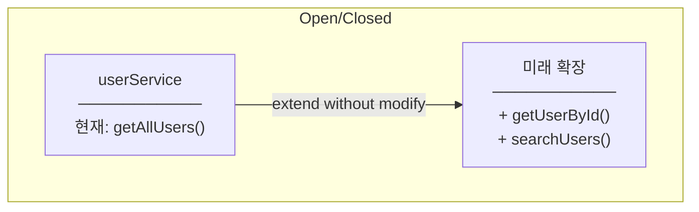
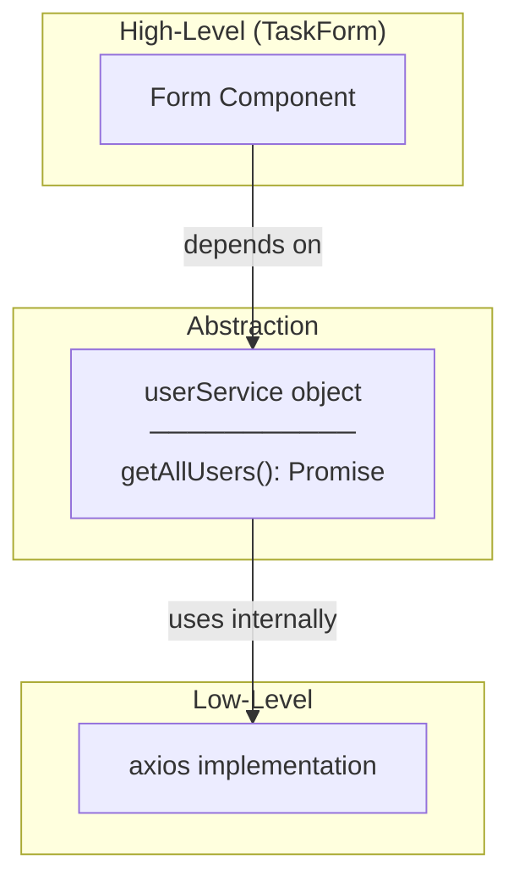
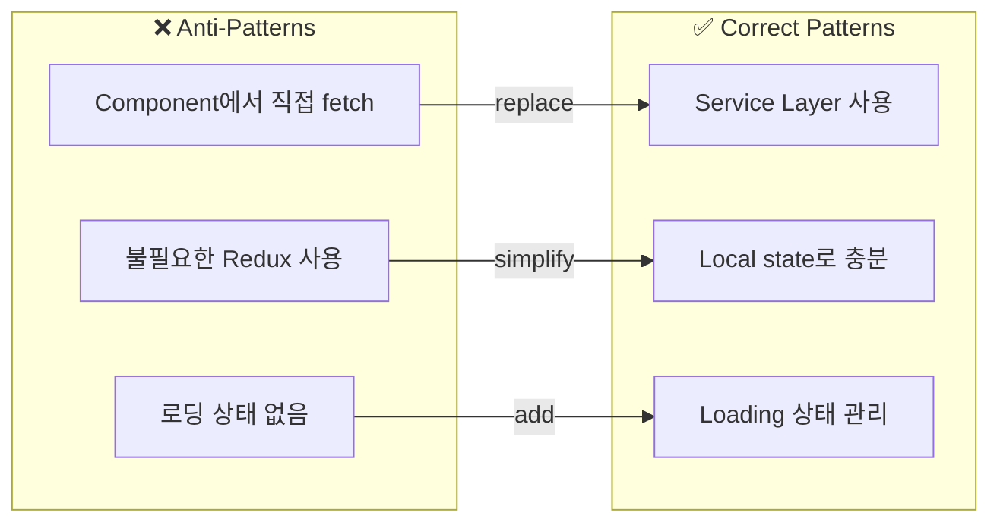

# Design Patterns

## Patterns Used

### 1. Barrel Export Pattern



**Implementation:**
```typescript
// features/user/index.ts
export { userService } from "./services/userService";
export type { UserListItemDto } from "./types/api.types";
```

**Benefits:**
- Cleaner imports
- Encapsulation of internal structure
- Single point of access
- Easy refactoring without changing consumers

---

### 2. Service Layer Pattern



**Why separate service?**
- Component doesn't know about HTTP
- Reusable across components
- Easy to mock for testing
- Single responsibility

---

### 3. Container/Presentational Pattern (준수)



**Note:** TaskForm은 local state로 users를 관리 (Redux 불필요)
- 사용자 목록은 form 내부에서만 필요
- 다른 컴포넌트와 공유 불필요
- 심플한 fetch & display 패턴

---

### 4. Controlled Component Pattern



**Implementation:**
```typescript
<select
  value={assignedToId ?? ""}
  onChange={(e) =>
    setAssignedToId(e.target.value ? Number(e.target.value) : null)
  }
>
```

**Why controlled?**
- Single source of truth (React state)
- Easy to validate/transform values
- Predictable behavior

---

### 5. Loading State Pattern



**Implementation:**
```typescript
const [usersLoading, setUsersLoading] = useState(true);

// In JSX
<select disabled={usersLoading}>
  ...
</select>
{usersLoading && <p>Loading users...</p>}
```

---

## SOLID Principles Applied

### S - Single Responsibility



---

### O - Open/Closed



**How?** 새 메서드 추가는 기존 코드 변경 없이 가능

---

### D - Dependency Inversion



**TaskForm은 axios를 직접 사용하지 않음** → Service를 통해 추상화

---

## Anti-Patterns Avoided


