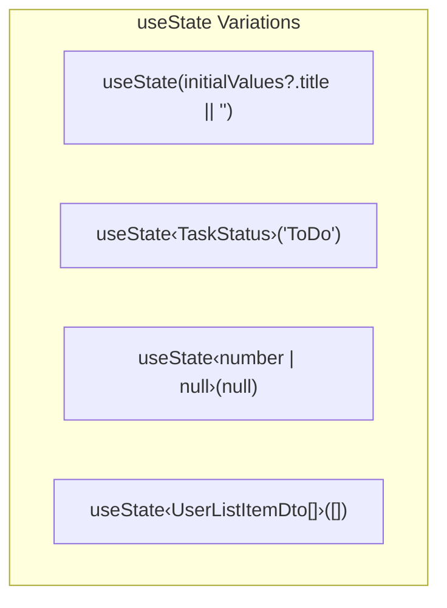
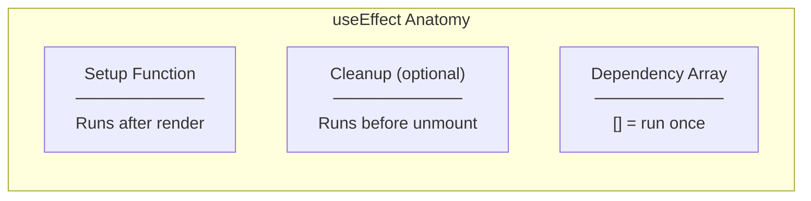
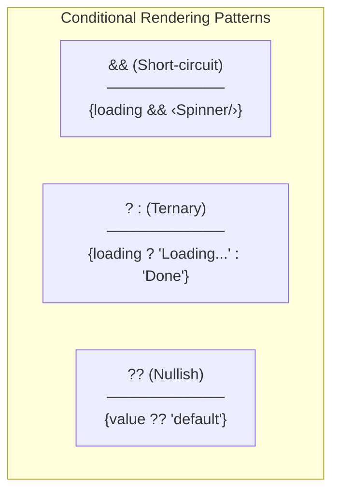
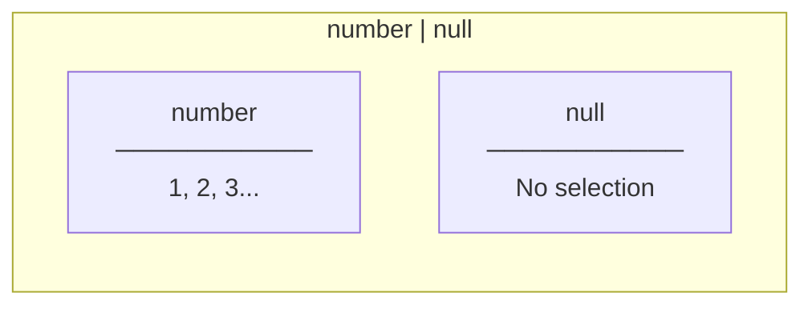
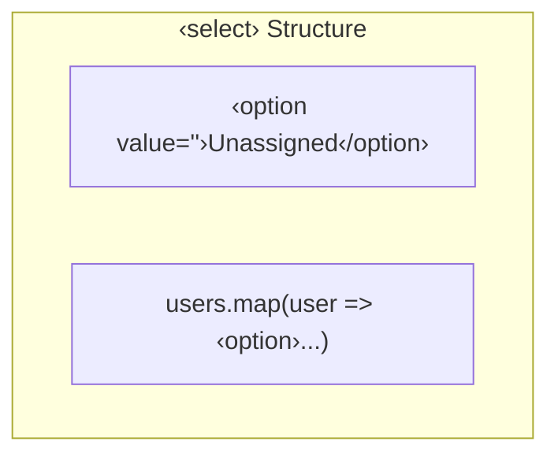
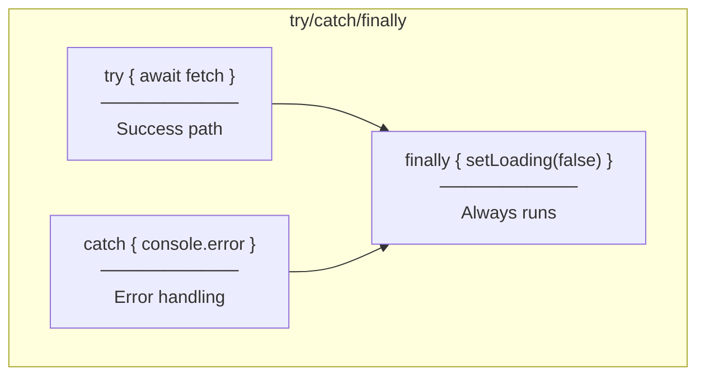
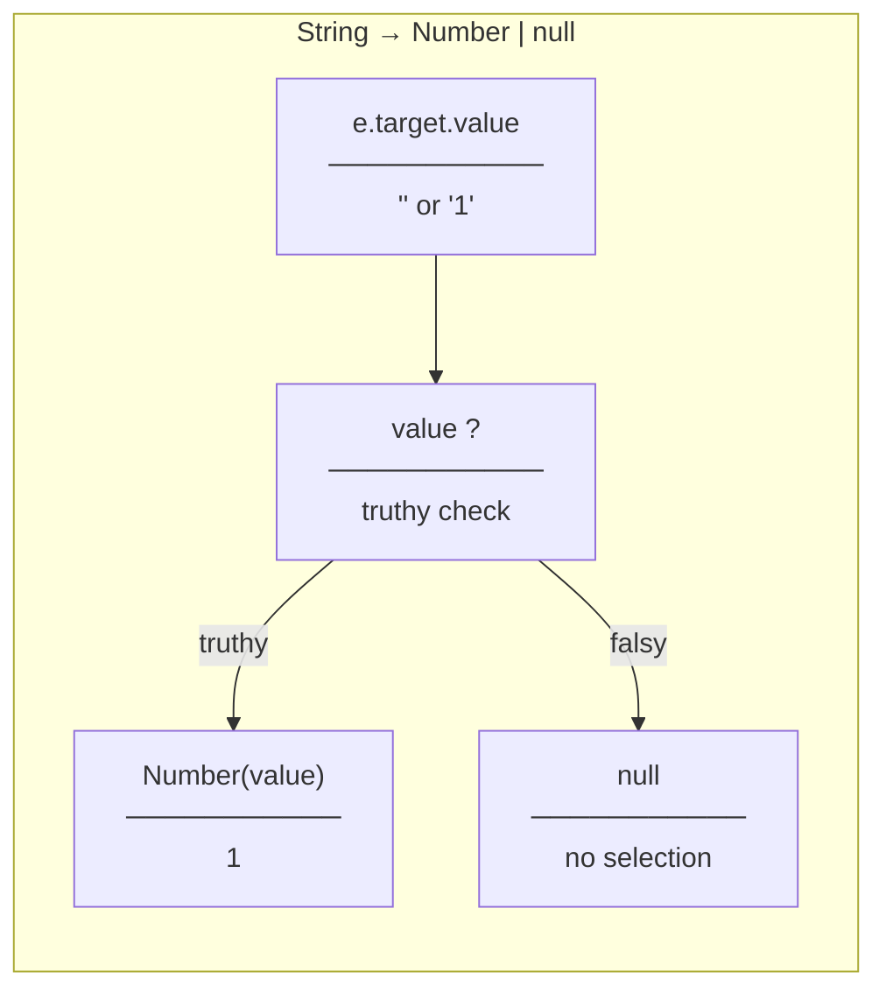

# Programming Concepts

## React Hooks

### 1. useState with Complex Types



**Code Examples:**
```typescript
// Simple string state
const [title, setTitle] = useState(initialValues?.title || "");

// Typed state with generic
const [status, setStatus] = useState<TaskStatus>(initialValues?.status || "ToDo");

// Nullable state
const [assignedToId, setAssignedToId] = useState<number | null>(
  initialValues?.assignedToId || null
);

// Array state with interface type
const [users, setUsers] = useState<UserListItemDto[]>([]);
```

---

### 2. useEffect for Data Fetching



**Implementation:**
```typescript
useEffect(() => {
  // Setup: Define async function inside
  const loadUsers = async () => {
    try {
      const data = await userService.getAllUsers();
      setUsers(data);
    } catch (error) {
      console.error("Failed to load users:", error);
    } finally {
      setUsersLoading(false);
    }
  };

  // Execute the async function
  loadUsers();
}, []); // Empty deps = run only on mount
```

**Why async function inside?**
- useEffect callback can't be async directly
- Must define and call async function inside
- Prevents race conditions

---

### 3. Conditional Rendering



**Code Examples:**
```typescript
// && for conditional display
{usersLoading && (
  <p className="mt-1 text-xs text-gray-500">Loading users...</p>
)}

// ?? for select value (null → empty string)
<select value={assignedToId ?? ""}>
```

---

## TypeScript Concepts

### 1. Type Imports

```typescript
// Type-only import (tree-shaking friendly)
import type { UserListItemDto } from "../../user";

// vs Regular import (includes runtime code)
import { UserListItemDto } from "../../user";
```

**Why `import type`?**
- Removed at compile time
- No runtime overhead
- Clear intent: "this is just a type"

---

### 2. Union Types with null



**Usage:**
```typescript
const [assignedToId, setAssignedToId] = useState<number | null>(null);

// When converting from string input
setAssignedToId(e.target.value ? Number(e.target.value) : null);
```

---

### 3. Interface Definition

```typescript
/**
 * UserListItemDto - 사용자 목록 아이템
 *
 * GET /api/users 응답의 배열 요소
 */
export interface UserListItemDto {
  id: number;
  name: string;
  initials: string;
}
```

**Convention:**
- JSDoc comment with Korean description
- `export interface` (not type alias)
- PascalCase naming

---

## HTML/JSX Concepts

### 1. Select Element with Dynamic Options



**Implementation:**
```typescript
<select
  id="assignedTo"
  value={assignedToId ?? ""}
  onChange={(e) =>
    setAssignedToId(e.target.value ? Number(e.target.value) : null)
  }
  disabled={usersLoading}
>
  <option value="">Unassigned</option>
  {users.map((user) => (
    <option key={user.id} value={user.id}>
      {user.name} ({user.initials})
    </option>
  ))}
</select>
```

**Key Points:**
- `value=""` for "no selection" option
- `key={user.id}` for React reconciliation
- `value={user.id}` (number converted to string by React)

---

### 2. Disabled State

```typescript
<select
  disabled={usersLoading}
  className="... disabled:bg-gray-100"
>
```

**Tailwind `disabled:` variant:**
- `disabled:bg-gray-100` - Gray background when disabled
- `disabled:opacity-50` - Semi-transparent when disabled

---

## Async/Await Pattern

### Error Handling with try/catch/finally



**Implementation:**
```typescript
try {
  const data = await userService.getAllUsers();
  setUsers(data);
} catch (error) {
  console.error("Failed to load users:", error);
} finally {
  setUsersLoading(false);  // Always reset loading
}
```

**Why finally?**
- Loading state must be reset regardless of success/failure
- Prevents stuck loading state on errors

---

## Module System

### Barrel Export (index.ts)

```typescript
// features/user/index.ts

// Re-export service
export { userService } from "./services/userService";

// Re-export type (type-only)
export type { UserListItemDto } from "./types/api.types";
```

**Import from barrel:**
```typescript
// Clean single import
import { userService } from "../../user";
import type { UserListItemDto } from "../../user";

// Instead of multiple deep imports
import { userService } from "../../user/services/userService";
import type { UserListItemDto } from "../../user/types/api.types";
```

---

## Number Conversion

### String to Number (from select)



**Implementation:**
```typescript
onChange={(e) =>
  setAssignedToId(e.target.value ? Number(e.target.value) : null)
}
```

**Why this pattern?**
- Select always returns string
- Empty string (`""`) is falsy → returns null
- Non-empty string → convert to number
