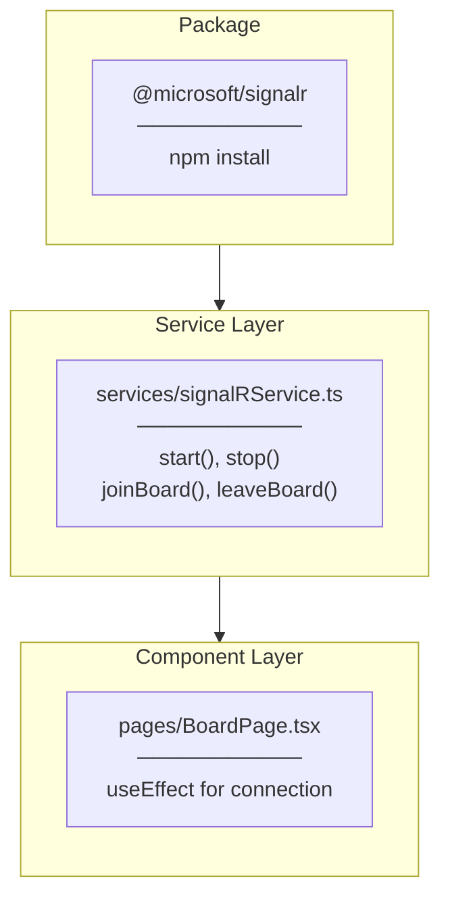

# SignalR Client Implementation Plan

## Overview

Task #52: Setup SignalR client connection for real-time task notifications (Story #50)

## Implementation Flow



---

## File-by-File Implementation Order

### 1. Package Installation

```bash
npm install @microsoft/signalr
```

---

### 2. signalRService.ts

**Location:** `src/services/signalRService.ts`

**Purpose:** SignalR client service for Hub communication

**Methods:**
| Method | Return | Description |
|--------|--------|-------------|
| `getConnection()` | `HubConnection` | Get singleton connection |
| `start()` | `Promise<void>` | Start connection |
| `stop()` | `Promise<void>` | Stop connection |
| `joinBoard()` | `Promise<void>` | Join TaskBoard group |
| `leaveBoard()` | `Promise<void>` | Leave TaskBoard group |

---

### 3. BoardPage.tsx Modifications

**Location:** `src/features/task/pages/BoardPage.tsx`

**Changes:**
| Change | Description |
|--------|-------------|
| import | Add `signalRService` |
| useEffect | Add SignalR connection lifecycle |
| cleanup | Add disconnect on unmount |

---

## Folder Structure

```
src/
├── services/
│   ├── api.ts              (EXISTING)
│   └── signalRService.ts   (NEW)
└── features/task/pages/
    └── BoardPage.tsx       (MODIFIED)
```

---

## Checklist

- [x] npm install @microsoft/signalr
- [x] Create signalRService.ts
- [x] Add getConnection() with singleton pattern
- [x] Add start()/stop() methods
- [x] Add joinBoard()/leaveBoard() methods
- [x] Modify BoardPage.tsx imports
- [x] Add SignalR useEffect
- [x] Add cleanup function
- [x] Frontend build success
