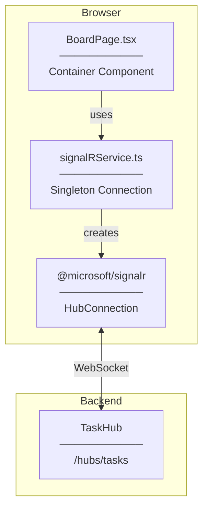
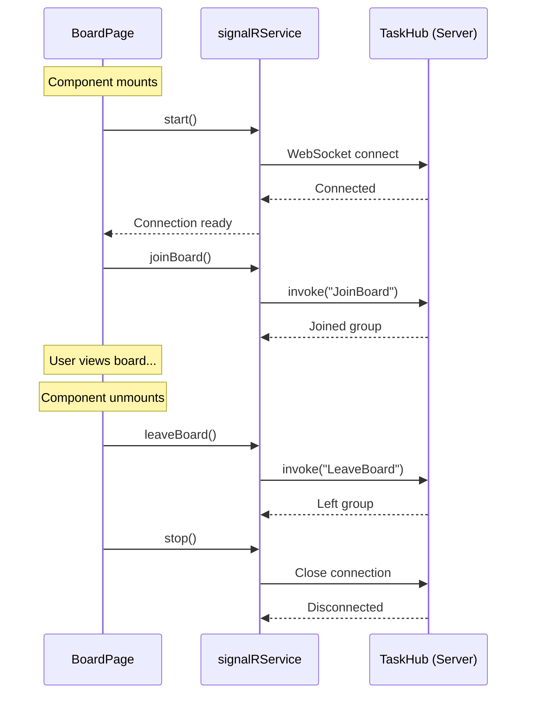
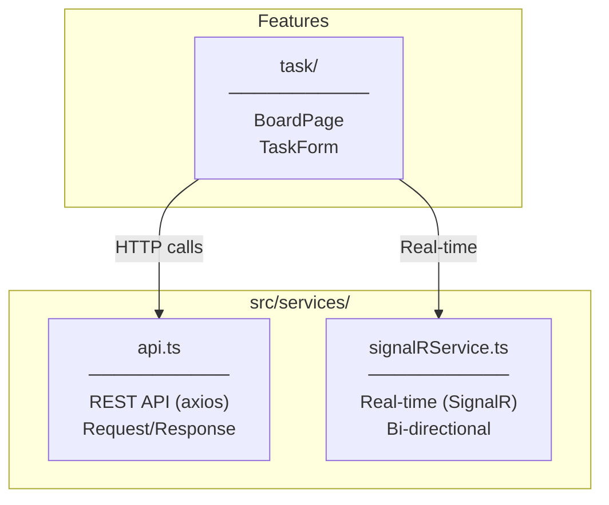
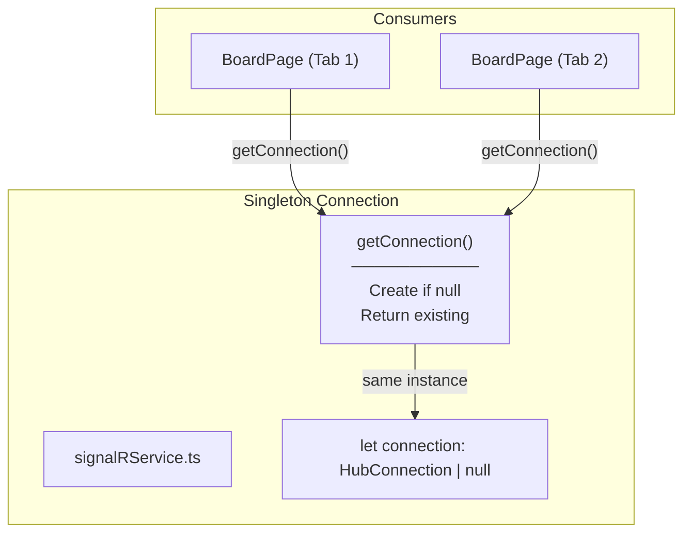
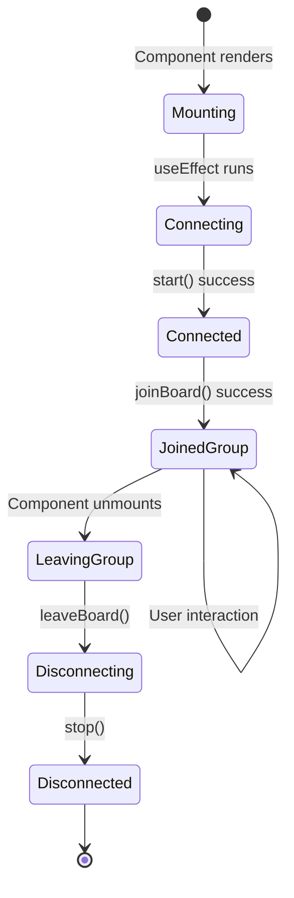
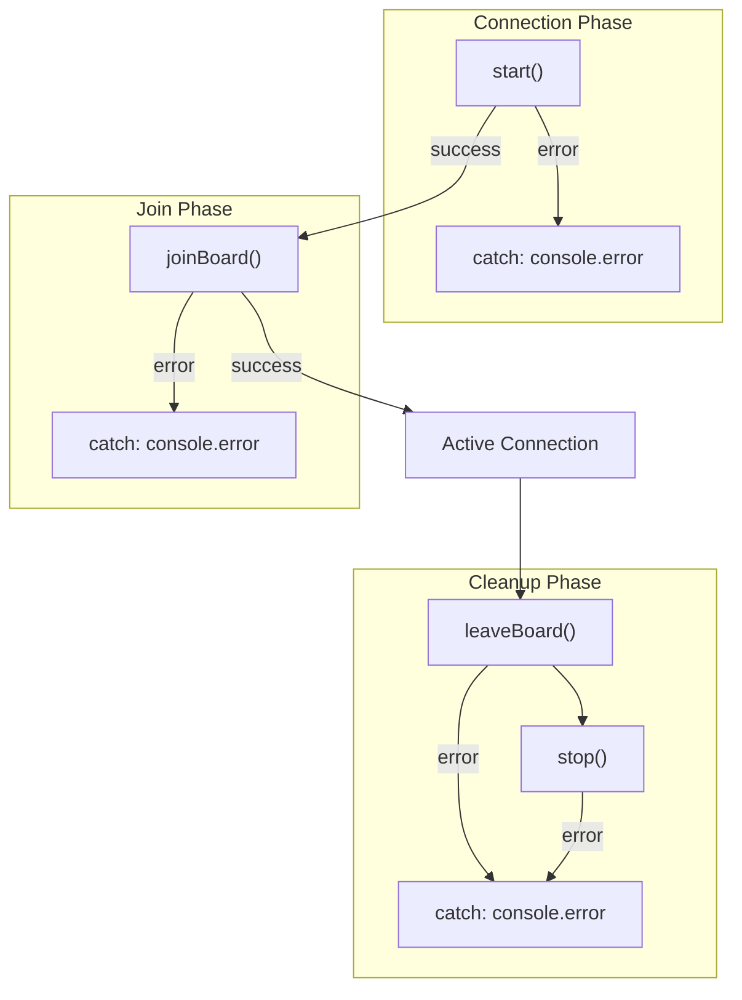
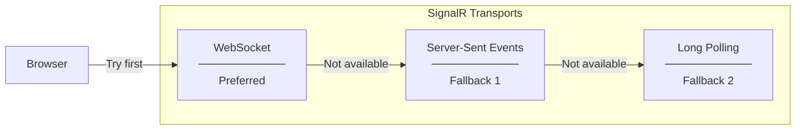

# Architecture Diagram

## SignalR Client Overview

---

## Connection Lifecycle

---

## Service Layer Architecture

---

## Singleton Pattern

**Why Singleton?**
- Single WebSocket connection per browser tab
- Avoid duplicate connections
- Efficient resource usage
- Consistent state management

---

## useEffect Lifecycle

---

## Error Handling Flow

---

## Transport Fallback

**SignalR automatically handles transport negotiation**
