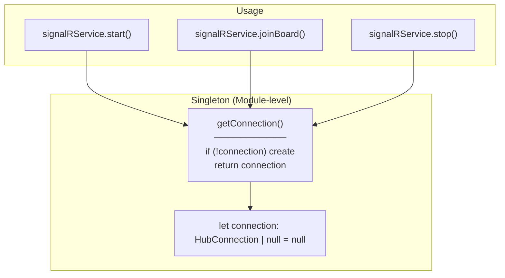
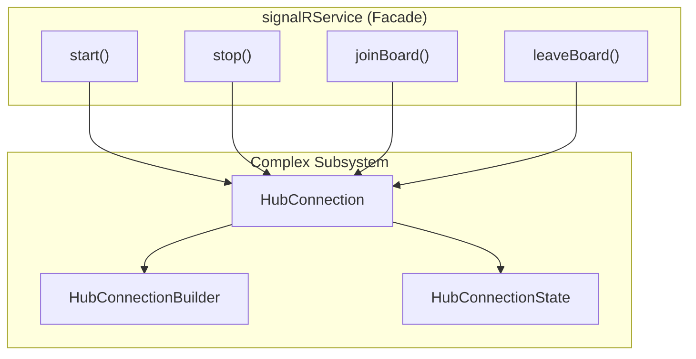
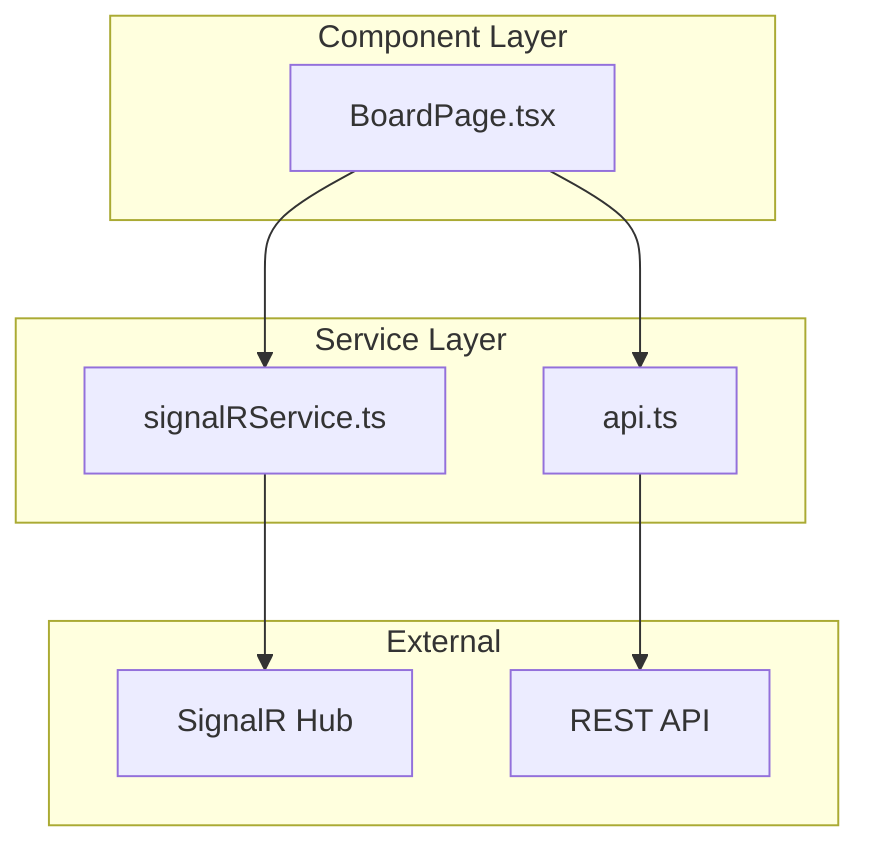
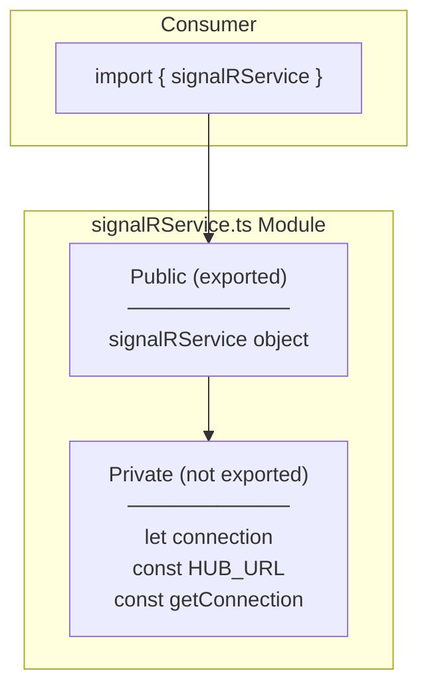
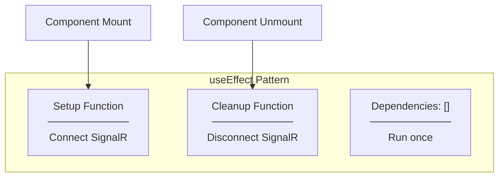
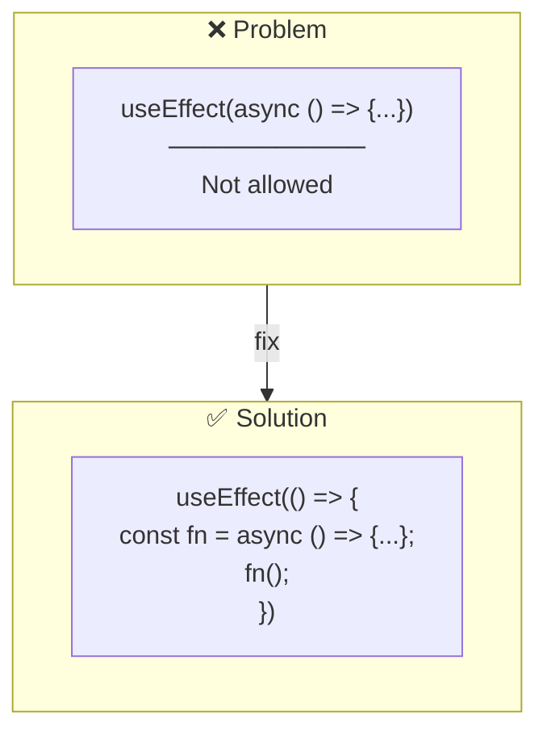
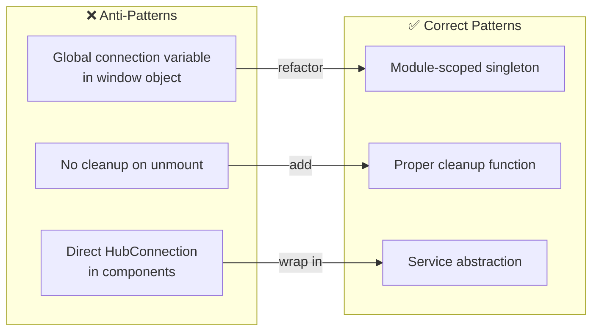

# Design Patterns

## Patterns Used

### 1. Singleton Pattern



**Implementation:**
```typescript
let connection: HubConnection | null = null;

const getConnection = (): HubConnection => {
  if (!connection) {
    connection = new HubConnectionBuilder()
      .withUrl(HUB_URL, { ... })
      .build();
  }
  return connection;
};
```

**Benefits:**
- Single connection per application
- Lazy initialization (created when needed)
- Module-level scope (no class needed)

---

### 2. Facade Pattern



**Why Facade?**
- Hides SignalR complexity from components
- Simple API: `start()`, `stop()`, `joinBoard()`, `leaveBoard()`
- Components don't need to know about HubConnectionBuilder, states, etc.

---

### 3. Service Layer Pattern



**Benefits:**
- Separation of concerns
- Components focus on UI
- Services handle communication logic
- Easy to test and mock

---

### 4. Module Pattern (ES Modules)



**Implementation:**
```typescript
// Private - not accessible outside
const HUB_URL = "...";
let connection: HubConnection | null = null;
const getConnection = () => { ... };

// Public - exported
export const signalRService = {
  getConnection,
  start,
  stop,
  joinBoard,
  leaveBoard,
};
```

---

## React Patterns

### 1. useEffect for Side Effects



**Implementation:**
```typescript
useEffect(() => {
  // Setup
  const connectSignalR = async () => {
    await signalRService.start();
    await signalRService.joinBoard();
  };
  connectSignalR();

  // Cleanup
  return () => {
    const disconnectSignalR = async () => {
      await signalRService.leaveBoard();
      await signalRService.stop();
    };
    disconnectSignalR();
  };
}, []); // Empty deps = mount/unmount only
```

---

### 2. Async in useEffect



**Why?**
- useEffect callback can't be async directly
- Must define async function inside and call it
- Cleanup function must be sync

---

## Anti-Patterns Avoided


