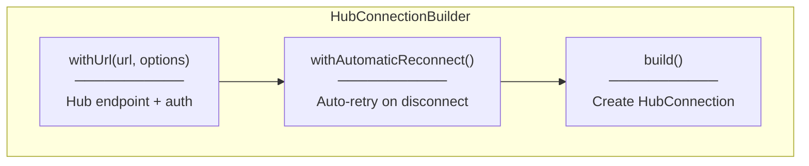
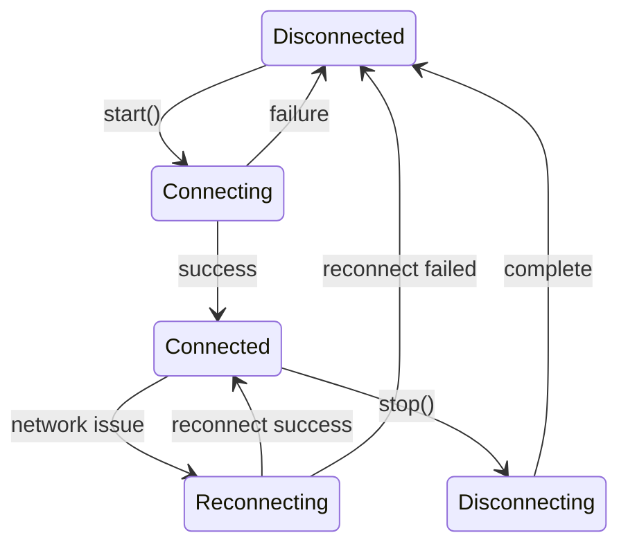
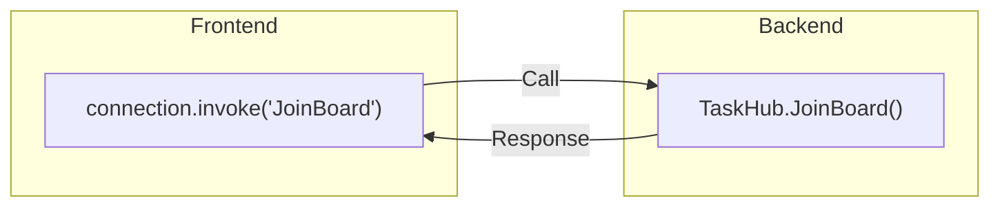

# Programming Concepts

## SignalR Client Concepts

### 1. HubConnectionBuilder



**Implementation:**
```typescript
import { HubConnectionBuilder, HubConnection } from "@microsoft/signalr";

const connection = new HubConnectionBuilder()
  .withUrl(HUB_URL, {
    accessTokenFactory: () => localStorage.getItem("token") || "",
  })
  .withAutomaticReconnect()
  .build();
```

**Options Explained:**
- `withUrl(url, options)` - Hub URL + authentication
- `accessTokenFactory` - Function that returns JWT token
- `withAutomaticReconnect()` - Retry connection on network issues

---

### 2. HubConnectionState



**State Check:**
```typescript
import { HubConnectionState } from "@microsoft/signalr";

if (conn.state === HubConnectionState.Disconnected) {
  await conn.start();
}

if (conn.state === HubConnectionState.Connected) {
  await conn.invoke("JoinBoard");
}
```

---

### 3. invoke() Method



**Implementation:**
```typescript
// Call server method
await connection.invoke("JoinBoard");

// Call with parameters
await connection.invoke("SendMessage", "Hello", userId);

// Call with return value
const result = await connection.invoke<string>("GetData");
```

---

## TypeScript Concepts

### 1. Type Imports

```typescript
import {
  HubConnectionBuilder,
  HubConnection,
  HubConnectionState,
} from "@microsoft/signalr";
```

**Types Used:**
| Type | Description |
|------|-------------|
| `HubConnectionBuilder` | Builder class for creating connections |
| `HubConnection` | Connection instance type |
| `HubConnectionState` | Enum for connection states |

---

### 2. Union Type with null

```typescript
let connection: HubConnection | null = null;
```

**Why?**
- Connection doesn't exist initially
- Created lazily on first use
- null indicates "not yet created"

---

### 3. Environment Variables

```typescript
const HUB_URL =
  import.meta.env.VITE_SIGNALR_URL || "https://localhost:5001/hubs/tasks";
```

**Pattern:**
- `import.meta.env.VITE_*` - Vite environment variables
- `||` fallback - Default value if not set
- Allows different URLs per environment

---

## async/await Patterns

### 1. Sequential Async Calls

```typescript
const connectSignalR = async () => {
  try {
    await signalRService.start();     // Wait for connection
    await signalRService.joinBoard(); // Then join group
  } catch (error) {
    console.error("SignalR connection failed:", error);
  }
};
```

**Why sequential?**
- Must connect before joining group
- Second call depends on first succeeding

---

### 2. Error Handling

```typescript
try {
  await conn.start();
  console.log("SignalR connected");
} catch (error) {
  console.error("SignalR connection failed:", error);
  throw error; // Re-throw for caller to handle
}
```

**Pattern:**
- `try/catch` for async errors
- Log error for debugging
- Optionally re-throw for caller

---

## React useEffect Patterns

### 1. Async Function Inside useEffect

```typescript
useEffect(() => {
  // Define async function inside
  const connectSignalR = async () => {
    await signalRService.start();
    await signalRService.joinBoard();
  };

  // Call it
  connectSignalR();

  // Cleanup (sync)
  return () => { ... };
}, []);
```

**Why?**
- useEffect can't be async directly
- Define and call async function inside
- Cleanup must be synchronous

---

### 2. Cleanup Function

```typescript
useEffect(() => {
  // Setup...

  // Cleanup: runs on unmount
  return () => {
    const disconnectSignalR = async () => {
      await signalRService.leaveBoard();
      await signalRService.stop();
    };
    disconnectSignalR();
  };
}, []);
```

**Why cleanup?**
- Prevent memory leaks
- Close connections properly
- Clean up resources on page leave

---

### 3. Empty Dependency Array

```typescript
useEffect(() => {
  // ...
}, []); // Empty array
```

**Meaning:**
- `[]` = run only on mount/unmount
- No dependencies = never re-run
- Perfect for one-time setup

---

## Module Export Pattern

```typescript
// Named export of object
export const signalRService = {
  getConnection,
  start,
  stop,
  joinBoard,
  leaveBoard,
};

// Usage
import { signalRService } from "../services/signalRService";
signalRService.start();
```

**Why object export?**
- Groups related functions
- Clear namespace
- Easy to import and use
- Consistent with api.ts pattern would differ (default export)

---

## Console Logging

```typescript
console.log("SignalR connected");
console.error("SignalR connection failed:", error);
```

**Development Purpose:**
- Debug connection issues
- Verify lifecycle events
- Track group join/leave
- Can be removed in production
