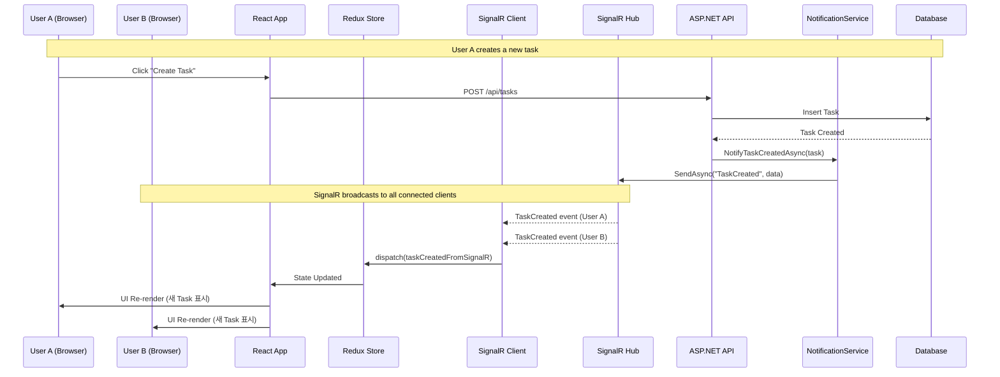
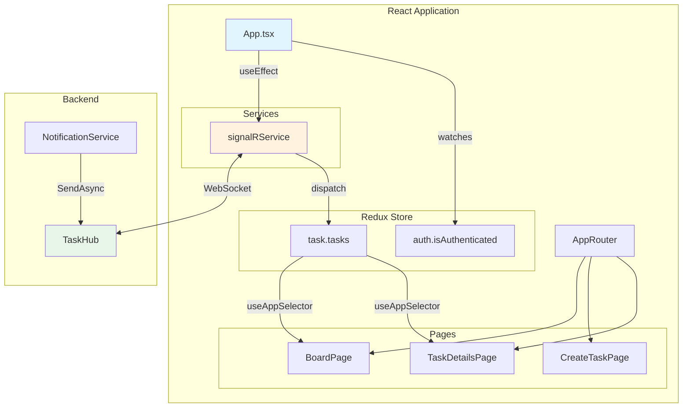
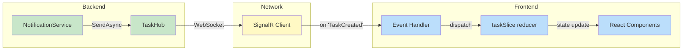
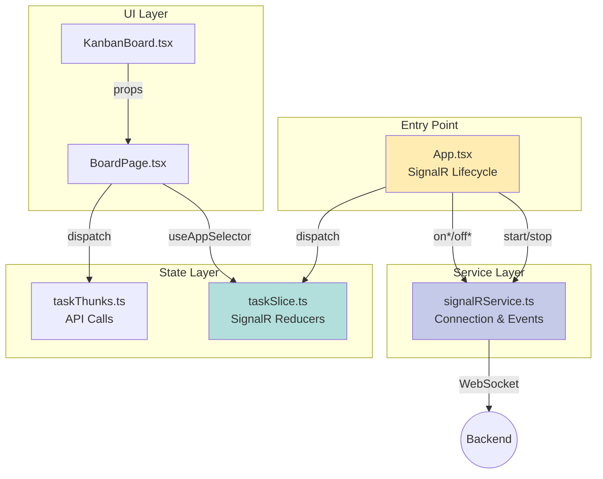
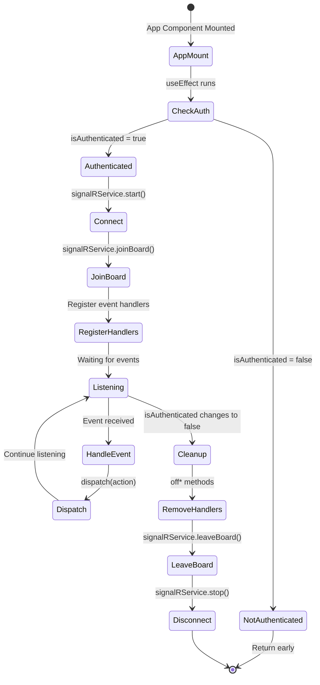

# Task #56: SignalR Event Handling - Architecture Diagram

## 전체 실시간 업데이트 흐름

## App-Level SignalR Connection 아키텍처

## SignalR Event → Redux Action 데이터 흐름

## 파일 구조 및 책임

## useEffect Lifecycle 흐름

