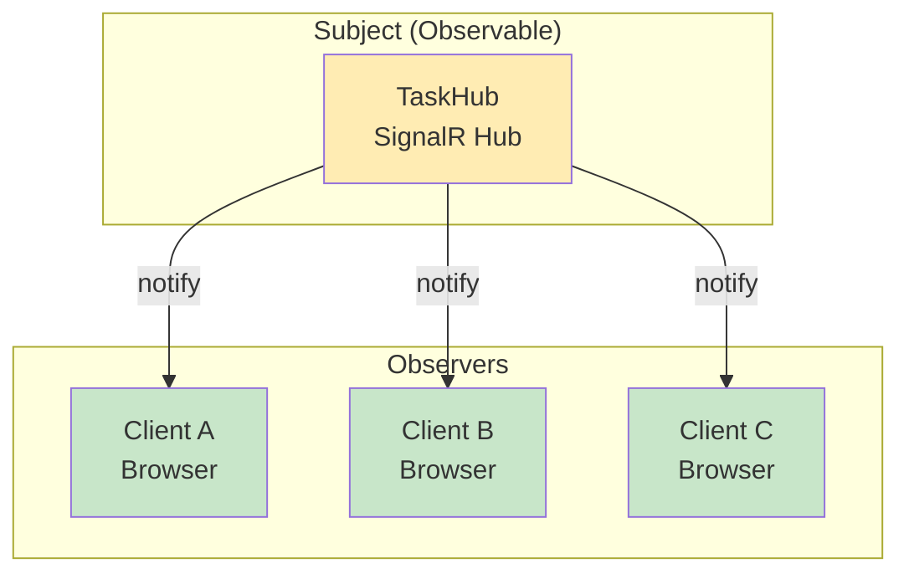
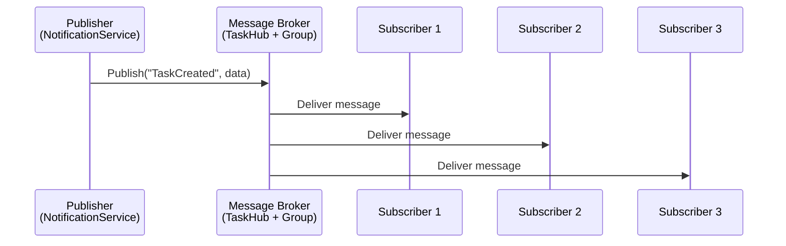
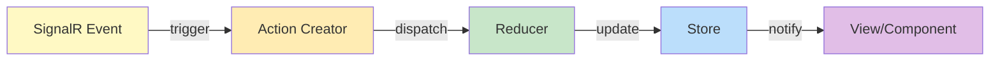
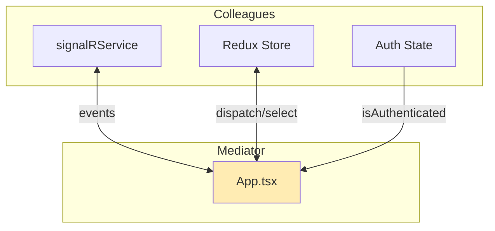

# Task #56: SignalR Event Handling - Design Patterns

## 1. Observer Pattern (관찰자 패턴)

### 개념
SignalR의 이벤트 시스템은 Observer Pattern의 전형적인 구현입니다.



### 코드 적용

```typescript
// Observer 등록 (Subscribe)
signalRService.onTaskCreated((data) => {
  dispatch(taskCreatedFromSignalR(data.task));
});

// Observer 해제 (Unsubscribe)
signalRService.offTaskCreated();
```

### 장점
- 느슨한 결합 (Loose Coupling)
- 실시간 업데이트
- 확장성 (새로운 Observer 쉽게 추가)

---

## 2. Singleton Pattern (싱글톤 패턴)

### 개념
SignalR Connection은 앱 전체에서 하나의 인스턴스만 사용합니다.

```mermaid
graph TB
    subgraph "signalRService.ts"
        Connection[connection: HubConnection | null]
        GetConn[getConnection]
    end

    App[App.tsx] -->|call| GetConn
    Board[BoardPage] -->|call| GetConn
    Details[DetailsPage] -->|call| GetConn

    GetConn -->|returns same instance| Connection

    style Connection fill:#ffcdd2
    style GetConn fill:#c8e6c9
```

### 코드 적용

```typescript
let connection: HubConnection | null = null;

const getConnection = (): HubConnection => {
  if (!connection) {
    connection = new HubConnectionBuilder()
      .withUrl(HUB_URL, {
        accessTokenFactory: () => localStorage.getItem("token") || "",
      })
      .withAutomaticReconnect()
      .build();
  }
  return connection;  // 항상 같은 인스턴스 반환
};
```

### 장점
- 메모리 효율성
- 연결 상태 일관성
- 중복 연결 방지

---

## 3. Publish-Subscribe Pattern (발행-구독 패턴)

### 개념
SignalR Group을 통한 메시지 브로드캐스팅.



### 코드 적용

```csharp
// Publisher (Backend)
await _hubContext.Clients.Group(BoardGroup)
    .SendAsync("TaskCreated", new { task = task });
```

```typescript
// Subscriber (Frontend)
getConnection().on("TaskCreated", callback);
```

### Observer vs Pub-Sub 차이점

| 특성 | Observer | Pub-Sub |
|------|----------|---------|
| 결합도 | Subject가 Observer를 알고 있음 | Publisher가 Subscriber를 모름 |
| 중개자 | 없음 | Message Broker 있음 |
| 동기/비동기 | 주로 동기 | 주로 비동기 |
| 예시 | DOM Event Listener | SignalR, Redis Pub/Sub |

---

## 4. Flux Pattern (Redux)

### 개념
SignalR 이벤트가 Redux의 단방향 데이터 흐름에 통합됩니다.



### 코드 적용

```typescript
// Action (자동 생성)
export const { taskCreatedFromSignalR } = taskSlice.actions;

// Reducer
taskCreatedFromSignalR: (state, action) => {
  const exists = state.tasks.some((t) => t.id === action.payload.id);
  if (!exists) {
    state.tasks.unshift(action.payload);
  }
},

// Dispatch from SignalR event
signalRService.onTaskCreated((data) => {
  dispatch(taskCreatedFromSignalR(data.task));
});
```

---

## 5. Mediator Pattern (중재자 패턴)

### 개념
App.tsx가 SignalR과 Redux 사이의 중재자 역할.



### 코드 적용

```typescript
// App.tsx acts as Mediator
function App() {
  const dispatch = useAppDispatch();
  const { isAuthenticated } = useAppSelector((state) => state.auth);

  useEffect(() => {
    if (!isAuthenticated) return;

    // Mediator coordinates between SignalR and Redux
    signalRService.onTaskCreated((data) => {
      dispatch(taskCreatedFromSignalR(data.task));
    });
  }, [isAuthenticated, dispatch]);
}
```

### 장점
- SignalR과 Redux가 직접 연결되지 않음
- 중앙 집중식 연결 관리
- 테스트 용이성

---

## 패턴 요약

| 패턴 | 적용 위치 | 목적 |
|------|----------|------|
| Observer | SignalR Client | 이벤트 구독/해제 |
| Singleton | HubConnection | 단일 연결 유지 |
| Pub-Sub | SignalR Hub + Group | 메시지 브로드캐스팅 |
| Flux | Redux + SignalR | 단방향 데이터 흐름 |
| Mediator | App.tsx | SignalR-Redux 연결 관리 |
