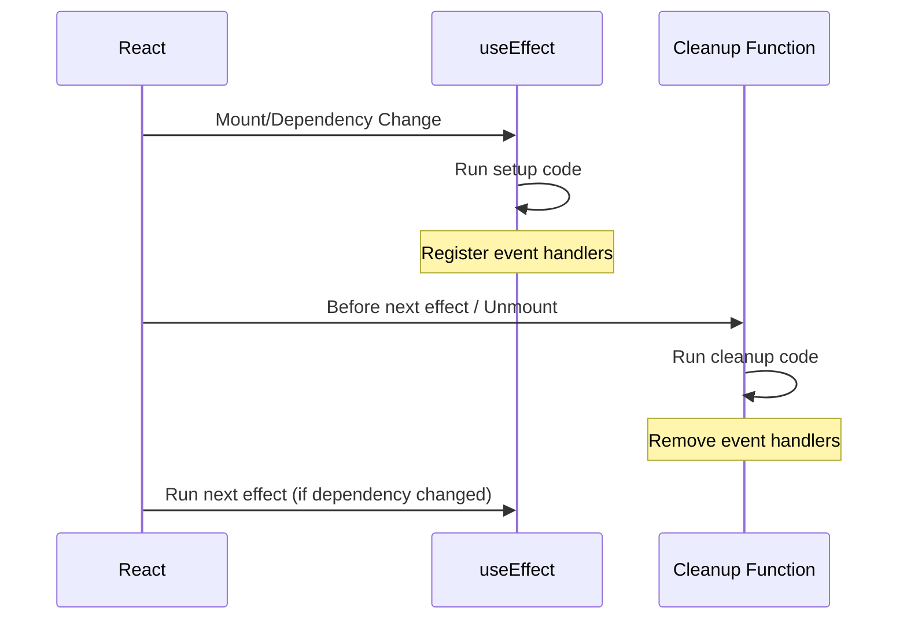

# Task #56: SignalR Event Handling - Programming Concepts

## 1. useEffect Cleanup Function

### 개념
React useEffect의 cleanup function은 컴포넌트 unmount 또는 dependency 변경 시 실행됩니다.

### 코드 적용

```typescript
useEffect(() => {
  // Setup
  signalRService.onTaskCreated(handler);

  // Cleanup (return function)
  return () => {
    signalRService.offTaskCreated();
  };
}, [dependency]);
```

### Lifecycle 흐름



### 왜 중요한가?
- **메모리 누수 방지**: 이벤트 리스너가 계속 쌓이는 것 방지
- **중복 핸들러 방지**: 같은 이벤트에 여러 핸들러 등록 방지
- **리소스 정리**: WebSocket 연결 해제

---

## 2. Conditional Early Return

### 개념
useEffect 내에서 조건이 맞지 않으면 일찍 반환하여 불필요한 코드 실행 방지.

### 코드 적용

```typescript
useEffect(() => {
  // Early return if not authenticated
  if (!isAuthenticated) {
    return;  // cleanup도 실행 안 됨
  }

  // 인증된 경우만 실행
  const connectSignalR = async () => {
    await signalRService.start();
    // ...
  };

  connectSignalR();

  return () => {
    // Cleanup only runs if setup ran
  };
}, [isAuthenticated]);
```

### 장점
- 불필요한 연결 시도 방지
- 코드 가독성 향상
- 조건부 cleanup 처리

---

## 3. Async Function in useEffect

### 개념
useEffect는 직접 async function을 받을 수 없으므로, 내부에서 async function을 정의하고 호출합니다.

### 잘못된 방식 ❌

```typescript
// useEffect는 cleanup function만 반환해야 함
// async function은 Promise를 반환하므로 에러
useEffect(async () => {
  await signalRService.start();
}, []);
```

### 올바른 방식 ✅

```typescript
useEffect(() => {
  const connectSignalR = async () => {
    try {
      await signalRService.start();
      await signalRService.joinBoard();
    } catch (error) {
      console.error("SignalR connection failed:", error);
    }
  };

  connectSignalR();

  return () => {
    // cleanup
  };
}, []);
```

---

## 4. Immer와 불변성 (Redux Toolkit)

### 개념
Redux Toolkit은 Immer를 내장하여 "변경하는 것처럼" 보이는 코드가 실제로는 불변 업데이트를 수행합니다.

### 코드 적용

```typescript
// 마치 직접 수정하는 것처럼 보이지만...
taskCreatedFromSignalR: (state, action) => {
  state.tasks.unshift(action.payload);  // 직접 수정?
  state.totalCount += 1;                // 직접 수정?
},
```

### 실제 동작 (Immer가 변환)

```typescript
// Immer가 내부적으로 이렇게 변환
taskCreatedFromSignalR: (state, action) => {
  return {
    ...state,
    tasks: [action.payload, ...state.tasks],
    totalCount: state.totalCount + 1,
  };
},
```

### 장점
- 코드 간결성
- 실수 방지 (깊은 복사 필요 없음)
- 성능 최적화 (Immer의 구조적 공유)

---

## 5. Array Methods (some, findIndex, filter)

### some - 존재 여부 확인

```typescript
const exists = state.tasks.some((t) => t.id === action.payload.id);
// true: 하나라도 조건 만족
// false: 모두 조건 불만족
```

### findIndex - 위치 찾기

```typescript
const index = state.tasks.findIndex((t) => t.id === action.payload.id);
// -1: 못 찾음
// 0 이상: 찾은 인덱스
```

### filter - 조건에 맞는 요소만 남기기

```typescript
state.tasks = state.tasks.filter((t) => t.id !== action.payload);
// 삭제된 task 제외한 새 배열
```

### unshift - 배열 맨 앞에 추가

```typescript
state.tasks.unshift(action.payload);
// 새 task가 맨 앞에 추가됨
```

---

## 6. Optional Chaining (?.)

### 개념
객체가 null/undefined일 수 있을 때 안전하게 프로퍼티 접근.

### 코드 적용

```typescript
if (state.selectedTask?.id === action.payload.id) {
  state.selectedTask = action.payload;
}
```

### 동등한 코드

```typescript
if (state.selectedTask && state.selectedTask.id === action.payload.id) {
  state.selectedTask = action.payload;
}
```

---

## 7. TypeScript Callback Type Definition

### 개념
함수 타입을 정의할 때 매개변수와 반환 타입을 명시합니다.

### 코드 적용

```typescript
const onTaskCreated = (
  callback: (data: { task: TaskResponseDto; createdBy: string }) => void
): void => {
  getConnection().on("TaskCreated", callback);
};
```

### 분해

```typescript
// callback 매개변수의 타입
(data: { task: TaskResponseDto; createdBy: string }) => void

// data: 객체 타입
{ task: TaskResponseDto; createdBy: string }

// => void: 반환값 없음
```

---

## 8. camelCase Naming Convention

### C# to JSON 변환

```csharp
// C# (PascalCase)
new { Task = task, CreatedBy = name }

// JSON (camelCase) - ASP.NET Core 기본 설정
{ "task": {...}, "createdBy": "..." }
```

### TypeScript에서 접근

```typescript
// 올바른 접근 (camelCase)
data.task
data.createdBy

// 잘못된 접근 (PascalCase)
data.Task      // undefined!
data.CreatedBy // undefined!
```

---

## 개념 요약

| 개념 | 위치 | 목적 |
|------|------|------|
| useEffect Cleanup | App.tsx | 이벤트 리스너 해제 |
| Early Return | useEffect | 조건부 실행 |
| Async in useEffect | App.tsx | 비동기 연결 |
| Immer | taskSlice.ts | 불변 상태 업데이트 |
| Array Methods | Reducers | 상태 조작 |
| Optional Chaining | Reducers | null 안전 접근 |
| Callback Types | signalRService | 타입 안전성 |
| camelCase | JSON 직렬화 | 데이터 형식 일치 |
