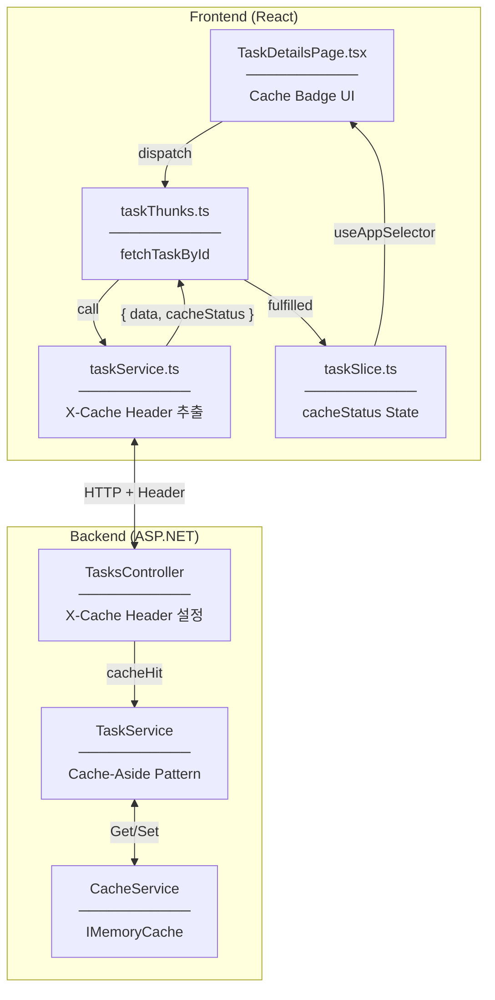
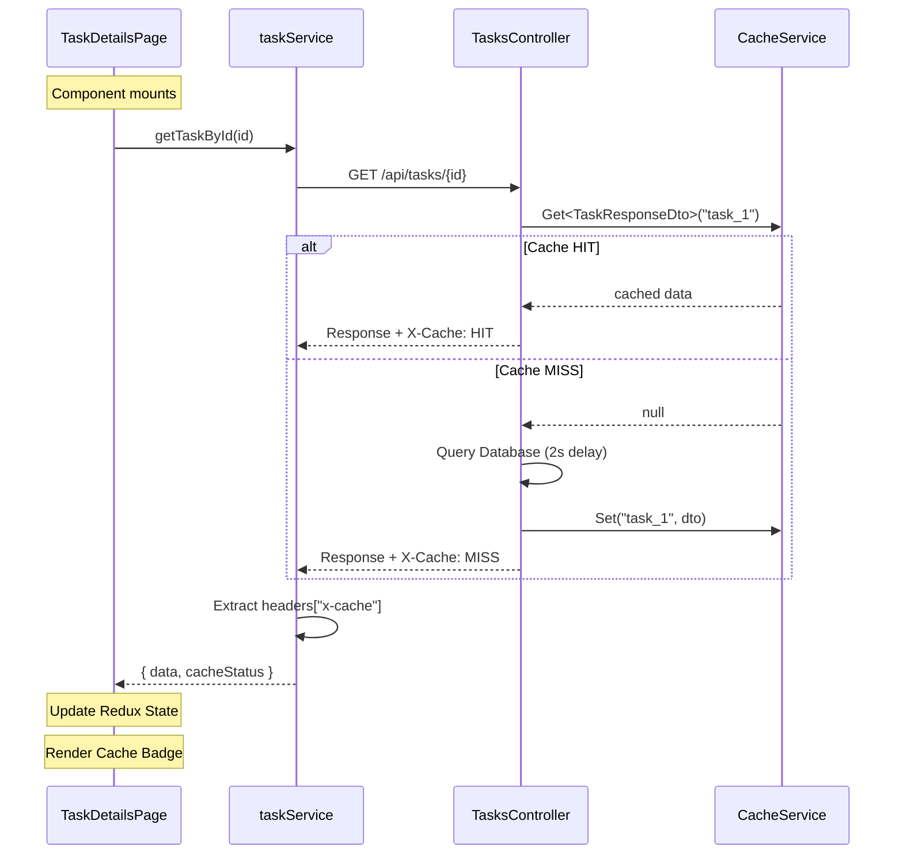
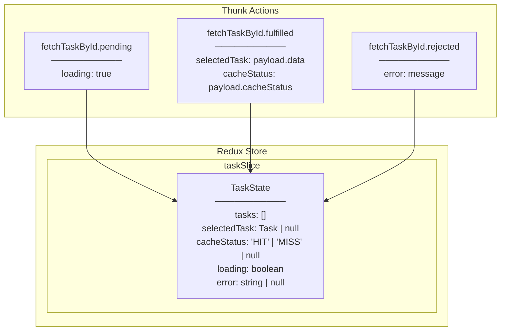
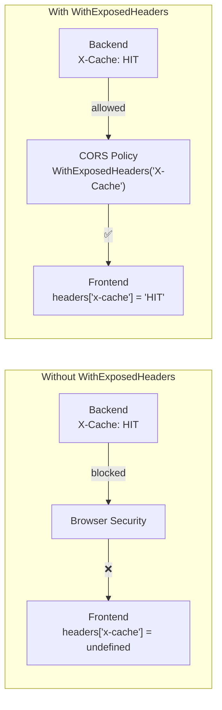
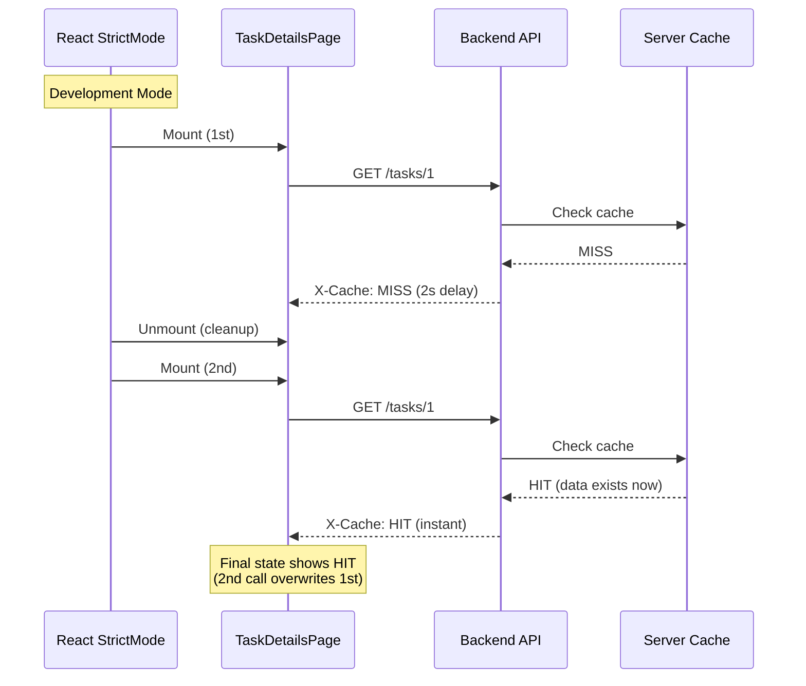
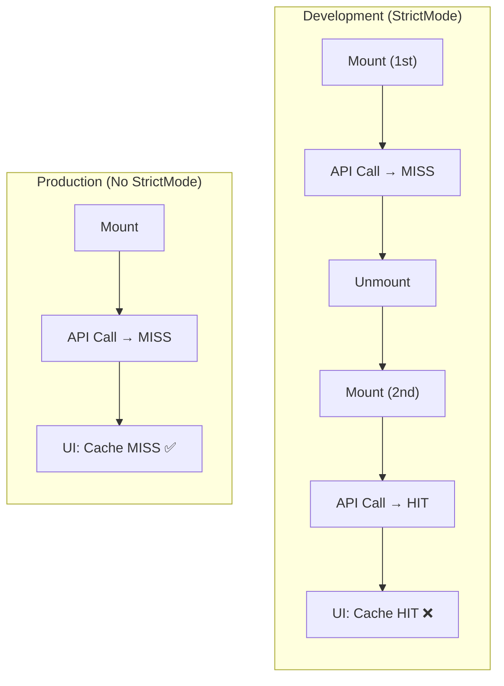
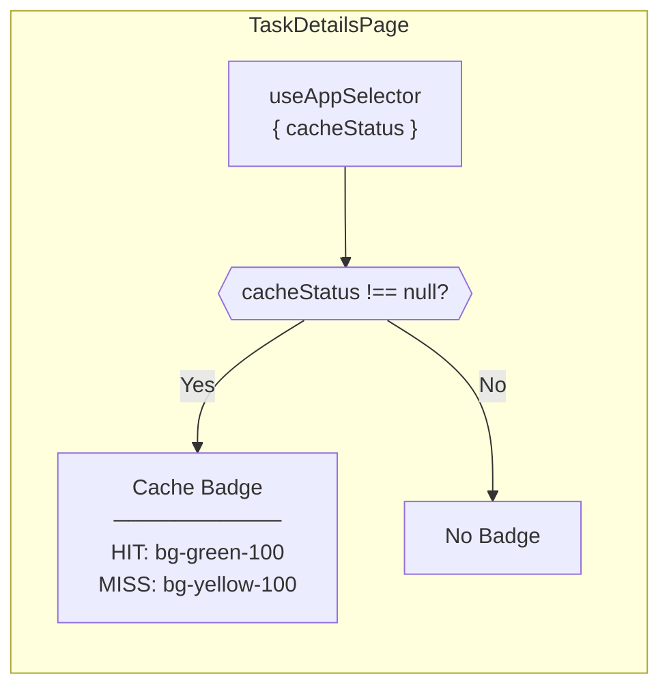
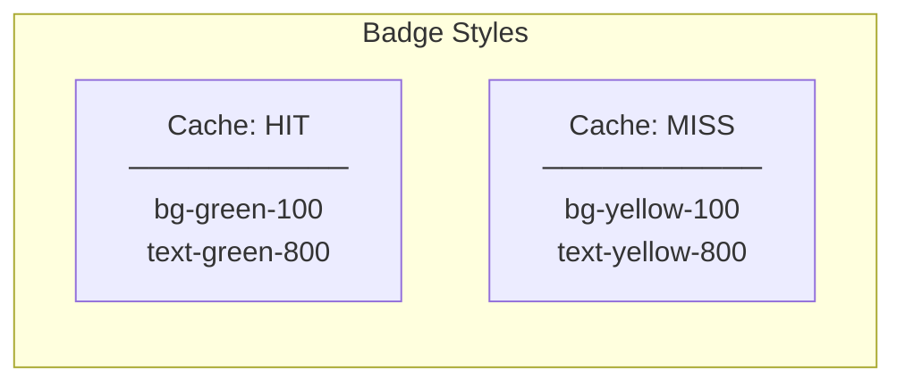

# Architecture Diagram

## Cache Status UI Overview

---

## X-Cache Header 전달 흐름

---

## Redux State 구조

---

## CORS Header Exposure

---

## React StrictMode 영향

---

## Production vs Development

---

## Component Rendering

---

## Cache Badge Styles

